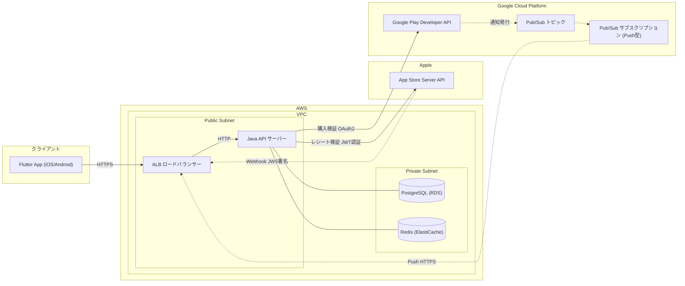

# Flutterアプリ サブスクリプション システム構成図

## 構成概要

| 項目 | 選定 |
|---|---|
| クライアント | Flutter App（iOS / Android） |
| ロードバランサー | AWS ALB |
| APIサーバー | Java（EC2 / ECS） |
| DB | PostgreSQL（RDS） |
| キャッシュ | Redis（ElastiCache）※レート制限・通知UUID重複排除 |
| ストア通知（iOS） | Apple → ALB → Java API（直接HTTPS） |
| ストア通知（Android） | Google Play → **Google Cloud Pub/Sub** → Java API |

---

## 1. Mermaid 形式



---

## 2. Python Diagrams 形式

`diagrams` ライブラリ（`pip install diagrams`）で実行するとPNG画像を生成できます。

```python
from diagrams import Diagram, Cluster, Edge
from diagrams.aws.compute import EC2
from diagrams.aws.database import RDS, ElastiCache
from diagrams.aws.network import ALB
from diagrams.gcp.analytics import Pubsub
from diagrams.gcp.devtools import GCR  # Google Play の代替アイコン
from diagrams.generic.device import Mobile
from diagrams.generic.network import Firewall  # App Store Server API の代替

graph_attr = {
    "rankdir": "LR",
    "splines": "ortho",
}

with Diagram(
    "Flutter Subscription System",
    direction="LR",
    graph_attr=graph_attr,
    filename="flutter-subscription-architecture",
    show=False,
):
    flutter = Mobile("Flutter App\n(iOS/Android)")

    with Cluster("Apple"):
        apple = Firewall("App Store\nServer API")

    with Cluster("Google Cloud Platform"):
        google_play = GCR("Google Play\nDeveloper API")
        with Cluster("Pub/Sub"):
            pubsub_topic = Pubsub("トピック")
            pubsub_sub  = Pubsub("サブスクリプション\n(Push型)")

    with Cluster("AWS"):
        with Cluster("VPC"):
            with Cluster("Public Subnet"):
                alb = ALB("ALB")
                api = EC2("Java API\nサーバー")
            with Cluster("Private Subnet"):
                db    = RDS("PostgreSQL\n(RDS)")
                cache = ElastiCache("Redis\n(ElastiCache)")

    # クライアント → API
    flutter >> Edge(label="HTTPS") >> alb >> api

    # API → 外部サービス（検証）
    api >> Edge(label="レシート検証 (JWT)") >> apple
    api >> Edge(label="購入検証 (OAuth2)")  >> google_play

    # API → DB / キャッシュ
    api >> db
    api >> cache

    # Apple Webhook（直接 HTTPS）
    apple >> Edge(
        label="Webhook (JWS)",
        style="dashed",
        color="darkorange",
    ) >> alb

    # Google Play → Pub/Sub → API
    google_play >> Edge(style="dashed", color="royalblue") >> pubsub_topic
    pubsub_topic >> Edge(style="dashed", color="royalblue") >> pubsub_sub
    pubsub_sub >> Edge(
        label="Push HTTPS",
        style="dashed",
        color="royalblue",
    ) >> alb
```

### アイコン補足

| ノード | 使用クラス | 補足 |
|---|---|---|
| Flutter App | `generic.device.Mobile` | モバイル端末を表す汎用アイコン |
| App Store Server API | `generic.network.Firewall` | 外部APIの代替アイコン。`saas` 系に差し替え可 |
| Google Play Developer API | `gcp.devtools.GCR` | GCP系の代替アイコン |
| Pub/Sub トピック / サブスクリプション | `gcp.analytics.Pubsub` | GCP公式アイコン |
| ALB | `aws.network.ALB` | AWS公式アイコン |
| Java API サーバー | `aws.compute.EC2` | ECSを使う場合は `aws.compute.ECS` に変更 |
| PostgreSQL | `aws.database.RDS` | AWS公式アイコン |
| Redis | `aws.database.ElastiCache` | AWS公式アイコン |

---

## 3. データフローの凡例

| 線種 | 意味 |
|---|---|
| 実線 `───` | 通常のリクエスト／レスポンス |
| 破線 `- - -` | ストアからの非同期通知（Webhook / Pub/Sub Push） |
| オレンジ破線 | Apple Webhook（JWS署名付きHTTPS） |
| 青破線 | Android通知（Google Play → Pub/Sub → API）|

---

## 4. Mermaid → PNG / SVG への変換方法

### 方法①: Mermaid CLI（ローカル変換）

```bash
# インストール
npm install -g @mermaid-js/mermaid-cli

# 変換
mmdc -i diagram.md -o output.png
mmdc -i diagram.md -o output.svg
```

### 方法②: mermaid.live（ブラウザ・インストール不要）

`https://mermaid.live` にコードを貼り付けてPNG/SVGをダウンロードできる。最も手軽。

### 方法③: GitHub / GitLab（自動レンダリング）

Markdownファイル内に `\`\`\`mermaid ... \`\`\`` と書くだけで、リポジトリのビューで自動レンダリングされる。このファイルもGitHub上で表示すればそのまま図として見られる。

### 方法④: VS Code 拡張

`Markdown Preview Mermaid Support` 拡張をインストールするとプレビューパネルで確認できる。

---

## 5. Python Diagrams の実行方法

`pip install diagrams` だけでは動かない。内部でGraphvizを使うため別途インストールが必要。

```bash
# 1. Graphviz をインストール（OS別）
brew install graphviz        # Mac
apt-get install graphviz     # Ubuntu / Debian
choco install graphviz       # Windows（Chocolatey）

# 2. Python ライブラリをインストール
pip install diagrams

# 3. スクリプトを実行
python diagram.py
# → カレントディレクトリに flutter-subscription-architecture.png が生成される
```

---

## 6. 用途別おすすめ

| | Mermaid | Python Diagrams |
|---|---|---|
| 手軽さ | ◎（mermaid.liveなら即時） | △（Graphvizのインストールが必要） |
| GitHubでの表示 | ◎ 自動レンダリング | ✗ 別途画像をコミットする必要あり |
| アイコンの見栄え | △ テキストベース | ◎ AWS/GCP公式アイコンで視覚的 |
| カスタマイズ性 | △ | ◎ |

ドキュメント用途なら **Mermaid + GitHub表示** が最も手軽。発表資料など見栄えが必要な場面では **Python Diagrams** が向いている。
