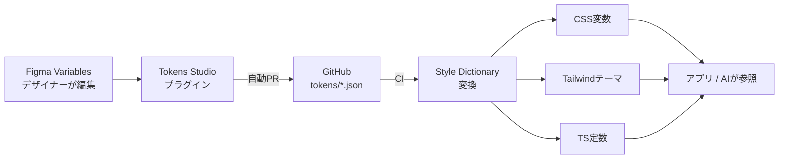

# ② デザイントークン連携 — 色と余白の単一の源を作る

[← 総合インデックスに戻る](README.md) ｜ 前 → [① 全体像と導入判断](01-overview.md) ｜ 次 → [③ Code Connect](03-code-connect.md)

**AIに「意味」を教える層のひとつめ**です。ここが整うと、生成コードから `bg-[#3B82F6]` のようなハードコードが消えます。Code Connectが使えないプランでも導入でき、単体で価値があります。

---

## 1. デザイントークンとは

**「値そのもの」ではなく「値に名前を付けたもの」** です。

```
❌ トークンなし          ✅ トークンあり
#3B82F6                 color.brand.500
16px                    spacing.4
0.75rem                 radius.card
```

### なぜ効くのか

| 効果 | 内容 |
| --- | --- |
| **AIが意味を理解する** | 「この青はブランドカラー」と分かる |
| **一括変更できる** | ブランド色変更が1箇所で済む |
| **ダーク／ライトの切替** | 同じ名前で値だけ差し替え |
| **デザインと実装のズレが消える** | 源が1つになる |
| **レビューが速い** | 「なぜこの値？」という議論が減る |

> 🔑 **AI駆動開発の文脈での価値**：AIは「`#3B82F6` と `#3B82F7` の違い」を判断できません。しかし「`brand-500` を使え」という指示には従えます。**トークンはAIへの共通言語**です。

---

## 2. 全体の流れ



**ポイントは「Gitを単一の源にする」**ことです。Figmaを直接参照しに行くのではなく、**リポジトリ内のJSONを正**とします。こうすると：

- CIで検証できる
- 変更履歴がGitに残る
- AIがリポジトリを読むだけでトークンを把握できる
- Figmaが落ちてもビルドできる

---

## 3. Figma Variables を整える

まずFigma側です。ここが雑だと後工程が全部崩れます。

### 3階層で設計する

```
① プリミティブ（原始値）      blue-500 = #3B82F6
        ↓ 参照
② セマンティック（意味）       color-primary = blue-500
        ↓ 参照
③ コンポーネント（用途）       button-bg-primary = color-primary
```

| 階層 | 例 | 変更頻度 |
| --- | --- | --- |
| プリミティブ | `blue-100` 〜 `blue-900` | ほぼ変わらない |
| **セマンティック** | `color-primary` `color-danger` `surface-base` | **ここを切り替えてテーマ変更** |
| コンポーネント | `button-bg-primary` | 必要な場合のみ |

> ⚠️ **コンポーネントで直接プリミティブを参照しない**でください。`Button` が `blue-500` を直接見ていると、ブランド変更時に全コンポーネントを触ることになります。必ずセマンティックを挟みます。

### 命名規則

```
✅ 良い：  color/text/primary       spacing/4       radius/card
❌ 悪い：  Color 1                  Spacing Large   角丸
```

**AIが読む前提**なので、英語・階層構造・一貫性のある命名にしてください。日本語やスペース入りは避けます。

---

## 4. Tokens Studio で Git に同期する

[Tokens Studio](https://tokens.studio/) は Figma Variables を読み書きし、**W3C Design Tokens 形式のJSON**としてGitHubに同期するプラグインです。

### 設定の流れ

```
1. FigmaにTokens Studioプラグインをインストール
2. Settings → Sync → GitHub を選択
3. リポジトリ・ブランチ・トークンファイルのパスを設定
   例: tokens/tokens.json
4. Personal Access Token を設定（repo権限）
5. Figma Variables をインポート
6. 「Push to GitHub」→ 自動でPRが作られる
```

### 出力されるJSON（W3C形式）

```json
{
  "color": {
    "blue": {
      "500": { "$type": "color", "$value": "#3B82F6" }
    },
    "primary": {
      "$type": "color",
      "$value": "{color.blue.500}"
    }
  },
  "spacing": {
    "4": { "$type": "dimension", "$value": "16px" }
  }
}
```

`$value` で `{color.blue.500}` のように**参照**が書けるのがポイントです。セマンティック層はこの参照で表現されます。

> 💡 **W3C Design Tokens 形式**は2025年10月に最初の安定版が公開され、Style Dictionary をはじめ主要ツールが対応しています。**独自形式ではなくこの形式を選ぶ**と、ツールを乗り換えても資産が残ります。

### 運用のルール

| ルール | 理由 |
| --- | --- |
| **トークンの変更は必ずPR経由** | レビューと履歴のため |
| デザイナーのpushはPRまで（直pushしない） | 破壊的変更の防止 |
| PRにはビジュアル差分を付ける | 影響範囲の可視化 |
| **mainへのマージは実装者が確認** | ビルドが壊れないか |

---

## 5. Style Dictionary で変換する

JSONを各プラットフォーム向けの形式に変換します。

```bash
npm install -D style-dictionary @tokens-studio/sd-transforms
```

### 設定ファイル

```js
// style-dictionary.config.js
import { register } from '@tokens-studio/sd-transforms'
import StyleDictionary from 'style-dictionary'

register(StyleDictionary)   // Tokens Studio 由来の記法に対応

export default {
  source: ['tokens/**/*.json'],
  preprocessors: ['tokens-studio'],
  platforms: {
    // ① CSS変数として出力
    css: {
      transformGroup: 'tokens-studio',
      transforms: ['name/kebab'],
      buildPath: 'src/styles/',
      files: [{
        destination: 'tokens.css',
        format: 'css/variables',
        options: { outputReferences: true },   // ★参照関係を保つ
      }],
    },
    // ② TypeScript定数として出力
    ts: {
      transformGroup: 'tokens-studio',
      transforms: ['name/camel'],
      buildPath: 'src/styles/',
      files: [{
        destination: 'tokens.ts',
        format: 'javascript/es6',
      }],
    },
  },
}
```

```bash
npx style-dictionary build
```

### 出力例

```css
/* src/styles/tokens.css */
:root {
  --color-blue-500: #3b82f6;
  --color-primary: var(--color-blue-500);   /* outputReferences: true の効果 */
  --spacing-4: 16px;
  --radius-card: 12px;
}
```

> 🔑 **`outputReferences: true` が重要**です。これが無いと `--color-primary: #3b82f6` と展開されてしまい、**ダークモードでセマンティック層だけ差し替える**ことができなくなります。

---

## 6. Tailwind CSS v4 と繋ぐ

Tailwind v4 は**CSS変数ベース**なので、トークンとの相性が非常に良くなりました。

```css
/* src/app/globals.css */
@import "tailwindcss";
@import "./tokens.css";     /* Style Dictionary の出力 */

@theme inline {
  /* CSS変数をTailwindのテーマに接続する */
  --color-primary: var(--color-primary);
  --color-danger: var(--color-danger);
  --color-surface: var(--surface-base);
  --spacing-4: var(--spacing-4);
  --radius-card: var(--radius-card);
}
```

これで `bg-primary` `rounded-card` `p-4` が使えるようになります。

```tsx
// AIが生成するコードがこうなる
<div className="bg-surface p-4 rounded-card">
  <button className="bg-primary text-white">送信</button>
</div>
```

> ⚠️ **`@theme` と `@theme inline` の違い**：`inline` を付けると、Tailwindが値を展開せずCSS変数への参照を保ちます。**ダークモードで値を差し替える場合は `inline` が必要**です。

### ダークモード

```css
:root {
  --color-primary: var(--color-blue-500);
  --surface-base: var(--color-white);
}

@media (prefers-color-scheme: dark) {
  :root {
    --color-primary: var(--color-blue-400);
    --surface-base: var(--color-gray-900);
  }
}
```

**セマンティック層だけ差し替えればよい**——これが3階層設計の効果です。

---

## 7. CIで自動化する

トークンJSONが更新されたら、自動でビルドして差分を確認します。

```yaml
# .github/workflows/tokens.yml
name: Design Tokens

on:
  pull_request:
    paths: ['tokens/**']
  push:
    branches: [main]
    paths: ['tokens/**']

jobs:
  build:
    runs-on: ubuntu-latest
    steps:
      - uses: actions/checkout@v4
      - uses: actions/setup-node@v4
        with: { node-version: 24, cache: npm }
      - run: npm ci

      - name: トークンをビルド
        run: npx style-dictionary build

      - name: 生成物に差分がないか確認
        run: |
          if ! git diff --quiet src/styles/; then
            echo "::error::トークンの生成物が最新ではありません"
            git diff src/styles/
            exit 1
          fi

      - name: アプリのビルドが通るか
        run: npm run build
```

### 生成物をコミットするか問題

| 方針 | 利点 | 欠点 |
| --- | --- | --- |
| **生成物をコミットする**（推奨） | AIがリポジトリを読むだけでトークンを把握できる。差分がPRで見える | コミットが増える |
| ビルド時に生成する | リポジトリがきれい | AIから見えない。CI必須 |

> 🔑 **AI駆動開発の文脈では「コミットする」を推奨**します。Claude Code は `src/styles/tokens.css` を読めば使える色が分かるため、Figma MCPに問い合わせる回数が減り、精度も安定します。

---

## 8. ハードコードを検出する

トークンを整備しても、書かれてしまえば意味がありません。**Lintで機械的に防ぎます**。

```js
// eslint.config.mjs（抜粋）
export default [
  {
    rules: {
      'no-restricted-syntax': ['error', {
        // className内の任意値記法（bg-[#fff] 等）を禁止
        selector: "JSXAttribute[name.name='className'] Literal[value=/\\[#[0-9a-fA-F]{3,8}\\]/]",
        message: 'HEX直書きは禁止です。デザイントークン（bg-primary 等）を使ってください',
      }],
    },
  },
]
```

Tailwind公式のプラグインも併用できます。

```bash
npm i -D eslint-plugin-better-tailwindcss
```

> 💡 **これはAI駆動開発では特に重要**です。AIは指示が曖昧だとハードコードに逃げます。**Lintで落ちる仕組みにしておけば、AI自身が修正します**（→ [⑤](05-ai-workflow.md)）。

---

## 9. よくあるつまずき

| 症状 | 原因 | 対処 |
| --- | --- | --- |
| ダークモードで色が変わらない | `outputReferences` が false | `true` にする／`@theme inline` を使う |
| トークン名が壊れる | 日本語・スペース入りの命名 | 英語・kebab/camelに統一 |
| 参照が解決されない | Tokens Studio の記法に未対応 | `@tokens-studio/sd-transforms` を登録 |
| PRが巨大になる | プリミティブ層を毎回変更 | セマンティック層で吸収する |
| Figmaと実装がズレる | 手動同期している | Tokens Studio の自動PRにする |
| AIがハードコードする | トークンが見えていない | 生成物をコミット＋Lintで禁止 |

---

## 10. この章のまとめ

- トークンは**値ではなく「名前」**。AIにとっての共通言語になる
- **3階層（プリミティブ → セマンティック → コンポーネント）** で設計し、セマンティックを切替点にする
- 命名は**英語・階層・一貫性**。「Color 1」ではAIも人間も読めない
- **Gitを単一の源にする**。Tokens Studio が自動PRを作る
- Style Dictionary で変換。**`outputReferences: true` を忘れない**
- Tailwind v4 とは **`@theme inline`** で接続する
- **生成物はコミットする**（AIがリポジトリを読むだけで把握できる）
- 🔑 **ハードコードはLintで機械的に禁止**する。AIは仕組みがあれば従う

---

次の章 → [③ Code Connect](03-code-connect.md)
