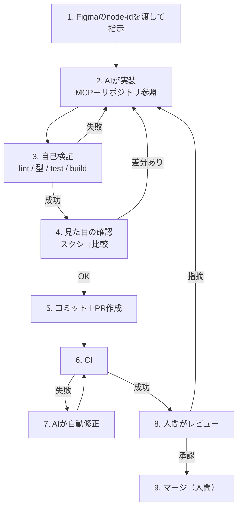

# ⑤ AI駆動開発のワークフロー — 品質を仕組みで担保する

[← 総合インデックスに戻る](README.md) ｜ 前 → [④ Figma MCPの接続と使い方](04-figma-mcp.md) ｜ 次 → [⑥ GitとGitHub MCP連携](06-git-github-mcp.md)

道具が揃っても、**運用の設計が悪ければ品質は上がりません**。この章では「AIに毎回同じ指示を書かなくて済む仕組み」と「人間がどこを見るか」を扱います。

---

## 1. 基本原則 — AIは「規約に従う」が「規約を作らない」

```
AIの性質:
  ✅ 明文化されたルールには従う
  ✅ 既存コードのパターンを真似る
  ❌ 何が正しいかを自分で決められない
  ❌ 曖昧な状況では最も一般的な（＝あなたの規約とは違う）選択をする
```

つまり **品質はプロンプトの巧拙ではなく「リポジトリに何が書いてあるか」で決まります**。

| やること | 効果 |
| --- | --- |
| `CLAUDE.md` に規約を書く | 毎回の指示が不要になる |
| Lint・型で機械的に縛る | AIが自分で修正する |
| 既存コードを整える | AIが真似る対象が良くなる |
| テストを用意する | 壊れたら自分で気づく |

> 🔑 **「AIが変なコードを書く」の大半は、リポジトリに正解が書かれていないだけ**です。プロンプトを工夫する前に、リポジトリを整えてください。

---

## 2. `CLAUDE.md` の設計

プロジェクトルートの `CLAUDE.md` は**AIが毎回読む恒久ルール**です。ここに書けば指示から省けます。

```markdown
# CLAUDE.md

## Figmaからの実装ルール

### 必ず守ること
- `components/ui/` 配下の既存コンポーネントを最優先で使う
  - 該当がない場合のみ新規作成し、理由をPR説明に書く
- 色・余白・角丸は**デザイントークンのみ**使用
  - `bg-[#3B82F6]` のような任意値記法は禁止
  - 使えるトークンは `src/styles/tokens.css` を参照
- 既定は Server Component。`'use client'` は末端のみ
- クリック可能な要素は `<button>` / `<a>`（`<div onClick>` 禁止）
- 入力には必ず `<label>` を紐付ける

### 配置ルール
- 共通UI          → `src/components/ui/`
- 機能固有        → `src/features/<機能名>/components/`
- ロジック        → `src/features/<機能名>/queries.ts` / `actions.ts`

### 実装後に必ず実行
```bash
npm run lint
npx tsc --noEmit
npm run test
npm run build
```

### やってはいけないこと
- Figma MCPの出力をそのまま貼り付ける
- 1つのPRで複数コンポーネントをまとめて実装する
- テストを削除・スキップして通す
- `any` で型エラーを回避する
```

### 書く際のコツ

| コツ | 例 |
| --- | --- |
| **禁止事項を明示する** | 「〜を使う」より「〜は禁止」のほうが効く |
| **参照先を示す** | 「トークンは `tokens.css` を参照」 |
| **検証コマンドを書く** | AIが自己検証するようになる |
| **理由を書きすぎない** | 長いと薄まる。ルールを簡潔に |

> ⚠️ **`CLAUDE.md` が長すぎると効果が落ちます。** 200行を超えたら、詳細は別ドキュメントに逃がして参照リンクにしてください。

---

## 3. 標準ワークフロー



**7の「CI失敗の自動修正」まではAIに任せ、8以降は人間**——この線引きが現実的です。

---

## 4. 生成の単位とコミット粒度

### 1PR = 1コンポーネント

```
✅ 良い例
  PR #1: StatCard コンポーネントを追加
  PR #2: StatCardGrid を追加（StatCardを使用）
  PR #3: ダッシュボードページに組み込み

❌ 悪い例
  PR #1: ダッシュボード画面を実装（+2,400行）
```

| 単位 | レビュー時間 | 差し戻しコスト |
| --- | --- | --- |
| 1コンポーネント（〜200行） | 10分 | 小さい |
| 画面まるごと（2,000行超） | **実質レビュー不能** | 全部やり直し |

> 🔑 **AIは大量のコードを速く生成できるため、放っておくとレビュー不能なPRが量産されます。** 速度の恩恵を受けるには、**意図的に粒度を小さく保つ**必要があります。

---

## 5. 品質ゲート — 機械で止める

人間のレビューに頼る前に、**機械で落とせるものは機械で落とします**。

```yaml
# .github/workflows/ci.yml
name: CI
on: [push, pull_request]

jobs:
  quality:
    runs-on: ubuntu-latest
    steps:
      - uses: actions/checkout@v4
      - uses: actions/setup-node@v4
        with: { node-version: 24, cache: npm }
      - run: npm ci

      - name: Lint（ハードコード検出を含む）
        run: npm run lint

      - name: 型チェック
        run: npx tsc --noEmit

      - name: ユニットテスト
        run: npm run test

      - name: ビルド
        run: npm run build

      - name: Code Connect の整合性
        run: npx figma connect parse
        env:
          FIGMA_ACCESS_TOKEN: ${{ secrets.FIGMA_ACCESS_TOKEN }}

      - name: E2E・ビジュアル回帰
        run: npx playwright test
```

### 特にAI駆動開発で効くゲート

| ゲート | 何を防ぐか |
| --- | --- |
| **ハードコード検出Lint** | `bg-[#3B82F6]` の混入（→ [②](02-design-tokens.md#8-ハードコードを検出する)） |
| **`tsc --noEmit`** | `any` での逃げ・型の不整合 |
| **ビジュアル回帰テスト** | 意図しない見た目の変化 |
| **a11y テスト** | `<div onClick>` 等の混入 |
| **`figma connect parse`** | Code Connectの腐り |
| **バンドルサイズ上限** | 不要な依存の追加 |

> 💡 **ゲートがあるとAIは自分で直します。** 「lintを通して」と伝えれば、エラーを読んで修正します。人間が指摘するより速く、確実です。

---

## 6. 人間がレビューで見るべき点

機械で落とせないものだけに集中します。

### 🔴 必ず見る（機械では判定できない）

- [ ] **仕様を満たしているか** — Figmaに描かれていない要件（エラー時・空状態・権限）
- [ ] **既存コンポーネントを再実装していないか** — 似たものが既にないか
- [ ] **状態設計は妥当か** — サーバー状態をグローバルに持っていないか（→ [React⑥](../react/06-state-design.md)）
- [ ] **Server/Client の境界** — ページ全体が `'use client'` になっていないか（→ [Next.js④](../nextjs/04-server-client-components.md)）
- [ ] **セキュリティ** — 認証・認可・入力検証（→ [Next.js⑥](../nextjs/06-server-actions-forms.md)・[⑧](../nextjs/08-auth-database.md)）
- [ ] **命名** — その名前で3ヶ月後に意味が通るか

### 🟡 余裕があれば見る

- [ ] パフォーマンス（不要な再レンダリング等）
- [ ] テストが本質を突いているか（形だけになっていないか）
- [ ] エラーハンドリングの粒度

### ⚪ 見なくてよい（CIが担保）

- フォーマット・インデント
- import順
- 型エラー
- ハードコードされた色

> 🚨 **AI生成であることを理由にレビューを省かない。** 逆に、**AI生成だからこそ「もっともらしく間違っている」**ことがあります。特に認証・課金・データ削除に関わる箇所は慎重に見てください。

---

## 7. うまくいかないときの切り分け

```
生成されたコードの品質が低い
  │
  ├─ ハードコードされた値が多い
  │    → トークンが整っていない or Lintが無い（→ ②章）
  │
  ├─ 既存コンポーネントを使わず再実装する
  │    → Code Connect が無い（→ ③章）
  │    → CLAUDE.md に「既存を使う」と書いていない
  │
  ├─ レイアウトが絶対配置になる
  │    → Figma側でAuto Layoutが使われていない
  │
  ├─ ファイル配置がバラバラ
  │    → CLAUDE.md に配置ルールが無い
  │
  ├─ 状態設計が変
  │    → 仕様がFigmaに無い。人間が指示すべき領域
  │
  └─ 毎回出力が違う
       → Figma側のコンポーネントが複雑すぎる
```

**ほとんどが「AIの問題」ではなく「土台の問題」**です。プロンプトをこねる前にここを確認してください。

---

## 8. チームでの役割分担

| 役割 | AI駆動開発での担当 |
| --- | --- |
| **デザイナー** | Figmaの構造化（Auto Layout・Variables・命名）、トークン設計 |
| **デザインエンジニア** | Code Connect の作成・保守、デザインシステムの実装 |
| **フロントエンド実装者** | 指示・レビュー・仕様の補完・複雑な状態実装 |
| **リード** | CLAUDE.md の整備、品質ゲートの設計、粒度のルール化 |

> 🔑 **デザイナーの作業品質が、そのまま実装の品質になります。** 「Figmaを整理する時間」は実装工数の削減に直結する、と説明できるかが導入成功の分かれ目です。

### デザイナーに依頼すべきこと

```
✅ Auto Layout を使う（絶対配置をやめる）
✅ Variables で色・余白を管理する
✅ 繰り返す要素はコンポーネント化する
✅ 英語・階層的な命名（「Frame 427」をやめる）
✅ バリアントを整理する（状態を漏れなく作る）
```

---

## 9. コスト管理

AIの利用料は使い方で大きく変わります。

| 節約になること | 理由 |
| --- | --- |
| **生成範囲をコンポーネント単位に絞る** | 巨大なフレームは大量のトークンを消費 |
| **トークン生成物をコミットする** | MCPへの問い合わせが減る（→ [②](02-design-tokens.md)） |
| **Code Connect を張る** | 手戻りが減る＝再生成が減る |
| `CLAUDE.md` を簡潔に保つ | 毎回読まれるため |
| 使わないMCPサーバーは外す | ツール定義が毎回コンテキストを消費 |

> ⚠️ **Figma MCPはベータ期間中は無料ですが、将来は従量課金の予定**です。運用設計の段階からコストを意識しておくと、課金開始時に慌てずに済みます。

---

## 10. この章のまとめ

- **AIは規約に従うが、規約を作らない**。品質はリポジトリの整備度で決まる
- **`CLAUDE.md` に恒久ルールを書く**。禁止事項・配置ルール・検証コマンドが効く
- ワークフローは「**CI失敗の自動修正までAI、レビューとマージは人間**」
- **1PR = 1コンポーネント**。放っておくとレビュー不能なPRが量産される
- **機械で落とせるものは機械で落とす**（Lint・型・ビジュアル回帰・a11y・`figma connect parse`）
- 人間は**仕様・再実装・状態設計・境界・セキュリティ・命名**に集中する
- 🚨 **AI生成だからこそ「もっともらしく間違っている」**。重要箇所は必ず検証
- 品質が低いときは**土台（トークン・Code Connect・Figma構造）を疑う**
- **デザイナーの作業品質がそのまま実装品質になる**

---

次の章 → [⑥ GitとGitHub MCP連携](06-git-github-mcp.md)
