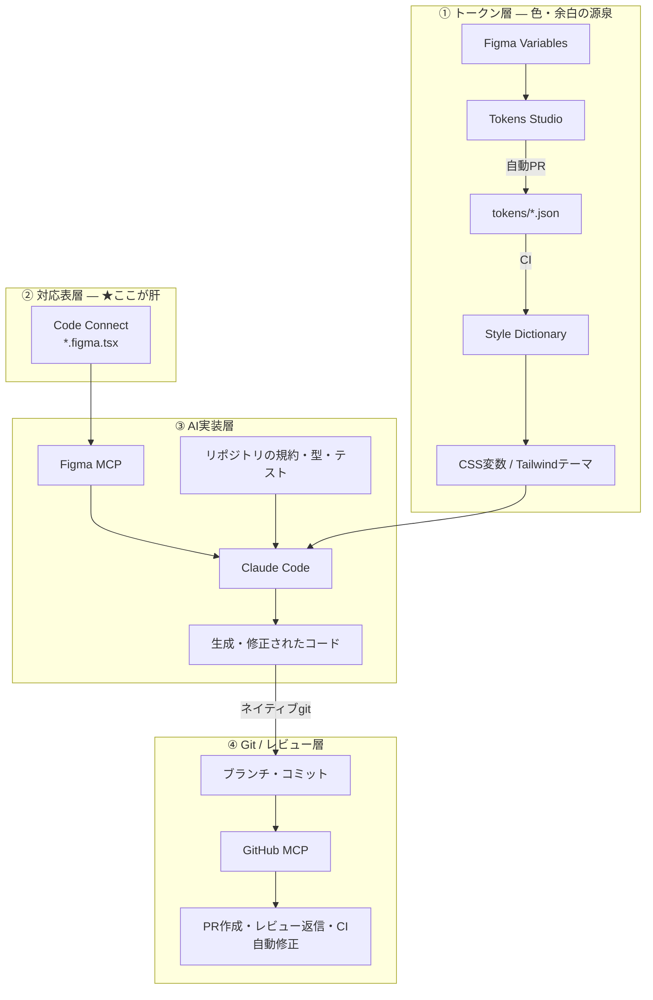

# Figma × MCP × AI駆動開発 完全ガイド 総合インデックス

このドキュメント群は、**Figmaのデザインを起点に、AI（Claude Code等）がReactコンポーネントを実装し、Gitでレビュー・マージまで回す開発体制** を構築するための実務ガイドです。

- 対象：デザインシステムを持つ（または作ろうとしている）チーム、フロントエンドリード、技術選定を判断する立場の人
- 前提：React / Next.js / TypeScript（→ [React](../react/README.md) ／ [Next.js](../nextjs/README.md)）
- 執筆時点：2026年8月。**Figma MCPサーバーはベータ**のため、仕様変更の可能性があります

> ⚠️ **このガイドは「魔法の自動化」を約束しません。** うまくいく条件と、いかない条件を明示することを重視しています。導入して失敗するチームの大半は、**順番を間違えている**だけです。

---

## 1. まず結論（30秒サマリ）

**実現可能です。ただし成否は「Code Connect を張るかどうか」でほぼ決まります。**

| | Code Connect **なし** | Code Connect **あり** |
| --- | --- | --- |
| AIの出力 | 汎用HTML/JSX・**値がハードコード** | **既存コンポーネントを呼ぶコード** |
| スタイル不一致 | **85〜90%** | 大幅に低下 |
| 実務での扱い | 参考程度。結局書き直す | そのままレビューに回せる |

```tsx
// ❌ Code Connectなし：AIはこう書く
<div className="flex items-center px-4 py-2 bg-[#3B82F6] rounded-[6px]">送信</div>

// ✅ Code Connectあり：AIはこう書く
<Button variant="primary">送信</Button>
```

**この差がすべて**です。ここに投資しないなら、この構想は着手しないほうが健全です。

---

## 2. 全体アーキテクチャ（4層）



### 各層の役割

| 層 | 何を担当するか | 主なツール | 章 |
| --- | --- | --- | --- |
| **① トークン層** | 色・余白・タイポの単一の源 | Figma Variables / Tokens Studio / Style Dictionary | [②](02-design-tokens.md) |
| **② 対応表層** | Figmaノード ↔ 実コンポーネント | **Code Connect** | [③](03-code-connect.md) |
| **③ AI実装層** | デザインを読んで実装する | Figma MCP / Claude Code | [④](04-figma-mcp.md)・[⑤](05-ai-workflow.md) |
| **④ Git層** | 記録・レビュー・CI | git / GitHub MCP | [⑥](06-git-github-mcp.md) |

---

## 3. よくある誤解の訂正

このガイドを読む前に、2点だけ整理しておきます。

### 誤解1：「Gitへの連携にMCPが必要」

**git操作にMCPは不要です。** Claude Code は `git` コマンドをそのまま実行できます。

MCPが要るのは **GitHub API側**（PR作成・レビュー返信・CI結果取得・Issue連携）です。ここを混同すると、不要なサーバーを挟んで遅く壊れやすい構成になります。

| やること | 手段 |
| --- | --- |
| commit / branch / push | **ネイティブ git**（MCP不要） |
| PR作成・レビュー返信・CI確認 | **GitHub MCP** |
| デザイン取得 | **Figma MCP** |

詳細は [⑥](06-git-github-mcp.md)。

### 誤解2：「Figmaから出たコードをそのままコミットする」

これが**最大のアンチパターン**です。生成コードは絶対配置・重複コンポーネント・トークン無視の温床になります。

**正しい捉え方**：Figma MCPの出力は「完成品」ではなく「**既存コンポーネントの組み立て指示**」です。実装はリポジトリの規約に従わせます。

---

## 4. 章立てと読み方

| # | 章 | 内容 |
| --- | --- | --- |
| ① | [全体像と導入判断](01-overview.md) | 4層アーキテクチャ・何ができて何ができないか・プラン要件・費用対効果 |
| ② | [デザイントークン連携](02-design-tokens.md) | Figma Variables・Tokens Studio・Style Dictionary・CIでの自動同期 |
| ③ | [**Code Connect**](03-code-connect.md) | **最重要章**。書き方・publish・CI連携・どこから張るか |
| ④ | [Figma MCPの接続と使い方](04-figma-mcp.md) | リモート/デスクトップの違い・Claude Code接続・各ツールの使い分け |
| ⑤ | [AI駆動開発のワークフロー](05-ai-workflow.md) | CLAUDE.md設計・プロンプト・生成単位・レビュー観点・品質ゲート |
| ⑥ | [GitとGitHub MCP連携](06-git-github-mcp.md) | git操作・GitHub MCP・PR自動化・CI自動修正・権限設計 |
| ⑦ | [段階導入とアンチパターン](07-adoption-roadmap.md) | 6ステップの導入順・失敗パターン・チェックリスト・効果測定 |

### 付録

- [用語集・チートシート](glossary.md) ← 用語辞典・逆引き表・コマンド集

---

## 5. 読者タイプ別のおすすめルート

- **導入可否をまず判断したい** → [①](01-overview.md) だけでOK（プラン要件と費用対効果を記載）
- **すでにやってみて品質に不満** → [③ Code Connect](03-code-connect.md) → [⑤ ワークフロー](05-ai-workflow.md)
- **デザイナー・デザインエンジニア** → [②](02-design-tokens.md) → [③](03-code-connect.md)
- **フロントエンド実装者** → [④](04-figma-mcp.md) → [⑤](05-ai-workflow.md) → [⑥](06-git-github-mcp.md)
- **これから体制を作る** → [⑦ 段階導入](07-adoption-roadmap.md) を先に読み、順番を決めてから各章へ
- **用語だけ引きたい** → [用語集](glossary.md)

---

## 6. 最重要ポイント（シリーズ全体から5つだけ）

1. **Code Connect がすべてを分ける** —— これ無しの Figma MCP は「85〜90%スタイル不一致」の世界（→ [③](03-code-connect.md)）
2. **土台から作る。MCP接続は最後** —— 「まずMCPを繋ぐ」から始めるチームはほぼ失敗する（→ [⑦](07-adoption-roadmap.md)）
3. **生成物は「指示」であって「完成品」ではない** —— そのままコミットしない
4. **git操作にMCPは不要**。GitHub MCPはPR・レビュー用（→ [⑥](06-git-github-mcp.md)）
5. **1コンポーネント単位で生成 → テスト → PR** —— 画面まるごと一発生成はレビュー不能な差分を生む（→ [⑤](05-ai-workflow.md)）

---

## 7. 前提バージョン・プラン

| 項目 | 前提 | 備考 |
| --- | --- | --- |
| Figma MCPサーバー | **ベータ** | 現在は無料。将来は従量課金予定 |
| **Code Connect** | **Organization プラン以上** | ここが実質的な足切りライン |
| Dev Mode / デスクトップMCP | Dev または Full シート（有料プラン） | Starter・コラボシートでは無言で失敗 |
| `@figma/code-connect` | 1.5 系 | — |
| `style-dictionary` | 5 系 | W3C Design Tokens 形式に対応 |
| Tailwind CSS | 4 系 | CSS変数ベース。トークンと相性が良い |
| React / Next.js | 19 / 16 系 | → [React](../react/README.md)・[Next.js](../nextjs/README.md) |

> ⚠️ **ベータ機能への依存について**：Figma MCPサーバーはベータであり、ツール名・出力形式・課金体系が変わる可能性があります。**トークン層（②）とCode Connect（③）はMCPが変わっても資産として残る**ため、投資の順序としてもこの2つが先です。

---

## 8. 関連シリーズ

- 🔵 [React 完全ガイド](../react/README.md) ← コンポーネント設計の土台
- ⚫ [Next.js 完全ガイド](../nextjs/README.md) ← [⑦ スタイリングとUI](../nextjs/07-styling-ui.md)・[⑬ 実践アーキテクチャ](../nextjs/13-architecture-practice.md) が本シリーズの前提
- 🟢 [Node.js 完全ガイド](../nodejs/README.md) ← CI・トークンビルドの実行環境
- 📖 [JavaScript・Node.js・React・Next.js の関係](../js-stack-relations.md)
