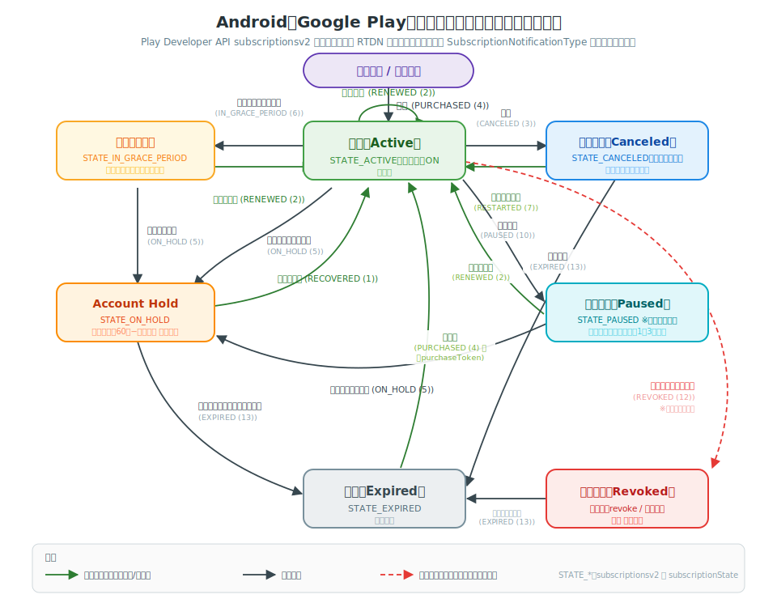

# Android サブスクリプション 状態遷移図（SVG）

[iOS版の状態遷移図](ios-subscription-lifecycle.md)と同じスタイルで、Android（Google Play Billing）のサブスクリプション状態遷移を1枚のSVGに描き起こしたものです。[公式のライフサイクル解説](https://developer.android.com/google/play/billing/lifecycle/subscriptions?hl=ja)の内容を、**Play Developer API `subscriptionsv2` のステータス値** と **RTDN（Real-time Developer Notifications）の通知タイプ** で整理しています。

> SVG単体ファイル：[`android-subscription-lifecycle.svg`](android-subscription-lifecycle.svg)
> 通知タイプの完全な一覧と発生タイミングは [イベント・ステータス一覧](flutter-subscription-events.md) を参照。

---

## 状態（ステータス）一覧

Play Developer API `purchases.subscriptionsv2.get` の `subscriptionState` に対応します。

| 状態 | subscriptionState | 利用可否 | 説明 |
| --- | --- | --- | --- |
| **有効（Active）** | `SUBSCRIPTION_STATE_ACTIVE` | 利用可 | 課金が成立し自動更新が有効。通常の正常状態。 |
| **解約済み（Canceled）** | `SUBSCRIPTION_STATE_CANCELED` | 利用可（期限まで） | ユーザーまたは開発者が解約。期限までは利用できる（解約予約）。 |
| **請求猶予期間（In Grace Period）** | `SUBSCRIPTION_STATE_IN_GRACE_PERIOD` | 利用可 | 更新の支払いに失敗したが、猶予期間中は利用を継続。Googleが再請求。 |
| **Account Hold** | `SUBSCRIPTION_STATE_ON_HOLD` | 利用不可 | 猶予期間後も未解決。**60日−猶予期間** の間、Googleが再請求を継続。 |
| **一時停止（Paused）** | `SUBSCRIPTION_STATE_PAUSED` | 利用不可 | ユーザーが一時停止（1〜3ヶ月）。課金なし。**Play Consoleで要事前有効化**。 |
| **失効（Expired）** | `SUBSCRIPTION_STATE_EXPIRED` | 利用不可 | 期限切れ。解約後の期限到来、または再請求失敗。 |
| **取り消し（Revoked）** | — ※通知で検知 | 利用不可 | 開発者の `revoke` またはGoogleの返金承認で即時剥奪。`SUBSCRIPTION_REVOKED` (12) で通知され、その後失効扱いになる。 |

> 猶予期間・Account Hold はデフォルト有効。猶予期間の長さは Play Console で調整・無効化でき、**Account Hold 期間は「60日−猶予期間」で自動計算**されます（猶予7日なら Hold は53日）。

---

## 主な遷移と通知タイプ

括弧内は RTDN `SubscriptionNotification` の定数名と種別値です。

| From → To | きっかけ（通知） | 補足 |
| --- | --- | --- |
| 新規購入 → 有効 | `SUBSCRIPTION_PURCHASED` (4) | **3日以内に確認（acknowledge）しないと自動返金**。 |
| 有効 → 有効 | `SUBSCRIPTION_RENEWED` (2) | 自動更新成功。`expiryTime` が更新される。更新分の acknowledge は不要。 |
| 有効 → 解約済み | `SUBSCRIPTION_CANCELED` (3) | ユーザー操作または `subscriptionsv2.cancel`。期限までは利用可。 |
| 解約済み → 有効 | `SUBSCRIPTION_RESTARTED` (7) | 期限内にユーザーが「定期購入を再開」。purchaseToken は変わらない。 |
| 解約済み → 失効 | `SUBSCRIPTION_EXPIRED` (13) | 期限到来。 |
| 有効 → 請求猶予期間 | `SUBSCRIPTION_IN_GRACE_PERIOD` (6) | 更新の支払い失敗＋猶予あり。利用は継続させる。 |
| 請求猶予期間 → 有効 | `SUBSCRIPTION_RENEWED` (2) | 猶予期間中に支払いが回復。 |
| 請求猶予期間 → Account Hold | `SUBSCRIPTION_ON_HOLD` (5) | 猶予期間が終了し、まだ未解決。アクセスを停止する。 |
| 有効 → Account Hold | `SUBSCRIPTION_ON_HOLD` (5) | 猶予期間を無効化している場合は直接ここへ。 |
| Account Hold → 有効 | `SUBSCRIPTION_RECOVERED` (1) | Hold 中に支払いが回復。即座にアクセスを復元する。 |
| Account Hold → 失効 | `SUBSCRIPTION_EXPIRED` (13) | 未回復のまま Hold 期間終了。 |
| 有効 → 一時停止 | `SUBSCRIPTION_PAUSED` (10) | 実際の停止は次の更新日から。予約時は `SUBSCRIPTION_PAUSE_SCHEDULE_CHANGED` (11)。 |
| 一時停止 → 有効 | `SUBSCRIPTION_RENEWED` (2) | 再開日到来または手動再開。 |
| 一時停止 → Account Hold | `SUBSCRIPTION_ON_HOLD` (5) | 再開時の課金に失敗した場合。 |
| 失効 → 有効 | `SUBSCRIPTION_PURCHASED` (4) | 再購入。**新しい purchaseToken** が発行される（旧トークンは `linkedPurchaseToken` で紐づく）。 |
| 任意の状態 → 取り消し | `SUBSCRIPTION_REVOKED` (12) | 開発者の `revoke`、またはGoogleが返金承認時にアクセス権も剥奪。即時停止し、続けて `SUBSCRIPTION_EXPIRED` (13) が通知される。 |

---

## iOS との対応

| Android（Google Play） | iOS（App Store）の相当 |
| --- | --- |
| `SUBSCRIPTION_STATE_ACTIVE` | 有効（status 1） |
| `SUBSCRIPTION_STATE_CANCELED`（期限まで有効） | 自動更新オフ（status 1・解約予約） |
| `SUBSCRIPTION_STATE_IN_GRACE_PERIOD` | 請求猶予期間（status 4） |
| `SUBSCRIPTION_STATE_ON_HOLD` | 請求リトライ中（In Billing Retry, status 3） |
| `SUBSCRIPTION_STATE_PAUSED` | （iOSに相当なし） |
| `SUBSCRIPTION_STATE_EXPIRED` | 失効（status 2） |
| Revoke（`SUBSCRIPTION_REVOKED`） | 取り消し（Revoked, status 5） |

対応の詳細（イベント単位の比較表）は [イベント・ステータス一覧 第3章](flutter-subscription-events.md#3-ios--android-対応イベント比較) を参照。

---

## 実装メモ

- **真実の源（Source of Truth）** は `purchases.subscriptionsv2.get` の `subscriptionState`。RTDN はあくまでトリガーとして使い、受信のたびに API で最新状態を取得して確定させる（冪等化）。
- **新規購入は3日以内に acknowledge** しないと自動返金される（`SUBSCRIPTION_PURCHASED` 受信時に忘れず処理）。
- **Account Hold 入りしたら即座にアクセス停止**、`SUBSCRIPTION_RECOVERED` で即座に復元。
- 再購入時は purchaseToken が変わるため、`linkedPurchaseToken` で旧レコードを無効化して重複権利を防ぐ。
- 一時停止はデフォルト無効。有効化するかどうかは事業判断（[事業視点ガイド](flutter-subscription-business.md)参照）。

> 参考：Google「[定期購入のライフサイクルについて](https://developer.android.com/google/play/billing/lifecycle/subscriptions?hl=ja)」「[RTDN リファレンス](https://developer.android.com/google/play/billing/rtdn-reference?hl=ja)」
