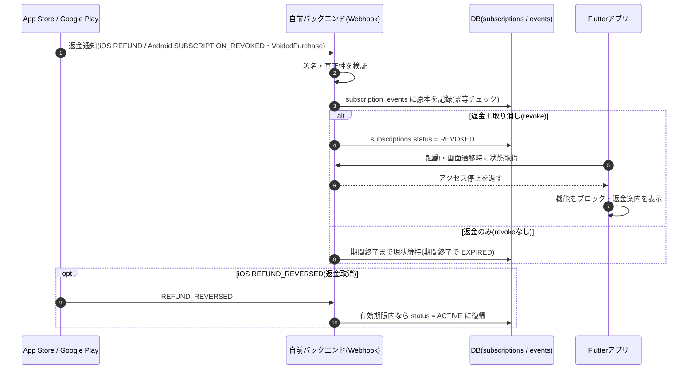

# Flutter サブスクリプション 解約・再加入 UX設計ガイド

> **対象読者:** 企画・デザイン・開発・PM
> 全体像・用語は [総合インデックス](flutter-subscription-overview.md)、ライフサイクルの技術詳細は [要件定義資料](flutter-subscription-guide.md)・[イベント一覧](flutter-subscription-events.md) を参照。

解約・失効・再加入まわりの画面設計と文言（マイクロコピー）の指針をまとめます。UX推奨はベストプラクティス、ストアの挙動・要件は公式一次情報に基づきます（末尾の出典参照）。

---

## 1. 基本方針（3原則）

1. **正直・簡単に**（ストア要件）— 解約は分かりやすく簡単に。終了日や請求を隠さない。操作的UI（ダークパターン）は審査・信頼の両面でリスク。
2. **期間内は使わせる** — 解約＝即ロックにしない。支払い済みの期間（例: 6/1まで）はフル機能を維持する。
3. **再開の摩擦を最小化** — データを保持し、ワンタップで戻れる導線と、誤解のない課金タイミング表記を用意する。

---

## 2. 解約後は「2つの状態」に分けて設計

設計書の `subscriptions.status` にそのまま対応します。

| 状態 | DBステータス | アクセス | 画面の役割 |
|---|---|---|---|
| A. 解約済み・期間内 | `CANCELED` | 〇（期間終了まで） | 安心感＋やわらかい再開導線 |
| B. 失効後 | `EXPIRED` | ✕ | 再加入（ウィンバック）画面 |

> 課金失敗系（`GRACE_PERIOD` / `BILLING_RETRY` / `ACCOUNT_HOLD`）は「解約」とは別物。支払い更新導線が中心になる（[要件定義資料 第8章](flutter-subscription-guide.md)参照）。

---

## 3. 状態A：解約済み・期間内（例: 5/10解約 → 6/1まで）

「もう使えない」と勘違いさせないことが最優先。

**見せるべき要素**

| 要素 | 文言例 |
|---|---|
| 解約を受理した安心感 | 「解約手続きが完了しました」 |
| 利用可能な期限を明示 | 「**6月1日まで**は引き続きすべての機能をご利用いただけます」 |
| ワンタップ再開（主CTA） | 「自動更新を再開する」 |
| 失うものの再提示（やわらかく） | 「6/1以降は〇〇・△△が使えなくなります」 |

- ホーム上部に**控えめなバナー**＋アカウント画面に状態カード。**毎画面でしつこく出さない**。
- 「期間内に再開すれば次の課金は元の更新日（6/1）のまま」と添えると再開のハードルが下がる。

---

## 4. 状態B：失効後（6/1以降・アクセス停止）

再加入（ウィンバック）画面として設計する。

**見せるべき要素**

| 要素 | 文言例 |
|---|---|
| 状態の明示 | 「プランは終了しました」 |
| 無料/有料の境界 | ロック機能に鍵アイコン＋「プレミアム機能」表示 |
| 再加入CTA（目立たせる） | 「プランを再開する」 |
| 価値の要約 | 「これまで〇回ご利用いただきました」など実績の再提示 |
| データ保持の安心 | 「データは保存されています。再開すればすぐ続きから使えます」 |

- **データを消さない**（再加入の摩擦を最小化）。
- 失効直後はリエンゲージのプッシュ通知＋アプリ内モーダルが有効。

---

## 5. 再開（Restore）導線の実装ポイント

| | iOS | Android |
|---|---|---|
| 期間内の再開 | アプリから自動更新を直接ONにはできない。**App Storeのサブスク管理**へ誘導（StoreKit2の `manageSubscriptionsSheet`（iOS 15+）／ ディープリンク `itms-apps://apps.apple.com/account/subscriptions`） | 新規購入と同じ請求フローをアプリ内で呼べる（in-app restore可）。または Play のサブスク管理（`https://play.google.com/store/account/subscriptions`）へ誘導 |
| 失効後の再加入 | 通常の購入フロー（通知 `SUBSCRIBED / RESUBSCRIBE`） | 通常の購入フロー（新規購入扱い） |
| 再開の確定検知 | `DID_CHANGE_RENEWAL_STATUS / AUTO_RENEW_ENABLED` | `SUBSCRIPTION_RESTARTED` |

---

## 6. 再開時の課金タイミングの表記

「**いま課金されるのか／次はいつ・いくらか**」を一文で誤解なく伝える。再開は2ケースあり、必ず出し分ける。

### 6-1. 表記の原則

1. **「請求の有無（今／なし）」を最初に言う**（ユーザーが最も不安な点）
2. **次回請求日・金額・頻度・自動更新**を必ずセットで明示（ストアの開示要件でもある）
3. 日付・金額は**ハードコードせず実データ**（`expiresDate` / `current_period_end`、ローカルタイムゾーン）を表示
4. 「更新（renew）」と「請求（charge）」を曖昧にしない

### 6-2. ケース別の文言例

**A. 期間内の再開（失効前／例: 5/15再開・期限6/1）** — 今は課金されない／次回は元の更新日のまま

- 確認シート（押す前）:
  > 「再開しても**今すぐの請求はありません**。次回更新日 **6月1日** に **¥980/月** が請求され、以降は毎月自動更新されます。」
- 完了後（トースト/画面）:
  > 「自動更新を再開しました。次回請求は **6月1日（¥980/月）** です。」
- 年額の場合:
  > 「次回請求は **6月1日（¥9,800/年）**。今回の再開による追加請求はありません。」

**B. 失効後の再加入（例: 6/1経過後）** — 今すぐ課金され、その日から新サイクル

- 確認シート:
  > 「**本日 ¥980** を請求してプランを開始します。次回請求は **7月1日**（毎月自動更新）。」

### 6-3. 表示する場所・タイミング

| 場面 | 表示内容 |
|---|---|
| 再開ボタンを押す前（確認） | これから何が起きるか（請求の有無・次回日・金額・頻度） |
| 再開完了後（トースト/結果画面） | 確定した次回請求日・金額 |
| アカウント/設定（常設） | 「次回請求: 6月1日 ¥980（毎月）」を常時表示 |

### 6-4. テンプレート（変数化）

```
{請求の有無} ／ 次回請求: {next_billing_date}（{price}/{period}）／ 自動更新
例) 今すぐの請求はありません ／ 次回請求: 2026年6月1日（¥980/月）／ 自動更新
```

### 6-5. 注意点

- **iOS は反映ラグに注意**: 期間内に App Store で自動更新をONに戻しても、StoreKit/アプリ側へ即時反映されないことがある。「再開しました」と断定せず、Webhook（`AUTO_RENEW_ENABLED`）で確定してから常設表示を更新する。確認シートでは「再開すると6/1に請求されます」と**予定**として書く。
- 金額・日付は**検証済みの値**を使う（バックエンドの `current_period_end` を正に）。
- **無料トライアルは再提示しない**前提で表記（iOSは同一サブスクグループで生涯1回）。割引オファー時は「初回¥◯◯、次回(7/1)から¥980」のように切替時点を明記。
- 失効後の再加入は「新規購入扱い」なので、A の「更新日のまま」表記を**流用しない**。

---

## 7. ウィンバック施策（任意・効果大）

- **タイミング**: 「解約直後」「期限の2〜3日前」「失効後数日」の3点が定番。
- **オファー例**: 復帰割引・年額への乗り換え提案・機能ハイライト。
- ⚠️ **iOSの注意**: 同一サブスクグループのフリートライアルは生涯1回。解約者に「無料体験」は再提示できない → **割引オファー**で対応。
- **解約理由アンケート**（1問・任意）は改善材料＋その場のオファー提示に有効。

---

## 8. やってはいけないこと（ダークパターン回避＝ストアポリシー要件）

- 解約＝即ロックにしない（**期間内は使わせる**）。
- 終了日を隠す／分かりにくくする。
- 「閉じる」を見つけにくくする等の誘導。
- しつこい引き止めポップアップの連発。
- → Apple / Google とも「明確で簡単な解約・正直な表示」を求めており、操作的UIは審査・信頼の両面でリスク。

---

## 9. 計測しておくと良い指標

解約理由の分布 ／ 期間内の再開率 ／ 失効後の再加入率 ／ ウィンバックオファーの反応率。

---

## 10. 課金失敗・猶予期間のUX（意図しない解約対策）

カード期限切れ・残高不足などで自動更新の課金が失敗した状態。解約と違い「**ユーザーは続けたいのに払えていない**」＝意図しない解約（インボランタリーチャーン）。回収導線の良し悪しが解約率に直結する。日数・ライフサイクルの詳細は [要件定義資料 第8章](flutter-subscription-guide.md) を参照。

### 10-1. 状態は3つ

| 状態 | DBステータス | アクセス | iOS | Android | 画面の役割 |
|---|---|---|---|---|---|
| 課金失敗・猶予中 | `GRACE_PERIOD` | 〇（維持） | Grace Period（3/16/28日・要ON） | Grace Period（最大30日・既定ON） | 穏やかな通知＋支払い更新 |
| 猶予後・停止 | `BILLING_RETRY` / `ACCOUNT_HOLD` | ✕ | Billing Retry（60日・固定） | Account Hold（最大60日） | 全面ブロック＋復帰導線 |
| 回復 | `ACTIVE` | 〇 | `DID_RENEW / BILLING_RECOVERY` | `SUBSCRIPTION_RECOVERED` | 再開の安心メッセージ |

### 10-2. フェーズ別ポイント

**A. Grace Period 中（アクセス維持）— ここが回収の主戦場**
- **アクセスを止めない**（止めると回収率が大きく下がる）
- 穏やかなバナー/モーダルで「お支払いに問題があります」を通知（非難しない）
- **支払い方法の更新へワンタップ**（ディープリンク）
  - iOS: `itms-apps://apps.apple.com/account/billingandsubscriptions`
  - Android: `https://play.google.com/store/account/subscriptions`
- 残り日数・期限（`grace_period_end`）を示すと行動を促せる
- プッシュ通知は「失敗直後・中盤・終了前日」の3回が目安

**B. Billing Retry / Account Hold 中（アクセス停止）**
- アプリ起動時に**全面ブロック画面**を表示し、復帰導線を主役に
- サブスク機能はブロック。ただし**解約・支払い更新・再購入は受け付ける**
- ストアが裏で課金リトライを継続中であることを伝えると安心感が出る

**C. 回復時（即時対応）**
- アクセス権を**即座に復元**
- 「ご利用を再開しました」をトースト/モーダルで提示

### 10-3. 文言例（マイクロコピー）

| 状態 | 文言例 |
|---|---|
| Grace（バナー） | 「お支払いを確認できませんでした。**6月8日**までにお支払い方法を更新してください。それまでは引き続きご利用いただけます。」＋[支払い方法を更新] |
| Hold（全面） | 「ご利用が一時停止されています。お支払い方法を更新すると、すぐに再開できます。」＋[支払い方法を更新] |
| 回復（トースト） | 「お支払いが完了しました。ご利用を再開しました。」 |

### 10-4. やってはいけないこと
- Grace Period 中にアクセスを止める（回収率低下）
- 「解約されました」と誤解させる（まだ継続中。事実は「支払い保留」）
- 支払い更新導線を分かりにくくする／同じ全画面を何度も出して操作を妨げる

> **設定の前提:** Grace Period はストア側で有効化が必要（iOS既定OFF／Android既定ON）。iOSでフリートライアル併用時は「無料オファーからの移行も含む」もONにする（[要件定義資料 8-3](flutter-subscription-guide.md)）。状態判定はバックエンドの `status` を正とし、`grace_period_end` で残日数を表示する。

---

## 11. 返金・取り消し時の対応

返金は「**取り消し（revoke）を伴うか**」で対応もステータスも変わる。返金処理自体はストアが行い、開発者はWebhookで検知して権利を更新する。技術詳細は [要件定義資料 第11章](flutter-subscription-guide.md)・[システム構成設計 第6章](flutter-subscription-system-design.md) を参照。

### 11-1. 2パターンと状態

| パターン | 意味 | アクセス | DBステータス |
|---|---|---|---|
| **返金＋取り消し（revoke）** | アクセス権を即時剥奪して返金 | **即停止** | **`REVOKED`** |
| 返金のみ（revokeなし） | 返金するが期間終了までは使える | 期間終了まで継続 | 現状維持 → 期間終了で `EXPIRED` |

### 11-2. 検知するイベント

| OS | イベント | 内容 |
|---|---|---|
| iOS | `REFUND` | Appleが返金を承認（`revocationDate` を含む）→ アクセス剥奪 |
| iOS | `REFUND_REVERSED` | 返金がチャージバック等で取消 → **権利を復帰** |
| iOS | `REFUND_DECLINED` | 返金が却下（権利はそのまま） |
| Android | `SUBSCRIPTION_REVOKED` (12) | 取り消し＝アクセス剥奪（API revoke / 返金＋失効） |
| Android | `VoidedPurchaseNotification` | 返金・チャージバックの確実な検知（`refundType` / `productType` を含む） |

> Android の「返金のみ（revokeなし）」では `SUBSCRIPTION_REVOKED` は届かない。返金検知は **`VoidedPurchaseNotification`** を併用するのが確実。

### 11-3. やること（開発側）

1. **Webhookの真正性検証**（iOS: JWS署名 / Android: Pub/Sub Bearer Token）
2. **対象ユーザーの特定**（`originalTransactionId` / `purchaseToken`）
3. **`subscriptions.status = REVOKED` に更新し、アクセスを即停止**
4. **冪等処理**（同一通知が複数回届く。`notificationUUID` 等で重複スキップ）
5. **監査ログ保存**（`subscription_events.raw_payload` に原本を保持。会計照合・問い合わせ用）
6. **復帰対応**（iOS `REFUND_REVERSED` を受けたら、有効期限内なら `ACTIVE` に戻す）
7. **不正・チャージバック対策**（返金パターンを記録。悪質な繰り返しは再加入制限を検討。ただし正当な返金者を巻き込まない）
8. 事業側で**売上の戻し計上**とチャージバック率のモニタリング

### 11-4. ステータス遷移

```
ACTIVE / CANCELED / GRACE_PERIOD …
        │ 返金＋取り消し（iOS: REFUND / Android: SUBSCRIPTION_REVOKED）
        ▼
     REVOKED（アクセス✕・即停止）
        │ iOS REFUND_REVERSED（返金取消）
        ▼
     ACTIVE（有効期限内なら権利復帰）
```

### 11-5. 処理シーケンス図



### 11-6. ユーザー向け画面の方針

- 失効後（`EXPIRED`）の再加入画面に近いが、**返金が文脈**になる。基本は穏やかに「利用終了」を伝える。
- 文言は2案（運用方針で選択）:
  - 標準（正当な返金者向け）: 「返金処理が完了し、プレミアム機能のご利用を終了しました。」
  - 中立（チャージバック等を区別しない）: 「プレミアム機能のご利用が終了しました。」
- ⚠️ **強い非難・不正断定の文言は避ける**（誤検知・正当な返金者への配慮）。サポート導線を必ず置く。
- 再加入を妨げない（`REVOKED` でも再購入は受け付ける）。ただし不正が疑われるケースの扱いは運用ルールで定義。

---

## 12. 画面モック（ワイヤーフレーム）

実画面に近いHTMLモックは **[flutter-subscription-ux-mockup.html](flutter-subscription-ux-mockup.html)**（ブラウザ／GitHub Pagesでプレビュー可）。以下はテキスト版ワイヤーフレーム。金額(¥980/月)・日付(更新日5/1・解約5/10・再開5/15・期限6/1)はサンプルで、実装では検証済みの実データを表示する。

### ① ホーム（期間内バナー）  `CANCELED`

```
┌─────────────────────────────┐
│  9:41                  ● ● ● │
├─────────────────────────────┤
│  ホーム                       │
├─────────────────────────────┤
│ ┌─────────────────────────┐ │
│ │ ⚠ 解約手続きが完了しました  │ │
│ │   6月1日まで全機能を利用可  │ │
│ │                 [ 再開 ]  │ │
│ └─────────────────────────┘ │
│ ┌─ 今日のおすすめ ─────────┐  │
│ │ コンテンツ A           ›  │ │
│ │ コンテンツ B           ›  │ │
│ └─────────────────────────┘ │
├─────────────────────────────┤
│ [ホーム]  さがす   アカウント  │
└─────────────────────────────┘
→ 控えめなバナーで「期限＋再開」。期間内は機能を止めない。
```

### ② アカウント状態カード  `CANCELED`

```
┌─────────────────────────────┐
│  アカウント                   │
├─────────────────────────────┤
│ ┌─ サブスクリプション ───────┐ │
│ │ 状態        解約済み(期間内)│ │
│ │ 利用できる期限 2026年6月1日 │ │
│ │ 次回の請求   なし          │ │
│ │ [   自動更新を再開する   ] │ │
│ │     プランの詳細を見る      │ │
│ └─────────────────────────┘ │
│ 6/1以降は保存・広告非表示等が   │
│ 使えなくなります               │
└─────────────────────────────┘
→ 「期限／次回請求なし／再開」を一覧。失うものをやわらかく明示。
```

### ③ 失効後の再加入画面  `EXPIRED`

```
┌─────────────────────────────┐
│  プレミアム                   │
├─────────────────────────────┤
│       プランは終了しました     │
│   データは保存されています     │
│ ┌─────────────────────────┐ │
│ │ ✔ 基本機能         [無料] │ │
│ │ 🔒 保存・DL    [プレミアム] │ │
│ │ 🔒 広告非表示  [プレミアム] │ │
│ │ 🔒 高度な分析  [プレミアム] │ │
│ └─────────────────────────┘ │
│ [  プランを再開する ¥980/月  ]│
└─────────────────────────────┘
→ 無料/有料の境界を明示し再加入CTAを目立たせる。データ保持で安心感。
```

### ④ 再開確認シート（期間内）  `CANCELED`

```
┌─────────────────────────────┐
│ （背景: アカウント画面・薄暗）  │
│░░░░░░░░░░░░░░░░░░░░░░░░░░░░░░░│
│ ┌────────── ▭ ───────────┐ │
│ │ 自動更新を再開しますか？     │ │
│ │ 再開しても今すぐの請求は     │ │
│ │ ありません。次回更新日       │ │
│ │ 6月1日に ¥980/月 を請求、   │ │
│ │ 以降毎月自動更新。           │ │
│ │ [       再開する       ]   │ │
│ │        キャンセル           │ │
│ │ いつでも解約できます         │ │
│ └─────────────────────────┘ │
└─────────────────────────────┘
→ 「今は課金なし／次回6/1」を先頭に。iOSは予定として表記。
```

### ⑤ 再開確認シート（失効後）  `EXPIRED`

```
┌─────────────────────────────┐
│ （背景: 失効後画面・薄暗）      │
│░░░░░░░░░░░░░░░░░░░░░░░░░░░░░░░│
│ ┌────────── ▭ ───────────┐ │
│ │ プランを再開しますか？       │ │
│ │ 本日 ¥980 を請求して開始。  │ │
│ │ 次回の請求は 7月1日         │ │
│ │ （毎月自動更新）。           │ │
│ │ [     ¥980で再開する    ]  │ │
│ │        キャンセル           │ │
│ │ 失効後は新規購入扱い         │ │
│ └─────────────────────────┘ │
└─────────────────────────────┘
→ 即時課金＋新サイクルを明示。期間内の表記を流用しない。
```

### ⑥ 再開完了トースト  `ACTIVE`

```
┌─────────────────────────────┐
│  アカウント                   │
├─────────────────────────────┤
│ ┌─ サブスクリプション ───────┐ │
│ │ 状態      有効(自動更新ON) │ │
│ │ 次回の請求  2026年6月1日   │ │
│ │ 金額       ¥980 / 月      │ │
│ └─────────────────────────┘ │
│ ┌─────────────────────────┐ │
│ │ ✔ 自動更新を再開しました。  │ │
│ │  次回請求は6月1日(¥980/月) │ │
│ └─────────────────────────┘ │
└─────────────────────────────┘
→ 確定後に次回請求日・金額を提示。常設カードも更新（Webhook確定後）。
```

### ⑦ 課金失敗・猶予中バナー  `GRACE_PERIOD`

```
┌─────────────────────────────┐
│  ホーム                       │
├─────────────────────────────┤
│ ┌─────────────────────────┐ │
│ │ ⚠ お支払いに問題があります  │ │
│ │  6月8日までに支払い方法を   │ │
│ │  更新してください。         │ │
│ │  それまでは利用できます。   │ │
│ │      [ 支払い方法を更新 ]  │ │
│ └─────────────────────────┘ │
│ ┌─ 今日のおすすめ ─────────┐  │
│ │ コンテンツ A           ›  │ │
│ └─────────────────────────┘ │
├─────────────────────────────┤
│ [ホーム]  さがす   アカウント  │
└─────────────────────────────┘
→ アクセスは止めない。期限＋更新導線を穏やかに。
```

### ⑧ アクセス停止・全面ブロック  `BILLING_RETRY` / `ACCOUNT_HOLD`

```
┌─────────────────────────────┐
│  9:41                  ● ● ● │
├─────────────────────────────┤
│                             │
│             ⚠               │
│  ご利用が一時停止されています  │
│                             │
│  お支払い方法を更新すると、    │
│  すぐに再開できます。         │
│                             │
│  [    支払い方法を更新    ]  │
│       プランを解約する        │
│                             │
│  お支払いの確認を続けています  │
└─────────────────────────────┘
→ 起動時に全面表示。更新が主CTA。解約・更新の操作は残す。
```

### ⑨ 回復（支払い成功）トースト  `ACTIVE`

```
┌─────────────────────────────┐
│  ホーム                       │
├─────────────────────────────┤
│ ┌─────────────────────────┐ │
│ │ ✔ お支払いが完了しました。  │ │
│ │   ご利用を再開しました。    │ │
│ └─────────────────────────┘ │
│ ┌─ 今日のおすすめ ─────────┐  │
│ │ コンテンツ A           ›  │ │
│ └─────────────────────────┘ │
├─────────────────────────────┤
│ [ホーム]  さがす   アカウント  │
└─────────────────────────────┘
→ 即座にアクセス復元＋「再開しました」を提示。
```

### ⑩ 返金・取り消しによる利用終了  `REVOKED`

```
┌─────────────────────────────┐
│  プレミアム                   │
├─────────────────────────────┤
│      ご利用を終了しました      │
│  返金処理が完了したため、      │
│  プレミアム機能のご利用を      │
│  終了しました。               │
│ ┌─────────────────────────┐ │
│ │ ✔ 基本機能         [無料] │ │
│ │ 🔒 保存・DL    [プレミアム] │ │
│ │ 🔒 広告非表示  [プレミアム] │ │
│ └─────────────────────────┘ │
│ [   プランを再開する ¥980/月  ]│
│      お困りの場合はサポートへ   │
└─────────────────────────────┘
→ 穏やかに利用終了を伝える。非難しない／サポート導線を置く。
```

---

## 出典・参考リンク（公式情報）

ストアの挙動・要件部分は以下の一次情報に基づきます（最終確認: 2026-05-20）。画面構成・文言はベストプラクティスに基づく推奨です。

### Apple（developer.apple.com）

- [Auto-renewable Subscriptions](https://developer.apple.com/app-store/subscriptions/)（再開・更新日の挙動、オファー）
- [Reducing Involuntary Subscriber Churn](https://developer.apple.com/documentation/storekit/in-app_purchase/original_api_for_in-app_purchase/subscriptions_and_offers/reducing_involuntary_subscriber_churn)
- [App Review Guidelines](https://developer.apple.com/app-store/review/guidelines/)（解約・表示の要件）

### Google / Android

- [Subscription lifecycle](https://developer.android.com/google/play/billing/lifecycle/subscriptions)（Restore＝同一更新日で継続）
- [About subscriptions](https://developer.android.com/google/play/billing/subscriptions)
- [Cancel, pause, or change a subscription on Google Play（ユーザー向けヘルプ）](https://support.google.com/googleplay/answer/7018481)

> **更新日:** 2026-05-20 ／ UX要件・ストアポリシーは変動するため、実装時に一次情報を確認してください。
