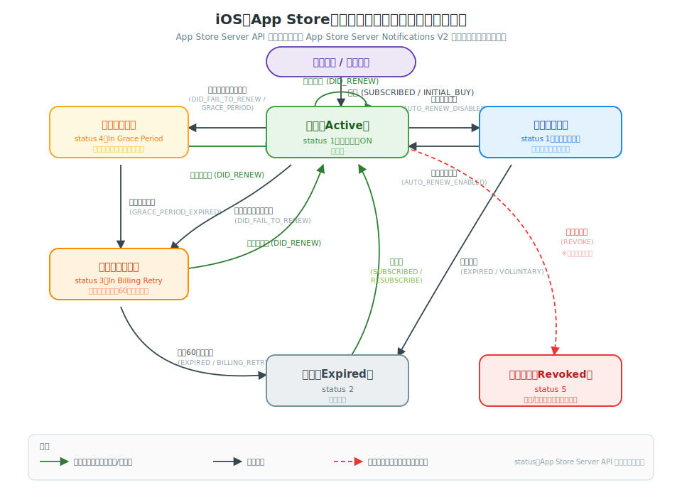

# iOS サブスクリプション 状態遷移図（SVG）

Android（Google Play Billing）には[公式の定期購入ライフサイクル図](https://developer.android.com/google/play/billing/lifecycle/subscriptions?hl=ja)がありますが、iOS（App Store）には同等の1枚図が公式に用意されていません。そこで **App Store Server API のステータス値** と **App Store Server Notifications V2（ASSN V2）の通知タイプ** をもとに、iOSのサブスクリプション状態遷移を1枚のSVGに描き起こしました。

> SVG単体ファイル：[`ios-subscription-lifecycle.svg`](ios-subscription-lifecycle.svg)

---

## 状態（ステータス）一覧

App Store Server API の `status` フィールドの値に対応します。

| 状態 | status値 | 利用可否 | 説明 |
| --- | --- | --- | --- |
| **有効（Active）** | `1` | 利用可 | 課金が成立し自動更新が有効。通常の正常状態。 |
| **自動更新オフ** | `1` | 利用可（期限まで） | ユーザーが自動更新をオフ（解約予約）。期限までは利用できる。 |
| **請求猶予期間（In Grace Period）** | `4` | 利用可 | 更新の支払いに失敗したが、猶予期間中は利用を継続。Appleが裏で再請求。 |
| **請求リトライ中（In Billing Retry）** | `3` | 原則 利用不可 | 支払い未解決のままAppleが最大60日間 再請求を試みる。 |
| **失効（Expired）** | `2` | 利用不可 | 期限切れ。自発的解約・再請求失敗・価格改定未承諾など。 |
| **取り消し（Revoked）** | `5` | 利用不可 | 返金、ファミリー共有の解除などで権利が取り消された状態。 |

> 「請求猶予期間」はApp Store Connectで**請求猶予期間（Billing Grace Period）を有効化している場合のみ**発生します。無効の場合は更新失敗時に直接「請求リトライ中」へ遷移します。

---

## 主な遷移と通知タイプ

括弧内は ASSN V2 の `notificationType` ＋ `subtype` です。

| From → To | きっかけ（通知） | 補足 |
| --- | --- | --- |
| 新規購入 → 有効 | `SUBSCRIBED` / `INITIAL_BUY` | 初回課金。`Transaction` を検証して権利付与。 |
| 有効 → 有効 | `DID_RENEW` | 自動更新成功。期限（`expiresDate`）が更新される。 |
| 有効 → 自動更新オフ | `DID_CHANGE_RENEWAL_STATUS` / `AUTO_RENEW_DISABLED` | ユーザーが解約予約。期限までは利用可。 |
| 自動更新オフ → 有効 | `DID_CHANGE_RENEWAL_STATUS` / `AUTO_RENEW_ENABLED` | 自動更新を再びオンに。 |
| 自動更新オフ → 失効 | `EXPIRED` / `VOLUNTARY` | 期限到来で自発的に失効。 |
| 有効 → 請求猶予期間 | `DID_FAIL_TO_RENEW` / `GRACE_PERIOD` | 更新の支払い失敗＋猶予あり。利用は継続。 |
| 請求猶予期間 → 有効 | `DID_RENEW` | 猶予期間中に支払いが回復。 |
| 請求猶予期間 → 請求リトライ中 | `GRACE_PERIOD_EXPIRED` | 猶予期間が終了し、まだ未解決。 |
| 有効 → 請求リトライ中 | `DID_FAIL_TO_RENEW`（猶予なし） | 猶予期間を無効化している場合は直接ここへ。 |
| 請求リトライ中 → 有効 | `DID_RENEW` | リトライ期間中に支払いが回復。 |
| 請求リトライ中 → 失効 | `EXPIRED` / `BILLING_RETRY` | 最大60日間 回復せず失効。 |
| 失効 → 有効 | `SUBSCRIBED` / `RESUBSCRIBE` | 同一プロダクトに再加入。 |
| 任意の状態 → 取り消し | `REVOKE` | 返金、ファミリー共有の解除など。即時に権利失効。 |

> このほか `DID_CHANGE_RENEWAL_PREF`（アップグレード＝即時／ダウングレード＝次回更新時のプラン変更）、`REFUND` / `REFUND_DECLINED` / `REFUND_REVERSED`（返金関連）、`PRICE_INCREASE`（値上げ同意）、`OFFER_REDEEMED`（オファー適用）などの通知もありますが、いずれも「有効」の状態を維持したままの付随的な通知が中心のため、本図では主要な状態遷移に絞っています。

---

## Android との対応

| Android（Google Play） | iOS（App Store）の相当 |
| --- | --- |
| `SUBSCRIPTION_STATE_ACTIVE` | 有効（Active, status 1） |
| `SUBSCRIPTION_STATE_IN_GRACE_PERIOD` | 請求猶予期間（In Grace Period, status 4） |
| `SUBSCRIPTION_STATE_ON_HOLD` | 請求リトライ中（In Billing Retry, status 3） |
| `SUBSCRIPTION_STATE_CANCELED`（期限まで有効） | 自動更新オフ（status 1・解約予約） |
| `SUBSCRIPTION_STATE_EXPIRED` | 失効（Expired, status 2） |
| `SUBSCRIPTION_STATE_PAUSED` | （iOSに相当なし。一時停止の仕組みは無い） |
| Revoke（返金・チャージバック） | 取り消し（Revoked, status 5） |

> iOS には Android のような **一時停止（PAUSED）** に相当する状態はありません。一方で iOS の「取り消し（Revoked）」は返金やファミリー共有解除を明示的に表す独立ステータスになっています。

---

## 実装メモ

- **真実の源（Source of Truth）** は App Store Server API の `Get All Subscription Statuses` で取得する `status`。通知はあくまでトリガーとして使う。
- 署名付き `JWSTransaction` / `JWSRenewalInfo` は必ず**サーバー側で検証**する。
- `EXPIRED` の `subtype` で失効理由（自発的 / 再請求失敗 / 価格未承諾 / 販売停止）を判別できる。
- 通知は再送・順不同・重複があり得るため、`status` の再取得で**冪等に**状態を確定させる。

> 参考：Apple「[App Store Server Notifications V2](https://developer.apple.com/documentation/appstoreservernotifications)」「[Get All Subscription Statuses](https://developer.apple.com/documentation/appstoreserverapi/get_all_subscription_statuses)」
