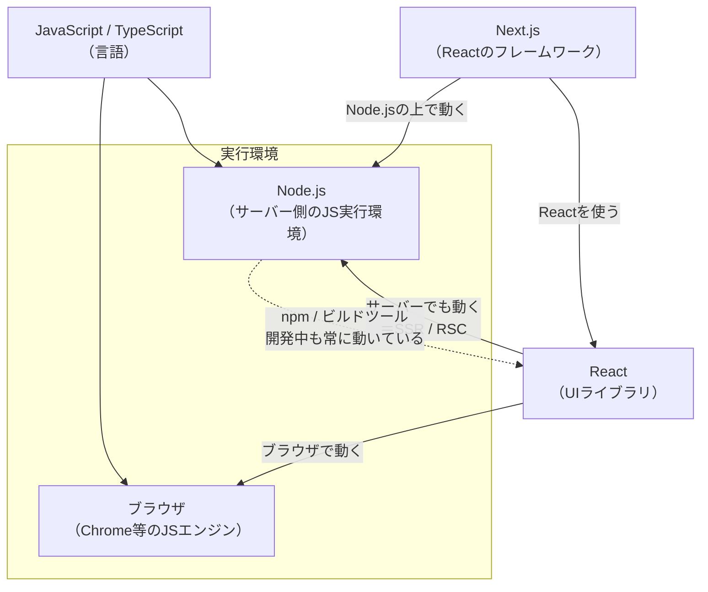

# JavaScript・Node.js・React・Next.js の関係

**「結局この4つは何が違って、どうつながっているのか」** を1ページで整理します。3つのシリーズ（[Node.js](nodejs/README.md) / [React](react/README.md) / [Next.js](nextjs/README.md)）を読む前に、ここで全体像をつかんでください。

---

## 1. まず結論（30秒サマリ）

**この4つは競合ではありません。積み重なっています。**

```
┌─────────────────────────────────────────────┐
│  Next.js    …… Reactでサービスを作る「完成車」 │
├─────────────────────────────────────────────┤
│  React      …… 画面を組み立てる「部品と設計図」 │
├─────────────────────────────────────────────┤
│  Node.js    …… ブラウザの外でJSを動かす「実行環境」│
├─────────────────────────────────────────────┤
│  JavaScript …… そもそもの「言語」              │
└─────────────────────────────────────────────┘
```

一言で説明すると：

| | 正体 | ひとことで |
| --- | --- | --- |
| **JavaScript** | プログラミング言語 | 文法そのもの。`const` や `for` はこれ |
| **Node.js** | JavaScriptの**実行環境** | ブラウザ以外の場所でJSを動かす土台 |
| **React** | JavaScriptの**ライブラリ** | 画面（UI）を部品に分けて組み立てる道具 |
| **Next.js** | Reactの**フレームワーク** | Reactでサービスを作るのに足りないものを全部入れたもの |

> 🔑 **最も多い誤解**：「Node.js と React はどちらを選ぶか」ではありません。**Node.js は土台、React はその上で使う道具**です。実際、Reactの開発をするときも、裏では必ずNode.jsが動いています。

---

## 2. たとえ話：レストランで理解する

```
🌐 JavaScript … 「日本語」という言語
🏗️ Node.js    … 厨房という「場所と設備」
🍳 React      … 調理器具のセット（包丁・鍋・オーブン）
🏪 Next.js    … 内装・レジ・メニュー表まで揃った「開店できる店舗一式」
```

- **言語（JavaScript）** が話せないと何も始まらない
- **厨房（Node.js）** がないと、家の外で料理を作れない
- **調理器具（React）** があると料理が速く正確に作れる
- **店舗一式（Next.js）** があれば、明日から営業できる

「調理器具だけ買っても店は開けない」——これが **「Reactだけでは本番のWebサービスにならない」** ということです。

---

## 3. なぜNode.jsが生まれたのか

JavaScriptは元々 **「ブラウザの中だけで動く言語」** でした。

```
1995年〜        ブラウザの中だけ
  ブラウザ ┌──────────────┐
          │ JavaScript   │  ← ボタンを押したら色が変わる、程度の用途
          └──────────────┘
          ※ファイルを読む、DBに繋ぐ、といったことは一切できない

2009年 Node.js 登場
  サーバー ┌──────────────┐
          │ JavaScript   │  ← ファイル操作・DB接続・HTTPサーバーができるように！
          └──────────────┘
```

**Node.js は「ブラウザからJavaScriptエンジン（V8）だけを取り出して、サーバー用の機能を足したもの」** です。これによって：

- ✅ **フロントもバックも同じ言語**で書ける（学習コストが半分に）
- ✅ 型やロジックをフロント・バックで**共有**できる
- ✅ npm という巨大なライブラリ資産が使える

この「サーバーでもJSが動く」という前提があって初めて、後の **SSR（サーバーでReactを実行してHTMLを作る）** が可能になりました。**Next.js が成立するのはNode.jsのおかげ**です。

---

## 4. なぜReactが生まれたのか

Node.js とは別の問題を解決するために登場しました。**「画面の更新が複雑になりすぎる」** 問題です。

```
❌ React以前（手続き的）：「どう変えるか」を全部書く
   ボタンが押された
     → カウンタのDOMを探す
     → テキストを書き換える
     → 隣のバッジも探して書き換える
     → 条件によっては要素を追加する…
   ※どこかで書き忘れると画面がズレる

✅ React（宣言的）：「どう見えるべきか」だけ書く
   count が 3 のときは「3」と表示する、とだけ書く
   → 変わったところはReactが自動で反映する
```

React の本質は **「データ → 画面」を関数として書ける** ことです。

```jsx
// データを渡すと画面が返る「関数」
function Counter({ count }) {
  return <p>現在: {count}</p>
}
```

ただし React が面倒を見るのは **画面だけ**。URL設計もサーバー処理もデータ取得も入っていません。だから Next.js が必要になります。

---

## 5. 3つの関係を1枚の図で



**注目すべきは React から Node への矢印**です。「Reactはブラウザのもの」と思われがちですが、**サーバー上のNode.jsでもReactは動きます**。これがSSRであり、React Server Components（RSC）です。

---

## 6. 開発中と本番、それぞれで何が動いているか

初学者が混乱しやすいのが「いつどれが動いているのか」です。

### 開発しているとき（`npm run dev`）

```
あなたのPC
├── Node.js が動いている
│   ├── npm（パッケージ管理）      ← Node.jsの機能
│   ├── ビルドツール（Turbopack等） ← Node.js上で動く
│   └── 開発サーバー               ← Node.js上で動く
└── ブラウザ
    └── React が動いて画面を描く
```

> 💡 **「ReactだけのプロジェクトでもNode.jsは必須」** なのはこのためです。`npm install` も `npm run dev` も、すべてNode.jsが実行しています。「Node.jsは使っていません」という状態は、実は存在しません。

### 本番で動いているとき（Next.jsの場合）

```
ユーザーのブラウザ                サーバー（Node.js）
┌──────────────────┐            ┌─────────────────────────┐
│ Client Component │ ←── HTML ── │ Server Component        │
│ （Reactが動く）   │            │ （Reactがサーバーで動く）│
│ ボタン・入力      │ ── 送信 ──→ │ Server Actions          │
└──────────────────┘            │ DB接続・APIキー使用      │
                                └─────────────────────────┘
```

**同じReactのコードが、サーバーとブラウザの両方で動いている**——これが現代のReact/Next.jsの姿です。詳しくは [Next.js④ Server/Client Components](nextjs/04-server-client-components.md)。

---

## 7. 学習順序 — どれから学ぶべきか

### 推奨ルート（遠回りに見えて最短）

```
1. JavaScript の基礎
   　変数・関数・配列メソッド（map/filter）・分割代入・async/await
   　※ここが弱いとReactで必ず詰まります
        ↓
2. React の基礎
   　コンポーネント・props・state・フック
   　→ 【React①〜⑤章】
        ↓
3. Node.js の基礎
   　実行環境・npm・非同期・簡単なサーバー
   　→ 【Node.js①〜④章】
        ↓
4. Next.js
   　→ 【Next.js全章】
```

> ⚠️ **Next.jsから始めるのはおすすめしません。** Server ComponentsとClient Componentsの区別（[Next.js④](nextjs/04-server-client-components.md)）は、「Reactが本来どう動くか」「Node.jsとブラウザは何が違うか」を知らないと理解できません。ここでつまずく人が非常に多いです。

### 目的別のショートカット

| やりたいこと | 学ぶ範囲 |
| --- | --- |
| 画面を作れるようになりたい | JavaScript → [React](react/README.md)（①〜⑤章） |
| APIサーバーを作りたい | JavaScript → [Node.js](nodejs/README.md)（全章） |
| Webサービスを丸ごと作りたい | 上記2つ → [Next.js](nextjs/README.md) |
| 既存のNext.jsプロジェクトを触る | [React④⑦章](react/README.md) → [Next.js③④⑤章](nextjs/README.md) |
| バックエンドだけ担当する | [Node.js](nodejs/README.md) 全章 ＋ [Next.js⑨章](nextjs/09-route-handlers-api.md) |

---

## 8. よくある疑問

### Q. Node.js と React、どっちを勉強すべき？

**両方です。** そもそも比較対象ではありません。強いて言えば、作りたいものが「画面」ならReact、「サーバー」ならNode.jsから始めてください。ただしReactを学ぶ過程でNode.js（npm）は必ず触ります。

### Q. Next.jsを使うならNode.jsの知識は要らない？

**必要です。** 次の場面で必ずNode.jsの知識が問われます。

- 環境変数・`process.env` の扱い（[Next.js②](nextjs/02-setup-and-structure.md)）
- 非同期処理とエラーハンドリング
- npm・依存関係のトラブル対応
- Dockerでのデプロイ（[Next.js⑫](nextjs/12-deploy-operations.md)）
- 「これはサーバーで動くのかブラウザで動くのか」の判断

### Q. Node.js と Express は何が違う？

- **Node.js** = JavaScriptの実行環境（土台）
- **Express** = Node.js上で動くWebサーバーの**フレームワーク**

Node.js だけでもHTTPサーバーは作れますが、面倒なのでExpressのような枠組みを使います。React と Next.js の関係に似ています。→ [Node.js⑥](nodejs/06-server-frameworks.md)

### Q. Next.jsがあればExpressは要らない？

**Next.jsを使うなら、多くの場合Expressは不要**です。Route Handlers（[Next.js⑨](nextjs/09-route-handlers-api.md)）がその役割を果たします。ただし「モバイルアプリ専用のAPIサーバー」など、画面を持たないサーバーが必要ならExpressやHono、NestJSを別に立てます。

### Q. TypeScriptはどこに位置する？

**JavaScriptに「型」を足した言語**です。書いたTypeScriptはビルド時にJavaScriptへ変換されます。

```
TypeScript ──[ビルド]──> JavaScript ──> Node.js / ブラウザで実行
```

現在のReact/Next.jsエコシステムは実質TypeScript前提なので、**早い段階で使い始めることをおすすめします**。

### Q. Deno や Bun は？

Node.jsと同じ「JSの実行環境」の後発です。Bunは高速さで注目されていますが、**エコシステムの成熟度と実務での採用実績ではNode.jsが依然として標準**です。まずNode.jsを学べば、知識はそのまま応用できます。→ [Node.js①](nodejs/01-what-is-nodejs.md)

---

## 9. 3シリーズの入り口

| シリーズ | 内容 | どんな人向け |
| --- | --- | --- |
| 🟢 [**Node.js 完全ガイド**](nodejs/README.md) | 実行環境・イベントループ・npm・サーバー構築・実務運用 | サーバー側を理解したい人 |
| 🔵 [**React 完全ガイド**](react/README.md) | コンポーネント・state・フック・React 19・設計パターン | 画面を作れるようになりたい人 |
| ⚫ [**Next.js 完全ガイド**](nextjs/README.md) | ルーティング・RSC・データ取得・認証・デプロイ | Webサービスを丸ごと作りたい人 |

---

## 10. このページのまとめ

- 4つは競合ではなく **積み重なる関係**：JavaScript → Node.js → React → Next.js
- **Node.js は「ブラウザの外でJSを動かす実行環境」**。これがあるからサーバーでReactが動く
- **React は「画面を組み立てるライブラリ」**。URL・サーバー処理・データ取得は含まない
- **Next.js はその足りない部分を埋めたフレームワーク**
- **React開発中も裏では常にNode.jsが動いている**（npm・ビルド・開発サーバー）
- 学習順序は **JavaScript → React → Node.js → Next.js**。Next.jsから始めると④章で詰まる
- TypeScriptは「型付きJavaScript」。ビルド時にJSへ変換される
