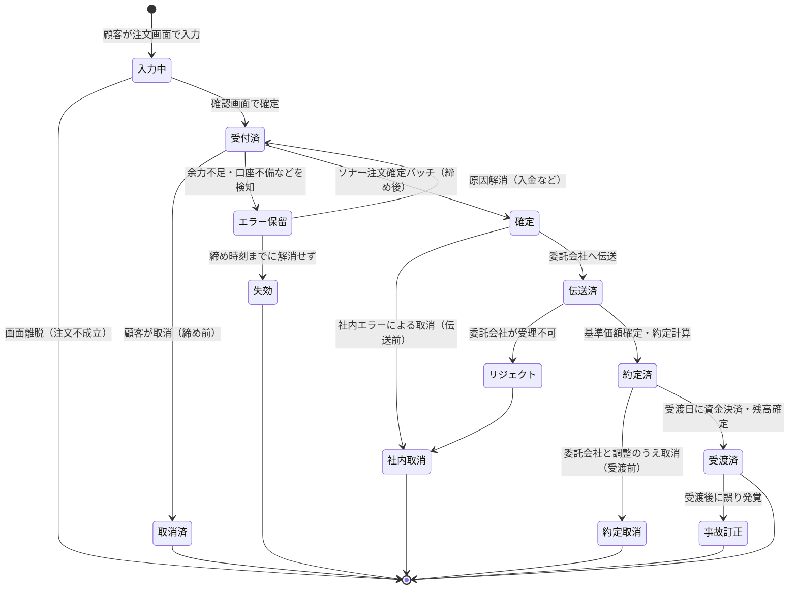

# ④ 注文・訂正・取消 — 状態遷移・締め時刻・例外処理

[← ③ 社内帳票](03-internal-documents.md) ｜ [総合インデックス](README.md) ｜ 次 → [⑤ 分配金の再投資](05-distribution-reinvestment.md)

注文まわりは「買えて、売れれば終わり」ではありません。**要件定義の分量の大半は、正常系ではなく訂正・取消・例外系**が占めます。ここを浅く済ませると、テスト工程で仕様が爆発します。

---

## 0. この章のゴール

1. 注文の状態遷移を図で書け、「どの状態で何ができるか」を言える
2. **訂正と取消の違い**、およびそれぞれが可能な期限を設計できる
3. 受渡後に誤りが発覚した場合（事故訂正）の業務フローを設計できる
4. **信託財産留保額のロット管理**という、MMF固有の難所を理解する

---

## 1. 注文種別の整理

### 1-1. 取引種別

| 種別 | 内容 | 第1フェーズでの推奨 |
| --- | --- | --- |
| **買付** | MMFを購入する | ◎ 必須 |
| **解約** | MMFを換金する（信託財産から払い出す） | ◎ 必須 |
| 買取請求 | 販売会社が受益権を買い取る形式 | △ MMFでは通常不要。要確認 |
| スイッチング | 他ファンドへの乗換 | ✕ Out推奨 |
| 積立（定時定額買付） | 毎月自動で買い付ける | △ 第2フェーズ推奨 |
| 自動スイープ | 入出金に連動した自動売買 | △ MRF仕様への影響大。要判断 |
| 償還 | 信託期間満了・繰上償還による強制換金 | ◎ 必須（顧客注文ではないが処理は必要） |

### 1-2. 数量の指定方法

| 指定方法 | 買付 | 解約 | 論点 |
| --- | --- | --- | --- |
| **金額指定** | ◎ 主流 | ○ | 金額から口数を逆算する。端数処理ルールが必要 |
| **口数指定** | ○ | ◎ 主流 | 1口＝1円のため金額とほぼ一致するが、**一致させてはいけない**（基準価額は変動しうる） |
| **全部解約** | — | ◎ 必須 | ★**未収分配金の精算**が絡む。[7節](#7-全部解約と未収分配金)参照 |

> ⚠️ **「MMFは1口1円だから金額＝口数」と決め打ちしないでください。** MMFは元本の安定を目指しますが、**保証はありません**。基準価額が10,000円（1万口あたり）から乖離する可能性を前提に、「金額 ÷ 基準価額 × 10,000 = 口数」の計算式で実装してください。1:1固定で作ると、元本割れが起きた瞬間にシステムが破綻します。

### 1-3. 受付チャネル

| チャネル | 第1フェーズ | 備考 |
| --- | --- | --- |
| Web（PC） | ◎ | 本プロジェクトの主戦場 |
| Web（スマートフォン） | ◎ | 別画面設計が必要な場合あり |
| アプリ | 要判断 | 既存アプリがある場合は改修範囲を確認 |
| コールセンター | 要判断 | オペレータ用画面と権限設計が追加で必要 |
| 対面（営業店） | 要判断 | 勧誘記録・適合性確認のフローが増える |

> 💡 **チャネルを絞ると、要件定義の分量が劇的に減ります。** 第1フェーズをWeb限定にできないか、企画と交渉する価値があります。

---

## 2. 取引サイクルと締め時刻（カットオフ）設計

### 2-1. 4つのタイムライン

[① 全体像](01-overview.md)で触れた4つの時刻を、ここで確定させます。

```
  T日
  ─────────────────────────────────────────────────────→
  09:00        15:00        15:30      16:00       18:00
    │            │            │          │           │
    │            │            │          │           └─ ④基準価額の受領
    │            │            │          └─ ③委託会社への伝送期限
    │            │            └─ ②ソナーの注文確定バッチ
    │            └─ ①Web受付締め（当日約定の締め）
    └─ 受付開始

  ①→② のバッファ：エラー注文の手当て・訂正取消の承認に使う時間
  ②→③ のバッファ：伝送データ作成とチェックの時間
  ③→④ のバッファ：委託会社側の処理時間

  ★このバッファをゼロにすると、障害時に必ず事故になります
```

### 2-2. 決めるべきこと

| 項目 | 論点 | 決定の目安 |
| --- | --- | --- |
| **Web受付締め時刻** | 何時までの注文を当日扱いにするか | 委託会社の伝送期限から逆算。**余裕を持つ** |
| 締め後注文の扱い | 翌営業日扱いで受け付けるか、受け付けないか | 「翌営業日扱いで予約受付」が親切だが、**取消可能期間の設計が増える** |
| **非営業日の注文** | 土日祝に注文できるか | 予約受付するなら、連休明けの大量処理を想定する |
| **営業日カレンダー** | 誰が管理するか（ソナー／フロント／両方） | **二重管理は事故のもと**。マスタの正を1つに決める |
| 年末年始・臨時休業 | 取扱いと告知 | 委託会社のカレンダーと一致させる |
| 締め時刻の変更 | 将来の変更に設定で対応できるか | ハードコードしない |

> 🔍 **確認事項**：委託会社への注文伝送期限と、**ほふりの投信決済システムを使う場合の締め時刻**（[⑨](09-trustee-settlement.md)）。この2つが決まらないと、Web受付締め時刻を決められません。要件定義の最初期に照会してください。

---

## 3. 注文の状態遷移（ステートマシン）

**この図が、注文機能の設計図そのものです。** 要件定義書には必ず入れてください。



### 各状態で「できること」の一覧

要件定義書に、この表をそのまま載せてください。**議論が一気に収束します。**

| 状態 | 顧客が取消 | 顧客が訂正 | 社内が取消 | 社内が訂正 | 備考 |
| --- | --- | --- | --- | --- | --- |
| **受付済**（締め前） | ◎ | △ 取消＋再入力 | ◎ | △ | 最も柔軟。ここで直させるのが理想 |
| **エラー保留** | ◎ | △ | ◎ | ○ | 原因解消の督促が必要 |
| **確定**（締め後・伝送前） | ✕ | ✕ | ○ 要承認 | △ | 社内判断のみで対応可能な最後の砦 |
| **伝送済** | ✕ | ✕ | △ 委託会社と調整 | ✕ | **委託会社への連絡が必要** |
| **約定済**（受渡前） | ✕ | ✕ | △ 委託会社と調整 | ✕ | 影響が大きい。上位者承認 |
| **受渡済** | ✕ | ✕ | **事故訂正扱い** | **事故訂正扱い** | [6節](#6-受渡後の誤り事故訂正)へ |

> 💡 **設計思想**：**「締め前に顧客自身に直してもらう」のが最もコストが低い**です。したがってフロント側は、確認画面での分かりやすい表示と、締め前の取消機能を充実させるべきです。これは[⑫ フロント要件](12-web-nonfunctional.md)につながります。

---

## 4. 注文受付時のチェック項目

「受付済」に遷移させる前に、何を検証するか。**漏れやすい項目に★を付けています。**

### 4-1. 買付注文

| # | チェック項目 | エラー時の挙動 |
| --- | --- | --- |
| 1 | 口座が有効か（開設済・閉鎖されていない・取引制限なし） | 受付不可 |
| 2 | ★**目論見書の交付（電子交付の同意と閲覧）が済んでいるか** | 交付フローへ誘導（[⑥](06-prospectus-delivery.md)） |
| 3 | ★**適合性確認が済んでいるか**（投資経験・リスク許容度） | 確認フローへ誘導 |
| 4 | 買付余力が足りるか | 受付不可 or エラー保留 |
| 5 | 最低申込単位・申込単位の刻みを満たすか | 受付不可 |
| 6 | 上限金額（1回あたり・1日あたり）を超えていないか | 受付不可 |
| 7 | 締め時刻内か | 翌営業日扱い or 受付不可 |
| 8 | 当該銘柄が販売可能な状態か（販売停止でないか） | 受付不可 |
| 9 | ★**口座区分**（特定口座／一般口座）が指定されているか | 選択を促す |
| 10 | ★反社・AMLのスクリーニングに抵触しないか | 受付保留・要確認 |
| 11 | ★**二重発注でないか**（[8節](#8-二重発注防止と冪等性)） | 受付不可 |

### 4-2. 解約注文

| # | チェック項目 | エラー時の挙動 |
| --- | --- | --- |
| 1 | 保有口数が足りるか（**約定未済の解約注文を差し引いた残**） | 受付不可 |
| 2 | ★**同日に買付した口の解約が可能か**（当日買付分の扱い） | ルールを決める |
| 3 | 出金先口座が登録・有効か | 登録フローへ誘導 |
| 4 | ★**信託財産留保額が発生する旨の表示・同意** | 確認画面で明示 |
| 5 | 全部解約の場合、★**未収分配金の精算方法の案内** | 確認画面で明示 |
| 6 | 締め時刻内か | 翌営業日扱い or 受付不可 |
| 7 | 質権・差押等の制限がないか | 受付不可 |
| 8 | 二重発注でないか | 受付不可 |

> ⚠️ **チェック4と5は、苦情に直結します。** 「知らないうちに手数料を引かれた」「解約したのに分配金がもらえていない」は、MMFで最も出やすい苦情です。**確認画面での明示を要件に入れてください。**

---

## 5. 訂正と取消 — 違いと実装方針

### 5-1. 用語の定義（先に合意する）

プロジェクトで言葉がブレる代表例です。要件定義書の冒頭で定義してください。

| 用語 | 定義 |
| --- | --- |
| **取消** | 注文をなかったことにする。後続の注文は発生しない |
| **訂正** | 注文の内容（数量・金額・口座区分など）を変更する |
| **取消訂正**（アボート＆リブック） | 元の注文を取り消し、正しい内容で新規に注文し直す。**訂正の実装方式** |
| **事故訂正** | 受渡完了後に誤りが発覚し、事後的に修正する。損失負担を伴うことがある |

### 5-2. 実装方針：訂正は「取消＋新規」で作る

| 方式 | 内容 | 評価 |
| --- | --- | --- |
| **A. 直接更新方式** | 既存の注文レコードを書き換える | ✕ **非推奨**。監査証跡が残りにくく、法定帳簿（注文伝票）の要件を満たしにくい |
| **B. 取消＋新規方式**（アボート＆リブック） | 元注文を「取消」状態にし、新しい注文番号で再作成する | ◎ **推奨**。履歴が完全に残る。会計・帳票との整合も取りやすい |

> ⚠️ **法定帳簿の観点から、B方式を強く推奨します。** 注文伝票には訂正・取消の記録も含めて保存する必要があります（[③ 5節](03-internal-documents.md#5-法定帳簿最重要)）。A方式では「元の注文が何だったか」が失われます。

### 5-3. 訂正パターンと対応

| 訂正内容 | 締め前 | 締め後・伝送前 | 伝送後・約定前 | 約定後 |
| --- | --- | --- | --- | --- |
| **数量・金額の誤り** | 取消＋再入力 | 社内取消＋再入力 | 委託会社と調整 | 事故訂正 |
| **銘柄の誤り** | 取消＋再入力 | 社内取消＋再入力 | 委託会社と調整 | 事故訂正 |
| **口座区分の誤り**（特定／一般） | 取消＋再入力 | 社内取消＋再入力 | ★**税処理に影響**。要調整 | ★事故訂正。税の訂正も必要 |
| **顧客の誤り**（他人の口座に発注） | 取消＋再入力 | 社内取消＋再入力 | 委託会社と調整 | ★事故訂正。**重大事象** |
| **出金先口座の誤り**（解約） | 変更可 | 要判断 | 要判断 | 資金の組戻し |

> 🔍 **確認事項**：口座区分（特定口座／一般口座）の訂正が、税処理・年間取引報告書にどう影響するか。**税務部門に照会が必須**です。年をまたぐと訂正が極めて困難になるため、「いつまでなら訂正可能か」のデッドラインを決めてください（[⑪](11-tax-nisa-account.md)）。

### 5-4. 権限と承認フロー

| 操作 | 実行者 | 承認者 | 記録 |
| --- | --- | --- | --- |
| 顧客による取消（締め前） | 顧客本人 | 不要 | 操作ログ |
| オペレータによる取消（締め前） | オペレータ | 不要 or 役席 | 操作ログ＋理由 |
| 社内取消（締め後） | 業務部担当 | **役席承認必須** | 承認記録＋理由 |
| 約定後の取消 | 業務部担当 | **部長級＋コンプラ** | 事故報告書 |
| **事故訂正** | 業務部担当 | **部長級＋コンプラ＋（損失発生時は経営）** | 事故報告書・再発防止策 |

---

## 6. 受渡後の誤り（事故訂正）

最も設計が漏れやすく、最も業務影響が大きい領域です。

### 6-1. 発生パターン

| パターン | 例 |
| --- | --- |
| **入力誤り** | オペレータが桁を間違えた |
| **システム不具合** | 計算ロジックの誤りで口数がずれた |
| **委託会社側の誤り** | 基準価額が誤って配信され、後日訂正された |
| **顧客の申出** | 「注文していない」との申出（なりすまし等を含む） |

> ⚠️ **「基準価額の訂正」は実際に起こります。** 委託会社が算出した基準価額に誤りがあり、後日訂正されるケースです。この場合、**すでに約定・受渡が済んだ取引をすべて再計算**する必要があります。[⑦ 委託会社との調整](07-management-company.md)で、訂正時の連絡ルートと対応手順を必ず取り決めてください。

### 6-2. 事故訂正の業務フロー（設計のひな形）

```
 1. 誤り検知（顧客申出／リコン差異／システムアラート）
        ↓
 2. 事実確認・影響範囲の特定
    ・対象顧客は何名か、金額はいくらか
    ・税処理・帳票にどう波及するか
        ↓
 3. 対応方針の決定（役席・コンプラ・必要に応じて経営）
    ・原状回復するか、金銭で調整するか
    ・顧客に不利益が生じる場合の損失負担
        ↓
 4. 委託会社・受託会社への連絡・調整
        ↓
 5. システム上の訂正処理
    ・取消＋再約定（アボート＆リブック）
    ・税額の再計算
    ・残高の修正
        ↓
 6. 顧客への通知・帳票の再発行
        ↓
 7. 事故報告書の作成・社内報告
    ・当局報告の要否をコンプラが判断
        ↓
 8. 再発防止策の策定・実施
```

### 6-3. システムに必要な機能

| 機能 | 内容 |
| --- | --- |
| **遡及訂正機能** | 過去日付の取引を訂正できるか。**ソナーの標準機能で可能か要確認** |
| **税額の再計算** | 訂正に伴う源泉税の追徴・還付 |
| **帳票の再発行** | 訂正後の取引報告書・取引残高報告書 |
| **年間取引報告書の訂正** | 年をまたいだ場合の訂正版の発行 |
| **訂正の証跡** | 誰が・いつ・何を・なぜ訂正したか |

> 🔍 **大和総研への確認事項**：ソナーにおける遡及訂正（過去日付の約定訂正）の標準機能の有無、および可能な遡及期間。**年をまたぐ訂正**が可能か。これができないと、業務が手作業になります。

---

## 7. 全部解約と未収分配金

**MMF固有の難所です。**

### 7-1. 何が問題か

MMFは日々分配金が計上され、月末にまとめて再投資されます。つまり**月中は「未収分配金」が溜まっている状態**です。

```
  4/1 ─────────────── 4/15（全部解約）────────── 4/30（本来の再投資日）
   │                        │                         │
   └─ 日々分配金を計上 ──────┤                         │
      （未収分配金が蓄積）    │                         │
                            │                         │
                    ここで全部解約すると             ここで再投資される
                    未収分配金はどうなる？           はずだった
```

### 7-2. 設計の選択肢

| 選択肢 | 内容 | 論点 |
| --- | --- | --- |
| **A. 解約代金に含めて即時精算** | 解約時点までの未収分配金を計算し、解約代金に加えて支払う | ◎ 顧客に分かりやすい。**ただし解約時点の分配金額が確定している必要がある** |
| **B. 月末に別途支払う** | 口数分だけ先に解約し、未収分配金は月末に改めて支払う | 顧客が「入金が2回ある」ことに戸惑う。**口座を閉じられると支払先がなくなる** |
| **C. 解約可能時期を制限** | 月末以外の全部解約を認めない | ✕ 非現実的 |

> 🔍 **最重要の確認事項（2点）**
> 1. **委託会社へ**：信託約款上、月中解約時の経過分配金の取扱いがどう定められているか。**これは約款が決めることであり、自社で自由に設計できません**
> 2. **大和総研へ**：ソナーが上記の処理を標準で持っているか。MRF・外貨建MMFで同等の処理をしているか

### 7-3. 派生する論点

- **解約後に口座を閉鎖する場合**：未収分配金の支払前に閉鎖できないよう制御が必要
- **税処理**：未収分配金の精算分も利子所得として源泉徴収の対象になるか（[⑪](11-tax-nisa-account.md)）
- **帳票表示**：解約時の取引報告書に、未収分配金の精算額を表示するか（[②](02-customer-documents.md)）
- **一部解約の場合**：未収分配金は口数按分か、全額据置か

---

## 8. 二重発注防止と冪等性

Webからの注文で必ず起きる問題です。

| 事象 | 対策 |
| --- | --- |
| 確認ボタンの連打 | ボタンの多重送信防止（フロント）＋**サーバ側のトークン検証** |
| ブラウザの戻る→再送信 | ワンタイムトークン（注文ごとに発行し、使用済みは無効化） |
| 通信タイムアウト後の再試行 | **注文IDによる冪等性保証**。同一IDの注文は1回だけ受け付ける |
| フロント〜ソナー間の通信断 | **注文の到達確認**の仕組み。応答が返らなかった注文の状態照会機能 |

> ⚠️ **最も危険なのは「フロントからソナーへ注文を送ったが、応答が返ってこなかった」ケース**です。注文が通ったのか通っていないのか分からない状態になります。
> **必須の設計**：フロント側で採番した一意な注文IDをソナーに渡し、応答不明時はそのIDで状態照会できるようにする。ソナー側は同一IDの再送を2重に処理しない（冪等）。
> 🔍 **大和総研へ**：この冪等性保証が、ソナーのIF仕様でどう担保されているか確認してください。

---

## 9. 信託財産留保額とロット管理（★MMF固有の難所）

### 9-1. 何が問題か

MMFでは「購入から一定期間（従来は30日）未満の解約に信託財産留保額がかかる」設計が一般的です。これを実装するには、**保有口数を「いつ取得したか」でロット管理**する必要があります。

```
 顧客の保有口数の内訳（例）
 ┌──────────────────────────────────────────┐
 │ ロット1： 4/ 1 取得  100,000口  → 30日経過済 │ 留保額なし
 │ ロット2： 4/20 取得   50,000口  → 30日未満   │ 留保額あり
 │ ロット3： 4/30 再投資    123口  → ???        │ ★ここが論点
 └──────────────────────────────────────────┘

 5/10 に 120,000口 を解約したら、どのロットから取り崩す？
```

### 9-2. 決めるべき3点

| # | 論点 | 選択肢 |
| --- | --- | --- |
| **1** | **取崩し順序** | 先入先出（FIFO）／後入先出（LIFO）／顧客有利の順 |
| **2** | **★再投資で増えた口の扱い** | ①再投資日を取得日とする ②元本口の取得日を引き継ぐ ③留保額の対象外とする |
| **3** | 留保額の計算単位 | 1万口あたり◯円か、金額の◯%か。端数処理 |

> ⚠️ **論点2が最大の罠です。** 再投資口の取得日を「再投資日」にすると、**毎月末に新しいロットが生まれ、その口は30日未満**になります。長年保有している顧客でも、解約のたびに再投資口の分だけ信託財産留保額が発生し、**「ずっと持っているのに手数料を取られた」という苦情になります。**

> 🔍 **確認事項（必須）**
> - **委託会社へ**：信託約款上、再投資により取得した口数の信託財産留保額の取扱いはどう定められているか。取崩し順序の定めはあるか
> - **大和総研へ**：ソナーのロット管理の方式と、再投資口の扱い。設定で変更可能か
>
> **これは約款が決めることであり、システム側で勝手に決められません。** 要件定義の早期に確認してください。後から発覚すると、残高データの持ち方から作り直しになります。

### 9-3. 取得単価との関係

信託財産留保額のロット管理とは**別に**、税務上の取得単価計算（総平均法に準ずる方法など）が必要です。**この2つは別々のロジック**なので、混同しないでください。詳細は[⑪ 口座・税制](11-tax-nisa-account.md)で扱います。

---

## 10. 例外・エラーパターン一覧

要件定義書の別紙として、この表を埋めてください。

| # | 事象 | 検知タイミング | 対応 | 顧客通知 |
| --- | --- | --- | --- | --- |
| 1 | 買付余力不足 | 注文受付時 | 受付不可 or 保留 | 画面表示 |
| 2 | 締め時刻超過 | 注文受付時 | 翌営業日扱い or 受付不可 | 画面表示 |
| 3 | 目論見書未交付 | 注文受付時 | 交付フローへ誘導 | 画面遷移 |
| 4 | 最低申込単位未満 | 注文受付時 | 受付不可 | 画面表示 |
| 5 | 保有口数超過の解約 | 注文受付時 | 受付不可 | 画面表示 |
| 6 | 出金先口座未登録 | 注文受付時 | 登録フローへ誘導 | 画面遷移 |
| 7 | **基準価額の未着** | 締め後 | ★約定できない。翌日扱いか要判断 | **要通知** |
| 8 | **基準価額の訂正** | 後日 | 全対象取引の再計算 | **要通知・帳票再発行** |
| 9 | 委託会社からのリジェクト | 伝送後 | 社内取消。原因調査 | **要通知** |
| 10 | 委託会社側のシステム障害 | 伝送時 | 代替手段（[⑦](07-management-company.md)）／翌営業日扱い | **要通知** |
| 11 | ソナー側の障害 | 随時 | 注文受付停止・縮退運転（[⑫](12-web-nonfunctional.md)） | **要告知** |
| 12 | フロント〜ソナー間の通信断 | 注文送信時 | 状態照会・冪等性で復旧 | 状況により |
| 13 | 販売停止・繰上償還の決定 | 随時 | 買付受付停止。既受付分の扱いを判断 | **要通知** |
| 14 | リコンサイル差異 | 夜間バッチ後 | 翌朝までに調査（[⑨](09-trustee-settlement.md)） | 影響時のみ |
| 15 | 口座閉鎖中の再投資 | 月末再投資時 | 未収分配金の支払方法を決める | **要通知** |

> 💡 **7番と8番は「起きない前提」で作られがちですが、実際に起こります。** 特に8番（基準価額の訂正）は、対応手順がないと業務が完全に止まります。

---

## 11. ソナーとの連携方式

| 論点 | 選択肢 | 判断材料 |
| --- | --- | --- |
| **注文連携の方式** | リアルタイムAPI／準リアルタイム／バッチ | 顧客への即時応答が必要ならAPI。**ソナーの提供方式に依存** |
| 余力チェックの場所 | フロントで持つ／ソナーに都度問合せ | 二重管理は差異のもと。**ソナーを正とするのが基本** |
| 注文状態の管理 | フロントで持つ／ソナーを正とする | **正を1つに決める。両方で持つと必ずズレる** |
| 注文番号の採番 | フロント採番／ソナー採番／両方 | 冪等性のためフロント採番のIDが必要（[8節](#8-二重発注防止と冪等性)） |
| 訂正・取消の受付 | フロント画面／ソナー画面／両方 | 権限設計と併せて決める |

> 🔍 **大和総研への質問リスト（注文編）**
> 1. 投資信託の注文受付について、リアルタイムAPIは提供されますか。応答時間のSLAは
> 2. 注文の冪等性（同一注文IDの再送を重複処理しない）はどう担保されますか
> 3. 注文の状態（受付済・確定・伝送済・約定済・受渡済）はソナー側で管理されますか。フロントから状態照会するIFはありますか
> 4. 締め後・伝送前の社内取消は、標準機能で可能ですか
> 5. 約定後・受渡前の取消（委託会社との調整後）は、標準機能で可能ですか
> 6. **受渡後の遡及訂正**は可能ですか。可能な遡及期間は。年をまたぐ訂正は可能ですか
> 7. **信託財産留保額のロット管理**はどの方式ですか。取崩し順序と再投資口の扱いは設定変更可能ですか
> 8. **全部解約時の未収分配金の精算**は標準機能で処理されますか
> 9. 営業日カレンダーはソナー側で管理されますか。フロントへ提供するIFはありますか
> 10. 基準価額が訂正された場合の再計算処理は、標準機能で提供されますか

---

## 12. この章のチェックリスト

- [ ] 取引種別・数量指定方法・受付チャネルのスコープが確定している
- [ ] **4つのタイムライン**（Web締め／ソナー締め／伝送期限／基準価額受領）が図で合意されている
- [ ] 営業日カレンダーの管理主体（正）が1つに決まっている
- [ ] **注文の状態遷移図**が作成され、各状態で可能な操作が表になっている
- [ ] 注文受付時のチェック項目が買付・解約それぞれで列挙されている
- [ ] 「訂正＝取消＋新規」の方式で合意している（法定帳簿の要件を満たす）
- [ ] 訂正・取消の権限と承認フローが定義されている
- [ ] **事故訂正の業務フロー**が文書化されている
- [ ] ソナーの**遡及訂正機能**の有無と遡及期間を確認した
- [ ] **全部解約時の未収分配金の扱い**を、信託約款ベースで委託会社に確認した
- [ ] 二重発注防止（冪等性）の設計がフロント・ソナー双方で担保されている
- [ ] **信託財産留保額のロット管理**の3論点（取崩し順序・再投資口の扱い・計算単位）を約款ベースで確定した
- [ ] 例外・エラーパターン一覧が埋まり、それぞれに対応と通知方法が定義されている
- [ ] **基準価額の未着・訂正**への対応手順が定義されている
- [ ] 口座区分の訂正可能デッドラインを税務部門と決めた

---

[← ③ 社内帳票](03-internal-documents.md) ｜ [総合インデックス](README.md) ｜ 次 → [⑤ 分配金の再投資](05-distribution-reinvestment.md)
