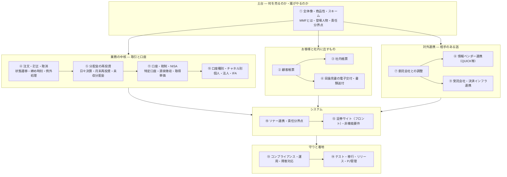

# 新規MMF 証券サイト販売 要件定義ガイド 総合インデックス

**「新しいMMFを自社の証券サイトで売る。バックオフィスは大和総研のソナー（SONAR）で処理する」** — このプロジェクトを成功させるために要件定義すべき事項を、業務・システム・法令・対外調整の4軸で網羅的に整理したガイドです。

- 対象：企画担当／システム担当／業務部（オペレーション）／コンプライアンス／プロジェクトマネージャー
- 前提：自社は **販売会社（証券会社）**。運用は委託会社、信託財産の保管は受託会社、バックオフィス基幹は **ソナー（共同利用型の証券基幹システム）**
- 作成時点：2026年9月

> ⚠️ **このガイドの位置づけ**
> 本資料は「**要件定義の抜け漏れを防ぐためのチェックリスト兼たたき台**」です。制度・税制・自主規制ルール、およびソナーの標準機能仕様は改定されます。
> **本資料の記述をそのまま設計の根拠にせず、各章の「🔍 確認事項」に挙げた項目を、委託会社・大和総研・自社のコンプライアンス／税務部門に必ず確認してください。**
> 特に税務・法令の記述は「論点の所在を示すもの」であり、最終判断は所管部門・専門家の見解によります。

---

## 1. まず結論（30秒サマリ）

このプロジェクトの成否を分けるのは、**画面を作ること**ではありません。次の4点です。

| # | 勝負どころ | なぜ重要か | 章 |
| --- | --- | --- | --- |
| **①** | **ソナーの標準機能で、どこまで素で乗るか** | 共同利用型システムは個社カスタマイズのコストとリードタイムが跳ね上がる。「標準機能に業務を寄せる」判断を**要件定義の最初**にやらないと、後半でスケジュールが破綻する | [⑩](10-sonar-integration.md) |
| **②** | **MMF特有の「日々決算・月末再投資」を業務全体で捌けるか** | 毎日分配金が計上され月末にまとめて再投資される。帳票・税・残高表示・解約時の経過分配金まで、**全部ここに引きずられる** | [⑤](05-distribution-reinvestment.md) |
| **③** | **委託会社との合意形成のリードタイム** | 販売会社契約、事務手続、データ授受、決済スキーム、スケジュール。**相手のある話**なので自社の努力だけでは縮まらない | [⑦](07-management-company.md) |
| **④** | **設定日（ファンド設定日）から逆算した工程表** | 設定日は動かせない。テスト・接続確認・リハーサルの期間を先に確保し、残りで開発する | [⑭](14-test-release.md) |

**最初に読む1章だけ選ぶなら**：システム担当は [⑩ ソナー連携と責任分界点](10-sonar-integration.md)、企画・業務担当は [① 全体像・商品性・スキーム](01-overview.md) です。

---

## 2. 全体マップ



---

## 3. 章立て

### 土台

| 章 | 内容 |
| --- | --- |
| [① 全体像・商品性・スキーム](01-overview.md) | MMFとは何か／MRFとの違い／円建てMMFが一度消えて戻ってきた背景／登場人物と資金・情報の流れ／責任分界点マトリクス／スコープIn-Out |

### 業務の中核

| 章 | 内容 |
| --- | --- |
| [④ 注文・訂正・取消](04-order-correction-cancel.md) | 注文種別と受付チャネル／締め時刻と営業日／**注文ステータスの状態遷移**／訂正と取消の違い／受渡後の事故訂正／二重発注防止／30日未満解約の信託財産留保額 |
| [⑤ 分配金の再投資](05-distribution-reinvestment.md) | 日々決算・月末一括再投資の仕組み／**未収分配金**の管理と表示／月中解約時の経過分配金／源泉徴収後の再投資／端数処理／月末が非営業日の場合 |
| [⑪ 口座・税制・NISA・マイナンバー](11-tax-nisa-account.md) | 口座区分／公社債投信の課税関係（分配金＝利子所得・解約差益＝譲渡所得等）／**NISA対象外**の扱い／取得単価計算／法人・非居住者／法定調書 |

### お客様と社内に出すもの

| 章 | 内容 |
| --- | --- |
| [② 顧客帳票](02-customer-documents.md) | 取引報告書・取引残高報告書・特定口座年間取引報告書・支払通知書・運用報告書の一覧と発生トリガ／**日々決算による帳票爆発をどう抑えるか**／電子交付と郵送の分岐／ソナー標準帳票との差分 |
| [③ 社内帳票](03-internal-documents.md) | 日次・月次のオペレーション帳票／経理仕訳と代行手数料／コンプライアンス・モニタリング帳票／**法定帳簿**と保存年限／経営管理KPI／当局・協会報告 |
| [⑥ 目論見書の電子交付・書類送付](06-prospectus-delivery.md) | 交付目論見書と請求目論見書／電子交付の同意取得・撤回・閲覧確認／**版数管理と訂正目論見書**／未同意者の買付制御／郵送運用と同封物最適化／交付記録の保存 |

### 対外連携

| 章 | 内容 |
| --- | --- |
| [⑦ 委託会社との調整](07-management-company.md) | 販売会社契約と商品審査／**合意すべき商品性パラメータ一覧**／事務手続書／データ授受の経路と時刻／決済スキーム／障害時の連絡体制／打合せアジェンダのひな形 |
| [⑧ 情報ベンダーへのデータ連携（QUICK等）](08-info-vendor.md) | 受信データ（基準価額・分配金・純資産）と送信データ／**MMFの「7日間平均利回り」表示**／新ファンドのコード登録／データ遅延・欠損時のフォールバック／契約と再配信の権利 |
| [⑨ 受託会社・決済インフラ連携](09-trustee-settlement.md) | 受託会社の役割と販売会社との距離感／**投資信託振替制度（ほふり）**／約定照合・資金決済・残高照合／リコンサイル差異の調査フロー／障害時の代替手段 |

### システム

| 章 | 内容 |
| --- | --- |
| [⑩ ソナー連携・責任分界点](10-sonar-integration.md) | **機能×担当の責任分界点マトリクス**／想定インターフェース一覧／商品マスタ登録項目／日次バッチのタイムライン／標準機能とアドオンの切り分け／**大和総研への質問リスト** |
| [⑫ 証券サイト（フロント）・非機能要件](12-web-nonfunctional.md) | 画面一覧と遷移／MMF特有の表示項目／適合性確認フロー／性能（月末ピーク）・可用性・セキュリティ／メンテナンス時間とバッチの関係／縮退運転 |

### 守りと着地

| 章 | 内容 |
| --- | --- |
| [⑬ コンプライアンス・運用・障害対応](13-compliance-ops.md) | 適用法令と自主規制／商品審査プロセス／広告審査／改定すべき社内規程一覧／日次オペレーション手順／**元本割れ（ブレーク・ザ・バック）発生時**の対応／繰上償還 |
| [⑭ テスト・移行・リリース・プロジェクト管理](14-test-release.md) | 設定日からの逆算工程／テスト工程と接続テスト／**日付シフトテスト**（月末再投資の検証）／リハーサル／Go-No Go基準／切り戻し／体制とRACI |
| [⑮ 口座種別・チャネル別の取扱い（個人・法人・IFA）](15-account-types.md) | **「一般口座だから源泉徴収なし」は誤り**／法人の源泉徴収は所得税のみか／**源泉徴収の取扱いが異なる法人類型**／所得税額控除と任意期間の税額集計／個人の住民税の特別徴収／**IFA口座の業務・システム12項目**／口座種別×論点マトリクス |
| [用語集・チェックリスト・未決事項](glossary.md) | 用語辞典／全体チェックリスト（統合版）／**Open Issues管理表**／委託会社・大和総研への質問票 |

---

## 4. 読者別ルート

| あなたの立場 | 読む順番 |
| --- | --- |
| **プロジェクトマネージャー** | ① → ⑩ → ⑦ → ⑭ → [用語集の未決事項一覧](glossary.md) |
| **システム担当（フロント）** | ① → ④ → ⑫ → ⑤ → ⑥ |
| **システム担当（バック・ソナー窓口）** | ① → ⑩ → ④ → ⑤ → ⑪ → ⑮ → ⑨ |
| **業務部（オペレーション）** | ① → ④ → ⑤ → ③ → ⑬ |
| **企画・商品担当** | ① → ⑦ → ⑧ → ⑪ → ⑮ → ⑬ |
| **コンプライアンス** | ① → ⑥ → ⑬ → ⑪ → ② |

---

## 5. 要件定義の全体像 — 4つの層

要件定義書を書くとき、この4層で章立てすると漏れにくくなります。

```
┌─────────────────────────────────────────────────────┐
│ 第1層：業務要件（何をする業務か）                    │
│  商品性・取引サイクル・オペレーション手順・体制        │
│  → ①④⑤⑬⑮                                        │
├─────────────────────────────────────────────────────┤
│ 第2層：機能要件（システムが何をするか）              │
│  画面・帳票・バッチ・IF・データ                       │
│  → ②③④⑤⑥⑩⑫                                    │
├─────────────────────────────────────────────────────┤
│ 第3層：非機能要件（どんな品質で動くか）              │
│  性能・可用性・セキュリティ・運用保守・移行            │
│  → ⑫⑬⑭                                           │
├─────────────────────────────────────────────────────┤
│ 第4層：制約要件（守らねばならないこと）              │
│  法令・自主規制・税制・ソナーの仕様制約・対外スケジュール│
│  → ⑥⑦⑧⑨⑪⑬⑮                                    │
└─────────────────────────────────────────────────────┘
```

---

## 6. 本ガイドで追加した論点（ご依頼の8項目以外）

ご指定いただいた8項目に加え、**同種プロジェクトで実際に炎上しやすい**次の論点を追加しています。

| 追加論点 | なぜ追加したか | 章 |
| --- | --- | --- |
| **ソナーとの責任分界点・IF定義** | 「バックはソナーで対応」の一言に、最大のコストとリスクが隠れている。標準／アドオンの切り分けが遅れると全工程が遅延する | [⑩](10-sonar-integration.md) |
| **口座区分・税制・NISA対象可否** | MMF（公社債投信）は株式投信と課税区分が違う。**NISA対象外**をサイトでどう明示するかを含め、設計の前提になる | [⑪](11-tax-nisa-account.md) |
| **証券サイトのフロント要件・非機能要件** | 月末（再投資日）と金利イベント時にアクセスが集中する。締め時刻直前の輻輳設計が必要 | [⑫](12-web-nonfunctional.md) |
| **コンプライアンス・社内規程改定・広告審査** | 商品審査会を通らないと販売できない。広告審査のリードタイムも工程に効く | [⑬](13-compliance-ops.md) |
| **元本割れ・繰上償還時の対応** | MMFは元本保証ではない。「起きない前提」で作ると、起きたときに業務が止まる | [⑬](13-compliance-ops.md) |
| **テスト・移行・リリース計画** | 日々決算・月末再投資は**日付を動かさないと検証できない**。日付シフトテストの環境確保は早期に手を打つ必要がある | [⑭](14-test-release.md) |
| **口座種別・チャネル別の差異（個人・法人・IFA）** | 法人は特定口座が使えず源泉徴収の内訳も違う。**源泉徴収されない法人類型**もあり、受け入れ範囲の定義が要る。IFAは税務は同じでも業務が別 | [⑮](15-account-types.md) |
| **未決事項（Open Issues）管理** | 対外調整が多い案件は「決まっていないことリスト」の運用が品質を決める | [用語集](glossary.md) |

---

## 7. 最初の30日でやること（推奨アクション）

| 週 | やること | アウトプット |
| --- | --- | --- |
| **第1週** | スコープ確定・体制組成。委託会社とのキックオフ日程確保。大和総研へ初回照会 | スコープ定義書、体制図、[質問票](glossary.md)の発送 |
| **第2週** | 商品性パラメータの仮確定（[⑦](07-management-company.md)の合意事項テーブルを埋める） | 商品仕様（案） |
| **第3週** | ソナー標準機能の適合性確認（[⑩](10-sonar-integration.md)のマトリクスを埋める） | Fit&Gap一覧、アドオン候補リスト |
| **第4週** | 設定日から逆算した工程表の合意。Go/No-Go の判断基準を先に決める | マスタースケジュール、リスク一覧 |

---

## 8. 関連資料

- [投資指標と資産シミュレーション まとめ](../investment-indicators-simulation.md) — リスク・リターン指標の基礎
- [実証実験（PoC）「報告書渡し」の計上基準日 完全ガイド](../poc-revenue-recognition-guide.md) — 収益認識の考え方
- [ネットワーク技術 完全ガイド](../network/README.md) — 専用線・回線設計を検討する場合

---

[→ ① 全体像・商品性・スキームから読む](01-overview.md)
