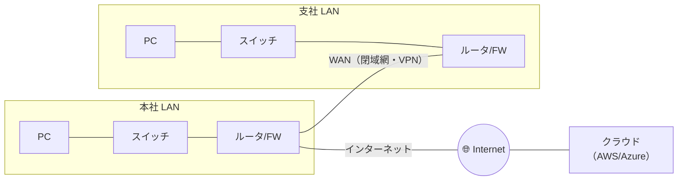
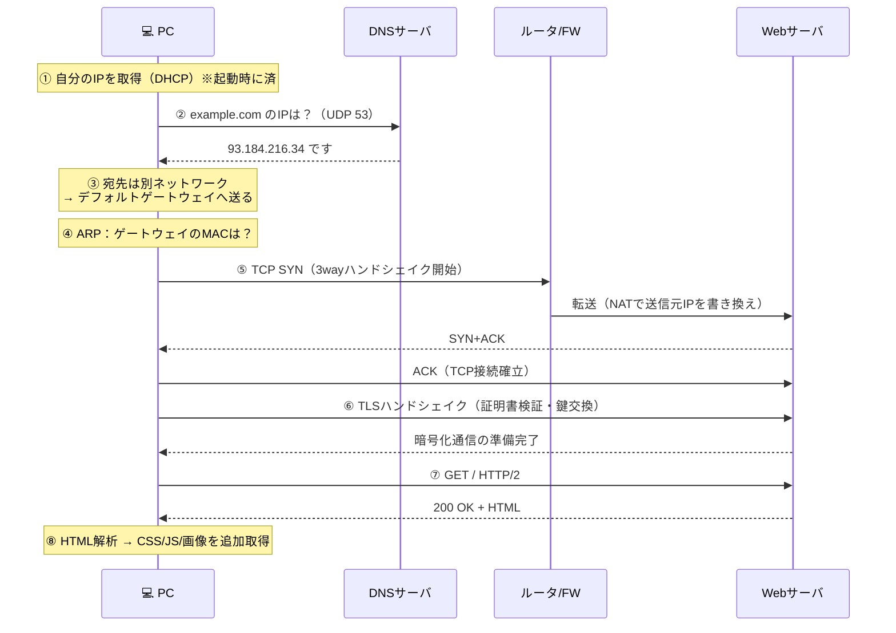

# ① ネットワークの基礎 — パケット・階層・機器の役割

[← 総合インデックスに戻る](README.md) ｜ 次 → [② 物理層とデータリンク層](02-physical-datalink.md)

この章では **「ネットワークとは結局どういう仕組みなのか」** をはっきりさせます。ここが曖昧なままだと、以降のVLANもルーティングもクラウドVPCも、暗記科目になってしまいます。

---

## 0. この章のゴール

読み終えたとき、次の問いに答えられる状態を目指します。

1. なぜデータは「パケット」に切り刻まれるのか
2. OSI 7階層は結局なんの役に立つのか
3. スイッチとルータは何が違うのか
4. ブラウザで `https://example.com` を開いたとき、何がどの順で起きているのか

---

## 1. ネットワークとは「宛先つきの荷物を運ぶ仕組み」

ネットワークの本質は、**郵便**とほぼ同じです。

| 郵便 | ネットワーク |
| --- | --- |
| 荷物の中身 | データ（HTMLやJSON） |
| 宛先住所 | **IPアドレス** |
| 差出人住所 | 送信元IPアドレス |
| 郵便番号による仕分け | **ルーティング** |
| 集配所・中継局 | ルータ |
| 「大きい荷物は分割して送る」 | **パケット分割** |
| 「届いたか確認する書留」 | **TCP** |
| 「届かなくても気にしない普通郵便」 | **UDP** |

この対応表を頭に置いておくと、以降の話がほぼ全部つながります。

---

## 2. なぜ「パケット」に分割するのか

データはそのまま送られません。数百〜1500バイト程度の**パケット**という小包に切り刻まれて、1つずつ送られます。

### 回線交換 vs パケット交換

```
【回線交換】昔の固定電話。通話中は線を1本占有する
  A ══════════════════════════ B    ← この線は他の人が使えない
  ✅ 速度が安定する
  ❌ 通信していない間も回線を占有して無駄

【パケット交換】インターネット。小包を混ぜて流す
  A ─□─□─□─□─□─→ B
  C ──■──■──■───→ D    ← 同じ線を共有できる
  ✅ 1本の回線を大勢で共有できる（＝安い）
  ❌ 混むと遅くなる・順番が入れ替わる・消える
```

インターネットが安価に世界へ広がったのは、パケット交換を選んだからです。そしてその代償として、**「遅延する」「順序が入れ替わる」「消える」** という3つの問題を、上位層（→ [④ TCP](04-transport-tcp-udp.md)）が後始末しています。

### 分割するもう1つの理由

1つの巨大なデータをそのまま送ると、途中で1ビットでも壊れたら**全部を送り直し**になります。分割してあれば、壊れた1パケットだけ再送すれば済みます。

> 🔑 **MTU（Maximum Transmission Unit）**：1パケットに詰められる最大サイズ。イーサネットでは通常 **1500バイト**。この値が合っていないと「pingは通るのにWebサイトだけ開かない」という厄介な障害が起きます（→ [③ 8章](03-ip-routing.md)）。

---

## 3. LAN・WAN・インターネットの区別

| 用語 | 範囲 | 誰が管理するか | 例 |
| --- | --- | --- | --- |
| **LAN**（Local Area Network） | 1つの建物・フロア内 | **自分たち** | オフィスの島、自宅のWi-Fi |
| **WAN**（Wide Area Network） | 拠点間・都市間 | 通信事業者から借りる | 東京本社〜大阪支社の閉域網 |
| **インターネット** | 世界中 | 誰のものでもない（ASの集合） | 一般のWebアクセス |
| **イントラネット** | 社内限定 | 自分たち | 社内ポータル・基幹システム |
| **DMZ**（非武装地帯） | 社内と外の中間 | 自分たち | 公開Webサーバの置き場所 |



> 💡 **「拠点間をどうつなぐか」が、規模が大きくなるほど設計の主戦場になります。** VPNか、専用線か、SD-WANか。詳細は [⑩ ハイブリッド構成](10-hybrid-patterns.md) で扱います。

---

## 4. OSI 7階層 — なぜ層に分けるのか

### 層に分ける理由

ネットワークは「電気信号を流す話」から「JSONをやり取りする話」まで、抽象度がまるで違う仕事の集合体です。これを**役割ごとに層に切り、下の層の中身を上の層は気にしなくていい**ようにしたのが階層モデルです。

```
たとえ話：国際郵便
  ┌─────────────────────────────┐
  │ 手紙の内容（日本語で書く）      │ ← 相手も日本語が読めればOK
  ├─────────────────────────────┤
  │ 封筒・宛名書き                 │ ← 郵便局の書式に従う
  ├─────────────────────────────┤
  │ 飛行機・船・トラック            │ ← 送り主はどれで運ばれるか知らない
  └─────────────────────────────┘
```

**手紙を書く人は、飛行機の燃料を気にしなくていい。** これが階層化の価値です。

### OSI 7階層

| 層 | 名前 | 仕事 | 代表例 | 機器 |
| --- | --- | --- | --- | --- |
| **L7** | アプリケーション層 | アプリが直接使う約束事 | HTTP・DNS・SMTP | L7ロードバランサ・WAF |
| **L6** | プレゼンテーション層 | 文字コード・暗号化・圧縮 | TLS・JPEG・UTF-8 | — |
| **L5** | セッション層 | 対話の開始と終了の管理 | セッション管理 | — |
| **L4** | トランスポート層 | **どのアプリに届けるか**・信頼性 | **TCP・UDP**・ポート番号 | L4ロードバランサ・FW |
| **L3** | ネットワーク層 | **どの機械に届けるか**・経路選択 | **IP**・ICMP・ルーティング | **ルータ・L3スイッチ** |
| **L2** | データリンク層 | **隣の機器まで**確実に渡す | イーサネット・**MACアドレス**・VLAN | **スイッチ（L2SW）** |
| **L1** | 物理層 | 0と1を電気・光・電波にする | ケーブル・コネクタ・光信号 | ハブ・メディアコンバータ |

> 🔑 **覚え方**：L2は「**同じ部屋の中**で隣に手渡す」、L3は「**別の建物**まで届ける」。この違いが分かれば、スイッチとルータの違いも分かります。

### TCP/IP 4階層（実務ではこちら）

OSIは教科書のモデルで、**現実のインターネットは TCP/IP モデル**で動いています。

```
  OSI 7階層                    TCP/IP 4階層
┌──────────────┐
│ L7 アプリケーション│ ┐
├──────────────┤ │
│ L6 プレゼンテーション│ ├─→  アプリケーション層   HTTP, DNS, TLS
├──────────────┤ │
│ L5 セッション    │ ┘
├──────────────┤
│ L4 トランスポート │ ──→  トランスポート層     TCP, UDP
├──────────────┤
│ L3 ネットワーク  │ ──→  インターネット層     IP, ICMP
├──────────────┤
│ L2 データリンク  │ ┐
├──────────────┤ ├─→  ネットワーク         Ethernet, Wi-Fi
│ L1 物理       │ ┘      インターフェース層
└──────────────┘
```

**実務での使い分け**：
- 会話で「L2で」「L3で」「L7で」と言うときは **OSIの番号**を使う（これが業界共通語）
- 実際のプロトコル設計・実装の話は **TCP/IP 4層**で考える

---

## 5. カプセル化 — データが包まれていく様子

送信するとき、データは層を降りるたびに**ヘッダ（宛名ラベル）を貼られて**いきます。これがカプセル化です。

```
【送信側：上から下へ包んでいく】

L7  アプリ         │        "GET /index.html"          │
                  ↓
L4  TCP      │TCPヘッダ│ "GET /index.html"        │
             （送信元ポート:52341 / 宛先ポート:443）
                  ↓
L3  IP    │IPヘッダ│TCPヘッダ│ "GET /index.html"   │
          （送信元IP:192.168.1.10 / 宛先IP:93.184.216.34）
                  ↓
L2  Ethernet │Ethヘッダ│IPヘッダ│TCPヘッダ│ data │FCS│
             （送信元MAC / 宛先MAC＝次のルータのMAC）
                  ↓
L1  物理          ～～電気信号・光・電波～～

【受信側：下から上へ剥がしていく（デカプセル化）】
```

### 各層の「宛先」の違い ← ここが核心

| 層 | 宛先 | 特徴 |
| --- | --- | --- |
| **L2**（MACアドレス） | **次の1ホップ先**の機器 | ルータを通過するたびに**書き換わる** |
| **L3**（IPアドレス） | **最終的な相手**の機器 | 原則、最後まで**変わらない**（NAT時を除く） |
| **L4**（ポート番号） | 相手の機器の中の**どのアプリか** | 80ならWeb、443ならHTTPS |

```
自宅PC ──① ── ホームルータ ──② ── ISPルータ ──③ ── Webサーバ

宛先IP  : ①②③ すべて 93.184.216.34（変わらない）
宛先MAC : ① ホームルータのMAC
          ② ISPルータのMAC
          ③ Webサーバのポート先のMAC   ← 区間ごとに変わる
```

> 🔑 **これが「L2は隣まで、L3は最終目的地まで」の意味です。** 宅配便で言えば、IPアドレス＝伝票の宛先、MACアドレス＝いま荷物を持っているトラックの次の行き先。

---

## 6. ネットワーク機器の役割一覧

| 機器 | 動作する層 | 何をするか | 使いどころ |
| --- | --- | --- | --- |
| **リピータ／ハブ** | L1 | 受けた信号を**全ポートにそのまま流す** | 現在は使われない（衝突が起きる） |
| **スイッチ（L2SW）** | L2 | MACアドレスを学習し、**必要なポートだけに送る** | LANの基本。島ごと・フロアごとに設置 |
| **ルータ** | L3 | **異なるネットワーク間**を中継。経路を選ぶ | 拠点の出口・インターネット接続 |
| **L3スイッチ** | L2+L3 | スイッチの筐体でルーティングもする（高速・多ポート） | 社内のVLAN間ルーティング。**中規模以上の中核** |
| **ファイアウォール（FW）** | L3/L4（NGFWはL7も） | 通信の**許可/拒否**を判断。ステートフル検査 | 社内とインターネットの境界 |
| **ロードバランサ（LB）** | L4 or L7 | 複数サーバへ**負荷を振り分ける**・死活監視 | Webサーバの前段 |
| **WAF** | L7 | Webアプリへの攻撃（SQLi・XSS）を遮断 | 公開Webの前段 |
| **プロキシ** | L7 | 通信を代理。ログ取得・フィルタリング | 社内からのWebアクセス管理 |
| **無線AP** | L1/L2 | 電波と有線の変換 | オフィスのWi-Fi |
| **ONU / モデム** | L1 | 光信号 ⇄ 電気信号の変換 | 回線の引き込み口 |

### 「スイッチとルータの違い」を1行で

> **スイッチは同じネットワーク内で配るもの。ルータは違うネットワークへ渡すもの。**

```
192.168.1.0/24 のネットワーク
┌───────────────────────────────┐
│ PC-A ─┐                        │
│       ├─ スイッチ ─── ルータ ──┼─→ 192.168.2.0/24 や インターネットへ
│ PC-B ─┘   （この中の配達）      │      （外への配達）
└───────────────────────────────┘
```

---

## 7. 実演：`https://example.com` を開くと何が起きるか

ここまでの知識を全部使って、1回のアクセスを追いかけます。**この流れが分かれば、障害の切り分けもできるようになります。**



### 各ステップで使われる技術と、詰まったときの章

| # | 起きていること | 層 | 詳細 |
| --- | --- | --- | --- |
| ① | DHCPでIP・GW・DNSを自動取得 | L7 | [⑤](05-application-dns-http.md) |
| ② | ドメイン名 → IPアドレス変換 | L7 | [⑤](05-application-dns-http.md)・[DNSガイド](../dns-guide.md) |
| ③ | 宛先が同一サブネットか判定 → 違えばGWへ | L3 | [③](03-ip-routing.md) |
| ④ | IP → MACアドレスを解決（ARP） | L2/L3 | [③](03-ip-routing.md) |
| ⑤ | TCP 3wayハンドシェイク・NAT変換 | L4/L3 | [④](04-transport-tcp-udp.md) |
| ⑥ | TLSで暗号化・サーバ証明書の検証 | L6/L7 | [⑤](05-application-dns-http.md) |
| ⑦ | HTTPリクエスト・レスポンス | L7 | [⑤](05-application-dns-http.md) |

> 🔑 **障害切り分けの鉄則は「下の層から順に確認する」**。「Webが見られない」とき、いきなりHTTPを疑わず、①ケーブル → ②IP取得 → ③ping → ④DNS → ⑤HTTP の順に潰します（→ [⑫](12-operations-troubleshooting.md)）。

---

## 8. 通信の3つの型

| 型 | 宛先 | 例 | 注意点 |
| --- | --- | --- | --- |
| **ユニキャスト** | 1対1 | 通常のWebアクセス | 基本これ |
| **ブロードキャスト** | 同一ネットワーク内の**全員** | ARP・DHCP要求 | **多すぎると全端末の負荷になる**（ブロードキャストストーム） |
| **マルチキャスト** | 登録した**グループ**のみ | IP放送・映像配信 | 対応機器・設定が必要 |

> ⚠️ **1つのネットワーク（ブロードキャストドメイン）に端末を詰め込みすぎない。** 目安は **1セグメント200〜250台まで**。それ以上はVLANで分割します（→ [②](02-physical-datalink.md)）。ブロードキャストは全員に届くため、台数の2乗に近い勢いで無駄な負荷が増えます。

---

## 9. 帯域・遅延・パケットロス — 「速さ」の3つの指標

「ネットワークが遅い」には、まったく違う3つの原因があります。

| 指標 | 意味 | たとえ | 効く場面 |
| --- | --- | --- | --- |
| **帯域（bps）** | 1秒あたりに流せる量 | 道路の**車線数** | 大容量ファイル転送・動画 |
| **遅延（RTT / ms）** | 往復にかかる時間 | 道路の**長さ** | Web表示・オンラインゲーム・DB接続 |
| **パケットロス（%）** | 消えるパケットの割合 | 荷物の**紛失率** | 音声・映像通話 |

### よくある誤解：「1Gbpsにしたのに速くならない」

Web表示の体感速度を支配するのは、**帯域より遅延**です。

```
1ページの表示 = DNS解決 + TCP接続 + TLS + HTTPリクエスト...
              ＝ 何往復もする ＝ 遅延が何倍にも効く

RTT 10ms の回線で5往復 →  50ms
RTT 80ms の回線で5往復 → 400ms   ← 帯域が10倍でもこれは縮まらない
```

- **帯域を上げるべき**：ファイルサーバへの大容量転送、バックアップ、動画配信
- **遅延を下げるべき**：Webサイト表示 → **CDN**を使う（→ [⑤](05-application-dns-http.md)）、拠点の近くにサーバを置く

> 🔑 **物理法則の壁**：光ファイバー中の光速は約20万km/秒。東京〜大阪（往復約1000km）は、どんなにお金をかけても **片道約5ms・往復10ms** を下回れません。詳しくは [光通信ネットワークの全体像](../optical-fiber-network-guide.md)。

---

## 10. この章のまとめ

| 覚えること | 一言で |
| --- | --- |
| パケット交換 | 回線を共有するため小包に分けて送る。代償は遅延・順序入替・消失 |
| 階層モデル | 役割ごとに層を分け、下の層の中身を気にしなくてよくする |
| **L2 と L3 の違い** | **L2＝隣の機器まで（MAC）／L3＝最終目的地まで（IP）** |
| カプセル化 | 層を降りるたびにヘッダが貼られ、上るたびに剥がされる |
| スイッチ vs ルータ | 同じネットワーク内で配る vs 違うネットワークへ渡す |
| 速さの3指標 | 帯域・遅延・ロス。**Web表示は遅延が支配的** |
| 切り分けの鉄則 | **必ず下の層から**確認する |

---

[← 総合インデックスに戻る](README.md) ｜ 次 → [② 物理層とデータリンク層](02-physical-datalink.md)
