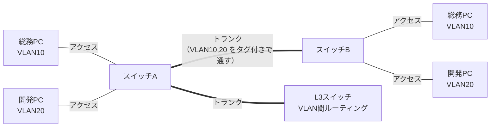

# ② 物理層とデータリンク層 — ケーブル・スイッチ・VLAN

[← 総合インデックスに戻る](README.md) ｜ 前 → [①](01-network-basics.md) ｜ 次 → [③ ネットワーク層](03-ip-routing.md)

L1（物理層）とL2（データリンク層）は、**「同じ建物の中で、隣の機器まで確実にデータを渡す」** ための世界です。
オフィスネットワークのトラブルの体感 7割は、この2つの層で起きます。

---

## 1. 物理層 — ケーブルと規格

### 1-1. LANケーブル（ツイストペア）の規格

| カテゴリ | 最大速度 | 最大距離 | 実務での位置づけ |
| --- | --- | --- | --- |
| Cat5 | 100Mbps | 100m | ❌ もう使わない |
| **Cat5e** | 1Gbps | 100m | 既存設備で現役。1Gまでなら十分 |
| **Cat6** | 1Gbps（10Gは55mまで） | 100m | **新規配線の標準** |
| **Cat6A** | **10Gbps** | 100m | 10G化・PoE++・**新規なら本命** |
| Cat7 / Cat8 | 10G〜40Gbps | 100m / 30m | 特殊用途。コネクタが特殊で扱いにくい |

> 🔑 **迷ったらCat6A。** 配線工事の人件費はケーブル代よりはるかに高く、後から引き直すコストを考えると、最初から10G対応にしておくのが結果的に安上がりです。

### 1-2. 光ファイバー

| 種別 | 距離 | 用途 |
| --- | --- | --- |
| **マルチモード（MMF / OM3・OM4）** | 〜300〜400m（10G時） | 建物内・フロア間・データセンター内 |
| **シングルモード（SMF / OS2）** | 数km〜数十km | 建物間・キャンパス間・キャリア回線 |

> 📖 光ファイバーの原理・種類・施工・測定まで踏み込んだ詳細は [光ファイバー・光通信 完全ガイド](../optical-fiber-overview.md) を参照してください。本シリーズでは「オフィスネットワークとしてどう使うか」に絞ります。

### 1-3. イーサネット速度規格

| 規格 | 速度 | 主な用途（2026年時点） |
| --- | --- | --- |
| 1000BASE-T | 1Gbps | **PC接続の標準** |
| 2.5G/5GBASE-T | 2.5/5Gbps | Wi-Fi 6E/7 AP の接続（既存Cat5e/6を活かせる） |
| 10GBASE-T / SR | 10Gbps | **サーバ接続・スイッチ間の標準** |
| 25G / 40G | 25/40Gbps | データセンターのサーバ接続 |
| 100G / 400G | 100/400Gbps | データセンターのスパイン間・キャリア幹線 |

### 1-4. PoE（Power over Ethernet）— LANケーブルで給電する

無線APや監視カメラ、IP電話は、**LANケーブル1本で電源も供給**できます。電源工事が不要になるため、実務上とても重要です。

| 規格 | 通称 | 給電電力（受電側） | 用途 |
| --- | --- | --- | --- |
| 802.3af | PoE | 12.95W | IP電話・旧型AP |
| 802.3at | **PoE+** | 25.5W | **Wi-Fi 6 AP・PTZカメラ** |
| 802.3bt Type3 | PoE++ | 51W | Wi-Fi 6E/7 AP・高性能カメラ |
| 802.3bt Type4 | PoE++ | 71.3W | ディスプレイ・シンクライアント |

> ⚠️ **PoE設計の落とし穴：「ポート単位の電力」ではなく「スイッチ全体の給電容量（PoEバジェット）」を見る。**
> 例：24ポートPoE+スイッチでも、総給電容量が370Wなら、25.5W×24＝612W は供給できません。**満載でAPを繋ぐと後半が起動しない**という事故が起きます。必要電力の合計を先に計算してください。

---

## 2. MACアドレス — 機器に焼かれた固有番号

```
  00:1A:2B  :  3C:4D:5E
  └───┬──┘     └───┬──┘
   OUI（24bit）   個体番号（24bit）
   メーカー識別    メーカーが割り振る
```

- 48ビット（6バイト）、通常16進数12桁で表記
- **NIC（ネットワークカード）に製造時に焼き込まれる**、原則ユニークな値
- IPアドレスは「引っ越すと変わる住所」、MACアドレスは「変わらない個体識別番号」

| 比較 | MACアドレス | IPアドレス |
| --- | --- | --- |
| 層 | L2 | L3 |
| 変わるか | 原則不変（機器固有） | ネットワークが変われば変わる |
| 有効範囲 | **同一ネットワーク内のみ** | 世界中 |
| 用途 | 隣の機器を特定 | 最終目的地を特定 |

> 💡 **ランダムMAC（プライバシー機能）**：iOS・Android・Windows 11 は、Wi-Fi接続時にSSIDごとに**ランダムなMACアドレス**を使います。MACアドレス認証や固定IP払い出しをしている環境では繋がらなくなるため、端末側で「プライベートアドレスをオフ」にする運用が必要です。**最近のWi-Fi繋がらない問い合わせの定番原因**です。

---

## 3. スイッチはどうやって「必要なポートだけ」に送るのか

### MACアドレステーブルの学習

スイッチは電源投入直後、何も知りません。通信を見ながら**「どのポートの先に、どのMACアドレスがいるか」を自動で覚えていきます**。

```
【状態1：起動直後。テーブルは空】

  PC-A(MAC:aaaa) ─ Port1 ┐
  PC-B(MAC:bbbb) ─ Port2 ├─ スイッチ   MACテーブル：（空）
  PC-C(MAC:cccc) ─ Port3 ┘

【状態2：A が B 宛に送信】
  ① Port1 から「送信元aaaa」のフレームが届く
     → 「aaaa は Port1 にいる」と学習 ✍️
  ② 宛先 bbbb は未知
     → 全ポートに転送（フラッディング）📢

【状態3：B が返信】
  ③ Port2 から「送信元bbbb」が届く → 「bbbb は Port2」と学習 ✍️

【状態4：以降】
  MACテーブル： aaaa→Port1 / bbbb→Port2
  → A→B の通信は Port2 だけに送られる（Port3のCには流れない）✅
```

| 動作 | いつ起きるか |
| --- | --- |
| **学習（Learning）** | フレームの**送信元MAC**とポートを記録。既定で300秒保持 |
| **転送（Forwarding）** | 宛先MACがテーブルにある → そのポートだけへ |
| **フラッディング（Flooding）** | 宛先MACが**未知** or ブロードキャスト → 受信ポート以外の全ポートへ |
| **エージング（Aging）** | 一定時間通信のないエントリを削除 |

> 🔑 **「同じスイッチに繋いだのに遅い・盗聴される」を防いでいるのがこの仕組みです。** L1のハブは学習をせず常に全ポートへ流すため、現在は使われません。

---

## 4. VLAN — 1台のスイッチを論理的に分割する

### なぜVLANが必要か

**問題**：総務部と開発部を分けたい。でも物理的にスイッチを2台買って配線を分けるのは高いし面倒。

**解決**：1台のスイッチの中を**論理的に区切る**。これがVLANです。

```
【VLANなし】全員が同じネットワーク。総務から開発サーバが丸見え

 [総務PC] [総務PC] [開発PC] [開発PC]
     └────────┴───────┴────────┘
              1つのスイッチ
       ＝ 1つのブロードキャストドメイン

【VLANあり】1台のスイッチが2つに割れているように振る舞う

 [総務PC] [総務PC] │ [開発PC] [開発PC]
     └────┬────┘ │    └────┬────┘
      VLAN 10     │     VLAN 20
   192.168.10.0/24│  192.168.20.0/24
              （通信不可）
     ↓ VLAN間で通信したい場合は L3（ルータ/L3SW）を経由 ＝ そこで制御できる
```

### VLANの3大メリット

| メリット | 内容 |
| --- | --- |
| **セキュリティ** | 部署間・用途間を分離。侵入されても被害範囲を限定できる |
| **ブロードキャスト抑制** | ドメインが小さくなり、無駄なトラフィックが減る |
| **柔軟性** | 配線を変えずに、設定変更だけで所属を変えられる |

### アクセスポートとトランクポート

| 種別 | 役割 | つなぐ先 |
| --- | --- | --- |
| **アクセスポート** | 1つのVLANだけに所属。タグなし | PC・プリンタ・サーバ |
| **トランクポート**（タグVLAN / IEEE 802.1Q） | **複数VLANをまとめて通す**。フレームにVLAN IDのタグを付ける | スイッチ間・無線AP・仮想化ホスト |



> ⚠️ **ネイティブVLAN（タグなしVLAN）の不一致**は、スイッチ間の設定ミス定番です。「一部のVLANだけ通信できない」ときはまずここを疑ってください。

### 実務でのVLAN設計例（中規模オフィス）

| VLAN ID | 用途 | セグメント | ポイント |
| --- | --- | --- | --- |
| 10 | 従業員PC（有線） | 192.168.10.0/24 | |
| 20 | 無線（社員） | 192.168.20.0/23 | 端末数が多いので/23 |
| 30 | **ゲストWi-Fi** | 192.168.30.0/24 | **社内へのアクセス全遮断**。インターネットのみ |
| 40 | サーバ | 192.168.40.0/24 | 必要な通信のみACLで許可 |
| 50 | IP電話 | 192.168.50.0/24 | QoS優先。PoE給電 |
| 60 | 監視カメラ・IoT | 192.168.60.0/24 | **必ず分離**。脆弱な機器が多い |
| 99 | 管理用（スイッチ本体） | 192.168.99.0/24 | 管理者端末からのみ到達可 |

> 🔑 **VLAN 1 は使わない**のが定石です。多くの機器の初期VLANであり、事故のもとになります。

---

## 5. STP — ループを防ぐ仕組み

### ブロードキャストストーム：ネットワークが一瞬で死ぬ現象

L2にはTTL（生存期間）がありません。**配線がループすると、ブロードキャストが永遠に回り続けて増殖し、数秒でネットワーク全体が停止します。**

```
      ┌───── SW-A ─────┐
      │                │
    SW-B ──────────── SW-C
      ↑ この三角形の配線があると…

  ブロードキャスト1発 → A→B→C→A→B→C→… 無限ループ
  → 各スイッチが複製し続ける → CPU/帯域100% → 全社停止 💀
```

> ⚠️ **現場で最も怖い事故のひとつ**です。「余ったLANケーブルの両端を、同じ島のハブに挿してしまった」だけでフロア全体が止まります。

### STP（Spanning Tree Protocol）

STPは、**ループになる経路をあえてブロック**して、木構造（ループのない形）を作ります。障害時にはブロックを解除して自動迂回します。

| 規格 | 収束時間 | 位置づけ |
| --- | --- | --- |
| STP（802.1D） | **30〜50秒** | 古い。遅すぎる |
| **RSTP（802.1w）** | **1〜3秒** | **現在の標準** |
| MSTP（802.1s） | 数秒 | VLANグループごとに木を作る。大規模向け |

### 現代の代替アプローチ

STPは「片方の経路を遊ばせる」ため帯域が無駄になります。中〜大規模では次の方式が主流です。

| 方式 | 内容 |
| --- | --- |
| **スタック / VSS / MLAG** | 複数のスイッチを**1台に見せる**。両方の経路を同時に使える |
| **L3化（ルーテッドアクセス）** | アクセス層から上をL3にし、L2ループ自体を発生させない |
| **VXLAN / EVPN** | データセンターの主流（→ [⑧ 大規模](08-onpremise-patterns.md)） |

> 🔑 **それでもSTPは必ず有効にしておく**こと。誤配線という人的ミスに対する最後の保険です。あわせて、PC接続ポートには **PortFast + BPDUガード**（誤って挿されたスイッチを自動遮断）を設定するのが定石です。

---

## 6. リンクアグリゲーション（LAG） — 束ねて太く・冗長に

複数の物理ポートを束ねて、**1本の論理リンク**として扱います。

```
  SW-A ═══ 1Gbps ×4本 ═══ SW-B    →  論理的に 4Gbps の1本
                                      1本切れても残り3本で継続 ✅
```

| 項目 | 内容 |
| --- | --- |
| プロトコル | **LACP（802.3ad）** ＝ 自動交渉。手動固定より安全 |
| メリット | 帯域増加 ＋ 冗長化 ＋ **STPでブロックされない**（1本に見えるため） |
| 注意点 | **1つの通信フローは1本のリンクしか使わない** |

> ⚠️ **「4本束ねたのに1つの転送が1Gbpsのまま」は仕様です。** 振り分けは送信元/宛先のMACやIP、ポート番号のハッシュで決まるため、**同じ相手との1本の通信は束ねても速くなりません**。多数の通信を捌くための仕組みだと理解してください。

---

## 7. Wi-Fi（無線LAN）

### 7-1. 規格

| 規格 | 通称 | 周波数帯 | 最大速度（理論値） | 備考 |
| --- | --- | --- | --- | --- |
| 802.11n | Wi-Fi 4 | 2.4/5GHz | 600Mbps | 旧式 |
| 802.11ac | Wi-Fi 5 | 5GHz | 6.9Gbps | まだ現役 |
| 802.11ax | **Wi-Fi 6** | 2.4/5GHz | 9.6Gbps | **多台数環境で強い**（OFDMA） |
| 802.11ax | **Wi-Fi 6E** | +**6GHz** | 9.6Gbps | 6GHz帯が空いている＝干渉が少ない |
| 802.11be | **Wi-Fi 7** | 2.4/5/6GHz | 46Gbps | MLO（複数帯同時利用）・低遅延 |

> 🔑 **Wi-Fi 6の本当の価値は「最大速度」ではなく「多台数を同時に捌く能力」**です。会議室に30人が集まっても速度が落ちにくい、という性質が実務では効きます。

### 7-2. オフィスWi-Fi設計の勘所

| 論点 | 指針 |
| --- | --- |
| **チャネル設計** | 2.4GHzは **1・6・11 のみ**（重ならない3波）。隣接APで同じチャネルを避ける |
| **電波出力** | **最大にしない**。強すぎると端末が遠いAPに繋ぎ続け（スティッキークライアント）、かえって遅くなる |
| **AP設置密度** | 「広く1台」より「**狭く複数台**」。目安は20〜30端末/AP、オフィスなら15〜20mおき |
| **バンドステアリング** | 5GHz/6GHzへ誘導。ただし相性問題が出る端末もある |
| **ローミング** | 802.11k/v/r で移動中の切替をスムーズに。VoIP利用時は必須 |
| **給電** | Wi-Fi 6/6E APは **PoE+（25.5W）以上**が必要 |
| **有線側の帯域** | Wi-Fi 6E/7 APには **2.5G/10Gポート**を。1Gだとそこが詰まる |

### 7-3. 無線のセキュリティ

| 方式 | 認証 | 用途 |
| --- | --- | --- |
| WPA2-PSK / WPA3-SAE | 共有パスワード | 小規模・ゲスト用 |
| **WPA2/3-Enterprise（802.1X）** | **ユーザーごとにID/証明書** | **中規模以上の社員用は必ずこれ** |

> ⚠️ **PSK（共有パスワード）の最大の問題は、退職者が出るたびに全端末の再設定が必要になること。** 50人を超えたら 802.1X + RADIUS への移行を検討してください（→ [⑥](06-security.md)）。
> **ゲストWi-Fiは必ず別VLANで社内から完全分離**し、クライアント間通信も禁止（クライアントアイソレーション）にします。

---

## 8. この層でよく起きる障害と原因

| 症状 | 疑うポイント | 確認方法 |
| --- | --- | --- |
| リンクが上がらない | ケーブル断・コネクタ不良・ポート故障 | LEDランプ、ケーブルを差し替えて切り分け |
| **通信が異常に遅い（10〜100Mbps）** | **オートネゴシエーション失敗**・ケーブル内の断線 | ポートのリンク速度を確認。**Cat5eで100M固定なら要交換** |
| ネットワーク全体が停止 | **ループ（ブロードキャストストーム）** | スイッチのLEDが全ポート同時に激しく点滅していたらほぼ確定 |
| 特定VLANだけ通信不可 | トランク設定漏れ・ネイティブVLAN不一致 | 両端のトランク許可VLANを突き合わせる |
| Wi-Fiだけ遅い/切れる | チャネル干渉・AP過密・電波が強すぎる | 無線サイトサーベイ、チャネル使用率の確認 |
| APが起動しない | **PoEバジェット超過** | スイッチの総給電量を確認 |
| 特定端末だけ繋がらない | **ランダムMAC**・MAC認証の登録漏れ | 端末のプライベートアドレス設定を確認 |
| パケットロスが出る | **デュプレックス不一致**（片方全二重/片方半二重） | インターフェースのエラーカウンタ（CRCエラー・コリジョン） |

---

## 9. この章のまとめ

| 覚えること | 一言で |
| --- | --- |
| ケーブル | **新規はCat6A**。工事費を考えると10G対応が結局安い |
| PoE | ポート単位でなく**スイッチ全体の給電容量**で設計する |
| MACアドレス | 機器固有・**同一ネットワーク内でのみ有効** |
| スイッチの学習 | 送信元MACから覚え、未知の宛先はフラッディング |
| **VLAN** | **1台のスイッチを論理分割**。セキュリティ・ブロードキャスト抑制・柔軟性 |
| トランク | 802.1Qタグで複数VLANを1本に通す。スイッチ間で使う |
| **STP** | ループを防ぐ命綱。**RSTP**が標準。PC側ポートはBPDUガードを |
| LAG | 束ねて太く・冗長に。ただし**1フローは1本しか使わない** |
| Wi-Fi | 電波は**強くしすぎない**。社員用は802.1Xへ |

---

[← 総合インデックスに戻る](README.md) ｜ 前 → [①](01-network-basics.md) ｜ 次 → [③ ネットワーク層（IPとルーティング）](03-ip-routing.md)
