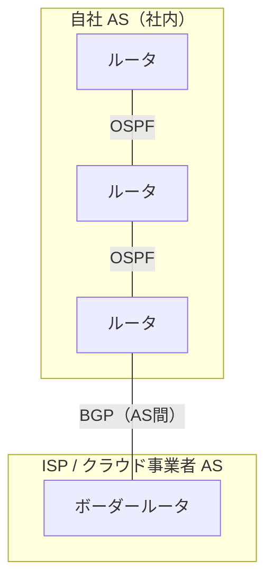

# ③ ネットワーク層 — IPアドレス・サブネット・ルーティング

[← 総合インデックスに戻る](README.md) ｜ 前 → [②](02-physical-datalink.md) ｜ 次 → [④ トランスポート層](04-transport-tcp-udp.md)

L3（ネットワーク層）は、**「世界のどこにいる相手にでも、経路をたどって届ける」** ための層です。
ここ、特に**サブネット計算**は、ネットワークを扱ううえで唯一「手を動かして覚えるべき」箇所です。クラウドのVPC設計も、結局これがそのまま出てきます。

---

## 1. IPアドレスの構造

IPv4アドレスは32ビット。8ビットずつ4つに区切って10進数で書きます。

```
   192   .   168   .    1   .   10
 11000000 10101000 00000001 00001010
 └──────────────────────┘└────────┘
      ネットワーク部          ホスト部
    （どのネットワークか）   （その中の何番目か）
```

**IPアドレスは「住所＋部屋番号」です。**

- ネットワーク部 ＝ マンションの住所（同じ建物なら同じ値）
- ホスト部 ＝ 部屋番号（建物内でユニーク）

どこまでがネットワーク部かを示すのが **サブネットマスク** です。

---

## 2. サブネットマスクとCIDR

### 表記の2つの形

```
192.168.1.10 / 255.255.255.0      ← サブネットマスク表記（旧来）
192.168.1.10 / 24                 ← CIDR表記（現在の標準）
                └─ 先頭から24ビットがネットワーク部、という意味

255.255.255.0
= 11111111 11111111 11111111 00000000
  └────── 1が24個 ──────┘└─ 0が8個 ─┘
       ネットワーク部        ホスト部
```

### CIDR早見表（暗記推奨）

| CIDR | サブネットマスク | ホスト数（利用可能） | 実務での用途 |
| --- | --- | --- | --- |
| /30 | 255.255.255.252 | **2台** | ルータ間のP2P接続 |
| /29 | 255.255.255.248 | 6台 | 小さなDMZ |
| /28 | 255.255.255.240 | 14台 | 小規模サーバ群 |
| /27 | 255.255.255.224 | 30台 | 小さな部署 |
| /26 | 255.255.255.192 | 62台 | 中規模サブネット |
| /25 | 255.255.255.128 | 126台 | |
| **/24** | 255.255.255.0 | **254台** | **最も一般的**。1部署・1フロア |
| /23 | 255.255.254.0 | 510台 | 無線用など台数が多い場合 |
| /22 | 255.255.252.0 | 1022台 | |
| /16 | 255.255.0.0 | 65534台 | **VPC全体の枠**として使う |

> 🔑 **計算式**：ホスト部が n ビットなら、使えるIPは **2ⁿ − 2 個**。
> −2 の理由は、**ネットワークアドレス**（全部0＝ネットワーク自体を指す）と**ブロードキャストアドレス**（全部1＝全員宛）は端末に割り当てられないためです。

### 具体例：192.168.1.0/24 の中身

| アドレス | 役割 |
| --- | --- |
| 192.168.1.**0** | **ネットワークアドレス**（端末に付けられない） |
| 192.168.1.1 | 慣習的に**デフォルトゲートウェイ**（ルータ） |
| 192.168.1.2 〜 192.168.1.254 | 端末に割り当て可能（254個） |
| 192.168.1.**255** | **ブロードキャストアドレス**（端末に付けられない） |

### 手を動かす：サブネット分割の練習

**問題**：`192.168.10.0/24` を4つに分割したい。

```
/24 を4分割 → 2² = 4 なので、2ビット借りる → /26

  192.168.10.0/26    → 使用可 .1  〜 .62    （BC: .63）
  192.168.10.64/26   → 使用可 .65 〜 .126   （BC: .127）
  192.168.10.128/26  → 使用可 .129〜 .190   （BC: .191）
  192.168.10.192/26  → 使用可 .193〜 .254   （BC: .255）
```

**問題**：`10.0.0.0/16` の中に `/24` はいくつ作れるか？
→ 24 − 16 = 8ビット分 ＝ **2⁸ = 256個**（10.0.0.0/24 〜 10.0.255.0/24）

> 💡 **クラウドのVPC設計はこれそのものです。** 「VPCを10.0.0.0/16で作り、AZごと・用途ごとに/24のサブネットを切る」という設計を [⑨](09-cloud-patterns.md) で扱います。

---

## 3. プライベートIPアドレスとグローバルIPアドレス

### プライベートアドレス（RFC 1918）— 社内で自由に使える範囲

| 範囲 | CIDR | サイズ | よく使われる場面 |
| --- | --- | --- | --- |
| 10.0.0.0 〜 10.255.255.255 | **10.0.0.0/8** | 約1677万 | **大規模社内網・クラウドVPC** |
| 172.16.0.0 〜 172.31.255.255 | **172.16.0.0/12** | 約104万 | 中規模。Dockerが172.17を使う点に注意 |
| 192.168.0.0 〜 192.168.255.255 | **192.168.0.0/16** | 65536 | **家庭・小規模オフィス** |

### そのほか覚えておくべき特殊アドレス

| アドレス | 意味 |
| --- | --- |
| **127.0.0.1**（/8） | ループバック。自分自身 |
| **169.254.0.0/16** | **APIPA / リンクローカル**。DHCPに失敗するとこれが付く ← **障害のサイン** |
| 100.64.0.0/10 | CGNAT用。ISPが加入者に配ることがある |
| 0.0.0.0 | 「すべて」の意味。ルーティングやバインドで使う |

> ⚠️ **`169.254.x.x` が付いていたら、それは「DHCPサーバから応答がない」というサインです。** ケーブル・スイッチ・DHCPサーバの順に疑ってください。

### アドレス設計の実務ルール

> 🔑 **最重要：「将来つなぐ相手」と重複しないアドレスを選ぶ。**
> `192.168.0.0/24` や `192.168.1.0/24` は家庭用ルータの初期値です。**在宅勤務でVPN接続したとき、自宅と社内が同じアドレスだと通信できません。** 社内には `10.x.x.x` や `172.20.x.x` など、初期値と被らない範囲を選ぶのが定石です。
> 同様に、**M&A・クラウド接続・拠点間VPNでのアドレス重複**は、後から直すのが非常に高コストです（→ [⑦ 5章](07-design-basics.md)）。

---

## 4. ARP — IPアドレスからMACアドレスを調べる

L3の宛先はIPですが、実際に送るには**L2の宛先MACアドレス**が必要です。この橋渡しがARPです。

```
PC-A (192.168.1.10) が 192.168.1.20 に送りたい

① A：「192.168.1.20 の人、MACアドレス教えて！」
      → ブロードキャスト（全員に届く）📢

② B (192.168.1.20)：「私です。MACは bb:bb:bb:bb:bb:bb です」
      → ユニキャストで返信

③ A：ARPテーブルに記録して、以後はそれを使う
```

`arp -a`（Windows/Mac）や `ip neigh`（Linux）で現在のARPテーブルを確認できます。

### 宛先が別ネットワークの場合

```
PC-A (192.168.1.10/24) が 8.8.8.8 に送りたい

① 自分のサブネット(192.168.1.0/24)の外だと判定
② → デフォルトゲートウェイ(192.168.1.1)へ送ることに決定
③ → ARPで「192.168.1.1のMAC」を解決
④ → 宛先IP=8.8.8.8 / 宛先MAC=ルータのMAC で送信
```

> 🔑 **この「宛先IP と 宛先MAC がズレる」のが、[①](01-network-basics.md) で見た「L3は最終目的地、L2は隣まで」の正体です。**

---

## 5. ルーティング — 経路をどう選ぶか

### ルーティングテーブル

ルータ（およびPC）は、**「この宛先ならこっちへ投げる」という表**を持っています。

```
宛先ネットワーク      ネクストホップ     インターフェース
─────────────────────────────────────────────────
192.168.1.0/24      直接接続           eth0
192.168.2.0/24      10.0.0.2           eth1
10.0.0.0/30         直接接続           eth1
0.0.0.0/0           203.0.113.1        eth2     ← デフォルトルート
```

| 用語 | 意味 |
| --- | --- |
| **ネクストホップ** | 次に渡す相手のIP |
| **デフォルトルート（0.0.0.0/0）** | 表に載っていない宛先の投げ先。**「それ以外は全部こっち」** |
| **メトリック** | 経路のコスト。小さいほうが優先 |
| **AD値（アドミニストレーティブディスタンス）** | 経路情報源の信頼度。小さいほうが優先 |

### ロンゲストマッチ（最長一致）— ルーティングの絶対原則

複数の経路が該当する場合、**より細かく（プレフィックス長が長く）指定されたものが勝ちます**。

```
宛先 10.1.2.3 へ送りたい。テーブルに以下がある場合：

  0.0.0.0/0      → ISPへ        （/0  ： 該当）
  10.0.0.0/8     → 拠点ルータへ  （/8  ： 該当）
  10.1.0.0/16    → 大阪ルータへ  （/16 ： 該当）
  10.1.2.0/24    → 大阪3Fへ      （/24 ： 該当）★最長

→ 10.1.2.0/24 の経路が採用される
```

> 🔑 **トラブル対応の必須知識**：「なぜかVPNを通らずインターネットに出てしまう」という事象の多くは、**より長いプレフィックスの経路が別方向を指している**のが原因です。

### 静的ルーティング vs 動的ルーティング

| | 静的ルーティング | 動的ルーティング |
| --- | --- | --- |
| 設定 | 管理者が手で書く | ルータ同士が情報交換して自動生成 |
| 障害時 | **自動迂回しない** | **自動で経路を切り替える** |
| 規模 | 〜数拠点 | 多拠点・冗長構成 |
| 向く場面 | 小規模、経路が単純 | 中規模以上、冗長経路あり |

### 主なルーティングプロトコル

| プロトコル | 種別 | 使いどころ |
| --- | --- | --- |
| RIP | 距離ベクトル型 | 古い。最大15ホップ制限。**新規採用しない** |
| **OSPF** | **リンクステート型** | **社内・データセンター内の標準**。収束が速い。エリア分割で大規模対応 |
| EIGRP | ハイブリッド | Cisco環境で使われる |
| **BGP** | パスベクトル型 | **インターネット（AS間）の唯一の標準**。クラウド接続でも必須 |



> 💡 **「社内はOSPF、外との境界はBGP」が定番構成です。**
> AWS Direct Connect や Azure ExpressRoute でクラウドと専用線接続する場合、**BGPの設定が必須**になります（→ [⑩](10-hybrid-patterns.md)）。

---

## 6. NAT — プライベートアドレスで外に出る仕組み

家庭やオフィスの端末はプライベートIPを持ちますが、そのままではインターネットに出られません（インターネット上のルータはプライベートIP宛の経路を持たないため）。そこで**送信元IPをグローバルIPに書き換える**のがNATです。

### NAPT（IPマスカレード）— 実際に使われているのはこれ

```
【社内 → インターネット】

PC-A 192.168.1.10:52341 ─┐
PC-B 192.168.1.11:49876 ─┼→ ルータ → 203.0.113.5:60001（Aの通信）
PC-C 192.168.1.12:51234 ─┘              203.0.113.5:60002（Bの通信）
                                        203.0.113.5:60003（Cの通信）
                         ポート番号で区別することで
                         グローバルIP 1個を全員で共有できる ✅
```

ルータは **NATテーブル**（変換表）を保持し、戻ってきたパケットを正しい端末に返します。

| 種類 | 内容 |
| --- | --- |
| **静的NAT** | 1対1で固定変換。公開サーバ用 |
| **動的NAT** | プールから空きを割り当て |
| **NAPT / PAT / IPマスカレード** | **ポート番号も使って多対1**。一般的なのはこれ |
| **ポートフォワード（宛先NAT）** | 外からの特定ポートを内部サーバへ転送。**公開サーバの定番** |

### NATの副作用（実務で刺さる）

| 問題 | 内容 | 対策 |
| --- | --- | --- |
| **外から接続を開始できない** | NATテーブルに無い通信は捨てられる | ポートフォワード・VPN・リバースプロキシ |
| **ポート枯渇** | 1グローバルIPあたり約64000セッションが上限 | グローバルIPを増やす・NAT機器の分散 |
| **セッションタイムアウトで切断** | NATテーブルの保持時間切れ | アプリ側でキープアライブ（→ [④](04-transport-tcp-udp.md)） |
| **送信元IPがわからない** | ログに全部同じIPが載る | X-Forwarded-For（L7）・PROXYプロトコル |

> ⚠️ **クラウドの落とし穴**：AWSの **NAT Gateway は処理データ量課金**（1GBあたり約0.062USD）です。プライベートサブネットのサーバがS3やECRと大量通信すると、**転送料より NAT Gateway 料金のほうが高くつく**ことがあります。**VPCエンドポイント**で回避します（→ [⑨](09-cloud-patterns.md)）。

---

## 7. IPv6

### なぜ必要か

IPv4は32ビット＝約43億個。世界人口とデバイス数を考えれば足りません。IPv6は**128ビット＝約340澗（3.4×10³⁸）個**です。

```
IPv4:  192.168.1.10
IPv6:  2001:0db8:0000:0000:0000:0000:0000:0001
       ↓ 省略ルール（先頭0を省略、連続する0を :: に）
       2001:db8::1
```

### IPv4との違い

| 項目 | IPv4 | IPv6 |
| --- | --- | --- |
| アドレス長 | 32ビット | 128ビット |
| アドレス設定 | DHCP または手動 | **SLAAC（自動生成）** or DHCPv6 |
| **NAT** | 必須 | **原則不要**（全機器にグローバルアドレス） |
| ブロードキャスト | あり | **なし**（マルチキャストで代替） |
| ARP | ARP | **NDP**（近隣探索） |
| ヘッダ | 可変長・複雑 | 固定長40バイト・シンプル |

### 実務での扱い

| 論点 | 現状（2026年） |
| --- | --- |
| 国内のFTTH | **IPoE（IPv6）が主流**。IPv4 over IPv6（MAP-E / DS-Lite）でIPv4通信も通す |
| 社内LAN | まだIPv4中心。**デュアルスタック**（両方有効）が現実解 |
| クラウド | AWS/Azure/GCPともIPv6対応済み。IPv6専用サブネットも作れる |
| セキュリティ | ⚠️ **IPv4のFWルールだけ書いてIPv6を素通しにする設定ミス**が定番。両方閉じること |

> 💡 **「夜だけ遅い」問題**：日本の家庭用回線で夜間の速度が落ちるのは、従来のPPPoE方式で網終端装置が混雑するためです。**IPoE（IPv6）に切り替えると解消する**ことが多く、これが「v6プラス」等のサービスの正体です。

---

## 8. MTUとフラグメント — 地味だが厄介な障害源

### MTUとは

1つのパケットに載せられる最大サイズ。イーサネットは通常 **1500バイト**。

| 環境 | MTU |
| --- | --- |
| 通常のイーサネット | **1500** |
| PPPoE（フレッツ等） | **1454**（8バイトのヘッダ分減る） |
| IPsec VPN | 1400前後（暗号化ヘッダ分減る） |
| ジャンボフレーム（DC内・ストレージ） | 9000 |

### 何が起きるか：「pingは通るのにWebだけ開かない」

```
① PCは MTU 1500 で大きなパケットを送る
② 途中の VPN 区間は MTU 1400 しか通せない
③ 本来は「大きすぎるよ、1400にして」とICMPで通知される（PMTUD）
④ ⚠️ ところが FW が ICMP を全部ブロックしていると、この通知が届かない
⑤ PCは1500のまま送り続ける → パケットは破棄され続ける
⑥ 小さいパケット（ping・TCPハンドシェイク）は通る
   大きいパケット（HTTPレスポンス本体）だけ消える
   → 「繋がるのにページが表示されない」😱
```

| 対策 | 内容 |
| --- | --- |
| **ICMP Type 3 Code 4 を通す** | PMTUD（Path MTU Discovery）を機能させる。**最も正しい対処** |
| **MSSクランプ** | ルータがTCPハンドシェイク時にMSS値を書き換えて小さくさせる。VPN機器の定番設定 |
| MTUを手動で下げる | 端末側で設定。台数が多いと非現実的 |

> 🔑 **VPN・トンネルを導入したあとに「特定のサイトだけ開けない」「大きいファイルだけ転送が止まる」なら、まずMTUを疑ってください。**

---

## 9. ICMP — pingとtracerouteの正体

ICMPは**エラー通知と診断のためのプロトコル**です。データ転送には使いません。

| 用途 | コマンド | 分かること |
| --- | --- | --- |
| 到達確認 | `ping 8.8.8.8` | 相手まで届くか・往復時間（RTT）・ロス率 |
| 経路確認 | `traceroute`（Win: `tracert`） | **どのルータを経由しているか**・どこで止まったか |
| 経路＋ロス率 | `mtr`（Linux/Mac） | traceroute + 継続的なロス測定。**切り分けに最強** |

### tracerouteの仕組み

TTL（Time To Live）を1, 2, 3... と増やしながら送り、**TTLが0になったルータが返すエラー**を集めて経路を復元しています。

```
TTL=1 で送信 → 1台目のルータで0になる → 「時間切れ」応答 → 1台目が判明
TTL=2 で送信 → 2台目のルータで0になる → 応答 → 2台目が判明
...以下、宛先に到達するまで繰り返す
```

> ⚠️ **`* * *` が出ても異常とは限りません。** ICMPに応答しない設定のルータは珍しくありません。**最終的な宛先に到達していれば問題なし**です。逆に、特定のホップから先がすべて `*` で宛先にも届かないなら、そこが切れ目です。

---

## 10. この章のまとめ

| 覚えること | 一言で |
| --- | --- |
| **サブネット** | ホスト部 n ビットで **2ⁿ−2 台**。/24 = 254台 |
| プライベートIP | 10 / 172.16-31 / 192.168。**将来つなぐ相手と重複させない** |
| 169.254.x.x | **DHCP失敗のサイン** |
| ARP | IP → MAC の解決。別ネットワーク宛ならGWのMACを引く |
| **ロンゲストマッチ** | **より細かい経路が勝つ**。想定外の経路選択の原因No.1 |
| ルーティング | 社内は**OSPF**、外部・クラウド接続は**BGP** |
| NAT | ポート番号で多対1変換。**外から開始できない**・**ポート枯渇**に注意 |
| IPv6 | NAT不要・デュアルスタックが現実解。**FWのv6ルール漏れに注意** |
| **MTU** | 「pingは通るのにページが開かない」の犯人。**MSSクランプ**で対処 |

---

[← 総合インデックスに戻る](README.md) ｜ 前 → [②](02-physical-datalink.md) ｜ 次 → [④ トランスポート層（TCP/UDP）](04-transport-tcp-udp.md)
