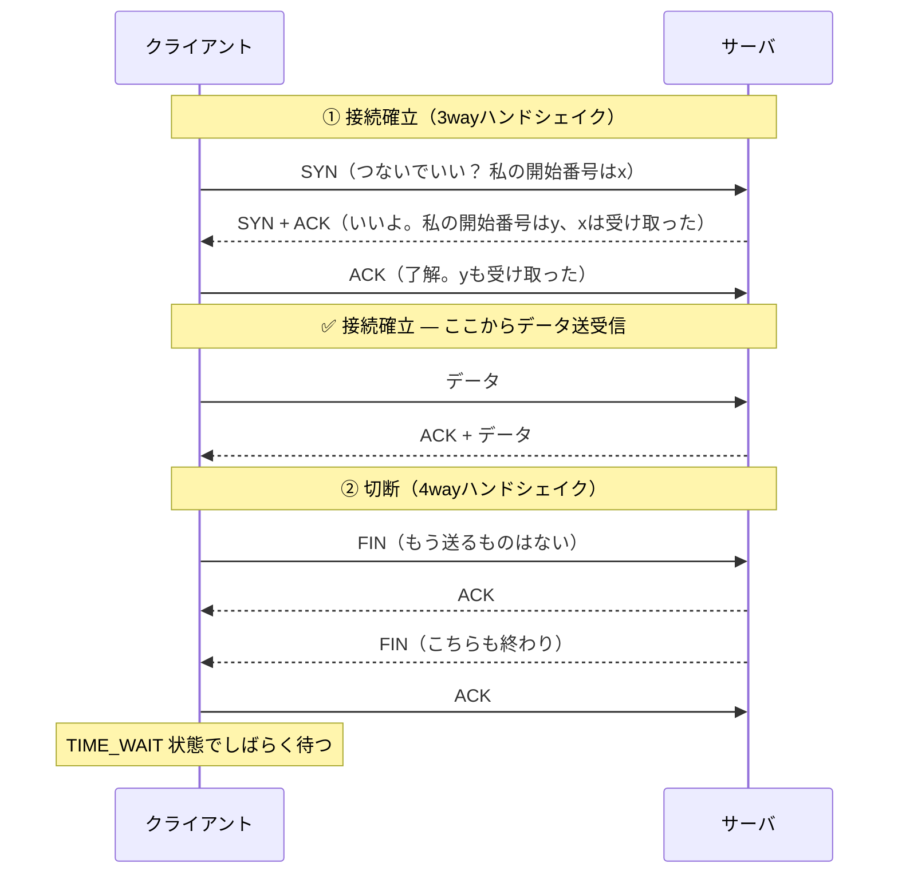

# ④ トランスポート層 — TCP・UDP・ポート・輻輳制御

[← 総合インデックスに戻る](README.md) ｜ 前 → [③](03-ip-routing.md) ｜ 次 → [⑤ アプリケーション層](05-application-dns-http.md)

L3までで「相手の機器」までは届きました。L4の仕事は2つです。

1. **その機器の中の、どのアプリに渡すか**（ポート番号）
2. **信頼できる通信にするか、速さを取るか**（TCP か UDP か）

アプリ開発者にとって、**「たまに遅い」「たまに切れる」の原因が最も多く潜んでいるのがこの層**です。

---

## 1. ポート番号 — 機器の中の「部屋番号」

```
   93.184.216.34 : 443
   └─────┬────┘   └┬┘
      どの機器     どのアプリ
      （L3 / IP）  （L4 / ポート）
```

マンションでいえば、IPアドレスが建物の住所、ポート番号が部屋番号です。1台のサーバでWebもメールもDBも動かせるのは、ポートで区別しているからです。

### ポート番号の区分

| 範囲 | 名前 | 用途 |
| --- | --- | --- |
| 0 〜 1023 | **ウェルノウンポート** | 標準サービス。Linuxでは**root権限が必要** |
| 1024 〜 49151 | 登録済みポート | アプリケーション固有 |
| 49152 〜 65535 | **エフェメラルポート（動的ポート）** | **クライアント側が通信ごとに一時的に使う** |

### 覚えておくべきポート番号

| ポート | プロトコル | 用途 |
| --- | --- | --- |
| 20 / 21 | TCP | FTP（データ / 制御） |
| **22** | TCP | **SSH・SFTP** |
| 25 | TCP | SMTP（メール送信） |
| **53** | **UDP**（大きい応答はTCP） | **DNS** |
| 67 / 68 | UDP | DHCP（サーバ / クライアント） |
| **80** | TCP | **HTTP** |
| 123 | UDP | NTP（時刻同期） |
| 389 / 636 | TCP | LDAP / LDAPS（Active Directory） |
| **443** | TCP（HTTP/3 は **UDP**） | **HTTPS** |
| 445 | TCP | SMB（Windowsファイル共有） |
| 514 | UDP | Syslog |
| 587 | TCP | SMTP Submission（メール送信・現在の標準） |
| 993 / 995 | TCP | IMAPS / POP3S |
| **3389** | TCP | **RDP（リモートデスクトップ）** |
| 3306 / 5432 | TCP | MySQL / PostgreSQL |
| 6379 | TCP | Redis |

> ⚠️ **インターネットに晒してはいけないポートの代表**：22（SSH）・3389（RDP）・445（SMB）・3306/5432（DB）・6379（Redis）。
> **クラウドのセキュリティグループで `0.0.0.0/0` に対してこれらを開けるのは、事故の典型パターン**です（→ [⑥](06-security.md)）。

### 「サーバ側は固定、クライアント側は毎回変わる」

```
ブラウザ                              Webサーバ
192.168.1.10:52341  ──────────→  93.184.216.34:443
              ↑ 毎回ランダム              ↑ 固定

同じPCから2つのタブで同じサイトを開くと：
192.168.1.10:52341 → 93.184.216.34:443
192.168.1.10:52342 → 93.184.216.34:443
              ↑ ポートが違うので別の通信として区別される
```

この **「送信元IP・送信元ポート・宛先IP・宛先ポート・プロトコル」の5つ組（5タプル）** が、1つの通信を識別する単位です。ファイアウォールもロードバランサもNATも、この5タプルで通信を管理しています。

---

## 2. TCP と UDP — 確実さか、速さか

| | **TCP** | **UDP** |
| --- | --- | --- |
| 例え | **書留郵便** | **はがき** |
| 接続 | 事前に接続を確立（コネクション型） | 確立しない（コネクションレス） |
| 到達保証 | **あり**（届かなければ再送） | なし（投げっぱなし） |
| 順序保証 | **あり** | なし |
| 速度 | 遅い（確認のやり取りが要る） | **速い** |
| ヘッダ | 20バイト以上 | **8バイト** |
| 主な用途 | Web・メール・SSH・DB・ファイル転送 | DNS・DHCP・NTP・**音声/映像通話**・オンラインゲーム |

### なぜ音声通話はUDPなのか

```
【TCPで通話したら】
  0.5秒前の音声が1パケット消えた
  → 再送を要求 → 届くまで待つ → 音が飛ぶどころか会話が止まる 😱

【UDPなら】
  消えたパケットは諦める
  → 「ザッ」と一瞬ノイズが入るだけで会話は続く ✅
```

**「多少欠けても、遅れないほうが価値がある」データはUDP**。これが判断基準です。

---

## 3. TCPの3wayハンドシェイク

TCPは通信の前に、必ず「接続の確立」を行います。



### この「往復」がコストになる

```
接続確立に  1往復（RTT）
TLSに      1〜2往復
実データ    1往復
──────────────────────
合計       3〜4往復

RTT 100ms の海外サーバなら、データが1バイトも流れる前に 300ms 経過 ⏳
```

> 🔑 **だからHTTP/2のコネクション再利用、HTTP/3（QUIC）の0-RTT、CDNによる距離短縮が効くのです**（→ [⑤](05-application-dns-http.md)）。

### TCPの状態遷移（トラブル対応で見る値）

`ss -ant`（Linux）や `netstat -an` で確認できます。

| 状態 | 意味 | 大量にあるとき疑うこと |
| --- | --- | --- |
| **LISTEN** | 接続待ち受け中 | 正常 |
| **ESTABLISHED** | 接続確立中 | 正常。多すぎるなら接続数上限を確認 |
| **SYN_SENT** | SYNを送ったが応答がない | **FWで遮断されている**・相手が落ちている |
| **SYN_RECV** | SYNを受けたがACKが返らない | **SYNフラッド攻撃**の可能性 |
| **TIME_WAIT** | 切断後の待機（既定60秒） | **短時間に大量接続を繰り返している**（後述） |
| **CLOSE_WAIT** | 相手はFINを送ったがこちらが閉じていない | **アプリのバグ（close漏れ）**。放置するとFD枯渇 |

> ⚠️ **`CLOSE_WAIT` が溜まり続けるのは、ほぼ確実にアプリケーション側のバグ**です。ネットワーク機器を調べても解決しません。

---

## 4. 信頼性の仕組み — 再送・順序制御・フロー制御

| 仕組み | やっていること |
| --- | --- |
| **シーケンス番号** | 各バイトに通し番号。受信側が順序を復元し、重複を捨てる |
| **ACK（確認応答）** | 「ここまで受け取った」を返す |
| **再送** | ACKが返らない（タイムアウト）／重複ACKが3回 → 再送 |
| **フロー制御（ウィンドウ）** | 受信側が「まだこれだけ受け取れる」と申告。**遅い受信側を潰さない** |
| **輻輳制御** | ネットワーク全体の混雑を検知して送信量を絞る |

### スライディングウィンドウ

ACKを1つずつ待っていては遅すぎるので、**ACKを待たずにまとめて送れる量（ウィンドウサイズ）** を決めています。

```
【ウィンドウが小さい】             【ウィンドウが大きい】
送信 → 待つ → ACK → 送信 → ...    送信送信送信送信 → まとめてACK
遅い 🐌                            速い 🚀
```

### 帯域遅延積（BDP）— 「回線は太いのに速度が出ない」の正体

```
必要なウィンドウサイズ = 帯域 × RTT

例：1Gbps・RTT 100ms（東京〜米国）の回線
  = 1,000,000,000 bit/s × 0.1s = 100,000,000 bit = 12.5 MB

→ ウィンドウが 12.5MB なければ、1Gbpsを使い切れない
→ 既定のウィンドウが 64KB だと… 実効速度は約 5Mbps 😱
```

| 対策 | 内容 |
| --- | --- |
| **ウィンドウスケーリング** | 64KB上限を拡張するTCPオプション。現代のOSは既定で有効 |
| OSのバッファ拡大 | `net.ipv4.tcp_rmem` / `tcp_wmem` のチューニング |
| **並列転送** | 複数コネクションで同時に送る（rsync -P、S3のマルチパートアップロード） |
| **距離を縮める** | CDN・リージョン配置の見直し。**根本的にはこれが最も効く** |

> 🔑 **「専用線を1Gbpsに増速したのに、海外拠点へのファイル転送が速くならない」**——これは帯域の問題ではなくBDPの問題です。増速の前に、まずRTTとウィンドウサイズを確認してください。

---

## 5. 輻輳制御 — 混雑をどう避けるか

ネットワークが混雑すると、パケットが捨てられます。TCPは**パケットロスを「混んでいるサイン」とみなして送信量を落とし**、問題なければ徐々に上げます。全員がこれをやることで、インターネットは破綻せずに回っています。

| アルゴリズム | 特徴 | 使われている場所 |
| --- | --- | --- |
| Reno / NewReno | 古典的。ロスで半減 | 教科書 |
| **CUBIC** | 高速回線向けに改良 | **Linux・Windowsの既定** |
| **BBR** | ロスではなく**帯域と遅延を推定**して制御。**無線・長距離で強い** | Google（YouTube・GCP）・Linuxで選択可 |

> 💡 **BBRは、パケットロスが発生しやすい無線環境や国際回線で、CUBICより数倍速くなることがあります。** 長距離転送が多いサーバなら、`net.ipv4.tcp_congestion_control=bbr` の検討価値があります。

### バッファブロート

途中の機器が大きすぎるバッファを持つと、パケットは捨てられずに**溜まって遅延だけが増えます**。「回線速度は出ているのに、Web会議がカクつく」原因のひとつです。対策はルータ側の **AQM（fq_codel・CAKE）** です。

---

## 6. QUIC と HTTP/3 — UDPの上に信頼性を再実装する

TCPには構造的な限界があり、Googleが**UDPの上に新しいトランスポート**を作りました。それがQUICで、その上のHTTPが**HTTP/3**です。

| 課題（TCP+TLS） | QUICの解決 |
| --- | --- |
| 接続確立に **TCP 1往復 + TLS 1〜2往復** | **1往復で完了**。再接続なら **0-RTT** |
| **HoLブロッキング**：1つのパケットロスで全ストリームが止まる | ストリームごとに独立。**他は止まらない** |
| Wi-Fi→モバイル切替で**接続断** | **コネクションID**で識別。IPが変わっても継続 ✅ |
| TCPの改良はOS更新が必要 | ユーザー空間で実装 → **アプリ更新で改善できる** |

```
       HTTP/2                     HTTP/3
    ┌──────────┐              ┌──────────┐
    │  HTTP/2  │              │  HTTP/3  │
    ├──────────┤              ├──────────┤
    │   TLS    │              │  QUIC    │ ← TLS 1.3 を内包
    ├──────────┤              ├──────────┤
    │   TCP    │              │   UDP    │
    └──────────┘              └──────────┘
      TCP 443                   UDP 443 ★
```

> ⚠️ **ファイアウォール設計の実務ポイント**：HTTP/3 は **UDP 443** を使います。**UDPを一律ブロックしている環境ではHTTP/3が使えず、TCP（HTTP/2）にフォールバック**します。動作はしますが、モバイル環境での高速化の恩恵は受けられません。「なぜかスマホだけ遅い」の遠因になることがあります。

---

## 7. 実務でよく刺さる問題

### 7-1. エフェメラルポート枯渇

```
症状：高負荷時に「Cannot assign requested address」
      「connect: address already in use」が出る

原因：クライアント側の一時ポート（約28,000〜32,000個）を使い切った
      TIME_WAIT が60秒残るため、毎秒500接続 × 60秒 = 30,000 で枯渇
```

| 対策 | 内容 |
| --- | --- |
| **コネクションを使い回す** | **最も正しい対処**。HTTPのKeep-Alive、DBのコネクションプール |
| ポート範囲を広げる | `net.ipv4.ip_local_port_range = 1024 65535` |
| `tcp_tw_reuse` を有効化 | TIME_WAITのソケットを再利用（クライアント側のみ安全） |
| 接続先を分散 | 5タプルが変わるので枯渇しにくくなる |

> 🔑 **アプリ側で毎回 new HttpClient() している、DB接続をプールしていない——これが根本原因であることがほとんどです。** カーネルパラメータの調整は対症療法です。

### 7-2. NAT/FWのアイドルタイムアウトによる切断

```
症状：SSHが放置すると固まる、DB接続が「たまに」切れる、
      WebSocketが数分で落ちる

原因：NAT/FWがセッションテーブルを一定時間で削除する
      （FWの既定は 1時間前後、モバイル網では 5分程度のことも）
      → 双方は接続していると思っているが、途中の機器が忘れている
```

| 対策 | 内容 |
| --- | --- |
| **アプリ層のキープアライブ** | **最も確実**。WebSocketのping/pong、`ServerAliveInterval`（SSH） |
| TCPキープアライブ | OS既定は**2時間**と長すぎる。短縮するか、アプリ層で対処 |
| FWのタイムアウト延長 | 副作用（セッションテーブル圧迫）に注意 |

### 7-3. SYNフラッドと対策

大量のSYNだけを送りつけ、サーバの接続待ちキューを埋める攻撃です。対策は **SYN Cookie**（`net.ipv4.tcp_syncookies=1`、多くのディストリで既定有効）と、上位でのDDoS防御（→ [⑥](06-security.md)）。

---

## 8. この層のトラブル切り分け早見表

| 症状 | 確認コマンド | 疑うこと |
| --- | --- | --- |
| 繋がらない | `ping` は通る？ | L3はOK → L4のFW/ポートを疑う |
| ポートが開いているか | `nc -zv host port` / `Test-NetConnection` | FWのルール・サービス未起動 |
| 何がLISTENしているか | `ss -tlnp` / `netstat -ano` | バインドアドレスが `127.0.0.1` になっていないか |
| 接続数・状態の偏り | `ss -ant \| awk '{print $1}' \| sort \| uniq -c` | CLOSE_WAIT／TIME_WAIT の異常 |
| 実際のパケットを見たい | `tcpdump -i any port 443 -nn` | SYNに応答があるか |
| 途中でロスしているか | `mtr -rwbzc 100 <host>` | どのホップからロスが始まるか |
| 帯域が出ない | `iperf3 -c <host>` | BDP・ウィンドウサイズ |

> 🔑 **「SYNは出ているが SYN+ACK が返ってこない」= ほぼ確実にFW/セキュリティグループの遮断です。** tcpdumpで1回確認すれば、アプリ側を延々調べる無駄が省けます。

---

## 9. この章のまとめ

| 覚えること | 一言で |
| --- | --- |
| ポート番号 | 機器の中の**どのアプリか**。5タプルが通信の識別単位 |
| TCP vs UDP | **書留 vs はがき**。欠けても遅れないほうが良いならUDP |
| 3wayハンドシェイク | 接続に1往復かかる。**RTTがそのままコスト**になる |
| CLOSE_WAIT 大量 | **アプリのclose漏れ**。ネットワーク機器の問題ではない |
| **BDP（帯域×RTT）** | **太い回線でも遠いと速度が出ない**理由。並列化かCDNで対処 |
| 輻輳制御 | 既定はCUBIC。**長距離・無線ならBBR**が効くことがある |
| QUIC / HTTP/3 | **UDP 443**。FWでUDPを閉じるとTCPに落ちる |
| ポート枯渇 | **コネクションを使い回す**のが本質的な対処 |
| 謎の切断 | NAT/FWのタイムアウト。**アプリ層キープアライブ**で解決 |

---

[← 総合インデックスに戻る](README.md) ｜ 前 → [③](03-ip-routing.md) ｜ 次 → [⑤ アプリケーション層（DNS・HTTP・TLS）](05-application-dns-http.md)
