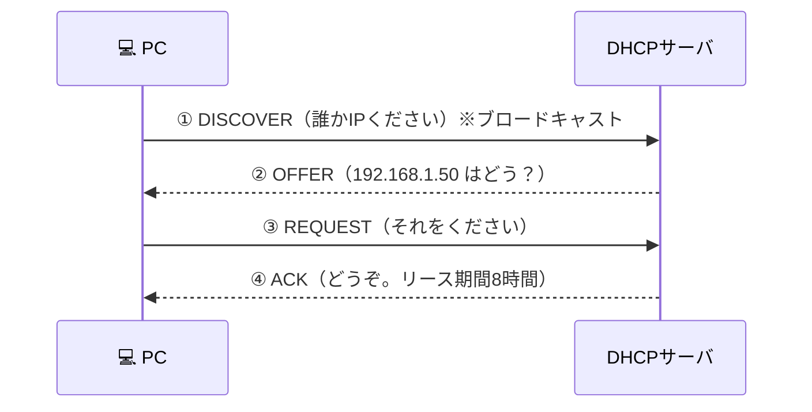
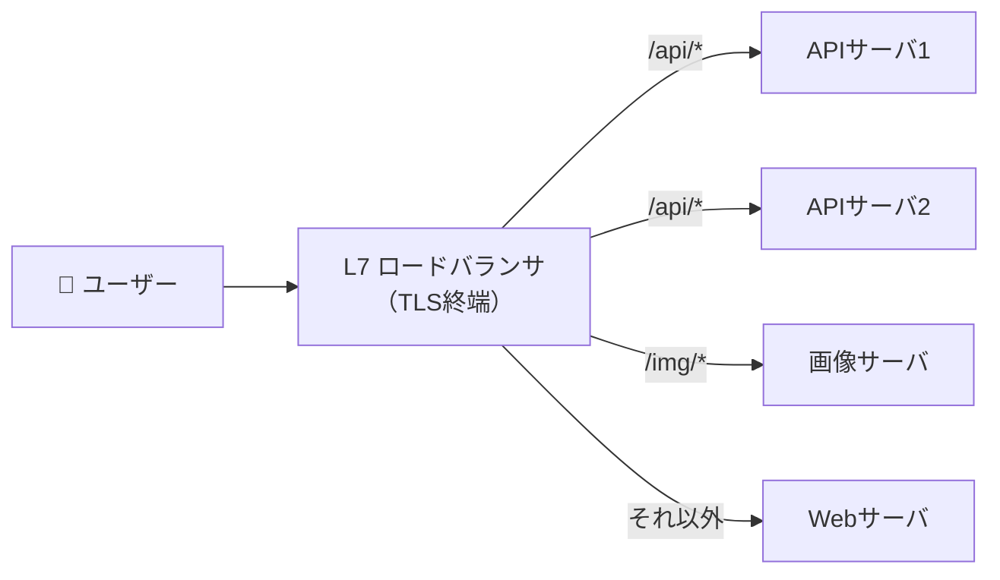

# ⑤ アプリケーション層 — DNS・HTTP・TLS・ロードバランサ

[← 総合インデックスに戻る](README.md) ｜ 前 → [④](04-transport-tcp-udp.md) ｜ 次 → [⑥ ネットワークセキュリティ](06-security.md)

ここまでで「相手のアプリまでデータを届ける」土台ができました。この章は、**その上で実際に動いているプロトコル**の話です。
アプリ開発者・Web運用者が日常的に触るのは、ほぼこの層になります。

---

## 1. DHCP — IPアドレスの自動配布

PCをLANに繋いだだけで通信できるのは、DHCPが設定を配っているからです。



**DHCPが配るもの**（IPアドレスだけではない点が重要）：

| 項目 | 内容 |
| --- | --- |
| IPアドレス / サブネットマスク | 自分の住所 |
| **デフォルトゲートウェイ** | 外に出るときの出口 |
| **DNSサーバ** | 名前解決先 |
| リース期間 | 何時間その住所を使えるか |
| NTPサーバ・ドメイン名など | オプション |

### 実務ポイント

| 論点 | 指針 |
| --- | --- |
| **DHCPリレー（IPヘルパー）** | DHCPはブロードキャストなのでVLANを越えない。**VLANごとにサーバを置くのではなく、L3SWにリレー設定**をして1台に集約する |
| **固定IPが必要な機器** | サーバ・プリンタ・スイッチ・AP。DHCPの**予約（MACアドレス紐付け）**で管理すると台帳が一元化できて楽 |
| **配布範囲の設計** | `.1〜.50` は固定用に空け、`.100〜.200` をDHCPプールにする、等 |
| **不正DHCPサーバ** | 誰かが家庭用ルータを社内LANに挿すと、**間違ったIPを配って一斉に通信不能**になる。スイッチの **DHCPスヌーピング** で防ぐ |

> ⚠️ **「午後になったら急に何人か繋がらなくなった」= DHCPプールの枯渇** が定番原因です。BYODやゲスト端末が増えると起きます。リース期間を短くする（8時間→2時間）か、プールを広げます。

---

## 2. DNS — 名前をIPアドレスに変換する

> 📖 **レコード種別・ゾーン設計・ドメイン移管などの詳細は [DNS・ドメイン完全ガイド](../dns-guide.md) にあります。** ここではネットワーク運用の観点に絞ります。

### 名前解決の流れ（再帰問い合わせ）

```
PC → ①社内DNS / ISPのリゾルバ（キャッシュがあれば即答）
        ↓ なければ
     ②ルートDNS   「.com は こっちのサーバへ」
        ↓
     ③.com のDNS  「example.com は こっちへ」
        ↓
     ④example.com の権威DNS  「93.184.216.34 です」
        ↓
     ① がキャッシュして PC に返す
```

### ネットワーク運用で押さえるべき点

| 論点 | 内容 |
| --- | --- |
| **TTL** | キャッシュ保持時間。**移行作業の前に300秒程度へ下げておく**のが定石。戻し忘れに注意 |
| **UDP 53 と TCP 53** | 通常はUDP。応答が512バイトを超えると**TCPにフォールバック**する。**FWでTCP 53を塞ぐとDNSSEC等で不具合**が出る |
| **内部DNSと外部DNS** | 社内からは内部IP、社外からは外部IPを返したい → **スプリットDNS**（下記） |
| **DoH / DoT** | DNSをHTTPS/TLSで暗号化。ブラウザが勝手にDoHを使うと**社内のフィルタリングを迂回**してしまう。企業では明示的に制御が必要 |
| **条件付きフォワーダ** | 「`corp.example.com` の問い合わせだけ社内DNSへ、それ以外はインターネットへ」。**ハイブリッド構成の要**（→ [⑩](10-hybrid-patterns.md)） |

### スプリットDNS（内部・外部で違う答えを返す）

```
                    www.example.com は？
社内PC ──→ 社内DNS ──→ 「10.0.1.20」（内部IP、直接アクセス）
社外PC ──→ 公開DNS ──→ 「203.0.113.5」（グローバルIP、FW経由）
```

> 🔑 **これを設計しないと、社内から自社サイトへのアクセスがわざわざ外に出て戻ってくる（ヘアピン）** ことになり、遅くなったりFWで弾かれたりします。**社内サーバをクラウド移行したときに必ず出てくる論点**です。

### DNSは障害の"見え方"を狂わせる

> ⚠️ **「サイトが見られない」の原因の相当数はDNSです。** しかもキャッシュのせいで **「自分は見られるが他の人は見られない」「昨日から直したのに反映されない」** という混乱を生みます。
> 切り分けでは、必ず **`dig @8.8.8.8 example.com`**（外部リゾルバ）と **`dig @<社内DNS> example.com`** を比較してください。

---

## 3. HTTP の進化 — 1.1 → 2 → 3

| | HTTP/1.1 | HTTP/2 | HTTP/3 |
| --- | --- | --- | --- |
| 登場 | 1997 | 2015 | 2022 |
| トランスポート | TCP | TCP | **QUIC（UDP）** |
| 同時リクエスト | **1接続に1つずつ** | **多重化**（1接続で並列） | 多重化 |
| ヘッダ | テキスト・毎回全部送る | **バイナリ・圧縮（HPACK）** | バイナリ・圧縮（QPACK） |
| HoLブロッキング | あり（アプリ層） | **TCP層に残る** | **解消** |
| サーバプッシュ | なし | あり（**現在は非推奨・廃止傾向**） | なし |
| 暗号化 | 任意 | 事実上必須 | **必須** |

### HTTP/1.1 の問題と、当時の回避策

```
【HTTP/1.1】1本の接続で1リクエストずつ
  接続1: [CSS取得] → [JS取得] → [画像1] → [画像2] ...
  → 遅いので、ブラウザは同一ホストに 6本 の接続を張った

  当時の回避テクニック（現在は逆効果になることが多い）：
   ・画像を1枚にまとめる（CSSスプライト）
   ・ドメインを分散する（ドメインシャーディング）
   ・CSS/JSを1ファイルに結合する
```

> 🔑 **HTTP/2 以降ではこれらの最適化が不要、どころか有害**です。多重化されるため、ファイルを細かく分けたほうがキャッシュ効率が良くなります。**古い記事のチューニング手法をそのまま適用しない**でください。

### HTTP/2 に残った HoL ブロッキング

```
HTTP/2：アプリ層では並列だが、下のTCPは1本
  → パケットが1つ消えると、TCPが順序を守るために
    「関係ない他のストリームまで待たされる」

HTTP/3（QUIC）：ストリームごとに独立して再送
  → 1つ消えても他は流れ続ける ✅
  → パケットロスが起きやすいモバイル・無線で効果が大きい
```

---

## 4. TLS — 暗号化と証明書

### TLSが保証する3つのこと

| 保証 | 内容 |
| --- | --- |
| **機密性** | 経路上で盗み見られない（暗号化） |
| **完全性** | 改ざんされていない |
| **真正性** | **接続先が本物である**（証明書による） |

### TLS 1.3 のハンドシェイク

```
【TLS 1.2】2往復（2-RTT）
【TLS 1.3】1往復（1-RTT）、再接続なら 0-RTT ★

クライアント ──「使える暗号方式リスト＋鍵材料」──→ サーバ
クライアント ←─「暗号方式決定＋証明書＋鍵材料」──  サーバ
             ✅ ここから暗号化通信
```

TLS 1.3では脆弱な暗号方式（RC4・SHA-1・静的RSA鍵交換など）が**仕様から削除**され、選択ミスによる事故が起きにくくなっています。

> ⚠️ **TLS 1.0 / 1.1 は廃止済み**です。まだ有効にしている機器があれば無効化してください。**TLS 1.2 以上、できれば 1.3** が現在の基準です。

### 証明書の種類

| 種類 | 検証内容 | 発行速度 | 用途 |
| --- | --- | --- | --- |
| **DV**（ドメイン認証） | ドメインの所有のみ | 数分・**無料**（Let's Encrypt） | 一般的なサイト。これで十分 |
| OV（組織認証） | 組織の実在性 | 数日 | 企業サイト |
| EV（拡張認証） | 厳格な組織審査 | 1〜2週間 | 金融など。**ブラウザの表示上の優遇は廃止済み** |
| **ワイルドカード** | `*.example.com` | — | サブドメインが多い場合 |
| **プライベートCA** | 社内で自己発行 | — | 社内システム。**全端末にルート証明書の配布が必要** |

### 証明書まわりの実務トラブル

| 症状 | 原因 |
| --- | --- |
| **有効期限切れ** | **最も多い事故。** 自動更新（ACME）＋**期限監視**を必ず設定する |
| 中間証明書の設定漏れ | ブラウザでは見えるがアプリ/curlでエラー。**サーバ側で中間証明書もセットで配信**する |
| 名前の不一致 | 証明書のSAN（Subject Alternative Name）に該当ホスト名がない |
| 時刻ずれ | サーバ/端末の時刻が大きくずれると検証に失敗 → **NTP同期を必ず** |
| SSLインスペクション | 社内FWが復号・再暗号化しており、**アプリが独自CAを信頼していない** |

> 🔑 **証明書の有効期限は年々短縮されています**（現在は最長398日、さらに短縮の方向）。**手動更新は現実的でなく、ACMEによる自動更新が前提**です。加えて、期限14日前にアラートを出す監視を必ず入れてください。

---

## 5. ロードバランサ（負荷分散装置）

### L4ロードバランサ と L7ロードバランサ

| | **L4 LB** | **L7 LB** |
| --- | --- | --- |
| 見るもの | IPアドレス・**ポート番号** | **URL・ヘッダ・Cookie**・ホスト名 |
| 中身 | 見ない（暗号化されたままでOK） | 見る（**TLS終端**が必要） |
| 速度 | **速い・低遅延** | やや重い |
| できること | 単純な振り分け | **パスによる振り分け**・ヘッダ書き換え・リトライ・WAF連携 |
| 製品例 | AWS NLB、LVS | AWS ALB、Nginx、HAProxy、Envoy |



### 振り分けアルゴリズム

| 方式 | 内容 | 向く場面 |
| --- | --- | --- |
| **ラウンドロビン** | 順番に均等配分 | サーバ性能が同じ場合の既定 |
| 重み付きラウンドロビン | 性能差に応じて配分 | 新旧サーバが混在 |
| **最小接続数（Least Connection）** | 接続数が少ないサーバへ | **処理時間にばらつきがある場合。実務ではこれが安全** |
| 応答時間ベース | 速いサーバへ | |
| **IPハッシュ** | 送信元IPで固定的に決定 | セッション維持が必要な場合 |

### ヘルスチェック — LBの本質はここ

負荷分散よりも、**「壊れたサーバを自動的に切り離す」ことがLBの最大の価値**です。

| 種類 | 内容 | 評価 |
| --- | --- | --- |
| L3（ping） | 応答するか | ❌ OSが生きているだけ。**不十分** |
| L4（TCP接続） | ポートが開いているか | △ プロセスは生きているが処理不能なことがある |
| **L7（HTTP）** | `/healthz` が **200** を返すか | ✅ **これを使う** |

> 🔑 **ヘルスチェック用エンドポイントの設計が重要です。**
> - 静的な200を返すだけ → 「DBが落ちているのに正常判定」になる
> - DBまで毎回チェック → 「DBが少し重いだけで**全サーバが一斉に切り離される**」（連鎖障害）
>
> **実務解**：`/healthz`（自分が生きているか＝軽量）と `/readyz`（依存先も含めて処理可能か）を分け、LBには前者、デプロイ制御には後者を使う。

### セッション維持（スティッキーセッション）

サーバのメモリにログイン状態を持つと、**別のサーバに振られた瞬間にログアウト**します。

| 対処 | 評価 |
| --- | --- |
| Cookieでサーバを固定（スティッキー） | △ 動くが、**そのサーバが落ちると該当ユーザーだけ全滅**。スケールも偏る |
| **セッションを外部化**（Redis・DB） | ✅ **推奨**。どのサーバに振られても同じ状態 |
| **ステートレス化**（JWT等） | ✅ 最もスケールしやすい（→ [SSOガイド](../sso/README.md)） |

---

## 6. プロキシとリバースプロキシ

```
【フォワードプロキシ】クライアント側に立つ
  社内PC → プロキシ → インターネット
  目的：アクセス制御・ログ取得・URLフィルタ・キャッシュ

【リバースプロキシ】サーバ側に立つ
  インターネット → リバースプロキシ → 内部の複数サーバ
  目的：負荷分散・TLS終端・キャッシュ・WAF・IPの隠蔽
```

### リバースプロキシ配下でよくある事故

| 問題 | 対処 |
| --- | --- |
| **アプリのログに全部同じIPが載る** | `X-Forwarded-For` を見る。ただし**信頼できるプロキシ経由の分だけ**採用すること（偽装可能） |
| httpsなのにアプリがhttpと誤認しリダイレクトループ | `X-Forwarded-Proto` を尊重する設定を入れる |
| 大きなファイルのアップロードが失敗 | プロキシ側の `client_max_body_size` 等の上限 |
| WebSocketが繋がらない | `Upgrade` / `Connection` ヘッダの転送設定 |
| タイムアウトが短い | プロキシとアプリで**タイムアウト値を階層的に**（外側を長く）設定する |

---

## 7. CDN — 距離を縮める

[④](04-transport-tcp-udp.md) で見たとおり、Web表示の速度は**遅延（RTT）に支配**されます。CDNはコンテンツを世界中のエッジにコピーし、**ユーザーの近くから返す**ことでRTTを短縮します。

| CDNの効果 | 内容 |
| --- | --- |
| **遅延短縮** | 海外からのアクセスが劇的に速くなる |
| **オリジン負荷軽減** | キャッシュヒット分はサーバに届かない |
| **DDoS吸収** | 巨大な帯域で攻撃を受け止める（→ [⑥](06-security.md)） |
| **TLS終端の分散** | ハンドシェイクをエッジで済ませられる |

| 設計上の注意 | 内容 |
| --- | --- |
| **キャッシュキー設計** | Cookieやクエリで無用に分岐するとヒット率が落ちる |
| **`Cache-Control` の設計** | 静的資産は `max-age=31536000, immutable` ＋ **ファイル名にハッシュ**。HTMLは短命に |
| **パージ（無効化）手順** | 事故ったときに即座に消せる手順を用意しておく |
| **オリジン保護** | オリジンのIPを直接叩かれないよう、**CDNのIPからのみ許可** |

---

## 8. その他の主要プロトコル

| プロトコル | ポート | 用途・実務ポイント |
| --- | --- | --- |
| **NTP** | UDP 123 | **時刻同期**。ずれると証明書検証・ログ相関・Kerberos認証が壊れる。**必ず設定** |
| **SMTP / IMAP** | 25 / 587 / 993 | メール。送信は**587（Submission）**。SPF・DKIM・DMARCの設定必須 |
| **SNMP** | UDP 161 / 162 | 機器監視。**v1/v2cは平文**。可能なら**v3**（→ [⑫](12-operations-troubleshooting.md)） |
| **Syslog** | UDP 514 | ログ集約。UDPは欠損するため重要ログは**TCP/TLS**で |
| **LDAP / LDAPS** | 389 / 636 | ディレクトリ認証（Active Directory） |
| **RADIUS** | UDP 1812/1813 | **802.1X認証**の中核（→ [⑥](06-security.md)） |
| **SMB** | TCP 445 | Windowsファイル共有。**絶対にインターネットへ公開しない** |
| **RDP** | TCP 3389 | リモートデスクトップ。**必ずVPN/踏み台の内側に** |

---

## 9. この章のまとめ

| 覚えること | 一言で |
| --- | --- |
| DHCP | IPだけでなく**GW・DNS**も配る。VLAN越えには**リレー**が必要 |
| DNS | **移行前にTTLを下げる**。社内外で答えを変える**スプリットDNS** |
| HTTP/2以降 | **結合・スプライトは不要**。古いチューニング記事に注意 |
| HTTP/3 | **UDP 443**。モバイル・無線で効果大 |
| TLS | **1.2以上、できれば1.3**。**期限切れが最大の事故** → 自動更新＋監視 |
| L4 vs L7 LB | ポートだけ見るか、**URL/ヘッダまで見るか** |
| **ヘルスチェック** | LBの本質。`/healthz` と `/readyz` を**分ける** |
| セッション維持 | スティッキーより**外部化・ステートレス化** |
| リバースプロキシ | `X-Forwarded-For` / `-Proto` の扱いが定番の落とし穴 |
| CDN | **遅延を距離ごと縮める**。オリジンはCDNからのみ許可 |
| NTP | 地味だが**止まると認証・証明書・ログが壊れる** |

---

[← 総合インデックスに戻る](README.md) ｜ 前 → [④](04-transport-tcp-udp.md) ｜ 次 → [⑥ ネットワークセキュリティ](06-security.md)
