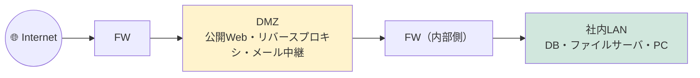

# ⑥ ネットワークセキュリティ — FW・VPN・ゼロトラスト

[← 総合インデックスに戻る](README.md) ｜ 前 → [⑤](05-application-dns-http.md) ｜ 次 → [⑦ ネットワーク設計の基礎](07-design-basics.md)

この章は **「どこに何を置いて守るか」** の話です。
個々の製品の使い方ではなく、**境界防御からゼロトラストへという設計思想の変化**と、その中で各機器が担う役割を整理します。

---

## 1. 前提：境界防御はもう成立しない

### 従来のモデル（境界防御 / 城と堀）

```
        🌐 インターネット（危険）
              │
         ┌────▼────┐
         │   FW    │  ← ここさえ固めれば安全、という発想
         └────┬────┘
    ─────────┴──────────
      社内ネットワーク（安全と信じる）
      PC  サーバ  プリンタ  ...
```

**この前提が崩れた理由：**

| 変化 | 何が起きたか |
| --- | --- |
| **クラウド利用** | 守るべきデータが社内ではなくSaaS・IaaSにある。FWの内側にない |
| **リモートワーク** | 社員が「堀の外」から働く。全員VPNは帯域も運用も破綻しがち |
| **BYOD・IoT** | 管理外の機器が社内LANに繋がる |
| **内部からの侵害** | フィッシングで1台侵入されれば、**内側は無防備**（ラテラルムーブメント） |
| **ランサムウェア** | 1台の感染が、共有フォルダ経由で全社に波及する |

> 🔑 **現代の前提は「侵入される」です。** 侵入を防ぐ努力は続けつつ、**侵入されたときに被害をどこまで小さく閉じ込められるか**（セグメンテーション・最小権限・検知）に設計の重心が移っています。

---

## 2. ファイアウォール

### 進化の3段階

| 世代 | 判断材料 | できないこと |
| --- | --- | --- |
| パケットフィルタ | IP・ポート | 応答パケットの判別ができず、穴を広く開ける必要がある |
| **ステートフルインスペクション** | **通信の状態（セッション）** | 中身までは見ない |
| **次世代FW（NGFW）** | **アプリケーション種別・ユーザー・URL・マルウェア** | — |

### ステートフルとは

```
【ステートレス】
  社内 → 外 : 許可
  外 → 社内 : 戻りの通信も許可しないといけない
              → 高いポートを全開放…😱 穴だらけ

【ステートフル】★現在の標準
  社内 → 外 : 許可し、その通信をセッションテーブルに記録
  外 → 社内 : 「記録済みの通信への応答」なら自動的に許可
              それ以外は拒否 ✅
```

### NGFWで増えた判断軸

| 軸 | できること |
| --- | --- |
| **アプリケーション識別** | 「ポート443を許可」ではなく「**Salesforceは許可、個人用ストレージは拒否**」 |
| **ユーザー識別** | AD連携し「営業部はこのSaaSのみ」といった制御 |
| **SSLインスペクション** | 暗号化通信を復号して検査。⚠️ **性能低下・プライバシー・証明書配布**の課題あり |
| **IPS機能** | 既知の攻撃パターンを遮断 |

### ファイアウォールルールの設計原則

| 原則 | 内容 |
| --- | --- |
| **デフォルト拒否** | 「明示的に許可したもの以外はすべて拒否」。**逆は絶対にやらない** |
| **最小権限** | 「Any → Any」を作らない。送信元・宛先・ポートを具体的に |
| **順序に注意** | 上から評価される。**広い許可ルールを上に置くと下の拒否が効かない** |
| **ルールの棚卸し** | 使われていないルールを定期的に削除。放置は事故の温床 |
| **ログ** | 拒否だけでなく**許可した通信もログ**を取る（侵害調査に必須） |
| **変更管理** | 誰がいつ何のために開けたかを記録。**「とりあえず開けた」を残さない** |

> ⚠️ **クラウドで最も多い事故**：セキュリティグループで `0.0.0.0/0` に対して **22（SSH）・3389（RDP）・DBポート** を開放。
> 公開直後から総当たり攻撃が始まります。**踏み台・VPN・Session Manager 等の内側に置く**のが正解です。

---

## 3. IDS / IPS / WAF — 何を守るのか

| | **IDS** | **IPS** | **WAF** |
| --- | --- | --- | --- |
| 正式名 | 侵入検知 | 侵入防御 | WebアプリケーションFW |
| 動作 | **検知して通知** | **検知して遮断** | 検知して遮断 |
| 見る層 | L3〜L7 | L3〜L7 | **L7（HTTPの中身）** |
| 守る対象 | ネットワーク全体 | ネットワーク全体 | **Webアプリ** |
| 防ぐもの | 不審な通信・既知の攻撃 | 同左 | **SQLi・XSS・ディレクトリトラバーサル** |
| 設置 | ミラーポート（経路外） | インライン（経路上） | Webサーバ/LBの前段 |

```
     🌐 インターネット
          │
     ┌────▼────┐
     │   FW    │  ← ポート・IP・アプリ種別で許可/拒否
     └────┬────┘
     ┌────▼────┐
     │IPS/IDS  │  ← 攻撃パターンを検知・遮断
     └────┬────┘
     ┌────▼────┐
     │  WAF    │  ← HTTPリクエストの中身を検査
     └────┬────┘
      Webサーバ
```

> 🔑 **FWとWAFは代替関係ではなく、守る層が違います。**
> FWは「443番を通す/通さない」しか判断できません。**443番を通したうえで、その中に含まれるSQLインジェクションを止めるのがWAF**です。公開Webサイトがあるなら両方必要です。
>
> ただし **WAFは万能ではありません。** 誤検知で正常な業務を止めることがあるため、**まずは検知モードで運用して調整**し、その後に遮断モードへ移すのが定石です。**WAFは時間を稼ぐ手段であり、アプリ側の対策（プリペアドステートメント等）の代わりにはなりません。**

---

## 4. VPN — 公衆網の上に安全な通路を作る

### 2つのタイプ

| | **サイト間VPN（拠点間）** | **リモートアクセスVPN** |
| --- | --- | --- |
| 用途 | 本社 ⇄ 支社、社内 ⇄ クラウド | 在宅・外出先の社員 → 社内 |
| 方式 | **IPsec** | SSL-VPN / IPsec / WireGuard |
| 単位 | 拠点まるごと | 端末1台ずつ |
| 常時接続 | 常時 | 必要時 |

### 主な方式

| 方式 | 特徴 | 注意点 |
| --- | --- | --- |
| **IPsec** | 標準規格。相互接続性が高い。拠点間の定番 | 設定項目が多い。NAT越えに工夫が要る |
| **SSL-VPN** | TCP 443を使うためどこからでも繋がりやすい | ⚠️ **製品の脆弱性が狙われやすい**。パッチ適用が生命線 |
| **WireGuard** | 高速・軽量・設定が単純 | 比較的新しい。商用機能は製品による |
| **L2TP/PPTP** | 古い | **PPTPは暗号が破られている。使用禁止** |

### VPNの限界（ここが重要）

| 課題 | 内容 |
| --- | --- |
| **帯域のボトルネック** | 全社員のトラフィックが本社の1台に集中。**SaaS利用もいったん社内経由**になり無駄（ヘアピン） |
| **信頼しすぎ** | **VPNで繋がれば社内と同じ権限**。端末が感染していれば、そのまま社内へ持ち込まれる |
| **脆弱性が致命傷** | VPN装置の脆弱性は**インターネットから直接狙える**。実際に大規模侵害の入口になっている |
| **運用負荷** | 証明書・アカウント・クライアントソフトの管理 |

> ⚠️ **VPN装置のパッチ適用は最優先事項です。** 公開されている脆弱性は数日で悪用され始めます。「業務影響があるから週末に」と先延ばしにしている間に侵害された事例が多数あります。

---

## 5. ゼロトラスト — 「社内だから安全」をやめる

### 考え方

```
【境界防御】
  「社内ネットワークにいる」＝「信頼する」
       ↓
【ゼロトラスト】
  場所は問わない。アクセスのたびに、毎回検証する
   ・誰か（ユーザー認証・MFA）
   ・どの端末か（デバイスの管理状態・パッチ・EDR稼働）
   ・何にアクセスするか（最小権限）
   ・普段と違わないか（リスクベース評価）
```

### 実装要素

| 要素 | 役割 | 関連 |
| --- | --- | --- |
| **IdP（ID基盤）** | 認証の中心。SSO・MFA・条件付きアクセス | [SSOガイド](../sso/README.md) |
| **デバイス管理（MDM/EDR）** | 端末が管理下にあり、健全かを判定 | |
| **ZTNA** | VPNの置き換え。**アプリ単位**でアクセスを仲介。ネットワークには繋がせない | |
| **CASB** | SaaS利用の可視化と制御（シャドーIT対策） | |
| **SWG** | Webアクセスのフィルタ・マルウェア検査（プロキシのクラウド版） | |
| **マイクロセグメンテーション** | サーバ間通信を最小限に制限 | |

### SASE / SSE

```
【従来】機能ごとに機器を買って社内に置く
   FW・プロキシ・IPS・VPN装置 …… 全部オンプレ
   → リモートワーカーは、わざわざ社内を経由する必要がある

【SASE（Secure Access Service Edge）】
   これらの機能をクラウド側に集約し、ユーザーの近くのエッジで処理

   在宅社員 ─┐
   支社    ─┼→ 🌩 SASEクラウド（FW/SWG/CASB/ZTNA） ─→ SaaS・社内・Internet
   本社    ─┘         ↑ ここで一元的にポリシー適用
```

| 用語 | 意味 |
| --- | --- |
| **SSE** | SASEのうち**セキュリティ機能**（SWG・CASB・ZTNA・FWaaS） |
| **SASE** | **SSE + ネットワーク機能（SD-WAN）** |

> 💡 **SASEが解決するのは「拠点も人も分散したのに、セキュリティ機器は本社にある」というねじれです。**
> ただし **導入は段階的に**。いきなり全部を入れ替えるのではなく、①VPN → ZTNA、②プロキシ → SWG、といった順に置き換えるのが現実的です（→ [⑩](10-hybrid-patterns.md)）。

---

## 6. セグメンテーション — 被害を閉じ込める

**「侵入されること」を前提にすると、最も効くのがネットワークの分割です。**

### 分割の粒度

| レベル | 手段 | 効果 |
| --- | --- | --- |
| **VLAN分割** | 部署・用途ごとに分ける | 基本。まずここから（→ [②](02-physical-datalink.md)） |
| **VLAN間ACL** | VLAN間の通信を必要な分だけ許可 | **VLANを切っただけで全許可なら意味がない** |
| **DMZ** | 公開サーバを社内から隔離 | 公開サーバが侵害されても社内へ波及しない |
| **マイクロセグメンテーション** | **サーバ1台単位**で通信を制限 | ラテラルムーブメントをほぼ封じる。ホスト型FW/クラウドSGで実現 |

### 必ず分離すべきもの

| 対象 | 理由 |
| --- | --- |
| **ゲストWi-Fi** | 部外者の端末。**社内へは一切通さず、インターネットのみ**。クライアント間通信も禁止 |
| **IoT・監視カメラ・複合機** | ファームウェアが古く脆弱なまま放置されがち。**踏み台にされる定番** |
| **管理ネットワーク** | スイッチ・サーバのIPMI等。**乗っ取られると全部終わる**。専用VLAN＋アクセス元制限 |
| **OT / 制御系** | 工場の制御機器。情報系と混ぜない |
| **開発 / 検証環境** | 本番と同じ網に置かない |

### DMZの基本形



**鉄則**：
- インターネット → DMZ：必要なポートのみ許可
- **DMZ → 社内LAN：原則拒否**。必要な通信（例：WebからDBへの3306）だけを明示的に許可
- **社内LAN → DMZ**：管理用のみ

> 🔑 **「DMZから社内へは、DMZが乗っ取られた前提で最小限しか通さない」** が設計の核心です。

---

## 7. DDoS対策

| 種類 | 内容 | 対策 |
| --- | --- | --- |
| **帯域枯渇型（Volumetric）** | 大量のトラフィックで回線を埋める。**DNS/NTPリフレクション** | 自社の回線では吸収不能。**CDN・DDoS防御サービス**に頼る |
| **プロトコル型** | SYNフラッド等でセッションテーブルを枯渇させる | SYN Cookie、FWの保護機能 |
| **アプリケーション型（L7）** | 重い検索やログイン処理を大量に呼ぶ | **WAF・レート制限・CAPTCHA・ボット対策** |

| 準備すべきこと | 内容 |
| --- | --- |
| **オリジンIPの秘匿** | CDN経由に統一し、**オリジンへの直接アクセスを遮断** |
| レート制限 | IP・ユーザー単位でリクエスト数を制限 |
| **事前の連絡体制** | ISP・DDoS対策事業者・経営層への連絡経路を**攻撃前に**決めておく |
| 縮退運転の設計 | 重い機能を一時停止して主要機能を守る仕組み |

> ⚠️ **自社設備だけで帯域枯渇型DDoSに対抗するのは不可能です。** 回線が埋まった時点で、内側に何を置いても届きません。**上流（CDN・キャリア・DDoS対策サービス）で止めるしかない**という前提で設計してください。

---

## 8. 主な攻撃と対策の対応表

| 攻撃 | 概要 | 主な対策 |
| --- | --- | --- |
| **ポートスキャン** | 開いているポートを探索 | 不要ポートを閉じる・IPSで検知 |
| **総当たり（ブルートフォース）** | ID/パスワードを試行 | **MFA**・アカウントロック・公開範囲の制限・鍵認証 |
| **ARPスプーフィング** | 偽のARP応答で通信を盗聴 | **DAI（動的ARP検査）**・DHCPスヌーピング |
| **DNSキャッシュポイズニング** | 偽のIPをキャッシュさせる | **DNSSEC**・ランダム化 |
| **中間者攻撃（MITM）** | 通信に割り込む | **TLS**・HSTS・証明書検証 |
| **不正DHCPサーバ** | 誤ったGW/DNSを配る | **DHCPスヌーピング** |
| **ラテラルムーブメント** | 侵入後に横展開 | **セグメンテーション**・最小権限・EDR |
| **VPN機器の脆弱性悪用** | 公開装置の既知脆弱性 | **迅速なパッチ適用**・MFA・ZTNAへの移行 |
| **ランサムウェア** | 暗号化して身代金要求 | **オフライン/イミュータブルバックアップ**・セグメント分離・EDR |
| **SQLi / XSS** | Webアプリの脆弱性 | **アプリ側の実装対策** ＋ WAF |

---

## 9. 規模別・最低限やること

| 規模 | 最低限やること |
| --- | --- |
| **小規模（〜50人）** | ①UTM1台（FW+IPS+URLフィルタ）②**ゲストWi-Fi分離** ③管理画面のパスワード変更 ④**自動更新の有効化** ⑤バックアップ（オフライン保管）⑥クラウドサービスの**MFA必須化** |
| **中規模（50〜500人）** | 上記＋①**VLAN分割とVLAN間ACL** ②802.1X認証 ③**ログ集約（Syslog/SIEM）** ④DMZ分離 ⑤EDR導入 ⑥資産管理と脆弱性管理 ⑦FW冗長化 |
| **大規模（500人〜）** | 上記＋①**ゼロトラスト/SASE** ②マイクロセグメンテーション ③**SOC/24時間監視** ④特権アクセス管理（PAM）⑤インシデント対応体制とBCP ⑥定期的なペネトレーションテスト |

> 🔑 **費用対効果が最も高いのは、実は高価な機器ではありません。**
> **①MFAの有効化、②パッチ適用、③バックアップ（オフライン）、④ゲスト/IoTの分離** ——この4つで、実際の被害の大半は防げます。順番を間違えないでください。

---

## 10. この章のまとめ

| 覚えること | 一言で |
| --- | --- |
| 前提 | 境界防御は崩壊。**「侵入される」前提で被害を閉じ込める** |
| FW | **デフォルト拒否**・最小権限・ルールの棚卸し |
| FW と WAF | 代替ではなく**守る層が違う**。443を通した先の中身はWAF |
| WAF運用 | まず**検知モード**で調整。アプリ対策の代わりにはならない |
| VPN | 便利だが**帯域集中・過剰な信頼・脆弱性**が弱点。**パッチが生命線** |
| ゼロトラスト | 場所で信頼せず、**毎回検証**。VPN→ZTNAへ段階移行 |
| **セグメンテーション** | 最も効く対策。**ゲスト・IoT・管理系は必ず分離** |
| DMZ | **DMZ→社内は原則拒否** |
| DDoS | 帯域枯渇型は**上流で止めるしかない** |
| 優先順位 | **MFA・パッチ・バックアップ・分離** が最もコスパが高い |

---

[← 総合インデックスに戻る](README.md) ｜ 前 → [⑤](05-application-dns-http.md) ｜ 次 → [⑦ ネットワーク設計の基礎](07-design-basics.md)
