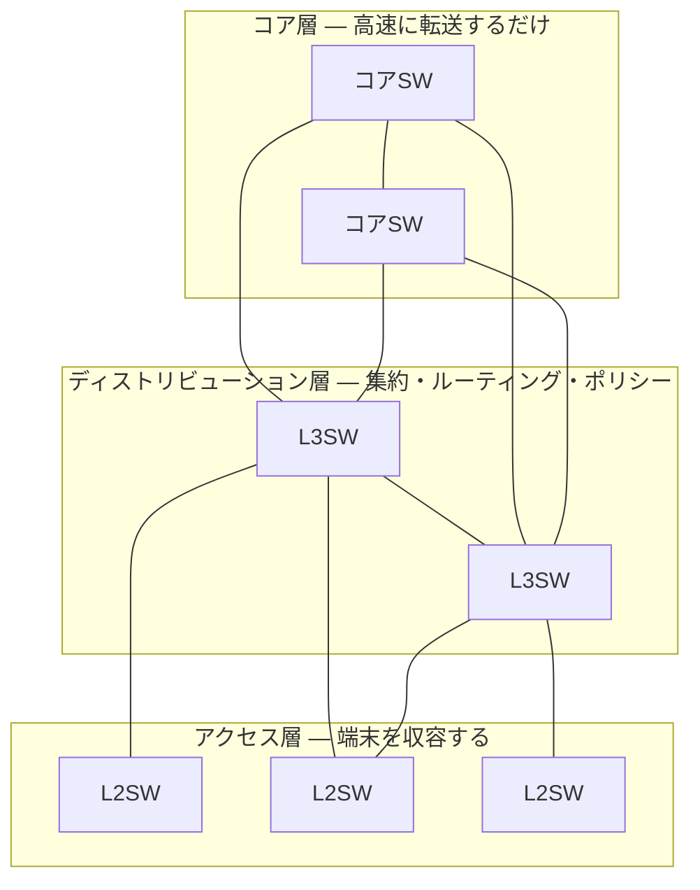

# ⑦ ネットワーク設計の基礎 — 要件定義・冗長化・アドレス設計

[← 総合インデックスに戻る](README.md) ｜ 前 → [⑥](06-security.md) ｜ 次 → [⑧ オンプレミス構成パターン](08-onpremise-patterns.md)

ここからが**応用編**です。①〜⑥で覚えた部品を、**どう組み合わせて1つのネットワークにするか**。
この章で「設計の型」を身につけたうえで、⑧〜⑩の具体的な構成パターンに進みます。

---

## 1. 設計は5つの工程で進む


| 工程 | 決めること | 成果物 |
| --- | --- | --- |
| **① 要件定義** | 台数・拠点・帯域・可用性・予算・期限 | 要件定義書 |
| **② 論理設計** | **VLAN構成・IPアドレス設計・ルーティング方針・セキュリティポリシー** | 論理構成図・アドレス設計書 |
| **③ 物理設計** | 機器の選定・設置場所・配線・ラック・電源 | 物理構成図・機器一覧・配線表 |
| **④ 構築** | 設定投入・ラッキング | 設定書（コンフィグ） |
| **⑤ 試験・移行** | 疎通試験・障害試験・切替 | 試験成績書・移行手順書 |

> 🔑 **手戻りコストは工程が進むほど跳ね上がります。** 特に **② のIPアドレス設計をやり直す羽目になると全機器の再設定**が必要です。ここに時間をかけてください。

---

## 2. 要件定義 — 最初に聞くべきこと

### ヒアリングシート

| 分類 | 質問 | なぜ聞くか |
| --- | --- | --- |
| **規模** | 現在の従業員数／**3〜5年後の想定**／拠点数 | 機器のポート数・ライセンス体系が変わる |
| | 端末数（PC・スマホ・プリンタ・カメラ・IoT） | **1人あたり2〜3台**が現実的な係数 |
| **業務** | 使う業務システムはオンプレか、クラウド（SaaS）か | 出口の帯域設計が変わる |
| | Web会議・動画配信・CADなどの重い用途は？ | 帯域とQoSの要否 |
| | 拠点間で共有するデータはあるか | WAN方式の選定に直結 |
| **可用性** | **止まったら何が困るか。何分まで許容できるか** | 冗長化の投資額を決める根拠 |
| | 業務時間は？夜間・休日のメンテ窓は取れるか | 移行計画に直結 |
| **セキュリティ** | 扱う情報の機密度・業界規制・取引先要件 | 分離要件・監査ログ要件 |
| | リモートワークの有無・人数 | VPN/ZTNAの規模 |
| **運用** | **社内に運用できる人はいるか**（人数・スキル） | ⚠️ **最重要**。運用できない構成は作ってはいけない |
| | 24時間監視は必要か。誰が対応するか | 保守契約のレベル |
| **予算** | 初期費用／年間の維持費／減価償却の考え方 | オンプレ vs クラウドの判断に直結 |
| **期限** | いつまでに。移転や契約期限に紐づくか | |

> ⚠️ **最も見落とされるのが「運用できる人がいるか」です。**
> 高機能な機器を入れても、設定変更できる人がいなければ塩漬けになります。**社内に専任がいないなら、多少割高でも運用委託込み、あるいはクラウド管理型（コントローラがSaaS）の製品を選ぶほうが、総合的には安く安全**です。

---

## 3. 非機能要件を数字にする

| 観点 | 指標の例 |
| --- | --- |
| **可用性** | 稼働率99.9%／RTO 4時間／RPO 1時間 |
| **性能** | 拠点の実効帯域300Mbps以上／社内RTT 5ms以内 |
| **拡張性** | 3年後に1.5倍の端末を収容できること |
| **運用性** | 設定変更が1営業日以内／監視で1次切り分けが可能 |
| **セキュリティ** | ログを1年保管／ゲストは社内へ到達不可 |

### 可用性の計算 — 「99.9%」が何を意味するか

| 稼働率 | **年間の停止許容時間** | 月間 | 実現に必要なこと |
| --- | --- | --- | --- |
| 99%（2ナイン） | **3日15時間** | 7時間18分 | 単一構成でも達成しうる |
| 99.9%（3ナイン） | **8時間46分** | 43分 | **主要機器の冗長化＋翌営業日保守** |
| 99.99%（4ナイン） | **52分** | 4分23秒 | 全経路冗長＋**オンサイト即日保守**＋監視体制 |
| 99.999%（5ナイン） | **5分15秒** | 26秒 | 設備・回線・拠点まで二重化。非常に高コスト |

> 🔑 **「99.99%が欲しい」と言われたら、「年間52分しか止められない」＝**夜間に機器を再起動するだけで予算を使い切る**という意味だと共有してください。
> 実際に必要なのは、多くの場合「**業務時間内に止まらない**」であって、24時間365日ではありません。**メンテナンス窓を設ける**だけで、必要な投資が大きく変わります。

### 直列と並列の可用性

```
【直列】機器が縦に並ぶと、可用性は掛け算で下がる
  ルータ(99.9%) → FW(99.9%) → SW(99.9%)
  = 0.999³ = 99.7%  ← 単体より悪くなる ⚠️

【並列（冗長化）】
  FW を2台にすると
  = 1 −(1−0.999)² = 99.9999%  ← 劇的に上がる ✅
```

**この計算が、冗長化投資を説明するときの根拠になります。**

---

## 4. SPOF（単一障害点）を潰す

**SPOF＝そこが壊れると全体が止まる箇所。** 設計レビューでは、構成図を見ながら1つずつ指を当てて「ここが壊れたら？」と問います。

| 箇所 | SPOFになる例 | 冗長化の手段 |
| --- | --- | --- |
| **回線** | ISP 1本 | **2社の回線**（同一キャリアだと同時被災しうる） |
| **ルータ/FW** | 1台 | HA構成（Active-Standby / Active-Active） |
| **コアスイッチ** | 1台 | **スタック / VSS / MLAG** ＋ 経路も二重化 |
| **配線** | 1本 | LAG（別経路を通す。同じ配管に通したら意味がない） |
| **電源** | コンセント1系統 | **電源ユニット二重化＋別系統＋UPS** |
| **サーバ** | 1台 | クラスタ・LB配下に複数台 |
| **DNS/DHCP** | 1台 | 2台構成（DHCPはスプリットスコープ） |
| **人** | **設定できるのが1人だけ** | ⚠️ **文書化・複数人体制。見落とされがちな最大のSPOF** |
| **拠点** | データセンター1箇所 | DR拠点・マルチリージョン |

### 冗長化の3パターン

| 方式 | 動作 | 特徴 |
| --- | --- | --- |
| **Active-Standby** | 待機機は普段動かず、故障時に引き継ぐ | シンプル・確実。**切替に数秒〜数十秒**。待機機のコストが遊ぶ |
| **Active-Active** | 両方が同時に処理 | 帯域を使い切れる。**設定が複雑**・障害時の挙動が読みにくい |
| **N+1** | N台必要なところにもう1台 | 大規模で効率的 |

> ⚠️ **冗長化の最大の落とし穴は「切り替わらない冗長化」です。**
> 導入時に**必ず片系を落とす試験**（フェイルオーバーテスト）を実施してください。「設定はしたが試験していない」冗長構成は、いざというとき動きません。さらに、**年1回は本番でも切替試験**をするのが理想です（設定変更の積み重ねで壊れていることがあるため）。

---

## 5. IPアドレス設計 — 後から直せない最重要項目

### 設計の原則

| 原則 | 内容 |
| --- | --- |
| **1. 将来つなぐ相手と重複させない** | 自宅VPN・M&A・クラウド・取引先。**192.168.0.0/24 や 192.168.1.0/24 は避ける** |
| **2. 余裕を持たせる** | 現在の**2〜3倍**を見込む。/24 で足りていても、拠点枠は /22 で確保しておく |
| **3. 規則性を持たせる** | 拠点番号・用途がアドレスから読み取れるようにする |
| **4. 集約できる形にする** | 連続した範囲にまとめると、**ルーティングとACLが劇的に簡潔**になる |
| **5. 用途ごとに桁を固定する** | 「x.x.x.1 はGW、.2-.9 はネットワーク機器、.10-.49 はサーバ、.100- はDHCP」 |

### 設計例：3拠点＋クラウドの中規模企業

```
全社で 10.0.0.0/8 を使用し、第2オクテットを「拠点」に割り当てる

10.  0.0.0/16   予約（将来・共通サービス）
10. 10.0.0/16   東京本社     ┐
10. 20.0.0/16   大阪支社     ├ 拠点が増えても 10.30 / 10.40 と足せる
10. 30.0.0/16   福岡支社     ┘
10.100.0.0/16   AWS 本番VPC   ┐
10.110.0.0/16   AWS 検証VPC   ├ クラウドは 100番台でまとめる
10.120.0.0/16   Azure VPC     ┘
10.200.0.0/16   VPNクライアント払い出し

拠点内は第3オクテットで「用途」を固定（全拠点で共通ルール）
10.10.  0.0/24  ネットワーク機器管理
10.10. 10.0/24  有線PC
10.10. 20.0/23  無線（社員）        ← 台数が多いので /23
10.10. 30.0/24  ゲストWi-Fi
10.10. 40.0/24  サーバ
10.10. 50.0/24  IP電話
10.10. 60.0/24  IoT・カメラ・複合機
10.10.100.0/24  DMZ
```

**この設計の効き目：**
- 「10.20.x.x は大阪」と**アドレスを見ただけで場所が分かる**
- 「**全拠点のゲストWi-Fi**」を `10.0.30.0/24` ...ではまとめられないが、拠点ごとに第3オクテットが揃っているので**ACLがテンプレート化できる**
- 拠点まるごとの経路は `10.10.0.0/16` **1行で集約**できる（ルーティングテーブルが小さく保てる）

> 🔑 **第3オクテットの用途を全拠点で統一するのが、運用を楽にする最大のコツです。** 「30番はどこの拠点でもゲスト」と決まっていれば、設定ミスも問い合わせ対応も激減します。

### 命名規則も同時に決める

```
機器名：  <拠点>-<役割><連番>
  例）tky-core01 / tky-fw01 / osk-sw03 / tky-ap-3f-01

VLAN名：  <用途>
  例）VLAN10=USER / VLAN30=GUEST / VLAN99=MGMT
```

**構成図・監視画面・ログのすべてで同じ名前が出る**ようにしておくと、障害対応の速度がまったく変わります。

---

## 6. 帯域設計

### 必要帯域の見積もり

| 用途 | 1ユーザーあたりの目安 |
| --- | --- |
| Webブラウジング・メール | 0.5〜1 Mbps |
| **Web会議（映像あり）** | **2〜4 Mbps**（HD時） |
| クラウドストレージ同期 | 数Mbps（バースト） |
| 動画視聴（HD / 4K） | 5 / 25 Mbps |
| VDI・リモートデスクトップ | 1〜5 Mbps |

```
【計算例】従業員100人のオフィス

  基本利用          100人 × 1Mbps        = 100 Mbps
  Web会議 同時30%    30人 × 3Mbps        =  90 Mbps
  クラウド同期・その他                     =  50 Mbps
  ────────────────────────────────────────────────
  ピーク見込み                            ≒ 240 Mbps
  余裕率 1.5倍                            ≒ 360 Mbps

  → 1Gbpsのベストエフォート回線で足りるが、
    ⚠️ ベストエフォートは実効値が大きく下がる時間帯がある
    → 業務影響が大きいなら「帯域確保型」または2回線構成を検討
```

### オーバーサブスクリプション（収容率）

全端末が同時に最大速度を使うことはないので、**上位リンクは合計値より細くて構いません**。

| 区間 | 一般的な収容率 |
| --- | --- |
| アクセス層 → ディストリビューション層 | **20:1 〜 4:1** |
| ディストリビューション層 → コア層 | **4:1 〜 1:1** |
| サーバ収容（DC） | **3:1 〜 1:1**（できるだけノンブロッキング） |

```
例）48ポート×1Gbps のアクセススイッチ
   合計 48Gbps ぶんの端末を収容

   上位リンク 10Gbps × 1本 → 収容率 4.8 : 1  （一般オフィスなら妥当）
   上位リンク 1Gbps × 1本  → 収容率 48 : 1   （❌ 確実に詰まる）
```

### QoS — 優先順位をつける

帯域が足りないとき、**何を優先するか**を決めるのがQoSです。

| 優先度 | トラフィック | 理由 |
| --- | --- | --- |
| 最優先 | **音声（VoIP）** | 遅延・ジッタに極端に弱い |
| 高 | ビデオ会議 | 同上 |
| 中 | 業務システム・トランザクション | |
| 低 | ファイル転送・バックアップ・OS更新 | 多少遅くても業務は止まらない |

> 🔑 **QoSは帯域を増やしません。「足りないときに何を犠牲にするか」を決めるだけ**です。恒常的に足りないなら、まず増速を検討してください。
> なお **バックアップやWindows Updateを業務時間外にずらす**だけで解決することも多いので、QoS設定より先にスケジュール調整を試す価値があります。

---

## 7. 階層型ネットワーク設計（3層モデル）

中規模以上のLANは、役割で層を分けるのが定石です。



| 層 | 役割 | 置くもの |
| --- | --- | --- |
| **アクセス層** | 端末・APを収容 | PoE付きL2SW。**BPDUガード・ポートセキュリティ** |
| **ディストリビューション層** | VLAN間ルーティング・ACL適用・集約 | L3SW（冗長構成）。**ここでポリシーを効かせる** |
| **コア層** | ひたすら高速転送 | 高速L3SW。**ACLなど重い処理はさせない** |

> 💡 **小〜中規模では「コア層とディストリビューション層を統合した2層（コラプストコア）」で十分**です。3層が必要になるのは、フロア数・棟数が多い大規模からです。無理に3層にすると、機器代と複雑さだけが増えます。

---

## 8. 構成図の描き方

設計の成果物として、**最低2枚**は必要です。

| 図 | 描くもの | 使う人 |
| --- | --- | --- |
| **論理構成図** | VLAN・IPセグメント・ルーティング・通信の流れ | 設計者・運用者 |
| **物理構成図** | 機器・設置場所・ポート番号・ケーブル種別 | 工事業者・障害対応者 |

**あると助かるもの**：ラック搭載図、配線表（どのポートがどこへ）、機器一覧（型番・シリアル・保守期限・IP・管理者）、ライセンス/保守の期限一覧。

> 🔑 **構成図は「作って終わり」で確実に陳腐化します。**
> **変更作業の完了条件に「構成図の更新」を含める**ルールにしてください。古い構成図は、無いよりも危険です（誤った前提で作業して事故を起こす）。

---

## 9. 設計レビューのチェックリスト

構成が固まったら、以下を順に確認します。

- [ ] **SPOFはないか**（回線・機器・電源・配線・拠点・**人**）
- [ ] 各機器が壊れたとき、**何分で復旧するか**が言えるか
- [ ] **フェイルオーバー試験の計画**があるか
- [ ] IPアドレスは**将来つなぐ相手と重複しないか**（自宅・クラウド・取引先）
- [ ] アドレスに**2〜3倍の余裕**があるか
- [ ] **ゲストWi-Fi・IoT・管理系が分離**されているか（→ [⑥](06-security.md)）
- [ ] FWは**デフォルト拒否**か。Any-Anyルールがないか
- [ ] 上位リンクの**収容率**は妥当か
- [ ] **DHCPプール**は端末数に対して足りるか
- [ ] **NTPが全機器に設定**されているか
- [ ] **ログの集約先と保管期間**が決まっているか
- [ ] 監視項目が決まっているか（何を、どの閾値で、誰に通知）
- [ ] **保守契約のレベル**（先出しセンドバック/オンサイト、時間帯）が要件と合っているか
- [ ] 機器の**EOL/EOSL（保守終了）時期**を確認したか
- [ ] **設定のバックアップ**が自動取得されるか
- [ ] **移行手順とロールバック手順**があるか
- [ ] 構成図・アドレス設計書・パスワード管理の**保管場所**が決まっているか

---

## 10. この章のまとめ

| 覚えること | 一言で |
| --- | --- |
| 工程 | **論理設計（特にIPアドレス）に時間をかける**。手戻りが最も高くつく |
| 要件定義 | **「運用できる人がいるか」を必ず聞く**。運用できない構成は作らない |
| 可用性 | 99.9%＝年間8時間46分。**直列は掛け算で悪化、並列で劇的に改善** |
| SPOF | 回線・機器・電源・配線・**人**。**冗長化は試験してこそ意味がある** |
| **IPアドレス設計** | **将来つなぐ相手と重複させない**・2〜3倍の余裕・**用途の桁を全拠点で統一** |
| 帯域 | ピーク見積り×1.5。**収容率**を確認。QoSは帯域を増やさない |
| 階層設計 | 小〜中規模は**2層（コラプストコア）で十分** |
| 構成図 | **更新を作業完了条件に入れる**。古い図は無いより危険 |

---

[← 総合インデックスに戻る](README.md) ｜ 前 → [⑥](06-security.md) ｜ 次 → [⑧ オンプレミス構成パターン（小・中・大規模）](08-onpremise-patterns.md)
