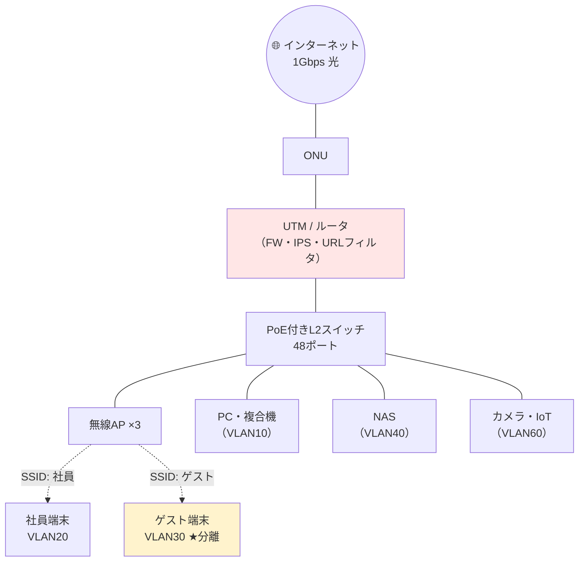
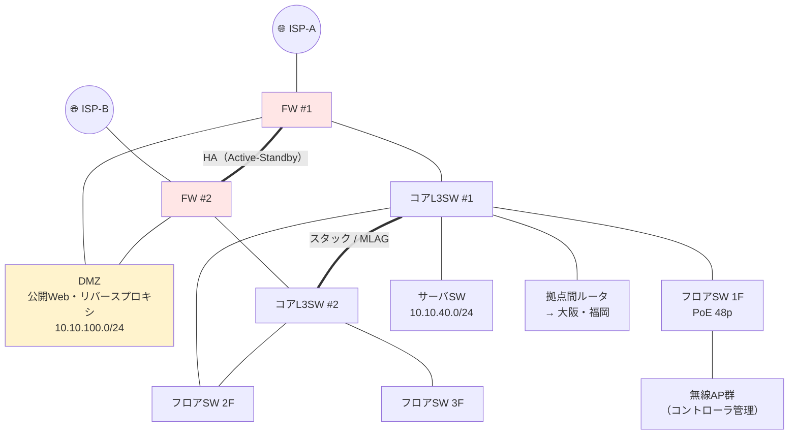
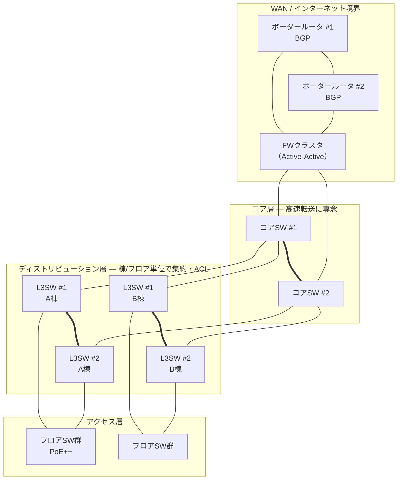
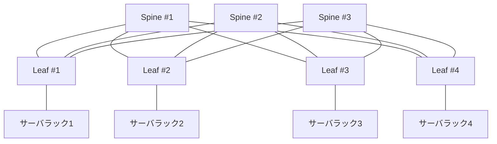

# ⑧ オンプレミス構成パターン — 小規模・中規模・大規模

[← 総合インデックスに戻る](README.md) ｜ 前 → [⑦](07-design-basics.md) ｜ 次 → [⑨ クラウド構成パターン](09-cloud-patterns.md)

自社で機器を買って設置する **オンプレミス構成** を、3つの規模で具体的に示します。
各パターンについて **構成図・機器リスト・概算コスト・必要な運用体制・落とし穴** まで踏み込みます。

> 💡 **金額は2026年8月時点の目安**（税別・国内一般価格）です。ベンダー・商流・値引きで大きく変動します。稟議には必ず見積を取ってください。

---

## 0. 3パターンの全体像

| | **小規模** | **中規模** | **大規模** |
| --- | --- | --- | --- |
| 従業員 | 〜50人 | 50〜500人 | 500人〜 |
| 端末数 | 〜150台 | 150〜1,500台 | 1,500台〜 |
| 拠点 | 1拠点 | 2〜10拠点 | 10拠点〜／DC保有 |
| 構成 | **1層（フラット）** | **2層（コラプストコア）** | **3層 or Spine-Leaf** |
| 冗長化 | ほぼなし（機器予備で対応） | **主要機器を冗長化** | **全経路・全機器を冗長化** |
| ルーティング | 静的 | 静的 or OSPF | **OSPF / BGP / EVPN** |
| 初期費用の目安 | **50〜200万円** | **500〜3,000万円** | **5,000万円〜** |
| 運用体制 | 兼任1名＋ベンダー | **専任1〜3名** | **専任チーム＋24時間監視** |

---

## 1. 小規模パターン（〜50人・1拠点）

### 設計方針

**「シンプルに保つ」ことが最大の設計目標です。** 専任の担当者がいない前提で、壊れたときに誰でも交換できる構成にします。

### 構成図



### VLAN・アドレス設計

| VLAN | 用途 | セグメント | DHCP |
| --- | --- | --- | --- |
| 10 | 有線PC・複合機 | 10.1.10.0/24 | .100 - .200 |
| 20 | 無線（社員） | 10.1.20.0/24 | .100 - .200 |
| **30** | **ゲストWi-Fi** | 10.1.30.0/24 | .100 - .200 |
| 40 | サーバ・NAS | 10.1.40.0/24 | 固定 |
| 60 | カメラ・IoT | 10.1.60.0/24 | 固定 |
| 99 | 機器管理 | 10.1.99.0/24 | 固定 |

**ACLはこれだけ守れば十分：**
- VLAN30（ゲスト）→ **他VLANすべて拒否**、インターネットのみ許可
- VLAN60（IoT）→ 他VLANすべて拒否、必要な宛先のみ許可
- VLAN99（管理）→ 管理者端末からのみ到達可

### 機器リストと概算コスト

| 機器 | 台数 | 単価目安 | 小計 |
| --- | --- | --- | --- |
| UTM（FW・IPS・URLフィルタ一体型） | 1 | 25〜60万円 | 40万円 |
| UTMの年間ライセンス（セキュリティ機能） | — | 10〜25万円/年 | 15万円/年 |
| PoE+ L2スイッチ 48ポート | 1 | 15〜30万円 | 20万円 |
| 無線AP（Wi-Fi 6） | 3 | 3〜8万円 | 15万円 |
| NAS（バックアップ用含む） | 1 | 15〜40万円 | 25万円 |
| UPS | 1 | 5〜15万円 | 8万円 |
| 配線・設置工事 | — | — | 30〜60万円 |
| **初期費用 合計** | | | **約 140〜190万円** |
| **年間維持費** | | | **回線 6〜15万円 ＋ ライセンス 15万円 ＋ 保守 10万円** |

### この規模で「やらない」こと

| やらない | 理由 |
| --- | --- |
| 機器の冗長化 | 費用対効果が合わない。**予備機を1台持つ（コールドスタンバイ）**ほうが安く現実的 |
| 動的ルーティング | 経路が単純なので静的で十分 |
| 複雑なQoS | 回線に余裕を持たせるほうが早い |
| L3スイッチ | UTM/ルータでVLAN間ルーティングすれば足りる（台数が少ないため性能も問題ない） |

### 落とし穴

| 落とし穴 | 対策 |
| --- | --- |
| **UTMが単一障害点** | **予備機を確保**＋設定バックアップを自動取得。停止時に「ルータだけ直結してとりあえず通す」手順を用意 |
| **UTMがボトルネック** | 「1Gbps対応」の表記は素通し時の値。**IPS・SSL検査を有効にすると1/3〜1/5に落ちる**。実効スループットのカタログ値を確認する |
| ゲストWi-Fiを分けていない | 来客端末から社内NASが見える状態。**必ず分離** |
| **バックアップがNASだけ** | ランサムウェアでNASごと暗号化される。**オフラインまたはクラウドへの二重化**が必須 |
| 誰も管理していない | ⚠️ **管理者アカウント・設定・保守期限を1枚の表に**。担当者退職時の引き継ぎ資料にする |
| PoEバジェット超過 | AP追加時に給電が足りなくなる（→ [②](02-physical-datalink.md)） |

> 🔑 **この規模の投資優先順位**：①バックアップ（オフライン） → ②UTMのライセンス更新 → ③ゲスト/IoT分離 → ④予備機。**冗長化より先にバックアップ**です。

---

## 2. 中規模パターン（50〜500人・複数拠点）

### 設計方針

**「主要な経路を冗長化し、拠点をまとめて管理できるようにする」** 段階です。専任担当者が置かれ、構成の複雑さが一段上がります。

### 構成図（本社）



### 拠点間の接続

```
              ┌──────────────┐
   東京本社 ──┤              ├── 大阪支社
   10.10.0.0/16│  閉域網 or  │  10.20.0.0/16
              │  インターネットVPN │
   福岡支社 ──┤              │
   10.30.0.0/16└──────────────┘
```

| 方式 | 月額目安（1拠点） | 特徴 |
| --- | --- | --- |
| **インターネットVPN（IPsec）** | 5,000〜3万円 | 安い。**帯域・遅延は保証されない** |
| **広域イーサネット / IP-VPN** | 5〜30万円 | **帯域保証・低遅延**。SLAあり |
| **SD-WAN** | 2〜10万円＋機器 | 複数回線を束ね、**アプリごとに経路を選択**。拠点が多いほど効く |

> 💡 **中規模の定番は「メイン＝インターネットVPN、業務が止まると困る拠点だけ閉域網」**というハイブリッドです。全拠点を閉域網にすると費用が跳ね上がります。

### VLAN・アドレス設計（[⑦](07-design-basics.md)の設計例を適用）

```
10.10.0.0/16  東京本社   10.20.0.0/16  大阪   10.30.0.0/16  福岡
  ↓ 第3オクテットの用途は全拠点で統一する
  .0   管理  / .10  有線PC / .20-21 無線 / .30 ゲスト
  .40  サーバ / .50 IP電話 / .60 IoT   / .100 DMZ
```

### 機器リストと概算コスト（本社＋2拠点）

| 機器 | 台数 | 単価目安 | 小計 |
| --- | --- | --- | --- |
| 次世代FW（HA構成） | 2 | 150〜400万円 | 500万円 |
| FW年間ライセンス | — | 60〜150万円/年 | 100万円/年 |
| コアL3スイッチ（冗長） | 2 | 80〜250万円 | 300万円 |
| フロアPoEスイッチ 48p | 8 | 30〜60万円 | 320万円 |
| 無線AP（Wi-Fi 6E）＋コントローラ | 25 | 6〜12万円 | 220万円 |
| 支社ルータ／UTM | 2 | 40万円 | 80万円 |
| 支社スイッチ・AP | — | — | 150万円 |
| 監視・ログ基盤（Syslog/SNMP・SIEM簡易版） | 1式 | — | 150万円 |
| UPS・ラック・配線工事 | 1式 | — | 250万円 |
| 設計・構築費（SIer） | 1式 | — | 300〜600万円 |
| **初期費用 合計** | | | **約 2,300〜2,800万円** |
| **年間維持費** | | | **回線 150〜400万円 ＋ ライセンス 150万円 ＋ 保守 150万円** |

### この規模で必ず入れるもの

| 項目 | 理由 |
| --- | --- |
| **FW・コアSWの冗長化** | ここが止まると全社停止。可用性は掛け算で悪化する（→ [⑦](07-design-basics.md)） |
| **802.1X 認証（有線・無線）** | 人数が増えるとPSK運用が破綻する（→ [②](02-physical-datalink.md)） |
| **ログ集約（Syslog）** | 障害調査・インシデント対応に必須。**個別機器のログは消える** |
| **無線コントローラ** | AP 20台超を個別設定するのは非現実的。**クラウド管理型も有力** |
| **構成管理・設定バックアップの自動化** | 手作業では追いつかない |
| **DMZ分離** | 公開サーバの侵害が社内へ波及しないように |
| 監視（死活・トラフィック・閾値アラート） | 「ユーザーからの申告で気づく」状態を脱する |

### 落とし穴

| 落とし穴 | 対策 |
| --- | --- |
| **冗長化したが切替試験をしていない** | ⚠️ **導入時に必ず片系停止試験**。年1回は本番でも実施 |
| **FWのライセンス切れ** | 更新忘れで**IPS/URLフィルタが停止**しても通信は流れるため気づきにくい。期限を監視項目に入れる |
| 拠点のアドレスが重複 | 後付けのVPN接続で発覚しがち。**最初から全社のアドレス台帳を作る** |
| VLANは切ったがACLが Any-Any | セグメント分割の意味がなくなる |
| **拠点間VPNの帯域不足** | ファイルサーバを本社に集約すると支社が遅い。**QoS＋帯域見直し、または拠点にキャッシュ/複製** |
| 無線が遅い | AP台数不足・電波出力過大・有線側1Gがボトルネック |
| **属人化** | 設定できるのが1人だけ。**手順書と構成図を整備し、2人以上が触れる状態に** |

> 🔑 **中規模で最も効く投資は「監視とログ集約」です。** 機器を良いものにするより、**壊れたことに即座に気づき、原因を追える状態**のほうが、実際の停止時間を短くします。

---

## 3. 大規模パターン（500人〜・データセンター保有）

### 設計方針

**「全経路を冗長化し、拡張を設定変更だけで行えるようにする」** 段階です。手作業の限界を超えるため、**自動化（IaC）が前提**になります。

### 3-1. キャンパスネットワーク（オフィス側）— 3層構成



**ポイント**：
- ディストリビューション層で **OSPF** を動かし、経路を自動収束
- コア層には**ACLなど重い処理をさせない**（転送に専念）
- アクセス層〜ディストリビューション層は **L3化（ルーテッドアクセス）** も選択肢。STPに依存せず、収束が速い

### 3-2. データセンター側 — Spine-Leaf（リーフ・スパイン）

従来の3層は、**サーバ間（East-West）通信**が増えると詰まります。仮想化・コンテナ・分散DBの時代には Spine-Leaf が標準です。



| 特徴 | 内容 |
| --- | --- |
| **すべてのLeafがすべてのSpineに接続** | どのサーバ間も**必ず2ホップ**。遅延が均一で予測可能 |
| **全リンクを同時利用（ECMP）** | STPのように遊ぶリンクがない |
| **拡張が容易** | 帯域が足りない → Spineを足す。収容が足りない → Leafを足す |
| **VXLAN / EVPN** | L2セグメントをL3網の上に構築。**ラックをまたいだVLAN延伸・マルチテナント**が可能 |
| ルーティング | **BGP（EVPN）** が事実上の標準 |

> 🔑 **なぜVXLANが必要か**：仮想マシンをラック間で移動（ライブマイグレーション）しても同じセグメントに居続けたい。しかし物理的にVLANを全ラックへ延伸するとSTPの巨大な障害ドメインになる。**そこでL3の上にL2をトンネルで作る**——これがVXLAN/EVPNの動機です。

### 3-3. 大規模で追加される要素

| 要素 | 内容 |
| --- | --- |
| **DR（災害対策）拠点** | 遠隔地のDCへ複製。RTO/RPOを定義して設計 |
| **SD-WAN** | 多拠点の回線をポリシーで一元管理。拠点追加が容易に |
| **SASE / ZTNA** | リモートワーカーと拠点のセキュリティを集約（→ [⑥](06-security.md)） |
| **IaC（Ansible / Terraform）** | 設定を**コードで管理**。手作業では数百台を扱えない |
| **NetFlow / sFlow** | どの通信が帯域を食っているかの可視化 |
| **SOC / 24時間監視** | 自社またはMSSPへ委託 |
| **PAM（特権アクセス管理）** | 誰がいつどの機器にログインしたかの記録 |

### 機器リストと概算コスト（本社1,000人＋DC＋20拠点）

| 項目 | 概算 |
| --- | --- |
| ボーダールータ・FWクラスタ | 1,500〜4,000万円 |
| コア／ディストリビューションSW | 2,000〜5,000万円 |
| アクセスSW（100台規模） | 3,000〜5,000万円 |
| 無線AP（200台）＋コントローラ | 2,000〜3,000万円 |
| DC Spine-Leaf 一式 | 3,000〜1億円 |
| 監視・ログ・SIEM基盤 | 1,000〜3,000万円 |
| 設計・構築費 | 2,000〜5,000万円 |
| **初期費用 合計** | **1.5億〜3億円** |
| **年間維持費** | 回線・保守・ライセンス・SOC委託で **3,000万〜1億円** |

### 落とし穴

| 落とし穴 | 対策 |
| --- | --- |
| **複雑すぎて誰も全体を理解していない** | ドキュメント整備・**設計判断の記録（ADR）**・定期的な構成レビュー |
| **手作業での設定変更** | 数百台では必ずミスが出る。**IaC＋設定の自動検証**へ |
| **変更が怖くて塩漬け** | 機器のEOL到来で一斉更改となり、巨大プロジェクト化する。**計画的なライフサイクル管理**（5〜7年） |
| 障害の影響範囲が読めない | **障害ドメインを明示的に設計**（この機器が落ちると何が止まるか） |
| 監視アラートが多すぎて無視される | 閾値の見直し・**アラートの集約と重要度分け** |
| **ベンダーロックイン** | 独自プロトコル依存を避け、**標準規格（BGP/EVPN/802.1X）**中心に設計 |

---

## 4. オンプレミス全般のメリット・デメリット

| | 内容 |
| --- | --- |
| ✅ **性能・遅延** | 社内通信は**最速**。大容量データを扱う用途（CAD・映像編集・製造ライン）に有利 |
| ✅ **データの所在** | 物理的に手元にある。規制・契約要件を満たしやすい |
| ✅ **コスト予測** | 買い切りなので**変動しない**。長期利用ではクラウドより安くなることがある |
| ✅ **カスタマイズ** | 特殊要件（OT・特定プロトコル・低レイテンシ）に対応できる |
| ❌ **初期投資** | 大きい。**5年程度で減価償却＋更改**が前提 |
| ❌ **拡張の遅さ** | 機器の調達に**数週間〜数ヶ月**（半導体供給次第ではさらに） |
| ❌ **運用負荷** | パッチ・障害対応・保守契約・EOL管理がすべて自社責任 |
| ❌ **災害対策** | DR拠点を持つコストが非常に高い |
| ❌ **スキルの確保** | 採用も育成も難しい。**属人化しやすい** |

> 🔑 **「オンプレはもう古い」は誤りです。** 遅延要件が厳しい用途、規制要件、大容量データの常時処理では、いまもオンプレが最適解です。ただし **「なんとなく従来通り」で選ぶのは危険**——[⑪](11-scale-comparison.md) の判断フローで検証してください。

---

## 5. この章のまとめ

| 規模 | 構成 | 押さえる要点 |
| --- | --- | --- |
| **小規模** | UTM 1台＋PoE SW＋AP。**1層フラット** | **シンプルに保つ**。冗長化より**バックアップとゲスト分離**を優先。予備機を1台 |
| **中規模** | **2層（コラプストコア）**。FW・コアSW冗長。拠点間VPN | **監視とログ集約**が最も効く投資。802.1X。**切替試験を必ず実施** |
| **大規模** | **3層＋Spine-Leaf**。BGP/EVPN/VXLAN。SD-WAN・SASE | **IaCによる自動化が前提**。EOLを見据えたライフサイクル管理 |

---

[← 総合インデックスに戻る](README.md) ｜ 前 → [⑦](07-design-basics.md) ｜ 次 → [⑨ クラウド構成パターン（小・中・大規模）](09-cloud-patterns.md)
