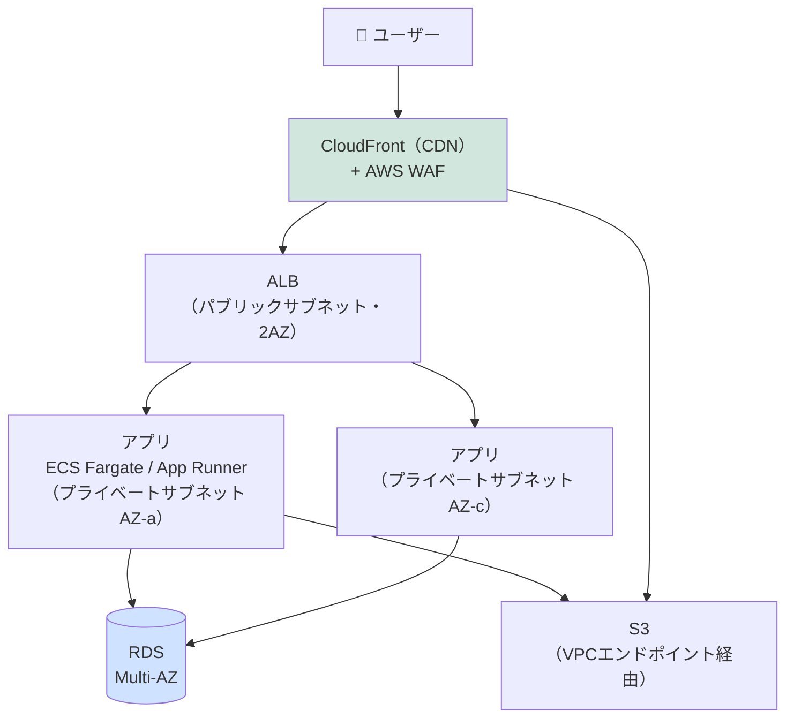
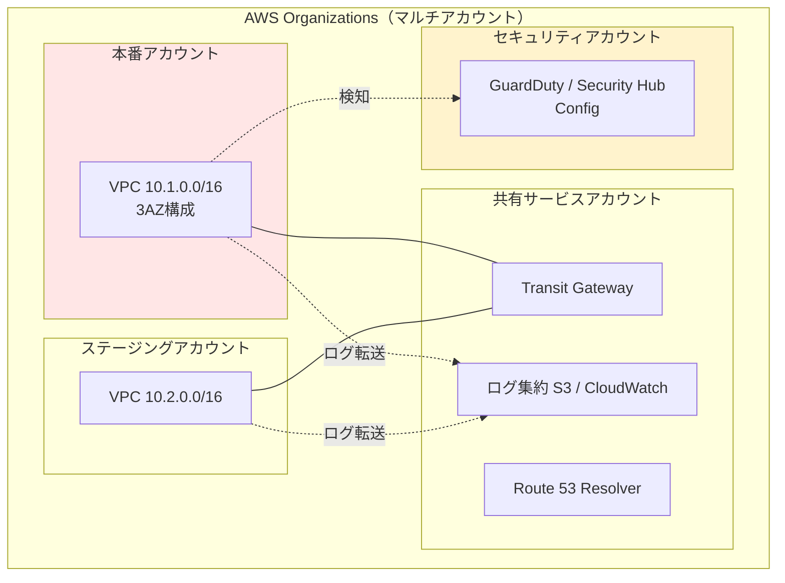
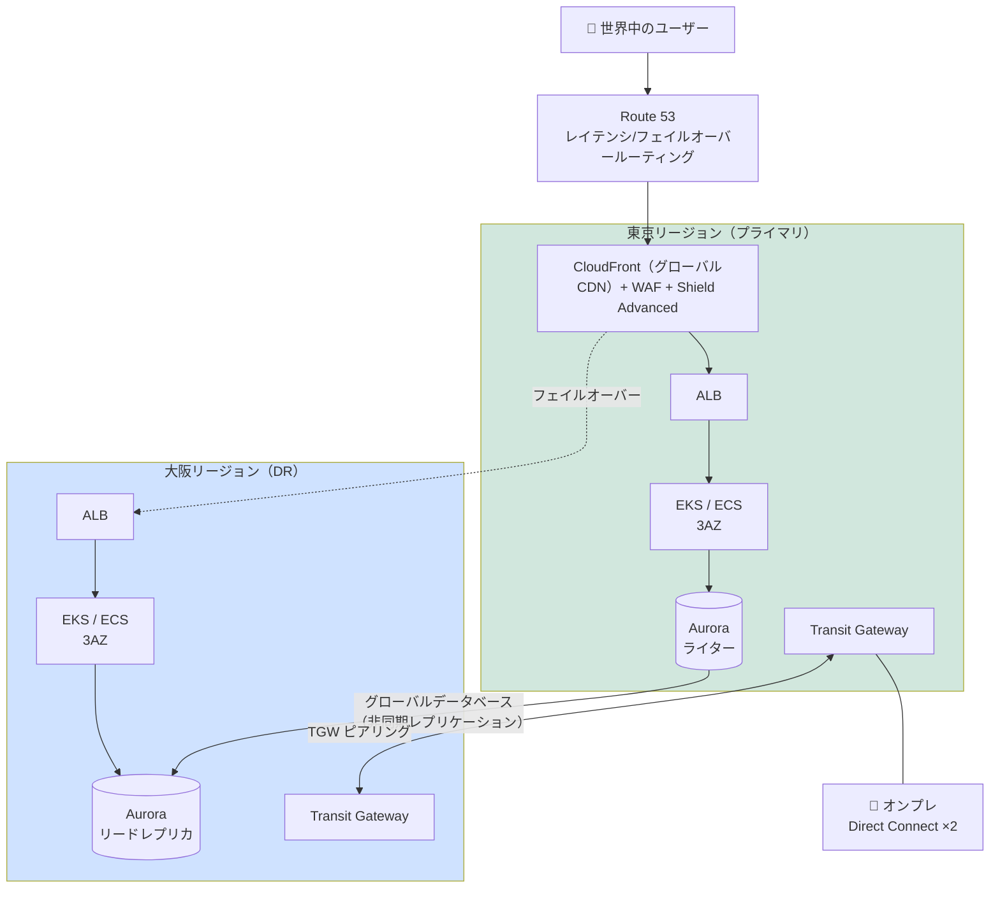

# ⑨ クラウド構成パターン — 小規模・中規模・大規模

[← 総合インデックスに戻る](README.md) ｜ 前 → [⑧](08-onpremise-patterns.md) ｜ 次 → [⑩ ハイブリッド構成パターン](10-hybrid-patterns.md)

クラウドのネットワークは、**⑧までに学んだ概念がそのままソフトウェアになったもの**です。
VPCはVLAN、セキュリティグループはFW、ルートテーブルはルーティングテーブル——名前が変わっただけで、考え方は同じです。

> 💡 本章はAWSの用語を主軸に説明し、**Azure / GCPの対応表**を都度示します。料金は2026年8月時点・東京リージョンの目安です。

---

## 0. クラウドネットワークの基本部品

### オンプレとの対応表

| オンプレの概念 | AWS | Azure | GCP |
| --- | --- | --- | --- |
| 自社のネットワーク全体 | **VPC** | **VNet** | **VPC ネットワーク** |
| VLAN / サブネット | **サブネット** | サブネット | サブネット |
| ルーティングテーブル | **ルートテーブル** | ルートテーブル | ルート |
| インターネット接続口 | **Internet Gateway** | （既定） | インターネットゲートウェイ |
| NAT（内→外のみ） | **NAT Gateway** | NAT Gateway | Cloud NAT |
| ファイアウォール（機器単位） | **セキュリティグループ** | NSG | ファイアウォールルール |
| ファイアウォール（サブネット単位） | **ネットワークACL** | NSG（サブネット適用） | — |
| L4ロードバランサ | **NLB** | Load Balancer | Network LB |
| L7ロードバランサ | **ALB** | Application Gateway | HTTP(S) LB |
| DNS | **Route 53** | Azure DNS | Cloud DNS |
| CDN | **CloudFront** | Front Door / CDN | Cloud CDN |
| WAF | **AWS WAF** | Azure WAF | Cloud Armor |
| 拠点接続（VPN） | **Site-to-Site VPN** | VPN Gateway | Cloud VPN |
| 拠点接続（専用線） | **Direct Connect** | **ExpressRoute** | **Cloud Interconnect** |
| VPC間・拠点間のハブ | **Transit Gateway** | **Virtual WAN** | Network Connectivity Center |
| サービスへの閉域接続 | **VPCエンドポイント / PrivateLink** | Private Endpoint | Private Service Connect |

> 🔑 **「VPC ＝ 自社専用の仮想データセンター」** と理解してください。⑦で学んだIPアドレス設計が、そのままVPCのCIDR設計になります。

### 押さえるべき3つの概念

**① パブリックサブネット と プライベートサブネット**

```
違いは「ルートテーブルの中身」だけです。物理的な違いはありません。

パブリックサブネット ： 0.0.0.0/0 → Internet Gateway   ← 外から直接届く
プライベートサブネット： 0.0.0.0/0 → NAT Gateway       ← 内から外へは出られるが
                                                        外から直接は届かない
```

**② セキュリティグループ（SG）と ネットワークACL（NACL）**

| | **セキュリティグループ** | **ネットワークACL** |
| --- | --- | --- |
| 適用単位 | **インスタンス・ENI単位** | サブネット単位 |
| 状態 | **ステートフル**（戻りは自動許可） | **ステートレス**（戻りも明示的に許可が必要） |
| ルール | **許可のみ** | 許可と拒否の両方 |
| 実務 | **主にこちらを使う** | 補助的に。特定IPの遮断など |

> 🔑 **SGの強力な機能：SGの参照。** 「ALBのSGからの3000番だけ許可」とIPではなくSGで指定できます。**サーバが増減してもルール変更が不要**になり、⑥のマイクロセグメンテーションが自然に実現します。

**③ アベイラビリティゾーン（AZ）**

**AZ ＝ 物理的に分離されたデータセンター群。** 「マルチAZにする」＝「別々の建物にサーバを置く」ということです。片方のAZが災害・障害で落ちても、もう片方で動き続けます。

> ⚠️ **AZをまたぐ通信には転送料金がかかります**（AWSで往復 約0.02USD/GB）。可用性と料金のトレードオフです。

---

## 1. 小規模パターン（スタートアップ・小規模Webサービス）

### 設計方針

**「サーバを管理しない」** が最大の方針です。可用性はマネージドサービスに任せ、人的リソースをアプリ開発に集中させます。

### パターンA：マネージドサービス中心（推奨）



### VPC・サブネット設計

```
VPC: 10.0.0.0/16   ← /16 で取っておく。将来の拡張が楽

  パブリックサブネット（ALB・NAT GW用）
    10.0.0.0/24    AZ-a
    10.0.1.0/24    AZ-c

  プライベートサブネット（アプリ）
    10.0.10.0/24   AZ-a
    10.0.11.0/24   AZ-c

  プライベートサブネット（DB）
    10.0.20.0/24   AZ-a
    10.0.21.0/24   AZ-c
```

> 🔑 **VPCのCIDRは後から縮小できません。** また、**将来オンプレやほかのVPCと接続する可能性を考え、重複しない範囲を選ぶ**こと（→ [⑦](07-design-basics.md)）。「とりあえず 10.0.0.0/16」は、複数プロジェクトで衝突する定番の失敗です。

### セキュリティグループ設計

| SG | インバウンド許可 | 意味 |
| --- | --- | --- |
| `sg-alb` | 0.0.0.0/0 : 443 | インターネットから |
| `sg-app` | **`sg-alb` から : 3000** | **ALBからのみ**。IPではなくSGで指定 |
| `sg-db` | **`sg-app` から : 5432** | **アプリからのみ** |

> ⚠️ **`sg-db` に `0.0.0.0/0 : 5432` を書かない。** 「開発中だから一時的に」が本番に残る事故が多発しています。

### 月額コストの目安

| 項目 | 月額 |
| --- | --- |
| ALB | 約 3,000円〜（+ LCU課金） |
| ECS Fargate（0.5vCPU/1GB × 2） | 約 6,000円 |
| RDS（db.t4g.small・Multi-AZ） | 約 15,000円 |
| **NAT Gateway** | **約 7,000円 + 処理データ量** ← 後述の罠 |
| S3・CloudFront | 数百〜数千円 |
| **合計** | **約 3〜5万円/月** |

### 小規模で「やらない」こと

| やらない | 代わりに |
| --- | --- |
| EC2でサーバを立てて管理する | **Fargate / App Runner / Lambda** でOS管理から解放される |
| 自前でDBを構築 | **RDS / Aurora Serverless** |
| Transit Gateway・複数VPC | **1VPCで十分**。複雑さは負債 |
| 複数アカウント分割 | 1アカウント（ただし**ルートユーザーのMFAは必須**） |

### 落とし穴

| 落とし穴 | 対策 |
| --- | --- |
| **NAT Gateway の料金** | 固定 約7,000円/月 ＋ **処理データ 0.062USD/GB**。S3・ECR・CloudWatchへの通信が全部ここを通ると高額に。**→ VPCエンドポイントで回避**（S3/DynamoDBのGateway型は**無料**） |
| **データ転送料（エグレス）** | クラウド→インターネットは 約0.114USD/GB。**画像や動画配信はCloudFront経由**にすると単価が下がる |
| 単一AZに寄せてしまう | AZ障害で全停止。**RDSはMulti-AZ、アプリは2AZ**に配置 |
| SGを緩く開ける | `0.0.0.0/0` での 22/3389/DBポート開放は**即座に攻撃される** |
| **パブリックサブネットにDBを置く** | 誤った公開の温床。**DBは必ずプライベートサブネット** |
| コストの想定外増加 | **Budgets でアラート**を設定。Cost Explorer を毎月見る |

> 🔑 **小規模クラウドで最も多い無駄は NAT Gateway 料金です。** S3とDynamoDBはGateway型VPCエンドポイントが**無料**なので、必ず作ってください。ECR・CloudWatch・SSM等はInterface型（有料だがNAT経由より安いことが多い）で検討します。

---

## 2. 中規模パターン（複数環境・複数チーム）

### 設計方針

**「環境を分離し、権限とネットワークの境界を明確にする」** 段階です。チームが増え、本番事故の防止と監査が課題になります。

### 構成図



### 本番VPCの内部構成

```
VPC: 10.1.0.0/16   3AZ構成

  パブリック         10.1.0.0/24   .1.0/24   .2.0/24    ALB・NAT GW
  アプリ（Private）  10.1.10.0/24  .11.0/24  .12.0/24   ECS/EKS
  DB（Private）     10.1.20.0/24  .21.0/24  .22.0/24   RDS/ElastiCache
  内部通信（Private）10.1.30.0/24  .31.0/24  .32.0/24   VPCエンドポイント
  TGW接続用          10.1.40.0/28  .41.0/28  .42.0/28   ★/28で十分
```

> 💡 **Transit Gateway アタッチメント用のサブネットは /28 で十分**です。ここに /24 を使うのは無駄になります。

### 中規模で追加する要素

| 要素 | 目的 |
| --- | --- |
| **マルチアカウント（AWS Organizations）** | **本番/検証/開発を別アカウントに**。誤操作の影響範囲を物理的に分離。請求も分かれる |
| **Transit Gateway** | VPCが3つを超えたらVPCピアリングは破綻する（**n×(n-1)/2 本**必要）。**ハブ&スポークへ** |
| **VPCエンドポイント（PrivateLink）** | AWSサービスへの通信をインターネットに出さない。**NAT料金の削減にも効く** |
| **WAF＋CloudFront** | L7攻撃対策・DDoS吸収（→ [⑥](06-security.md)） |
| **Route 53 Resolver** | オンプレとのDNS統合の準備（→ [⑩](10-hybrid-patterns.md)） |
| **VPCフローログ** | 通信の記録。**インシデント調査に必須** |
| **IaC（Terraform / CDK）** | 手作業のコンソール操作を廃止。レビュー可能に |
| **GuardDuty / Security Hub** | 脅威検知・設定不備の継続的チェック |

### VPCピアリング vs Transit Gateway

```
【VPCピアリング】1対1の直接接続
  VPC 3つ → 3本   VPC 5つ → 10本   VPC 10個 → 45本 😱
  ・推移的ルーティング不可（A-B と B-C があっても A-C は通らない）
  ・データ転送料のみ、時間課金なし（安い）

【Transit Gateway】ハブ&スポーク
  VPC 10個 → アタッチメント10本のみ ✅
  ・推移的ルーティング可
  ・ルートテーブルで細かく制御できる
  ・アタッチメント 約0.07USD/時 ＋ 処理データ 0.02USD/GB
```

> 🔑 **VPCが2〜3個までならピアリング、4個以上またはオンプレ接続があるなら Transit Gateway** が判断の目安です。

### 月額コストの目安

| 項目 | 月額 |
| --- | --- |
| 本番環境（ECS/EKS・RDS Multi-AZ・ALB・3AZ） | 20〜60万円 |
| ステージング環境 | 5〜15万円 |
| Transit Gateway（VPC 4本） | 約 4万円 + 転送量 |
| WAF・CloudFront | 3〜10万円 |
| GuardDuty・Config・ログ保管 | 3〜10万円 |
| **合計** | **約 40〜100万円/月** |

### 落とし穴

| 落とし穴 | 対策 |
| --- | --- |
| **VPCのCIDRが重複** | 後からTGWで繋げなくなる。**全社のCIDR台帳を先に作る**（→ [⑦](07-design-basics.md)） |
| **アカウント分割の粒度を誤る** | 細かすぎると運用破綻、粗すぎると分離の意味がない。**環境（本番/検証/開発）＋役割**が基本 |
| クロスAZ転送料が膨らむ | AZをまたぐ通信が多い設計。**同一AZ内で完結**させる工夫（トポロジー対応ルーティング） |
| IaCとコンソール操作の混在 | **ドリフト**（設定のズレ）が発生。**コンソールは読み取り専用**に寄せる |
| SGルールの肥大化 | **SG参照**を活用し、IP直書きを減らす |
| ログを取っていない | VPCフローログ・ALBアクセスログ・CloudTrailは**最初から有効化** |

---

## 3. 大規模パターン（マルチリージョン・全社基盤）

### 設計方針

**「リージョン障害でも事業を止めない」「数十〜数百のアカウントを統制する」** 段階です。

### 構成図



### 大規模で追加される要素

| 要素 | 内容 |
| --- | --- |
| **マルチリージョン** | リージョン障害に備える。**Aurora Global Database**（RPO 1秒程度・RTO 1分程度） |
| **ハブ&スポーク（Network アカウント）** | ネットワーク専用アカウントにTGW・DX・検査VPCを集約 |
| **検査VPC（Inspection VPC）** | 全通信をNetwork Firewallやサードパーティ製FWに通して検査 |
| **AWS Network Firewall** | VPC間・Egressの通信をステートフル検査。**ドメインベースのEgress制御** |
| **PrivateLink（自社サービス公開）** | 自社が提供するサービスを、顧客VPCへ**インターネットを経由せず**公開 |
| **IPAM（IPアドレス管理）** | 数百VPCのCIDRを**自動で重複なく払い出す** |
| **SCP（サービスコントロールポリシー）** | 「特定リージョン以外は使用禁止」等をアカウント横断で強制 |
| **集中ログ基盤** | 全アカウントのCloudTrail・VPCフローログを1箇所へ。**改ざん防止（Object Lock）** |
| **専用線の冗長化** | Direct Connect を**2回線・2ロケーション**（→ [⑩](10-hybrid-patterns.md)） |

### DR（災害対策）戦略の4段階

| 戦略 | RTO / RPO | コスト | 内容 |
| --- | --- | --- | --- |
| **バックアップ&リストア** | 数時間〜数日 / 数時間 | 低 | データだけ別リージョンに保管 |
| **パイロットライト** | 数十分 / 数分 | 中 | **DBのみ常時複製**、アプリは停止状態で用意 |
| **ウォームスタンバイ** | 数分 / 数秒 | 高 | **縮小版が常時稼働**。障害時にスケールアップ |
| **マルチサイトアクティブ** | ほぼ0 / ほぼ0 | 非常に高 | 両リージョンで本番稼働 |

> 🔑 **RTO/RPOを決めずにDRを設計してはいけません。** 「止まらないようにしたい」ではなく「**何分までなら止まってよいか**」「**何分ぶんのデータなら失ってよいか**」を事業側と合意することが出発点です。この2つの数字で、コストが10倍違います。

### 月額コストの目安

| 項目 | 月額 |
| --- | --- |
| 本番（東京・EKS・Aurora・3AZ） | 200〜1,000万円 |
| DR（大阪・ウォームスタンバイ） | 50〜300万円 |
| Transit Gateway・Direct Connect | 30〜100万円 |
| CloudFront・WAF・Shield Advanced | 50〜200万円（Shield Adv. は約3,000USD/月〜） |
| セキュリティ・ログ・監視 | 30〜100万円 |
| **合計** | **約 400万〜2,000万円/月** |

### 落とし穴

| 落とし穴 | 対策 |
| --- | --- |
| **DR構成を作ったが切替訓練をしていない** | ⚠️ **年1〜2回のフェイルオーバー訓練**を必ず実施。訓練していないDRは動かない |
| データ転送料が想定外 | リージョン間転送は 約0.09USD/GB。**転送量の設計とモニタリング**を |
| **IPアドレスの枯渇** | 数百VPCで /16 を使い続けると枯渇する。**IPAMで管理し、サイズを適正化** |
| アカウントが増えすぎて統制不能 | **Control Tower / Landing Zone** で標準化して払い出す |
| リージョンごとにサービス差異 | 大阪など一部リージョンは**使えないサービスがある**。DR設計前に確認 |
| 検査VPCがボトルネック | スループット設計とスケーリングを事前に検証 |

---

## 4. クラウド全般のメリット・デメリット

| | 内容 |
| --- | --- |
| ✅ **初期投資が不要** | 機器を買わない。**キャッシュフローが平準化** |
| ✅ **調達が速い** | 必要な瞬間に増やせる。オンプレの数週間〜数ヶ月が**数分**に |
| ✅ **可用性が作りやすい** | マルチAZ・マルチリージョンが設定で実現できる |
| ✅ **運用負荷の軽減** | ハードウェア障害・パッチ・EOLの多くをクラウド側が担う |
| ✅ **セキュリティ機能** | 高度な検知・監視サービスを従量で使える |
| ❌ **従量課金の不確実性** | **転送料・NAT・クロスAZ**など見えにくいコストが積み上がる |
| ❌ **長期利用では割高になりうる** | 負荷が一定なら、**5年TCOでオンプレが安いケースがある**（→ [⑪](11-scale-comparison.md)） |
| ❌ **遅延** | オンプレ社内LANのような超低遅延は出せない |
| ❌ **設定ミスの影響が大きい** | **1行のSG変更で全世界に公開**されうる |
| ❌ **ロックイン** | マネージドサービスを深く使うほど移行が困難に |
| ❌ **スキルの再学習** | ネットワーク技術者にIAM・IaC等の新しい知識が必要 |

---

## 5. この章のまとめ

| 規模 | 構成 | 押さえる要点 |
| --- | --- | --- |
| **小規模** | **1VPC・2AZ**。ALB＋Fargate/App Runner＋RDS Multi-AZ | **サーバを管理しない**。**NAT Gateway料金**に注意→VPCエンドポイント。DBはプライベートサブネットへ |
| **中規模** | **マルチアカウント＋Transit Gateway**。3AZ・IaC・WAF | **VPCが4つ以上ならTGW**。CIDR台帳を先に作る。ログは最初から有効化 |
| **大規模** | **マルチリージョン＋ハブ&スポーク＋検査VPC** | **RTO/RPOを事業側と合意**してからDR設計。**訓練していないDRは動かない**。IPAMでCIDR管理 |

| 共通の要点 | |
| --- | --- |
| オンプレとの対応 | **VPC＝仮想DC、SG＝FW、ルートテーブル＝ルーティングテーブル**。考え方は⑦までと同じ |
| SG設計 | **IPではなくSG参照**で書く。増減に強く、マイクロセグメンテーションになる |
| コストの罠 | **NAT Gateway・データ転送・クロスAZ**の3つ。Budgetsでアラートを |
| CIDR設計 | **後から縮小できない**。将来つなぐ相手と重複させない |

---

[← 総合インデックスに戻る](README.md) ｜ 前 → [⑧](08-onpremise-patterns.md) ｜ 次 → [⑩ ハイブリッド構成パターン（小・中・大規模）](10-hybrid-patterns.md)
