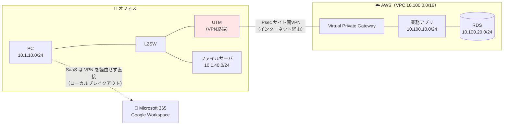
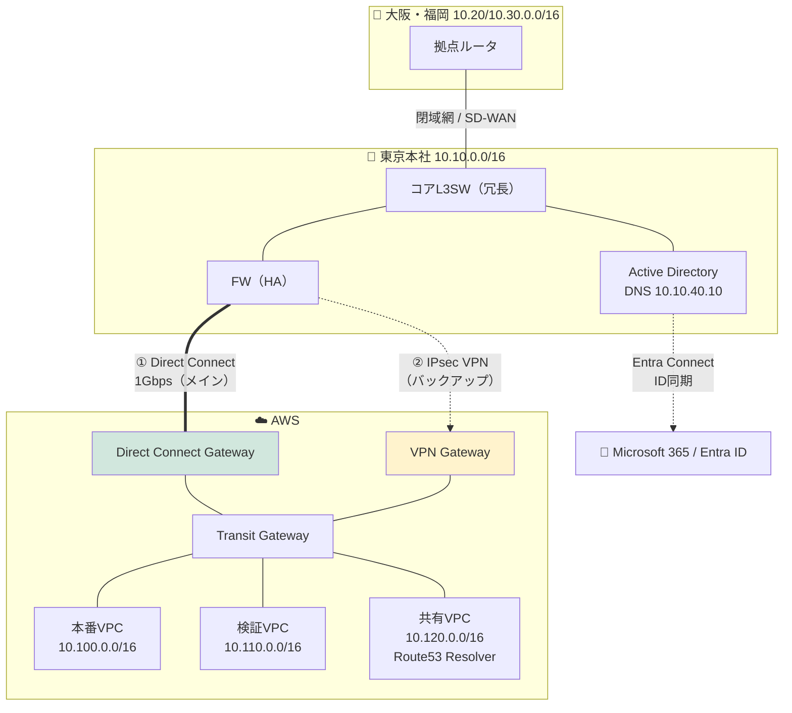
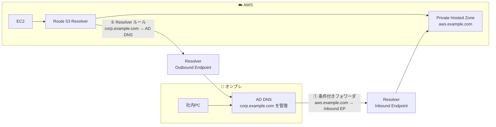
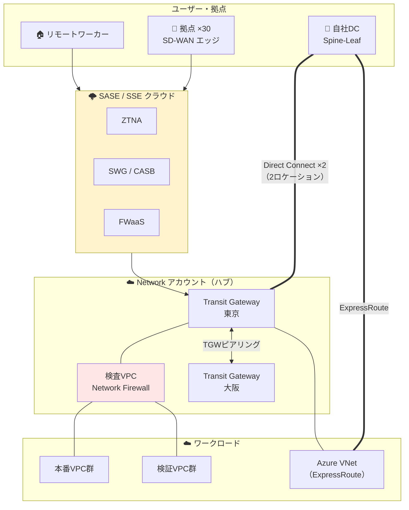

# ⑩ ハイブリッド構成パターン — 小規模・中規模・大規模

[← 総合インデックスに戻る](README.md) ｜ 前 → [⑨](09-cloud-patterns.md) ｜ 次 → [⑪ 規模別・形態別 総合比較](11-scale-comparison.md)

**ハイブリッド ＝ オンプレとクラウドを組み合わせる構成**です。
実は**現実の企業の大多数がここに該当します**。「全部クラウド」も「全部オンプレ」も少数派で、多くは移行の途中か、意図的に使い分けている状態です。

この章では、**両者をどうつなぐか**と、**つないだ後に必ず出てくる3つの問題**（アドレス重複・DNS・認証）を扱います。

---

## 0. なぜハイブリッドになるのか

| 理由 | 内容 |
| --- | --- |
| **移行の途中** | 一度に全部は移せない。数年かける（最も多い理由） |
| **移せないものがある** | 特殊なハードウェア依存・製造ライン・レガシー基幹システム |
| **遅延要件** | 工場の制御系・映像編集など、社内LANの低遅延が必要 |
| **規制・契約要件** | データを国内・自社設備に置くことが求められる |
| **既存投資の償却** | 買ったばかりの機器を捨てられない |
| **コスト最適** | 負荷が一定の部分はオンプレ、変動する部分はクラウド |
| **ID基盤が社内にある** | Active Directoryが社内にあり、クラウド側からも参照したい |

> 🔑 **「ハイブリッドは過渡期の姿」とは限りません。** 上記のうち下4つは恒久的な理由であり、**意図的にハイブリッドを選ぶ**のは正当な設計判断です。

---

## 1. 接続方式の選択

### 3つの方式

| | **インターネットVPN** | **専用線（DX / ExpressRoute）** | **SD-WAN** |
| --- | --- | --- | --- |
| 経路 | インターネット経由（暗号化） | **キャリアの閉域網** | 複数回線を束ねて最適経路を選択 |
| 帯域 | ベストエフォート | **保証帯域** | 回線次第 |
| 遅延 | 変動する | **安定・低遅延** | 変動 |
| 可用性 | 中 | **高**（SLAあり） | 高（複線化前提） |
| 開通期間 | **即日〜数日** | **1〜3ヶ月** | 数週間 |
| 月額（1Gbps級） | 1〜5万円 | **15〜60万円＋接続料** | 5〜20万円 |
| 向く規模 | 小規模・バックアップ回線 | 中〜大規模・基幹通信 | 多拠点 |

### AWS / Azure / GCP の専用線サービス

| | AWS | Azure | GCP |
| --- | --- | --- | --- |
| 専用線 | **Direct Connect（DX）** | **ExpressRoute** | **Cloud Interconnect** |
| 接続形態 | 専有(Dedicated) / ホスト型(Hosted) | Provider / Direct | Dedicated / Partner |
| 帯域 | 50Mbps〜100Gbps | 50Mbps〜100Gbps | 50Mbps〜200Gbps |
| ルーティング | **BGP必須** | **BGP必須** | **BGP必須** |
| 課金 | ポート時間料 ＋ **アウトバウンド転送料**（インターネットより安い） | ポート料 ＋ プラン | ポート料 ＋ 転送料 |

> 💡 **専用線の最大のメリットは「帯域保証」だけではありません。**
> **クラウドからのデータ転送料（エグレス）が、インターネット経由より安くなる**点も大きいです。データを頻繁に取り出す用途では、専用線代を転送料の削減で回収できることがあります。
>
> ⚠️ 一方、**専用線を引いても「ラストワンマイル（自社DC〜接続ポイント）」の回線が別途必要**です。この費用と開通期間を見落としがちです。

### 接続方式の判断フロー

```
拠点とクラウドを繋ぎたい
   │
   ├─ 通信量は月100GB未満？ ── Yes ─→ 【VPN】で十分
   │                                   （小規模パターンへ）
   ├─ 業務が止まると即座に損害が出る？
   │      │
   │      ├─ No  ─→ 【VPN】＋監視。将来必要なら専用線へ
   │      └─ Yes ─→ 【専用線 ＋ VPNをバックアップ】
   │                  （中規模パターンへ）
   │
   └─ 拠点が10以上、または遅延に厳しいシステムがある？
          └─ Yes ─→ 【専用線を2ロケーション冗長 ＋ SD-WAN/SASE】
                     （大規模パターンへ）
```

---

## 2. 小規模ハイブリッド（〜50人・1拠点＋クラウド）

### 設計方針

**「サイト間VPN 1本で、必要な通信だけ通す」。** 凝った構成にせず、止まったらインターネット経由で業務を継続できる設計にします。

### 構成図



### アドレス設計

```
オフィス   10.1.0.0/16    ← ⑦の設計に従う
AWS VPC   10.100.0.0/16  ← 100番台をクラウド枠に予約

★ 重複しないことが絶対条件。VPNは重複した瞬間に成立しない
```

### 設定のポイント

| 項目 | 内容 |
| --- | --- |
| **VPNトンネル** | AWSは**冗長化のため2本のトンネル**を払い出す。UTM側も2本設定する（片方はスタンバイでも可） |
| **ルーティング** | 拠点数が少ないので**静的ルート**で十分。BGP対応機器なら動的でもよい |
| **スプリットトンネル** | **SaaSへの通信はVPNを通さない**（ローカルブレイクアウト）。VPNが細いので必須 |
| **MTU / MSS** | ⚠️ IPsecでオーバーヘッドが乗る。**MSSクランプ（1350〜1387程度）を設定**（→ [③](03-ip-routing.md)） |
| **SGとFW** | クラウド側SGでオフィスのCIDR（10.1.0.0/16）からのみ許可 |

### コストの目安

| 項目 | 月額 |
| --- | --- |
| AWS Site-to-Site VPN | 約 6,000円（0.05USD/時） |
| データ転送（アウト） | 数千円〜 |
| 既存のインターネット回線 | （流用） |
| **追加コスト合計** | **約 1〜2万円/月** |

### 落とし穴

| 落とし穴 | 対策 |
| --- | --- |
| **アドレス重複** | オフィスが `192.168.1.0/24`（ルータ初期値）だと、在宅VPNと衝突。**移行前にアドレス変更**を |
| **VPNが単一障害点** | UTMが壊れると業務停止。**予備機**＋「一時的にインターネット経由で使う」代替手順を用意 |
| MTU起因の不具合 | 「繋がるがファイル転送だけ止まる」→ **MSSクランプ**（→ [③ 8章](03-ip-routing.md)） |
| 帯域不足 | オフィスの上り帯域がVPNの上限になる。**バックアップ転送は夜間に** |
| **SaaSまでVPN経由** | 遅くて無駄。スプリットトンネル設定を確認 |

---

## 3. 中規模ハイブリッド（50〜500人・複数拠点＋クラウド）

### 設計方針

**「基幹通信は専用線、バックアップはVPN」。** そして、ここから **DNS統合・ID統合**が本格的な設計項目になります。

### 構成図



### 3-1. アドレス設計（全社の台帳）

```
10. 10.0.0/16   東京本社
10. 20.0.0/16   大阪支社
10. 30.0.0/16   福岡支社
10. 40.0.0/16   （拠点用の予約）
10.100.0.0/16   AWS 本番VPC
10.110.0.0/16   AWS 検証VPC
10.120.0.0/16   AWS 共有サービスVPC
10.200.0.0/16   リモートアクセスVPN 払い出し

★ 全社で1枚の台帳にまとめ、払い出しを一元管理する
★ M&A・取引先接続の可能性を考え、使わない範囲も予約しておく
```

### 3-2. ハイブリッドDNS — 最も詰まりやすい設計項目

**問題**：クラウドのサーバから社内の `fileserver.corp.example.com` を引きたい。逆に、社内PCからクラウドの `db.internal` を引きたい。



| 方向 | 設定 |
| --- | --- |
| **クラウド → オンプレ** | Route 53 Resolver の **Outbound Endpoint** ＋ 転送ルール（`corp.example.com` → AD DNSのIP） |
| **オンプレ → クラウド** | AD DNSに**条件付きフォワーダ**（`aws.example.com` → Resolver **Inbound Endpoint** のIP） |

> 🔑 **ここを設計しないと、「VPNは繋がっているのに名前で通信できない」という状態になります。**
> また、**スプリットDNS**（→ [⑤](05-application-dns-http.md)）も併せて設計してください。社内から自社の公開サイトへアクセスしたとき、外に出て戻ってくる（ヘアピン）と遅く、FWで弾かれることもあります。

### 3-3. ID統合

| 方式 | 内容 |
| --- | --- |
| **ディレクトリ同期** | オンプレADのユーザーを Entra ID / IAM Identity Center へ同期。**SSOの土台**（→ [SSOガイド](../sso/README.md)） |
| **AD参加型のクラウドサーバ** | クラウドのWindowsサーバを社内ADドメインに参加させる。**AD通信用のポート開放が必要**（LDAP 389/636、Kerberos 88、SMB 445 等） |
| **フェデレーション** | SAML/OIDCでクラウドサービスへSSO |

> ⚠️ **AD参加型を選ぶ場合、必要なポートが多く、DNSとNTPの整合も必須**です。時刻が5分以上ずれるとKerberos認証が失敗します（→ [⑤](05-application-dns-http.md)）。

### コストの目安

| 項目 | 月額 |
| --- | --- |
| Direct Connect（1Gbps ホスト型） | 15〜40万円（キャリア＋AWSポート料） |
| ラストワンマイル回線 | 5〜20万円 |
| バックアップVPN | 約 6,000円 |
| Transit Gateway（VPC 3本＋DX/VPN） | 約 5万円 ＋ 転送量 |
| **追加コスト合計** | **約 25〜70万円/月** |

### 落とし穴

| 落とし穴 | 対策 |
| --- | --- |
| **DNSの相互解決を設計していない** | 上記のResolver設定。**接続テストの項目に「名前解決」を明記** |
| 専用線を引いたが**冗長性がない** | DX 1本は工事や障害で落ちる。**最低でもVPNをバックアップに**（BGPで自動切替） |
| **BGPの経路制御ミス** | 意図しない経路が広報され、通信が想定外の経路を通る。**AS-PATH / MED / Local Preference を設計**し、広報範囲を絞る |
| バックアップVPNに切り替わったら帯域不足 | **縮退時に何を優先するか**を決めておく（QoS・非優先通信の停止） |
| **時刻同期のずれ** | NTPを全体で統一。認証・証明書・ログ相関が壊れる |
| クラウド側SGがオンプレCIDRを想定していない | 拠点追加のたびに更新漏れ。**CIDR集約（10.0.0.0/8）でルール数を減らす**設計に |
| 開通期間の見積り不足 | **専用線は1〜3ヶ月**。プロジェクト計画の最初に発注する |

---

## 4. 大規模ハイブリッド（500人〜・多拠点＋マルチクラウド）

### 設計方針

**「ネットワークを専用の基盤として切り出し、拠点・クラウド・リモートを1つのポリシーで統制する」** 段階です。

### 構成図



### 大規模で追加される要素

| 要素 | 目的 |
| --- | --- |
| **専用線の2ロケーション冗長** | 同一拠点の2本では、その拠点の障害で全滅する。**別々の接続ポイント**へ |
| **SD-WAN** | 30拠点の回線を一元管理。アプリごとに経路を選択（重要業務は専用線、SaaSは直接） |
| **SASE / SSE** | 拠点・リモートのセキュリティをクラウドに集約（→ [⑥](06-security.md)） |
| **検査VPC** | VPC間・Egressの全通信を集中検査 |
| **マルチクラウド** | AWSとAzureを併用。**それぞれに専用線を引く**か、オンプレをハブにする |
| **IPAM** | 全社のCIDRを自動払い出し・重複防止 |
| **ネットワーク専用アカウント/チーム** | 接続基盤をワークロードから分離し、専門チームが運用 |

### マルチクラウド接続の3つの型

```
【型1】オンプレをハブにする
  AWS ←専用線→ 自社DC ←専用線→ Azure
  ✅ 既存の投資を活かせる  ❌ DCが単一障害点・遅延が増える

【型2】各クラウドを直接つなぐ
  AWS ←→ Azure（キャリアの相互接続サービス経由）
  ✅ 低遅延  ❌ 構成が複雑・コスト高

【型3】キャリアのクラウド接続基盤をハブにする（Megaport等）
  すべてを1つの接続基盤に集約
  ✅ 拡張が容易・帯域変更が柔軟  ❌ 新しいベンダー依存が増える
```

> 💡 **マルチクラウドは「安易に選ばない」のが原則です。** 運用コストとスキル要件が2倍以上になります。**特定サービスがそのクラウドにしかない、規制上必要、といった明確な理由**がある場合に限定してください。

### コストの目安

| 項目 | 月額 |
| --- | --- |
| Direct Connect 10Gbps ×2ロケーション | 100〜300万円 |
| ExpressRoute | 50〜150万円 |
| SD-WAN（30拠点） | 50〜150万円 |
| SASE / SSE（1,000ユーザー） | 100〜300万円 |
| Transit Gateway・検査VPC | 30〜100万円 |
| **追加コスト合計** | **約 350万〜1,000万円/月** |

### 落とし穴

| 落とし穴 | 対策 |
| --- | --- |
| **経路が複雑で誰も全体像を把握できない** | ネットワーク構成をコード化し、**経路の可視化ツール**（Reachability Analyzer 等）を活用 |
| 非対称ルーティング | 行きと帰りで経路が違い、**ステートフルFWが通信を落とす**。経路設計を対称に |
| **専用線が同じ建物経由だった** | 「2本引いた」つもりで**物理的に同じ経路**。キャリアに**経路の分離を明示的に確認** |
| SASE導入で既存FWと二重管理 | ポリシーの一元管理先を決める。**段階移行の順序を計画**（VPN→ZTNA、プロキシ→SWG） |
| マルチクラウドで運用が破綻 | 本当に必要か再検証。**片方を主、片方を従**と割り切る |
| コストが見えない | ネットワーク費用を**サービス別に配賦**する仕組みを作る |

---

## 5. ハイブリッド設計の共通チェックリスト

つないだ後に必ず出てくる論点です。**接続前に設計してください。**

- [ ] **アドレスは重複していないか**（オンプレ・全クラウド・VPN払い出し・取引先）
- [ ] **DNSの相互解決**は設計されているか（両方向）
- [ ] スプリットDNSは必要か（社内から自社公開サイトへのアクセス）
- [ ] **NTPは統一**されているか
- [ ] **認証はどこが権威か**（オンプレAD / クラウドIdP）。同期方式は
- [ ] 経路は**対称**か（非対称ルーティングになっていないか）
- [ ] **専用線の物理経路は本当に分かれているか**
- [ ] バックアップ回線に切り替わったとき、**帯域は足りるか**。何を止めるか
- [ ] MTU / MSSクランプは設定されているか
- [ ] クラウド側SGはオンプレCIDRを許可しているか。**集約できているか**
- [ ] **SaaS通信はローカルブレイクアウト**しているか（VPN経由になっていないか）
- [ ] ログはどこに集約するか（オンプレとクラウドで分散していないか）
- [ ] **監視は両側を統合して見られるか**
- [ ] 障害時の**切り分け責任分界点**が明確か（自社／キャリア／クラウド事業者）
- [ ] **切替試験の計画**があるか

---

## 6. この章のまとめ

| 規模 | 構成 | 押さえる要点 |
| --- | --- | --- |
| **小規模** | **サイト間VPN 1本**。SaaSは直接（スプリットトンネル） | **アドレス重複**と**MSSクランプ**。VPN障害時の代替手順 |
| **中規模** | **専用線メイン＋VPNバックアップ**。TGWでVPC集約 | **DNS相互解決**と**ID統合**が本番の設計項目。**専用線は1〜3ヶ月**かかる |
| **大規模** | **専用線2ロケーション＋SD-WAN＋SASE＋検査VPC** | 経路の可視化。**物理経路の分離をキャリアに確認**。マルチクラウドは安易に選ばない |

| 共通の要点 | |
| --- | --- |
| つなぐ前に決めること | **①アドレス ②DNS ③認証**。この3つが未設計だと必ず詰まる |
| 冗長化 | 専用線1本は冗長ではない。**最低でもVPNをバックアップに** |
| 切り替わった後 | **縮退時の帯域と優先順位**を決めておく |
| ハイブリッドの位置づけ | 過渡期とは限らない。**意図的な選択として正当** |

---

[← 総合インデックスに戻る](README.md) ｜ 前 → [⑨](09-cloud-patterns.md) ｜ 次 → [⑪ 規模別・形態別 総合比較と選定](11-scale-comparison.md)
