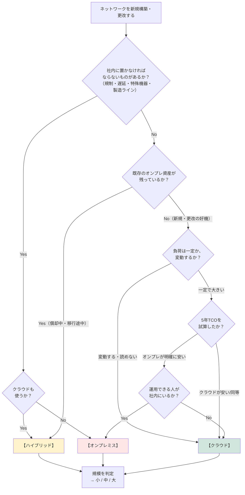
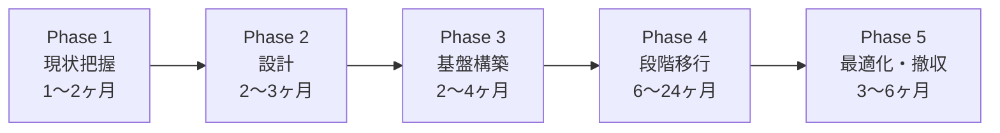

# ⑪ 規模別・形態別 総合比較と選定 — 9パターン早見表

[← 総合インデックスに戻る](README.md) ｜ 前 → [⑩](10-hybrid-patterns.md) ｜ 次 → [⑫ 運用・監視・トラブルシュート](12-operations-troubleshooting.md)

⑧⑨⑩で見た **小・中・大規模 × オンプレ・クラウド・ハイブリッド の9パターン**を、横に並べて比較します。
**「どれを選ぶか」を決めるための章**です。

---

## 1. 9パターン早見表

| | **オンプレミス**（→[⑧](08-onpremise-patterns.md)） | **クラウド**（→[⑨](09-cloud-patterns.md)） | **ハイブリッド**（→[⑩](10-hybrid-patterns.md)） |
| --- | --- | --- | --- |
| **小規模** 〜50人 | UTM 1台＋PoE SW＋AP **1層フラット・VLAN分割** 初期 140〜190万円 年間 30〜40万円 | 1VPC・2AZ **ALB＋Fargate＋RDS** 初期 ほぼ0 月額 3〜5万円 | 社内LAN＋**サイト間VPN 1本** SaaSは直接 追加 月額 1〜2万円 |
| **中規模** 50〜500人 | **2層（コラプストコア）** FW/コアSW冗長・拠点間VPN 初期 2,300〜2,800万円 年間 450〜700万円 | **マルチアカウント＋TGW** 3AZ・IaC・WAF 月額 40〜100万円 | **専用線＋VPNバックアップ** DNS統合・ID統合 追加 月額 25〜70万円 |
| **大規模** 500人〜 | **3層＋Spine-Leaf** BGP/EVPN/VXLAN・SD-WAN 初期 1.5〜3億円 年間 3,000万〜1億円 | **マルチリージョン＋検査VPC** ハブ&スポーク・IPAM 月額 400〜2,000万円 | **専用線2ロケーション＋SASE** SD-WAN・マルチクラウド 追加 月額 350〜1,000万円 |

> 💡 金額は2026年8月時点の目安です。**ハイブリッドの金額は「オンプレ構成＋クラウド構成＋接続費用」の"接続費用"部分**を示しています。

---

## 2. 選定フローチャート

> 🔑 **最後の分岐「運用できる人が社内にいるか」が実は最重要です。**
> TCOでオンプレが安くても、運用できる人がいなければ、**障害復旧の遅れ・パッチ未適用による侵害・属人化**という形でコストが跳ね返ります。**人件費と採用可能性まで含めて判断**してください。

---

## 3. 規模の判定基準

「うちは中規模か大規模か」で迷ったときの目安です。**1つでも上位に該当したら、上位側で設計する**のが安全です。

| 判定軸 | 小規模 | 中規模 | 大規模 |
| --- | --- | --- | --- |
| 従業員数 | 〜50 | 50〜500 | 500〜 |
| 端末数 | 〜150 | 150〜1,500 | 1,500〜 |
| **拠点数** | 1 | 2〜10 | 10〜 |
| サーバ台数 | 〜5 | 5〜50 | 50〜 |
| **停止許容時間** | 半日〜1日 | **数時間** | **数分〜1時間** |
| ネットワーク専任者 | 0人（兼任） | **1〜3人** | **専任チーム** |
| 年間IT予算（NW関連） | 〜100万円 | 500〜3,000万円 | 3,000万円〜 |
| 監査・規制対応 | なし | 取引先要求レベル | **法規制・業界基準あり** |

> ⚠️ **「人数は中規模だが、停止許容時間は数分」というケースが最も難しい**です（EC・金融・医療など）。この場合は**規模ではなく可用性要件で設計**し、中規模の予算では収まらないことを最初に共有してください。

---

## 4. 5年TCO比較（中規模・500人の例）

**購入価格だけを比べると判断を誤ります。** 5年間の総保有コストで比較します。

### オンプレミス

| 項目 | 5年合計 |
| --- | --- |
| 機器初期費用 | 2,500万円 |
| 設計・構築費 | 500万円 |
| 保守契約（年150万円 × 5） | 750万円 |
| ライセンス（年150万円 × 5） | 750万円 |
| 回線費用（年300万円 × 5） | 1,500万円 |
| 電力・空調・ラック（年100万円 × 5） | 500万円 |
| **運用人件費（1.5人 × 5年）** | **4,500万円** |
| 5年目の更改準備 | 500万円 |
| **合計** | **約 1億1,500万円** |

### クラウド

| 項目 | 5年合計 |
| --- | --- |
| 初期構築費（設計・移行） | 1,500万円 |
| クラウド利用料（月70万円 × 60） | 4,200万円 |
| 回線費用（年200万円 × 5） | 1,000万円 |
| **運用人件費（1人 × 5年）** | **3,000万円** |
| 教育・資格取得 | 300万円 |
| **合計** | **約 1億円** |

### ハイブリッド

| 項目 | 5年合計 |
| --- | --- |
| オンプレ側（縮小構成） | 5,000万円 |
| クラウド利用料（月40万円 × 60） | 2,400万円 |
| 専用線・接続費（月40万円 × 60） | 2,400万円 |
| **運用人件費（2人 × 5年）** | **6,000万円** |
| **合計** | **約 1億5,800万円** |

### この試算から読み取ること

| 発見 | 内容 |
| --- | --- |
| **人件費が最大の費目** | どのパターンでも**総額の30〜40%**。機器代の議論より影響が大きい |
| **ハイブリッドは最も高い** | 両方の運用が必要なため。**「移行の途中だから」という理由なら期限を切る**べき |
| クラウドとオンプレは意外に拮抗 | 「クラウドは高い/安い」は一概に言えない。**必ず自社の数字で試算する** |
| 見落とされがちな費目 | 電力・空調・ラック代、教育費、**更改準備**、廃棄費用 |

> 🔑 **ハイブリッドが恒久構成になる場合は、「両方の運用コストを払い続ける」ことを明示的に受け入れてください。**
> 「なんとなく移行が止まったまま5年」が最も高くつきます。**移行するなら期限を切り、しないなら片方を確定させる**——この判断を先送りしないことが、最大のコスト削減です。

---

## 5. 判断軸ごとの向き不向き

| 判断軸 | オンプレ | クラウド | ハイブリッド |
| --- | --- | --- | --- |
| **初期投資を抑えたい** | ❌ | ✅ | △ |
| **長期・負荷一定でコスト最適** | ✅ | △ | △ |
| **急激な変動・スパイクがある** | ❌ | ✅ | ○ |
| **数分で調達したい** | ❌ | ✅ | ○ |
| **超低遅延（社内LAN級）** | ✅ | ❌ | ✅ |
| **大容量データを常時処理** | ✅ | △（転送料） | ✅ |
| **災害対策（DR）** | ❌（高コスト） | ✅ | ○ |
| **データ所在の規制対応** | ✅ | △（リージョン次第） | ✅ |
| **特殊ハードウェア依存** | ✅ | ❌ | ✅ |
| **運用人員が少ない** | ❌ | ✅ | ❌ |
| **セキュリティ機能の高度さ** | △ | ✅ | ○ |
| **コストの予測しやすさ** | ✅ | ❌ | ❌ |
| **スキル獲得のしやすさ** | △ | ○ | ❌ |

---

## 6. 移行のアンチパターン10選

クラウド移行・構成変更でよく見る失敗です。**着手前に確認してください。**

| # | アンチパターン | 何が起きるか | 対策 |
| --- | --- | --- | --- |
| **1** | **リフト&シフトで終わる** | オンプレのVMをそのままEC2へ。**構成は変わらず料金だけ増える** | 移行後のマネージドサービス活用（Fargate/RDS等）まで計画に含める |
| **2** | **アドレス設計をせずに始める** | 後からVPC間・オンプレ間を繋げない。**作り直し** | **最初に全社CIDR台帳**（→[⑦](07-design-basics.md)） |
| **3** | **DNS・認証を後回し** | 「繋がるのに名前で通信できない」「ログインできない」 | 接続設計と**同時に**設計（→[⑩](10-hybrid-patterns.md)） |
| **4** | **転送料を見積もらない** | 請求書で初めて気づく。**NAT GW・クロスAZ・エグレス** | PoC段階で通信量を実測。VPCエンドポイント活用（→[⑨](09-cloud-patterns.md)） |
| **5** | **移行の期限を切らない** | ハイブリッドが恒久化し、**両方の運用費を払い続ける** | 移行完了日を決め、進捗を可視化 |
| **6** | **切り戻し手順がない** | 移行当日に問題発生 → 戻せず長時間停止 | **ロールバック手順とその判断基準（何分で撤退するか）を事前に文書化** |
| **7** | **オンプレの運用をそのまま持ち込む** | 手動のコンソール操作・SSHでの設定変更 | **IaC＋レビュー**へ。クラウドは運用モデルごと変える |
| **8** | **セキュリティ設定が緩いまま公開** | SGを `0.0.0.0/0` で開放 → 即座に攻撃 | 公開前チェックリスト・**自動検査（Config/Security Hub）** |
| **9** | **人の準備をしない** | 既存メンバーが使えず、外注依存で固定費が増える | **教育・資格取得を計画に含める**（移行費用の10%程度を配分） |
| **10** | **DR/冗長構成を作って試験しない** | いざというとき切り替わらない | **年1〜2回のフェイルオーバー訓練を運用に組み込む** |

> ⚠️ **1番と5番が突出して多い失敗です。**
> 「まず全部そのままクラウドに載せて、あとで最適化する」は、**あとで最適化されないまま高い料金を払い続ける**結果に終わりがちです。移行の設計時点で、**何をどう作り替えるか**まで決めてください。

---

## 7. 段階的な進め方（推奨ロードマップ）

いきなり全部を変えるのではなく、次の順序が現実的です。

| Phase | やること | 完了条件 |
| --- | --- | --- |
| **1. 現状把握** | 資産棚卸し・**通信量の実測**・依存関係の可視化・EOL確認 | 何がどこと通信しているかの一覧ができている |
| **2. 設計** | **アドレス設計・DNS設計・ID設計**・接続方式の決定・TCO試算 | 設計書と**移行順序**が決まっている |
| **3. 基盤構築** | 接続（専用線/VPN）・共通サービス（DNS/認証/ログ/監視）・IaC整備 | **疎通試験と名前解決試験が完了** |
| **4. 段階移行** | 影響の小さいシステムから順に。**各回で切り戻し可能に** | 移行対象がすべて新環境で安定稼働 |
| **5. 最適化・撤収** | マネージドサービスへの置換・**旧環境の停止と撤去**・コスト最適化 | **旧環境が消えている**（ここまでやって完了） |

> 🔑 **Phase 1 の「通信量の実測」を飛ばさないでください。**
> 見積もりの精度がここで決まります。NetFlow/sFlow・VPCフローログ・スイッチのインターフェース統計から、**実際のピーク帯域と方向別の転送量**を1ヶ月は取得してください（→ [⑫](12-operations-troubleshooting.md)）。
>
> また **Phase 5 の「旧環境の撤去」まで到達しないプロジェクトが非常に多い**です。使っていないサーバの電気代と保守費、そしてパッチが当たらない放置機器という**セキュリティリスク**が残り続けます。

---

## 8. ケース別の推奨構成

| ケース | 推奨 | 理由 |
| --- | --- | --- |
| **創業したてのスタートアップ**（10人・Webサービス） | **クラウド 小規模** | 初期投資ゼロ・調達が速い・人手が要らない |
| **町工場**（30人・製造ライン制御あり） | **ハイブリッド 小規模** | 制御系はオンプレ必須。**情報系はSaaS＋VPN** |
| **地方の中堅企業**（200人・3拠点・基幹はオンプレ） | **ハイブリッド 中規模** | 基幹は残しつつ、新規システムをクラウドへ。**期限を切って移行** |
| **成長中のEC事業者**（100人・トラフィック変動大） | **クラウド 中規模** | セール時のスパイクに対応。CDN・WAF必須 |
| **全国展開の小売**（2,000人・50店舗） | **ハイブリッド 大規模** | 店舗はSD-WAN、本部システムはクラウド、POS周辺は店舗内 |
| **医療・金融**（規制が厳しい） | **ハイブリッド 中〜大規模** | 規制対象データはオンプレ／指定リージョン、それ以外はクラウド |
| **開発会社**（50人・自社サービスなし） | **クラウド 小規模＋SaaS中心** | 社内にサーバを置く理由がない。**社内LANは最小限で足りる** |
| **老朽機器の一斉更改を控えた企業** | **クラウド or ハイブリッドを本気で検討** | **更改は形態を見直す最大の好機**。ここで検討しないと次は5〜7年後 |

---

## 9. この章のまとめ

| 覚えること | 一言で |
| --- | --- |
| 9パターン | 規模（人数・拠点・停止許容時間）× 形態（オンプレ/クラウド/ハイブリッド） |
| 規模判定 | **1つでも上位に該当したら上位側で設計**。特に**停止許容時間**は規模と独立 |
| **TCO** | **人件費が総額の30〜40%**。機器代の議論より影響が大きい |
| ハイブリッド | **最も高コスト**。恒久化するなら意図的に、移行なら**期限を切る** |
| 最大のアンチパターン | **リフト&シフトで終わる**・**移行の期限を切らない** |
| 進め方 | 現状把握（**通信量の実測**）→ 設計 → 基盤 → 段階移行 → **旧環境の撤去** |
| 決め手 | 最後は「**運用できる人がいるか**」。TCOより効くことがある |
| 好機 | **機器の更改タイミング**が、形態を見直す最大のチャンス |

---

[← 総合インデックスに戻る](README.md) ｜ 前 → [⑩](10-hybrid-patterns.md) ｜ 次 → [⑫ 運用・監視・トラブルシュート](12-operations-troubleshooting.md)
