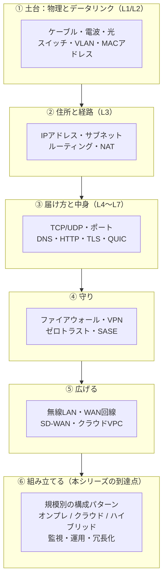

# ネットワーク技術 完全ガイド 総合インデックス

このドキュメント群は、**ネットワーク技術をゼロから応用・実務の構成設計まで** 体系立てて学ぶための教材です。専門用語をいきなり並べるのではなく、**たとえ話 → 図解 → 具体的な数字 → 実務の判断基準** の順に進みます。

- 対象：ネットワークを一から学びたい人／インフラ担当になった人／クラウド移行や拠点構築の構成を判断する立場の人
- 前提知識：不要（「LANケーブルを挿したことがある」程度でOK）
- 関連シリーズ：[光ファイバー・光通信 完全ガイド](../optical-fiber-overview.md)（物理層をさらに深く）／[DNS・ドメイン完全ガイド](../dns-guide.md)／[SSO 完全ガイド](../sso/README.md)（認証まわり）

> このページだけ読めば「全体像」と「どこに何が書いてあるか」がわかります。詳細は各章へ。

---

## 1. まず結論（30秒サマリ）

ネットワークとは、**「離れた機械同士が、決められた手順（プロトコル）で情報を渡し合う仕組み」** です。難しく見えるのは、**役割の違う仕事が何層にも重なっている**からです。

逆にいえば、**層（レイヤ）で切り分けて考えれば、ネットワークは驚くほど単純になります。**

```
郵便にたとえると

  L7 アプリケーション : 手紙の中身（日本語で書かれた本文）
  L4 トランスポート   : 「速達か普通郵便か」「分割して送って組み立て直す」
  L3 ネットワーク     : 宛先の住所（IPアドレス）と、どの経路で運ぶか
  L2 データリンク     : 隣の郵便局までの受け渡し（MACアドレス）
  L1 物理            : トラック・道路そのもの（ケーブル・電波・光）
```

実務で押さえるべき鉄則は3つだけです。

| 鉄則 | 意味 | なぜ重要か |
| --- | --- | --- |
| **切り分けは下の層から** | 疎通しないときは L1 → L2 → L3 → L4 → L7 の順に確認 | 上から見ると原因の候補が爆発する。下から潰せば必ず当たる |
| **アドレスは2種類ある** | MACアドレス（隣まで）と IPアドレス（最終目的地まで） | この2つの役割の違いが分かれば L2/L3 の混乱は消える |
| **設計は「規模」ではなく「止まったときの損害」で決める** | 冗長化・帯域・監視のレベルはビジネス影響から逆算 | 過剰投資と過少投資の両方を防げる |

そして本シリーズの後半（⑨⑩）が、あなたが一番知りたいであろう **「で、うちはどんな構成にすればいいのか」** に答える章です。

---

## 2. 全体マップ



---

## 3. 章立てと読み方

### 基礎編 — 「なぜ通信できるのか」がわかる

| # | 章 | 内容 |
| --- | --- | --- |
| ① | [ネットワークの基礎とOSI参照モデル](01-network-basics.md) | ネットワークとは何か・OSI 7階層とTCP/IP 4階層・カプセル化・Webページが表示されるまでの一部始終 |
| ② | [物理層とデータリンク層](02-physical-datalink.md) | LANケーブル・光・MACアドレス・スイッチの動作原理・VLAN・STP・リンクアグリゲーション |
| ③ | [IPアドレスとサブネット](03-ip-subnet.md) | IPv4/IPv6・サブネットマスクの計算・プライベートIP・DHCP・ARP・NAT/NAPT |
| ④ | [ルーティング](04-routing.md) | ルータの仕事・スタティック/ダイナミック・RIP/OSPF/BGP・デフォルトゲートウェイ・経路制御の実務 |
| ⑤ | [トランスポート層とアプリケーション層](05-transport-application.md) | TCP/UDP の違い・3ウェイハンドシェイク・ポート番号・DNS・HTTP/HTTPS・TLS・QUIC/HTTP3 |

### 応用編 — 「守る・広げる」技術

| # | 章 | 内容 |
| --- | --- | --- |
| ⑥ | [ネットワークセキュリティ](06-security.md) | ファイアウォール・NGFW/UTM・IDS/IPS・IPsec/SSL-VPN・ゼロトラスト・SASE/SSE・DMZ設計 |
| ⑦ | [無線LANとWAN](07-wireless-wan.md) | Wi-Fi 6/6E/7・電波設計・認証方式・WAN回線の種類と選び方・SD-WAN・拠点間接続 |
| ⑧ | [クラウドネットワーク](08-cloud-network.md) | VPC/VNet・サブネット設計・セキュリティグループ・ロードバランサ・CDN・専用線・Kubernetesのネットワーク |

### 構成設計編 — 「うちはどう組むか」に答える（本シリーズの核）

| # | 章 | 内容 |
| --- | --- | --- |
| ⑨ | [規模別ネットワーク構成パターン](09-scale-patterns.md) | **小規模（〜50人）／中規模（50〜500人）／大規模（500人〜）** の構成図・機器選定・コスト目安・移行トリガー |
| ⑩ | [オンプレ・クラウド・ハイブリッド構成](10-onprem-cloud-hybrid.md) | **3方式の比較・それぞれの構成図・接続方式・コスト構造・移行パターンと落とし穴** |
| ⑪ | [監視・運用・トラブルシューティング](11-operations.md) | SNMP/NetFlow/Syslog・監視設計・障害の切り分け手順・冗長化とBCP・運用ドキュメント |

### 付録

- [用語集・チートシート](glossary.md) ← 全章横断の用語辞典・「困った時どの章？」逆引き表・コマンド集

---

## 4. 読者タイプ別のおすすめルート

- **完全な初心者・文系出身で配属された** → ① → ③ → ② → ⑤（この4章で社内の会話についていけます）
- **とにかく構成パターンだけ知りたい** → この README の第5節 → [⑨ 規模別](09-scale-patterns.md) → [⑩ オンプレ/クラウド/ハイブリッド](10-onprem-cloud-hybrid.md)
- **オフィス移転・拠点構築を任された** → ⑨ → ② → ③ → ⑦ → ⑥ →（⑪で運用を固める）
- **クラウド移行を検討している** → ⑩ → ⑧ → ⑥ → ⑨（移行後の規模感を確認）
- **アプリ開発者だがインフラも見る** → ⑤ → ③ → ⑧ →（⑥のセキュリティグループ設計）
- **資格勉強（CCNA・ネットワークスペシャリスト）** → ① から ⑦ まで順番に
- **トラブル対応中** → [⑪ 切り分け手順](11-operations.md) → [用語集の逆引き表](glossary.md)

---

## 5. 構成パターン早見表（結論の先出し）

詳細は ⑨ ⑩ に譲りますが、**「規模」×「配置」** のどこに当てはまるかをここで先に掴んでください。

### 規模別の目安

| 規模 | 人数/拠点 | ネットワークの姿 | 象徴的な機器 | 月額イメージ |
| --- | --- | --- | --- | --- |
| **小規模** | 〜50人・1拠点 | 1セグメント。ルータ1台＋スイッチ数台 | UTM 1台、L2スイッチ、Wi-Fi AP 2〜5台 | 数万円 |
| **中規模** | 50〜500人・2〜10拠点 | VLAN分割＋L3スイッチでコア/エッジ分離。冗長化開始 | L3スイッチ冗長、NGFW冗長、コントローラ管理AP | 数十万円 |
| **大規模** | 500人〜・多拠点/DC | 3階層（コア/ディストリ/アクセス）またはSpine-Leaf。全経路冗長 | シャーシ型スイッチ、SD-WAN、専用線＋バックアップ | 数百万円〜 |

### 配置別の目安

| 方式 | 向いているケース | 主なコスト | 弱点 |
| --- | --- | --- | --- |
| **オンプレ** | 低遅延が必須／データを外に出せない／トラフィックが常時大量 | 初期投資（CAPEX）が主 | 拡張に時間・災害時の復旧が重い |
| **クラウド** | 需要が変動する／スモールスタート／機器管理をしたくない | 従量課金（OPEX）が主 | 通信量課金・レイテンシ・ベンダーロックイン |
| **ハイブリッド** | 既存資産を活かしつつ段階移行／基幹はオンプレ・Webはクラウド | 両方＋接続回線 | 設計と運用が最も複雑。監視が二重になる |

> **よくある誤解**：「クラウドにすれば安くなる」は**常時フル稼働のワークロードでは逆**になることが多いです。安くなるのは「ピークと平常時の差が大きい」「小さく始めて捨てられる」ケース。判断材料は [⑩ の第4節](10-onprem-cloud-hybrid.md) にコスト構造の比較表としてまとめました。

---

## 6. このシリーズで一番大事な5つ

1. **困ったら下の層から** —— 「ネットワークが遅い」の原因の多くは L1（ケーブル・電波）と L2（スイッチのループ・全二重半二重不一致）にある（→ [②](02-physical-datalink.md)・[⑪](11-operations.md)）
2. **サブネット設計はやり直しが効かない** —— IPアドレス設計は建物の間取りと同じで、後から変えると全部を止める必要が出る。最初に**将来の拠点数×3倍**で確保する（→ [③](03-ip-subnet.md)）
3. **冗長化は「機器」ではなく「経路」で考える** —— スイッチを2台にしても、そこに刺さるケーブルが1本なら冗長ではない（→ [⑪](11-operations.md)）
4. **境界防御だけの時代は終わった** —— リモートワークとクラウド利用で「社内＝安全」が崩れた。ゼロトラストは思想であって製品名ではない（→ [⑥](06-security.md)）
5. **構成は「今」ではなく「2年後」で選ぶ** —— 機器の減価償却は5年、回線契約は2〜3年縛りが普通。今ちょうどのサイズを買うと必ず足りなくなる（→ [⑨](09-scale-patterns.md)）

---

## 7. 表記と前提について

| 項目 | 本シリーズでの扱い |
| --- | --- |
| 価格・料金 | 執筆時点（2026年）の一般的な相場感。**契約前に必ず各社公式で確認**してください |
| 製品名 | 特定ベンダーの推奨ではなく、カテゴリの代表例として挙げています |
| 規格バージョン | Wi-Fi 7（802.11be）・IPv6・HTTP/3 を現行世代として扱います |
| コマンド例 | Linux / Windows / Cisco IOS 系を併記。機種により差異があります |
