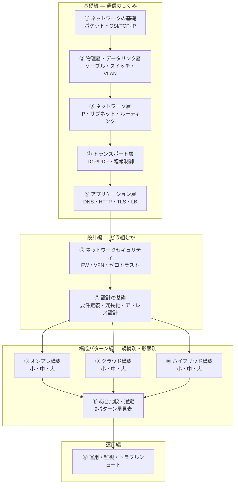

# ネットワーク技術 完全ガイド 総合インデックス

**「ケーブルの先で何が起きているか」から「1000人規模の全社ネットワークをどう設計するか」まで** を、ゼロから応用まで一気通貫でまとめたガイドです。

- 対象：これから学ぶ人／アプリ開発者でインフラも見ることになった人／社内ネットワークやクラウド構成を設計・判断する立場の人
- 前提知識：不要。①から読めば積み上がるように書いています
- 執筆時点：2026年8月

> 💡 **このガイドの特徴**：教科書的な「OSI 7階層」の解説で終わらせず、**小規模・中規模・大規模 × オンプレ・クラウド・ハイブリッドの9パターン** について、実際の構成図・機器リスト・概算コスト・落とし穴まで踏み込んでいます。

---

## 1. まず結論（30秒サマリ）

ネットワークは結局、この3つを決める作業です。

| 決めること | 具体的には | 章 |
| --- | --- | --- |
| **① どうつなぐか** | 物理配線・VLAN・IPアドレス設計・ルーティング | [②](02-physical-datalink.md)・[③](03-ip-routing.md) |
| **② どう守るか** | ファイアウォール・セグメント分割・VPN・ゼロトラスト | [⑥](06-security.md) |
| **③ どう止めないか** | 冗長化・監視・切り分け手順 | [⑦](07-design-basics.md)・[⑫](12-operations-troubleshooting.md) |

そして構成の選択は、**規模（人数・拠点数）** と **設置形態（オンプレ／クラウド／ハイブリッド）** の掛け算で決まります。

```
        小規模          中規模          大規模
      （〜50人）    （50〜500人）    （500人〜）
     ┌────────────┬────────────┬────────────┐
オンプレ│ ルータ1台  │ コア/エッジ │ Spine-Leaf │  → ⑧
     │ + L2SW     │ 2層・冗長化 │ EVPN/VXLAN │
     ├────────────┼────────────┼────────────┤
クラウド│ 1VPC/2AZ   │ マルチAZ    │ マルチ     │  → ⑨
     │ ALB+PaaS   │ 環境分離    │ アカウント  │
     ├────────────┼────────────┼────────────┤
ハイブ │ サイト間   │ 専用線1本   │ 冗長専用線 │  → ⑩
リッド │ VPNのみ    │ +VPN予備    │ + SASE     │
     └────────────┴────────────┴────────────┘
```

**最初に読むべき1章だけ選ぶなら**：技術を学びたい人は [①](01-network-basics.md)、構成を決めたい人は [⑪ 規模別・形態別の総合比較](11-scale-comparison.md) です。

---

## 2. 全体マップ



---

## 3. 章一覧

### 基礎編 — 通信のしくみをゼロから

| 章 | タイトル | 何がわかるか |
| --- | --- | --- |
| ① | [ネットワークの基礎](01-network-basics.md) | パケット交換・LAN/WAN・**OSI 7層とTCP/IP 4層**・カプセル化・機器の役割一覧 |
| ② | [物理層とデータリンク層](02-physical-datalink.md) | ケーブル規格・MACアドレス・スイッチの学習動作・**VLAN**・STP・LAG・Wi-Fi |
| ③ | [ネットワーク層（IPとルーティング）](03-ip-routing.md) | **サブネット計算**・CIDR・ルーティングテーブル・OSPF/BGP・NAT・IPv6・MTU |
| ④ | [トランスポート層（TCP/UDP）](04-transport-tcp-udp.md) | ポート・**3wayハンドシェイク**・再送・輻輳制御・QUIC・ポート枯渇 |
| ⑤ | [アプリケーション層（DNS・HTTP・TLS）](05-application-dns-http.md) | DNS・DHCP・**HTTP/1.1→2→3**・TLS 1.3・CDN・**ロードバランサ L4/L7** |

### 設計編 — 守り方と組み立て方

| 章 | タイトル | 何がわかるか |
| --- | --- | --- |
| ⑥ | [ネットワークセキュリティ](06-security.md) | FW・IDS/IPS・WAF・VPN・**ゼロトラスト/SASE**・セグメンテーション・DDoS対策 |
| ⑦ | [ネットワーク設計の基礎](07-design-basics.md) | 要件定義の進め方・**可用性の計算**・冗長化パターン・帯域設計・IPアドレス設計 |

### 構成パターン編 — 小規模・中規模・大規模 × オンプレ・クラウド・ハイブリッド

| 章 | タイトル | 何がわかるか |
| --- | --- | --- |
| ⑧ | [オンプレミス構成パターン](08-onpremise-patterns.md) | **小/中/大の3構成図**・機器リスト・概算コスト・要員・落とし穴 |
| ⑨ | [クラウド構成パターン](09-cloud-patterns.md) | VPC基礎・**小/中/大の3構成図**・AWS/Azure/GCP対応表・課金の罠 |
| ⑩ | [ハイブリッド構成パターン](10-hybrid-patterns.md) | VPN/専用線/SD-WAN・**小/中/大の3構成図**・ハイブリッドDNS・移行手順 |
| ⑪ | [規模別・形態別 総合比較と選定](11-scale-comparison.md) | **9パターン早見表**・判断フローチャート・5年TCO比較・アンチパターン |

### 運用編

| 章 | タイトル | 何がわかるか |
| --- | --- | --- |
| ⑫ | [運用・監視・トラブルシュート](12-operations-troubleshooting.md) | SNMP/Syslog/NetFlow・**下位層から切り分ける手順**・コマンド集・IaC |
| — | [用語集・チートシート](glossary.md) | 層別用語辞典・逆引き表・**ポート番号一覧**・サブネット早見表・コマンド集 |

---

## 4. 読者別ルート

### 🔰 ゼロから学びたい（学生・新人・非インフラ職）

**① → ② → ③ → ④ → ⑤** の順に素直に。③のサブネット計算だけは手を動かして覚えてください。ここが全ての土台です。

### 💻 アプリ開発者（インフラも見ることになった）

**① → ③（NAT・MTU） → ④（TCP・ポート枯渇） → ⑤（HTTP/TLS・LB） → ⑨（クラウド構成）**
アプリの「たまに遅い」「たまに切れる」の原因はだいたい④と⑤にあります。

### 🏢 社内ネットワークを任された（情シス）

**⑦（設計の基礎） → ⑧（オンプレ構成） → ⑥（セキュリティ） → ⑫（運用）**
規模に迷ったら [⑪](11-scale-comparison.md) の判断フローチャートへ。

### ☁️ クラウド移行を検討している

**⑪（比較・TCO） → ⑨（クラウド構成） → ⑩（ハイブリッド構成）**
移行アンチパターンは [⑪ 6章](11-scale-comparison.md) にまとめています。

### 🎯 資格勉強（CCNA・ネットワークスペシャリスト）

**① 〜 ⑦ 全部 → [用語集](glossary.md)**
CCNA範囲は①〜④＋⑥、ネスペは⑦〜⑩の設計論まで含みます。

---

## 5. 関連ガイド

このリポジトリ内の関連ドキュメントです。重複する内容は本シリーズでは要点のみ扱い、詳細は下記に譲っています。

| ガイド | 関係 |
| --- | --- |
| [DNS・ドメイン完全ガイド](../dns-guide.md) | ⑤のDNS部分の詳細版。レコード種別・移管手順まで |
| [光ファイバー・光通信 完全ガイド](../optical-fiber-overview.md) | ②の物理層の詳細版。**キャリア網側**（FTTH・PON・海底ケーブル）の視点 |
| [自作サーバーでWebサイトを公開する方法](../self-hosting-guide.md) | ⑧の家庭・SOHO規模の実践編 |
| [APIの種類・特徴・歴史 完全ガイド](../api-guide.md) | ⑤のHTTPより上のレイヤ |
| [SSO（シングルサインオン）完全ガイド](../sso/README.md) | ⑥のゼロトラストにおける認証基盤 |
| [低トラフィックサイト向けシステム構成ガイド](../ando-piano-system-design.md) | ⑨の小規模クラウド構成の実例 |

---

## 6. このガイドの前提と限界

- **ベンダー中立に書いています。** 具体的な製品名（Cisco・Fortinet・YAMAHA等）は例示にとどめ、設定コマンドは載せていません。考え方が分かれば製品マニュアルは読めます
- **価格は2026年8月時点の目安**です。為替・モデルチェンジで変動します。稟議には必ず見積を取ってください
- **法規制・業界要件（PCI DSS・医療情報ガイドライン等）は扱いません。** 該当する場合は必ず個別に確認を

---

次 → [① ネットワークの基礎](01-network-basics.md)
