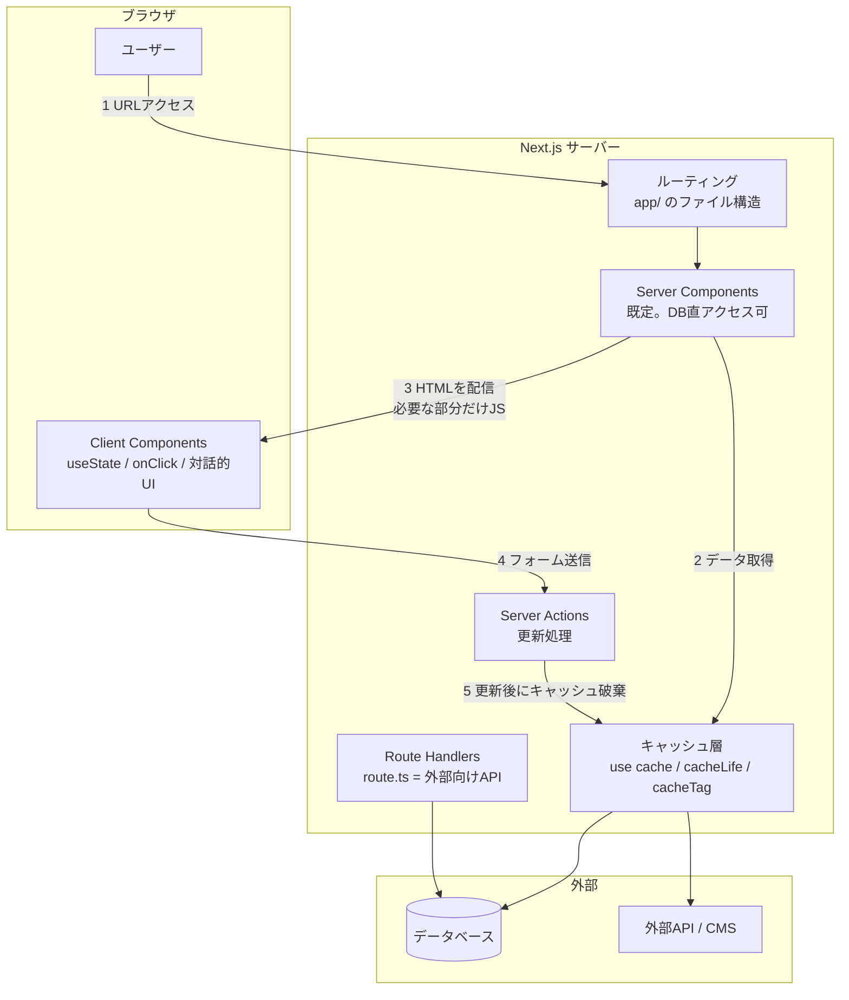

# Next.js 完全ガイド 総合インデックス

このドキュメント群は、**Next.js を基礎から応用・実務レベルまで体系立てて** 学ぶための教材です。React をまだよく知らない人でも読み進められるように、**たとえ話 → 図解 → 最小コード → 実務の判断基準** の順で段階的に深くなります。

- 対象：React/Next.js をこれから学ぶ人、Pages Router 時代の知識を App Router に更新したい人、業務でNext.jsの採用を判断するリード・PM
- 前提バージョン：**Next.js 16 系（執筆時点の最新は 16.3）／ React 19 系 / TypeScript**
- Next.js 15 以前との違いは各章の「**⚠️ バージョン差分**」ブロックにまとめています

> このページだけ読めば「全体像」と「どこに何が書いてあるか」がわかります。詳細は各章へ。

---

## 1. まず結論（30秒サマリ）

**Next.js とは「React で本番のWebサービスを作るために足りないものを全部入れたフレームワーク」** です。

React は本来「画面を組み立てるライブラリ」でしかなく、ルーティング（URL設計）・サーバー処理・データ取得・SEO・ビルド最適化は**自分で用意する必要**があります。Next.js はそれらを**規約（ファイルの置き方）だけで**使えるようにしたものです。

```
React だけ         → 部品（UIコンポーネント）は作れる。でも家にはならない
Next.js           → 部品＋間取り＋配管＋電気＋玄関まで込みの「建売住宅」
```

現代の Next.js（App Router）を理解する鍵は、次の3つだけです。

| 鍵となる概念 | ひとことで | 効果 |
| --- | --- | --- |
| **Server Components** | 既定でコンポーネントは**サーバーで実行**される | DBに直接アクセスでき、JSがブラウザに送られない＝軽い |
| **Cache Components（`use cache`）** | キャッシュは**明示的に宣言**する | 「なぜか古いデータが出る」問題が消える |
| **Server Actions** | フォーム送信を**関数呼び出し**として書ける | API を作らずに更新処理が書ける |

そして実務の鉄則がひとつ：**「Client Component は葉っぱ（末端）に置く」**。ページ全体を `'use client'` にした瞬間、Next.js を使う利点の大半が消えます。

---

## 2. 全体マップ



---

## 3. 章立てと読み方

### 基礎編 — まず動くものを作れるようになる

| # | 章 | 内容 |
| --- | --- | --- |
| ① | [Next.jsとは何か](01-what-is-nextjs.md) | Reactとの違い・なぜ必要か・CSR/SSR/SSG/ISRの前提知識・他フレームワーク比較 |
| ② | [環境構築とプロジェクト構造](02-setup-and-structure.md) | `create-next-app`・ディレクトリの意味・App Router と Pages Router の違い・設定ファイル |
| ③ | [ルーティング（App Router）](03-routing.md) | ファイル＝URLの規約・動的ルート・layout/loading/error・ルートグループ・並列/インターセプト |
| ④ | [Server ComponentsとClient Components](04-server-client-components.md) | 既定はサーバー・`'use client'` の境界・使い分けの判断フロー・よくある失敗 |

### 応用編 — 実際のサービスに必要な機能を組む

| # | 章 | 内容 |
| --- | --- | --- |
| ⑤ | [データ取得とキャッシュ](05-data-fetching-caching.md) | `use cache`・`cacheLife`・`cacheTag`・PPR・ストリーミング・N+1対策 |
| ⑥ | [Server Actionsとフォーム](06-server-actions-forms.md) | `'use server'`・`useActionState`・バリデーション・楽観的更新・セキュリティ |
| ⑦ | [スタイリングとUI](07-styling-ui.md) | Tailwind CSS v4・CSS Modules・shadcn/ui・デザインシステムの組み方 |
| ⑧ | [認証とデータベース](08-auth-database.md) | Auth.js / Clerk / Better Auth・Prisma vs Drizzle・セッション設計・認可の置き場所 |
| ⑨ | [Route HandlersとAPI連携](09-route-handlers-api.md) | `route.ts`・`proxy.ts`（旧middleware）・Webhook・外部API・型安全な通信 |

### 実践編 — 本番運用・チーム開発の水準に上げる

| # | 章 | 内容 |
| --- | --- | --- |
| ⑩ | [パフォーマンス最適化とSEO](10-performance-seo.md) | Core Web Vitals・`next/image`・フォント最適化・メタデータ・サイトマップ・構造化データ |
| ⑪ | [テストと品質管理](11-testing-quality.md) | Vitest・Playwright・RSCのテスト戦略・ESLint 9・TypeScript設定 |
| ⑫ | [デプロイと運用](12-deploy-operations.md) | Vercel・Docker/セルフホスト・環境変数・監視・ログ・障害対応 |
| ⑬ | [実践アーキテクチャ](13-architecture-practice.md) | ディレクトリ設計・レイヤ分割・大規模化・モノレポ・アンチパターン集 |
| ⑭ | [併用フレームワーク・ライブラリ総覧](14-ecosystem-frameworks.md) | **一緒に使う技術の全体像**。用途別の定番・比較・規模別の推奨スタック |

### 付録

- [用語集・チートシート](glossary.md) ← 全章横断の用語辞典と「困った時どの章？」逆引き表

---

## 4. 読者タイプ別のおすすめルート

- **とにかく最短で動かしたい** → ① → ② → ③ → ⑥（この4章で簡単なCRUDアプリが作れます）
- **React経験者・App Routerを学び直したい** → ④ → ⑤ → ⑥ →（⑬でアーキテクチャを固める）
- **Pages Routerから移行したい** → ② の比較表 → ③ → ④ → ⑤ → ⑨ の `proxy.ts` 移行
- **仕事で個人開発／MVPを作りたい** → ⑭ でスタックを決める → ⑦ → ⑧ → ⑫
- **チームの技術選定・レビューをする立場** → ① → ⑬ → ⑭ →（⑪・⑫で運用の要件を確認）
- **「使うフレームワークだけ知りたい」** → [⑭ 併用フレームワーク総覧](14-ecosystem-frameworks.md) だけ読めばOK
- **用語だけ引きたい** → [用語集](glossary.md)

---

## 5. 最重要ポイント（シリーズ全体から5つだけ）

1. **既定はサーバー、`'use client'` は末端に** —— Next.js の性能上の利点はここでほぼ決まる（→ [④](04-server-client-components.md)）
2. **キャッシュは「明示」の時代になった** —— Next.js 16 の Cache Components では、宣言しない限りリクエストごとに実行される。15以前の「暗黙にキャッシュされて古いデータが出る」ハマりどころは設計から消えた（→ [⑤](05-data-fetching-caching.md)）
3. **Server Actions は「公開されたエンドポイント」** —— 引数は信用できない。必ずサーバー側で認証・認可・バリデーションを行う（→ [⑥](06-server-actions-forms.md)）
4. **`proxy.ts`（旧 `middleware.ts`）で認可を完結させない** —— リダイレクトの体験改善に使い、本当の防御はデータアクセス層に置く（→ [⑧](08-auth-database.md)・[⑨](09-route-handlers-api.md)）
5. **Next.js は「全部入り」だが、DB・認証・UIは自分で選ぶ** —— そこで何を選ぶかがプロジェクトの寿命を決める（→ [⑭](14-ecosystem-frameworks.md)）

---

## 6. このシリーズの前提バージョン

| 項目 | 前提 | 備考 |
| --- | --- | --- |
| Next.js | **16 系**（16.3 時点） | 15以前との差分は各章の「⚠️ バージョン差分」に記載 |
| React | **19 系** | Server Components / Server Actions は React 19 の機能を土台にしている |
| Node.js | **20.9 以上** | Next.js 16 で Node.js 18 のサポートは終了 |
| 言語 | TypeScript 前提 | 現在のエコシステムは実質TS標準 |
| バンドラ | **Turbopack が既定** | dev / build ともに既定。Webpack へは明示的に切り替え |
