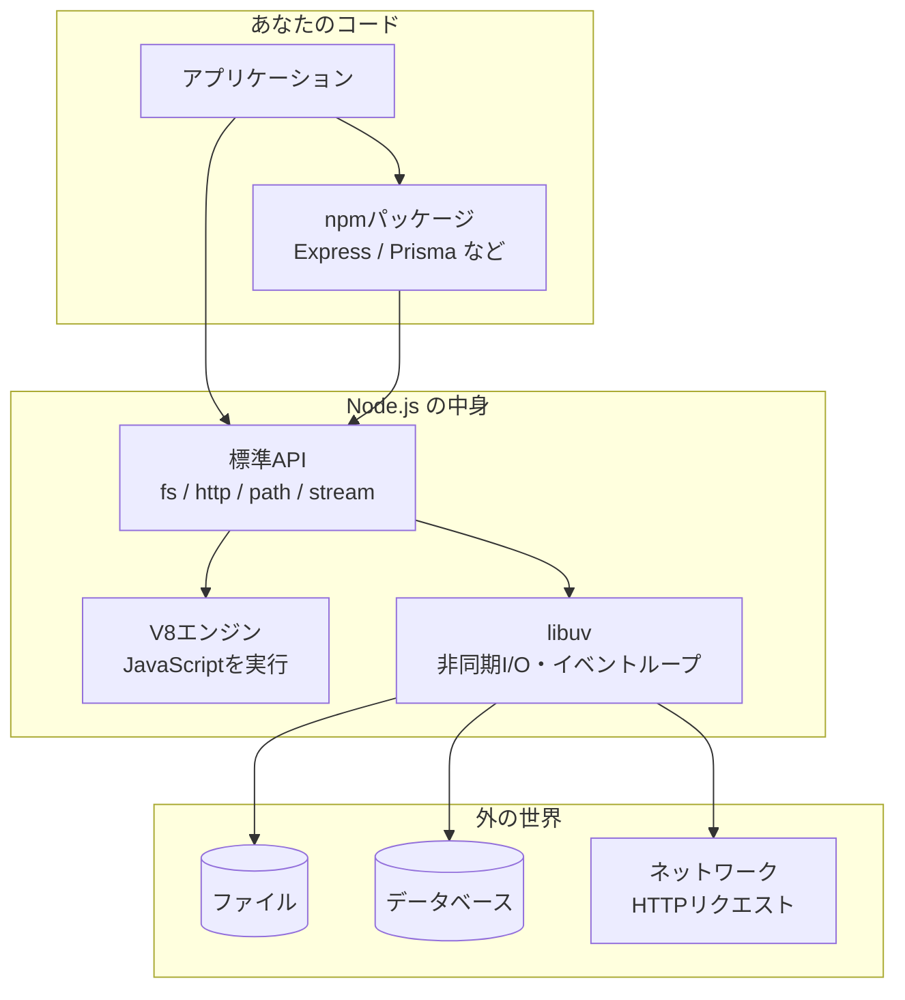

# Node.js 完全ガイド 総合インデックス

このドキュメント群は、**Node.js を基礎から実務レベルまで体系立てて**学ぶための教材です。「なぜJavaScriptがサーバーで動くのか」から、実際にAPIサーバーを作って運用するところまでを扱います。

- 対象：サーバー側を理解したい人、Next.jsの裏側で何が起きているか知りたい人、APIサーバーを作りたい人
- 前提バージョン：**Node.js 24 LTS**（執筆時点の Active LTS）／ TypeScript
- 関連：[React 完全ガイド](../react/README.md) ／ [Next.js 完全ガイド](../nextjs/README.md)

> 📖 **はじめに読むと理解が早まります** → [JavaScript・Node.js・React・Next.js の関係](../js-stack-relations.md)

---

## 1. まず結論（30秒サマリ）

**Node.js とは「ブラウザの外でJavaScriptを動かすための実行環境」** です。

JavaScriptは元々ブラウザ専用の言語でした。Node.js は**ブラウザからJSエンジン（V8）だけを取り出し、ファイル操作やネットワーク通信の機能を足したもの**です。これによってJavaScriptでサーバーが書けるようになりました。

```
ブラウザのJS        Node.jsのJS
─────────────       ─────────────
DOM操作 ✅          DOM操作 ❌（画面がない）
window ✅           window ❌
fetch ✅            fetch ✅
                    ファイル読み書き ✅
                    サーバー起動 ✅
                    DB接続 ✅
```

理解の鍵は次の3つです。

| 鍵となる概念 | ひとことで | なぜ重要か |
| --- | --- | --- |
| **シングルスレッド＋非同期** | 1人で待ち時間なく捌く仕組み | Node.jsの性能特性と弱点が全部ここから来る |
| **イベントループ** | 「終わった仕事」を順番に処理する司令塔 | 「なぜこの順で実行されるか」が説明できる |
| **モジュールとnpm** | コードの分割と再利用 | 依存管理のトラブルはここの理解不足 |

そして実務の鉄則がひとつ：**「イベントループを止めない」**。重い同期処理を1つ書くだけで、サーバー全体が停止します。

---

## 2. 全体マップ



**V8がJSを実行し、libuvが「待ち」を担当する**——この2つの組み合わせがNode.jsの正体です。

---

## 3. 章立てと読み方

### 基礎編

| # | 章 | 内容 |
| --- | --- | --- |
| ① | [Node.jsとは何か](01-what-is-nodejs.md) | 誕生の背景・ブラウザとの違い・インストール・Deno/Bun比較 |
| ② | [イベントループと非同期](02-event-loop.md) | シングルスレッド・イベントループ・実行順序・ブロッキング |
| ③ | [モジュールとnpm](03-modules-packages.md) | CommonJS vs ESM・package.json・依存管理・トラブル対処 |
| ④ | [標準APIを使う](04-core-apis.md) | fs・path・http・stream・process・環境変数・Web標準API |

### 応用・実践編

| # | 章 | 内容 |
| --- | --- | --- |
| ⑤ | [非同期処理を書きこなす](05-async-patterns.md) | Promise・async/await・並列制御・エラー処理の設計 |
| ⑥ | [サーバーとフレームワーク](06-server-frameworks.md) | 素のhttp・Express・Fastify・Hono・NestJS・API設計 |
| ⑦ | [実務・運用](07-practice-operations.md) | ログ・セキュリティ・パフォーマンス・Docker・監視・テスト |

### 付録

- [用語集・チートシート](glossary.md) ← 用語辞典・逆引き表・頻出エラー早見表

---

## 4. 読者タイプ別のおすすめルート

- **とりあえずサーバーを作りたい** → ① → ③ → ⑥（この3章でAPIが作れます）
- **Next.jsを使うが裏側が不安** → ① → ② → ③ → ④の環境変数 →（[Next.js⑫](../nextjs/12-deploy-operations.md)）
- **「なぜ動かない/遅い」を解決したい** → ② → ⑤（非同期の理解がほぼすべて）
- **本番運用を任された** → ⑦ を中心に、必要に応じて②⑤へ
- **フロントエンドしかやってこなかった** → ① → ② → ④ の順で「サーバー側の常識」が入ります
- **用語だけ引きたい** → [用語集](glossary.md)

---

## 5. 最重要ポイント（シリーズ全体から5つだけ）

1. **Node.jsは「言語」ではなく「実行環境」** —— JavaScriptを動かす場所であり、Reactと比較する対象ではない（→ [①](01-what-is-nodejs.md)）
2. **シングルスレッドなので、重い同期処理は全リクエストを止める** —— Node.jsで最も重大な事故のパターン（→ [②](02-event-loop.md)）
3. **`await` は「待つ」だけ。並列にしたいなら `Promise.all`** —— ループ内の `await` は直列実行になり、遅さの主因になる（→ [⑤](05-async-patterns.md)）
4. **非同期のエラーは try/catch から漏れやすい** —— `.catch()` の付け忘れがプロセス停止を招く（→ [⑤](05-async-patterns.md)）
5. **秘密情報は環境変数に。コードに書かない** —— 事故が最も多く、被害も大きい（→ [④](04-core-apis.md)・[⑦](07-practice-operations.md)）

---

## 6. このシリーズの前提バージョン

| 項目 | 前提 | 備考 |
| --- | --- | --- |
| Node.js | **24 LTS**（Active LTS） | 26はCurrent。本番は偶数番のLTSを使う |
| モジュール | **ESM（`import`）推奨** | CommonJS（`require`）も現役。差分は[③](03-modules-packages.md) |
| 言語 | TypeScript 推奨 | Node.js 24 は型注釈付きTSを直接実行可能 |
| パッケージ管理 | npm / pnpm | pnpm はディスク効率と速度に優れる |

### Node.jsのバージョン選び

| バージョン | 状態 | 使うべきか |
| --- | --- | --- |
| **24.x** | **Active LTS** | ✅ **本番で使うならこれ** |
| 26.x | Current | 新機能を試すなら。本番は避ける |
| 22.x | Maintenance LTS | 既存プロジェクトのみ。順次移行を |
| 20.x 以下 | EOL | ❌ セキュリティ更新が止まっている |

> 🔑 **偶数バージョンだけがLTSになります。** 奇数（25・27…）は実験的な位置づけで、本番では使いません。
