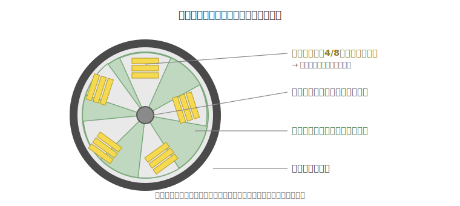
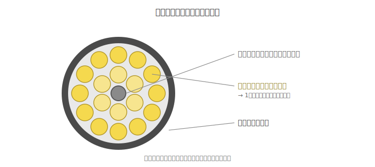

# ③ 光ファイバー ケーブル・コードと接続部材ガイド

> **光ファイバー・光通信 完全ガイド**：[総合インデックス](optical-fiber-overview.md) ｜ [🏠 ポータル](optical-fiber-portal.html) ｜ [①](optical-fiber-guide.md) [②](optical-fiber-network-guide.md) **③** [④](optical-fiber-fieldwork-guide.md) [⑤](optical-fiber-vendors.md) [⑥](sumitomo-electric-optical-fiber.md) [⑦](optical-fiber-transmission-deep-dive.md) [⑧](optical-fiber-transceiver-guide.md) [⑨](optical-fiber-career-guide.md) ｜ [✅ クイズ](optical-fiber-quiz.html) ｜ [🧮 計算機](optical-fiber-calculator.html)

「テープスロット型と層より型って何が違う？」「単心・メガネ・FOコードの使い分けは？」
「ケーブルとコードはどう呼び分ける？」「成端箱とクロージャって結局なに？」
——現場でよく出るこれらの疑問を、たとえ話を交えてゼロから整理したガイド。

> 光ファイバーそのものの仕組み（全反射・コア／クラッドなど）は
> [① ゼロからわかる完全ガイド](optical-fiber-guide.md)、
> これらの線材が張り巡らされたネットワーク全体の地図は
> [② ネットワーク全体像](optical-fiber-network-guide.md) を参照。

---

## 0. まず全体像（30秒）

光ファイバーの「線」は、用途と頑丈さで呼び名が変わる。

```
細い・柔らかい・機器寄り                      太い・頑丈・敷設寄り
   コード ───────────────────────────────────▶ ケーブル
 （屋内・機器間・1〜十数心）              （屋外・幹線・数十〜数千心）

接続するための箱
   成端箱  … ケーブルの「端」で心線をコネクタ化する（屋内寄り）
   クロージャ … ケーブルの「途中」の接続・分岐を守る（屋外寄り・防水）
```

---

## 1. テープスロット型ケーブル vs 層より型ケーブル

どちらも「たくさんの光ファイバ心線を1本のケーブルにまとめる方法」だが、**心線の並べ方** が違う。

### テープスロット型ケーブル

中心に **溝（スロット）付きの棒（スロットロッド）** を置き、その溝に
**テープ心線**（4心・8心などを横一列に並べてテープ状にしたもの）を
**積み重ねて** 収納する。スロットロッドの中心には抗張力体（テンションメンバ）が入る。



- **超多心・高密度**：同じ太さでたくさんの心線を詰められる（数百〜数千心も）。
- **多心一括融着**：テープ単位（4心・8心）をまとめて一度に融着接続できるので、**接続作業が速い**（融着の仕組みは[④ 施工・測定](optical-fiber-fieldwork-guide.md)）。
- **SZより**のスロットなら、布設後でも目的の心線を取り出す **中間分岐** がしやすい。
- 主な用途：通信会社の **幹線・大容量** ケーブル、地下管路など。

> **たとえ話**：板チョコのように整列した心線（テープ）を、本棚の段（スロット）に
> 何枚も差し込んでいくイメージ。きっちり詰まるのでたくさん入る。

### 層より型ケーブル（ストランド型／層撚り型）

中心の **テンションメンバ** の周りに、**心線（単心または小さなユニット）を層状にらせん撚り** して配置する。



- **単心の取り回しがしやすい**：1本ずつ識別・分岐がしやすい。
- **中小心数向け**：テープスロットほどの超高密度ではないが、柔軟で扱いやすい。
- 主な用途：中小心数の配線、引き落とし区間など。

> **たとえ話**：1本ずつの糸を芯のまわりに「より縄」のように巻きつけたもの。
> 1本だけほどいて使う、といった融通がきく。

### 早見表

| 観点 | テープスロット型 | 層より型 |
|------|----------------|---------|
| 心線の並べ方 | テープ心線をスロット（溝）に積層 | 心線をテンションメンバ周りに層状撚り |
| 心数・密度 | 超多心・高密度が得意 | 中小心数向け |
| 接続作業 | 多心一括融着で速い | 単心ごとに融着 |
| 単心の分岐 | テープ単位が基本（SZ撚りで中間分岐可） | 単心の識別・分岐がしやすい |
| 主な用途 | 幹線・大容量・地下管路 | 中小規模配線・引き落とし |

---

## 2. 単心コード / メガネコード / FOコード の違い

いずれも **屋内・機器接続向けの「コード」**。心線の本数と形でこう呼び分ける。

### 単心コード（1心）

- 光ファイバ心線 **1本** を、抗張力繊維（アラミド＝ケブラー等）で包み外被をかぶせたもの。
- 1方向ぶん（**シンプレクス**）。直径 φ2.0／φ3.0mm などが定番。
- 用途：機器への接続、パッチコードの片側、配線盤など。

```
 単心コード   ●  ← 円が1つ
```

### メガネコード（2心）

- 単心コードを **2本横に並べて連結** したもの。断面が **8の字（めがね）型**。
- 送信・受信のペア＝**双方向（デュプレックス）** に使う。
- 中央のくびれから **引き裂いて2本に分けられる**（ジッパー状）。
- 用途：サーバー／スイッチ／データセンター間など、Tx・Rxをペアで配線する場面。

```
 メガネコード  ●━● ← 円2つが連結（8の字）
```

> **たとえ話**：単心コードが「片道1車線」、メガネコードは「上り下りがセットの2車線」。

### FOコード（ファンアウトコード）

- **FO＝Fiber Optic ではなく「ファンアウト（Fan-Out＝扇状に展開）」** の略。
- **テープ心線ケーブルの端を、1心ずつのコネクタに“ばらして”成端する** ための多心コード。
- 4心・8心・12心などがあり、片端はテープ心線、もう片端が1心ずつのコネクタになる。
- 同じ心数を単心コードで何本も引くより **配線がかさばらず、すっきり** まとめられる。
- 用途：架内（ラック内）配線、テープ心線ケーブルのコネクタ成端。

```
 FOコード   ▤▤▤▤ ─┬─● (1心コネクタ)
 (4心の例)        ├─●
                  ├─●
                  └─●   ← テープを扇状に展開して成端
```

> **たとえ話**：4本まとめた“きしめん”の端を、1本ずつの“そうめん”に
> ほぐして、それぞれにプラグを付けるイメージ。

### 早見表

| | 心線数 | 形・特徴 | 主な用途 |
|--|------|---------|---------|
| 単心コード | 1心 | 円1つ。単方向（シンプレクス） | 機器接続・パッチ片側 |
| メガネコード | 2心 | 8の字型。双方向（デュプレックス）。裂いて分けられる | スイッチ／サーバー間 |
| FOコード | 4/8/12心 | テープ心線を1心ずつに展開（ファンアウト） | 架内配線・テープ心線の成端 |

---

## 3. 「ケーブル」と「コード」の違い

同じ光ファイバでも、**どこで・どう使うか** で呼び名と作りが変わる。

| 観点 | コード（cord） | ケーブル（cable） |
|------|--------------|-----------------|
| 主な場所 | 屋内・機器のそば | 屋外・長距離・幹線 |
| 心数 | 1〜十数心が中心 | 数十〜数千心も |
| 強度部材 | アラミド繊維で軽く補強 | 鋼線やFRPのテンションメンバで頑丈に |
| 外被・耐性 | 柔らかく取り回し重視 | 厚く頑丈、防水・耐候・対張力 |
| 役割 | 機器⇄配線盤をつなぐ最後のひと区間 | 区間と区間を結ぶ“幹” |
| イメージ | 延長コード・パッチ | 電柱や地中を走る本線 |

> ざっくり：**「コード＝細く柔らかく機器寄り」「ケーブル＝太く頑丈で敷設寄り」**。
> コードはコネクタを付けて機器につなぐ前提、ケーブルは過酷な環境に敷く前提で作られている。

---

## 4. 成端箱とクロージャは何が違う？

どちらも **光ファイバの接続点を収める箱**。違いは「ケーブルの端か途中か」と「屋内か屋外か」。

### 光成端箱（せいたんばこ）

- 役割：ケーブルの **端末（終点）** で、心線を **コネクタ化（＝成端）** して機器側とつなぐ箱。
- 中身：ケーブルの心線をピグテールに融着し、**アダプタ（コネクタの差込口）** に整列。
  ここからパッチコードで機器へつなぐ。
- 設置：**屋内** が中心（壁掛け・19インチラック・自立型など）。配線盤・パッチパネル的な役割。
- 別名：光接続箱、光成端架、スプライスボックスなど（メーカーにより呼称差あり）。

```
 [屋外からのケーブル] ─▶[ 成端箱 ]── アダプタ ──[パッチコード]──▶ 機器
                          融着→コネクタ化（端末で“仕上げる”）
```

### 光クロージャ

- 役割：ケーブルの **途中（中間）** の **接続・分岐点** を、外から守りつつ収める箱。
- 中身：内部の **トレイ** に融着接続点やスプリッタ（分岐器）を収納・整理。
- 設置：**屋外** が中心（架空＝電柱／地中＝マンホール・ハンドホール）。
  雨・ほこり・浸水に耐える **防水・防塵（IP等級）** 構造。
- 用途：幹線の中継接続、途中での分岐・引き落とし。

```
 ──ケーブル──[ クロージャ ]──ケーブル──   （途中で接続・分岐し、防水保護）
                  │
                  └─▶ 分岐して別方向へ
```

### 早見表

| 観点 | 成端箱 | クロージャ |
|------|--------|-----------|
| 位置 | ケーブルの **端末** | ケーブルの **途中** |
| 主目的 | 心線をコネクタ化（成端）して機器へ | 接続・分岐点を保護・収納 |
| 設置場所 | 屋内が中心 | 屋外（架空・地中）が中心 |
| 防水 | 屋内前提（屋外対応型もある） | 防水・防塵が前提 |
| イメージ | 配線盤／パッチパネル | 電線の途中にある保護ボックス |

> ※「成端箱・接続箱・クロージャ」は重なる呼び方をされることもあるが、
> **“端でコネクタ化＝成端箱” “途中で接続分岐を防水保護＝クロージャ”** と覚えると整理しやすい。

---

## まとめ

- **ケーブルの集合方式**：テープスロット型＝テープ心線を溝に積層して超多心・高密度・一括融着。層より型＝心線を芯の周りに撚り、単心の分岐がしやすい中小心数向け。
- **コードの種類**：単心＝1心・単方向／メガネ＝2心・双方向・裂ける／FO＝テープ心線を1心ずつに展開（ファンアウト）するコード。
- **ケーブル vs コード**：ケーブルは屋外・頑丈・多心、コードは屋内・柔軟・機器寄り。
- **箱の違い**：成端箱＝端末でコネクタ化（屋内寄り）、クロージャ＝途中の接続分岐を防水保護（屋外寄り）。

> **次に読む**：これらの線材を実際に**つなぎ・測る**手順（融着・研磨タイプ・心線の色識別・OTDR）は
> [④ 施工・接続・測定・保守ガイド](optical-fiber-fieldwork-guide.md) へ。
> 各部材を作っているメーカーは [⑤ 大手メーカー比較](optical-fiber-vendors.md) へ。
> 理解度チェックは [✅ クイズ](optical-fiber-quiz.html) でどうぞ。
