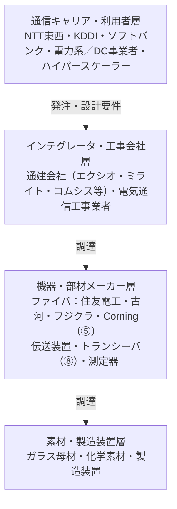
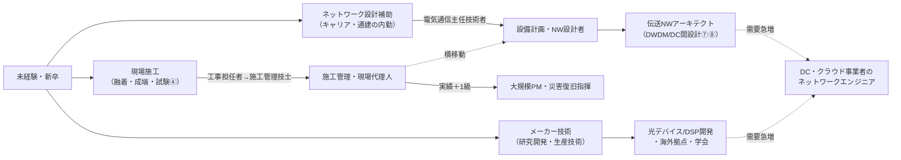

# ⑨ 光通信の資格・業界・キャリアガイド

> **光ファイバー・光通信 完全ガイド**：[総合インデックス](optical-fiber-overview.md) ｜ [🏠 ポータル](optical-fiber-portal.html) ｜ [①](optical-fiber-guide.md) [②](optical-fiber-network-guide.md) [③](optical-fiber-cable-types.md) [④](optical-fiber-fieldwork-guide.md) [⑤](optical-fiber-vendors.md) [⑥](sumitomo-electric-optical-fiber.md) [⑦](optical-fiber-transmission-deep-dive.md) [⑧](optical-fiber-transceiver-guide.md) **⑨** ｜ [✅ クイズ](optical-fiber-quiz.html) ｜ [🧮 計算機](optical-fiber-calculator.html)

技術がわかったら、次は「人と仕事」の話。この業界にどんなプレイヤーがいて、どんな資格が効いて、
どんなキャリアが描けるのか——就職・転職・業界研究、そして発注側として業界を理解したい人のための章。

> ⚠️ 資格の試験制度・科目・受験資格は改定されることがあります。受験前に必ず各試験機関の公式情報を確認してください。

---

## 0. まず全体像（30秒）

光通信の業界は、ざっくり**4層のピラミッド**でできている。

*（図が表示されない環境用：[SVG版](optical-fiber-svg/career-1.svg)）*

- **働き口はどの層にもある**：ネットワーク設計（キャリア）、施工管理・現場（工事会社）、研究開発・生産技術・営業技術（メーカー）。
- 資格は大別すると**「工事の入口」＝工事担任者**、**「ネットワークの管理職級」＝電気通信主任技術者**、
  **「施工現場の腕前」＝技能検定・民間認定**の3系統。

---

## 1. 資格の体系 — どれを取ればいい？

### 1-1. 国家資格マップ

| 資格 | 何ができる/何の証明？ | 難易度感 | 向いている人 |
|------|---------------------|---------|------------|
| **工事担任者（第二級/第一級デジタル通信）** | 通信回線への**端末設備の接続工事**を行う・監督する国家資格。光回線の宅内工事（②④の世界）はこれ | 入門〜中級。第二級は初学者の定番 | 通信工事の入口に立つ人・情シス |
| **電気通信主任技術者（伝送交換／線路）** | 通信事業者の**ネットワークの工事・維持・運用の監督責任者**。事業用設備には選任義務がある | 難関。業界の「一級建築士」的位置づけ | キャリア・通建で設計/管理職を目指す人 |
| **電気通信工事施工管理技士（1級/2級）** | 通信工事の**施工管理（現場監督）**。2019年新設で公共工事の技術者配置に直結 | 中級〜。実務経験要件あり | 工事会社の施工管理者 |
| **電気工事士／電気主任技術者** | 電気側の資格だが、通信土木・電源工事で併用が多い | ― | 幅を広げたい施工系人材 |
| **陸上無線技術士など無線系** | モバイル基地局（②§4）を扱うなら光とセットで効く | ― | モバイルインフラ系 |

- **迷ったら**：現場・工事寄りなら「第二級デジタル通信 → 第一級 → 施工管理技士」、
  設計・キャリア寄りなら「工事担任者 → 電気通信主任技術者（伝送交換）」が王道ルート。
- 「線路」区分の主任技術者は、まさに③④の**光ケーブル・土木・線路設備**が試験範囲。このシリーズの内容が下地になる。

### 1-2. 技能・民間系（現場の腕前の証明）

| 資格・認定 | 内容 |
|-----------|------|
| **技能検定（配電盤・制御盤組立て等の関連職種）** | 国家技能検定制度。工事系の腕前の公的証明 |
| **光ファイバ施工技能の民間認定（FOA等・各団体）** | 融着・成端・測定（④）の実技講習＋認定。工事会社の教育で活用 |
| **メーカー系トレーニング** | 融着接続機・測定器メーカー（⑤⑥）の機器講習。実務直結 |
| **CCNA等ネットワーク資格** | 光の上で動くL2/L3の知識。DC系（⑧）に進むなら相性が良い |

> 実務の評価は「資格＋**融着・測定の実技経験**」のセット。④の内容（融着・OTDR・清掃検査）は
> そのまま実技講習のカリキュラムと重なる。

---

## 2. 業界のプレイヤーを知る

### 2-1. 通信キャリア（発注側の頂点）

- **NTT東西**：FTTHのアクセス網（②）を全国に持つ。光コラボ（回線の卸）で多数のISPが乗る構造。
- **KDDI・ソフトバンク・楽天モバイル・電力系（オプテージ等）**：自前網＋モバイルバックホール。
- **国際系・DC系**：海底ケーブル（②§3）はNTT系・KDDI系に加えGoogle/Meta等の巨大IT企業が主要出資者。

### 2-2. 通信建設会社（通建）

キャリアの設計図を現実の電柱・管路・ビルに落とす実行部隊。**エクシオグループ・ミライト・ワン・コムシスHD**が3大手。
仕事は線路設備の設計、架空・地中ケーブルの敷設（③）、融着・成端・試験（④）、保守・災害復旧まで。
**5G基地局・DC建設ラッシュで人材需要が高い**一方、技術者の高齢化で若手が歓迎される業界でもある。

### 2-3. メーカー（⑤⑥⑧で既出の世界）

- ファイバ・ケーブル・部材：住友電工・古河電工・フジクラ・Corning・Prysmian・YOFC（⑤）
- 伝送装置・トランシーバ：国内外の装置ベンダ＋光モジュール専業メーカー（⑧）。AI需要の爆心地
- 測定器：OTDR・光パワーメータ等（④）の計測器メーカー
- 職種は研究開発（材料・光学・DSP）、生産技術、品質保証、営業技術（セールスエンジニア）と幅広い

### 2-4. 市場感（ざっくり）

- 世界の光ファイバ・ケーブル市場は**年率数％で成長を続ける数兆円規模**。牽引役はFTTH（新興国）・5G・**AIデータセンタ（⑧）**。
- 日本国内はFTTH整備が一巡し、**保守・更改・DC・非通信用途（センシング・医療）**へ軸足が移りつつある。
- 光ファイバの**センシング利用**（歪み・温度を測るDAS/DTS）はインフラ監視・防災で成長中——通信以外の出口も広がっている。

---

## 3. 歴史を深掘り — 「日本のお家芸」になるまで

①§11の年表を、産業史の視点で拡張する。

| 年代 | 出来事 | 意味 |
|------|--------|------|
| 1966 | カオ博士「高純度ガラスなら光通信が可能」と提唱 | 理論の出発点（2009年ノーベル賞） |
| 1970 | Corningが損失20dB/kmのファイバを実現 | 「実用の壁」を初突破 |
| 1970s後半 | 日本勢（電電公社＋メーカー）がVAD法を開発 | 量産・低損失化で日本が世界の先頭集団に |
| 1980s | 日本縦貫の光幹線・国際海底ケーブルが光化 | 銅から光への世代交代が始まる |
| 1990s | **EDFA実用化**・WDM登場 | 「増幅を光のまま」で容量が桁違いに（②⑦） |
| 2000s | FTTH本格展開。日本は世界最速級で普及 | アクセス網の光化＝「光回線」が家庭の言葉に |
| 2010 | **100Gコヒーレント商用化**（⑦） | DSP時代の幕開け。以後、多値化競争へ |
| 2010s後半 | データセンタ・クラウドが最大顧客に | 通信キャリア中心からDC中心へ主役交代（⑧） |
| 2020s | 400ZR・800G・CPO・マルチコア海底採用・AIクラスタ | 「AIのための光」時代。SDM実用化が始まる（⑦⑧） |

> 歴史の教訓：ブレークスルーは**材料（低損失ガラス）→ デバイス（EDFA）→ 信号処理（コヒーレントDSP）→
> 空間（マルチコア）**と主戦場を移してきた。キャリアを考えるときも「次の主戦場」を意識すると良い。

---

## 4. キャリアパスの実例マップ

*（図が表示されない環境用：[SVG版](optical-fiber-svg/career-2.svg)）*

- **現場系**：手に職（融着・測定）→ 施工管理 → 大規模プロジェクト管理。資格と実績が直結する積み上げ型。
- **設計系**：アクセス設計から始めて、伝送・DWDM・DC間（⑦⑧）へ。主任技術者が節目になる。
- **メーカー系**：材料・光学・信号処理の専門性で勝負。AI需要でトランシーバ・SiPh人材（⑧）は世界的売り手市場。
- **横断の穴場**：光ファイバセンシング、海底ケーブル業界（世界で数社しかない⑧②）、計測器、
  そして「光がわかるDCファシリティ人材」——供給が少なく重宝される。

---

## 5. 学び方ロードマップ（このシリーズの先へ）

| 段階 | やること |
|------|---------|
| 1. 基礎固め | 本シリーズ①〜④を読む → [✅ クイズ](optical-fiber-quiz.html)で8割取る |
| 2. 数字に慣れる | [🧮 計算機](optical-fiber-calculator.html)で損失バジェット計算を体で覚える（④§4） |
| 3. 資格の入口 | 工事担任者（第二級デジタル通信）の過去問へ。①②④の内容がそのまま土台になる |
| 4. 実技 | 融着接続機・OTDRの講習（メーカー・団体の実機トレーニング）を受ける |
| 5. 深掘り | ⑦⑧を読み、電気通信主任技術者（伝送交換 or 線路）や CCNA へ進む |
| 6. 現場情報 | ⑤⑥のカタログ・技報を読む習慣。展示会（光通信・DC系）で最前線を見る |

---

## 6. よくある疑問（FAQ）

**Q. 文系・未経験でも入れる業界？**
A. 入れる。通建・工事会社は未経験採用＋社内訓練（実技→資格）が確立している。営業技術・施工管理は
コミュニケーション力の比重も大きい。本シリーズ①〜④レベルの言葉がわかるだけで面接では十分目立つ。

**Q. 光ファイバ工事の仕事はAIに奪われない？**
A. 物理世界の施工・保守（④）は自動化が最も難しい領域のうえ、**AIそのものがDC建設・光配線の需要を
生んでいる**（⑧）。むしろ人手不足が続く見通しで、資格保有者の価値は上がる方向。

**Q. 資格なしでも働ける？**
A. 補助作業は可能だが、端末設備の接続や監督には工事担任者等が必要になる場面が多く、
昇給・現場責任者への道は資格とセット。会社が取得支援するのが業界の通例。

**Q. 主任技術者と施工管理技士はどちらが先？**
A. 役割が違う。**主任技術者＝事業者のネットワーク全体の維持監督**（設備側）、
**施工管理技士＝個々の工事現場の監督**（工事側）。所属先が通建なら施工管理技士、キャリア・設備側なら主任技術者が本命。

---

## まとめ

- 業界は**キャリア → 通建 → メーカー → 素材**の4層。働き口と役割は層ごとに違う。
- 資格は**工事担任者（入口）／電気通信主任技術者（設備監督）／施工管理技士（現場監督）**の3本柱＋実技認定。
- 歴史は**材料→EDFA→DSP→空間多重**と主戦場が移り、いまは**AIデータセンタが最大の成長ドライバ**。
- 未経験からの参入経路が確立した、**人材需要の強い「物理インフラ×成長産業」**である。

> **これでシリーズ完結**。総復習は [✅ クイズ](optical-fiber-quiz.html)、進捗管理は [🏠 学習ポータル](optical-fiber-portal.html) へ。
