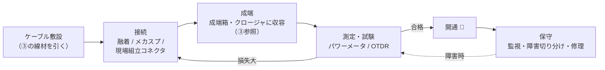
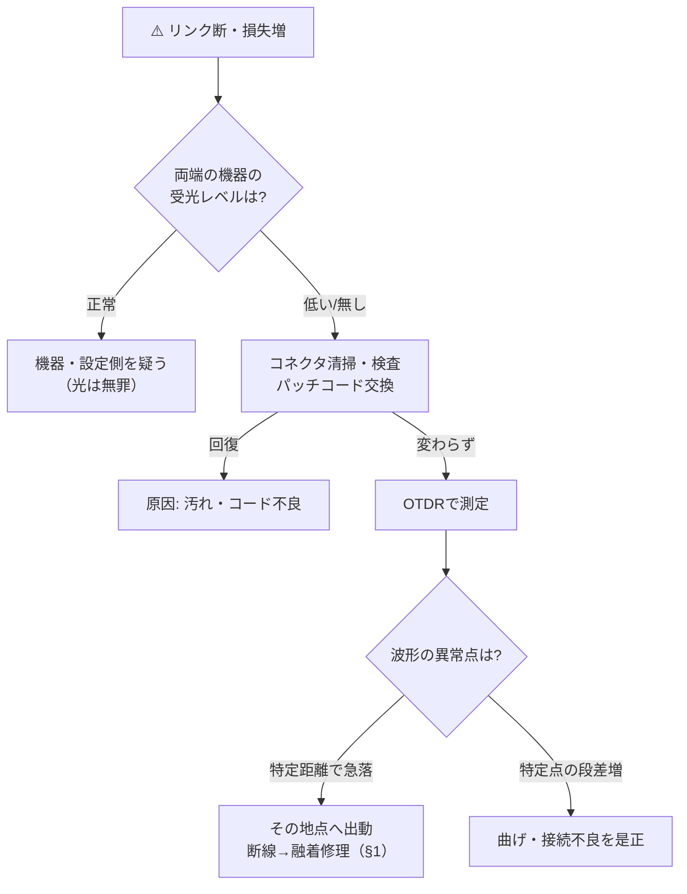

# ④ 光ファイバー 施工・接続・測定・保守ガイド

> **光ファイバー・光通信 完全ガイド**：[総合インデックス](optical-fiber-overview.md) ｜ [① 入門](optical-fiber-guide.md) ｜ [② ネットワーク全体像](optical-fiber-network-guide.md) ｜ [③ ケーブル・部材](optical-fiber-cable-types.md) ｜ **④ 施工・測定** ｜ [⑤ メーカー比較](optical-fiber-vendors.md) ｜ [⑥ 住友電工](sumitomo-electric-optical-fiber.md) ｜ [✅ クイズ](optical-fiber-quiz.html)

「融着とメカスプはどう使い分ける？」「APCの緑コネクタは何が違う？」「OTDRの波形ってどう読む？」——
線材と部材（③）を実際に**つなぎ・測り・守る**、現場作業の視点で光ファイバーを整理する章。

---

## 0. まず全体像（30秒）

光の工事は、突き詰めると **「つなぐ」と「測る」の繰り返し**。



*（図が表示されない環境用：[SVG版](optical-fiber-svg/fieldwork-1.svg)）*

- **接続の3方式**：融着（最良・要機材）／メカニカルスプライス（簡易）／現場組立コネクタ（コネクタ化まで一気に）。
- **測定の2本柱**：**パワーメータ**（トータルの損失を測る）と **OTDR**（どこで損失が起きているか場所を特定）。
- 品質の敵は **「汚れ・曲げ・接続不良」** の3つ。これで障害の大半が説明できる。

---

## 1. 接続方法の3方式と使い分け

### 1-1. 融着接続（ゆうちゃく）— 品質の王様

**ファイバ同士の端面をアーク放電で溶かして一体化させる**方法。

手順はどの現場でもほぼ共通：

```
① 被覆除去 → ② 清掃(アルコール) → ③ カット(専用カッタで直角に)
→ ④ 融着機にセット → ⑤ 自動調心+放電で溶着 → ⑥ 補強スリーブを熱収縮
```

- 接続損失 **0.02〜0.1dB程度** と最も低く、反射もほぼゼロ。恒久接続の第一選択。
- 専用機（融着接続機、数十万〜数百万円）と電源が必要。
- **コア調心**（コアを画像認識で直接合わせる：低損失・高価）と
  **外径調心**（クラッド外径基準：経済的・FTTH向け）の2方式がある（⑥参照）。
- テープ心線は**多心一括融着**（4〜12心を一度に）で施工が数倍速くなる（③参照）。

> ③で出てきた**カッタ**の出来が品質を左右する。端面が斜め・欠けだと、どんな高級融着機でも損失が出る。

### 1-2. メカニカルスプライス — 電源いらずの簡易接続

**V溝の部品にファイバ2本を差し込み、屈折率整合剤を挟んで機械的に固定**する方法。

- 工具は簡単な治具のみ。**電源不要・短時間**で接続できる。
- 損失は融着よりやや大きめ（〜0.5dB程度）、長期信頼性・反射も融着に劣る。
- 用途：災害復旧の仮接続、融着機を持ち込めない狭所、少数接続の宅内工事。

### 1-3. 現場組立コネクタ — 「接続」と「コネクタ化」を同時に

**現場でファイバにコネクタそのものを取り付ける**方式（③で見た成端の簡易版）。

- 内部にメカニカルスプライス構造や短いファイバ（ピグテール）を内蔵しており、
  **研磨も接着も不要**で数分で組み立てられる（例：住友電工 e-SC／Quick、フジクラ FuseConnect（融着内蔵型）→⑤⑥）。
- 用途：FTTHの宅内成端、ONU周り、成端箱のポート追加。

### 1-4. 使い分け早見表

| | 融着接続 | メカニカルスプライス | 現場組立コネクタ |
|--|---------|-------------------|----------------|
| 損失 | ◎ 0.02〜0.1dB | ○ 〜0.5dB | ○ 〜0.5dB |
| 機材 | 融着機＋カッタ（高価・要電源） | 治具のみ | 専用工具（簡易） |
| 速度 | 1接続数十秒＋準備 | 数分 | 数分 |
| 恒久性 | ◎ 恒久接続 | △ 仮設〜準恒久 | ○ 抜き差し可能になる |
| 主な用途 | 幹線・成端箱・恒久工事全般 | 仮復旧・狭所 | 宅内成端・ポート増設 |

> **たとえ話**：融着＝**溶接**、メカスプ＝**ボルト留め**、現場組立コネクタ＝**プラグを付けてコンセント化**。

---

## 2. コネクタの研磨タイプ — PC / UPC / APC

③でコネクタの**形**（SC/LC/MPO…）を見たが、もう1つ重要な軸が**フェルール端面の研磨タイプ**。
これは**反射（戻り光）をどれだけ抑えるか**の違いだ。

| 研磨 | 端面の形 | 反射減衰量 | 色の慣習 | 主な用途 |
|------|---------|-----------|---------|---------|
| **PC** | 球面研磨 | 〜-40dB | ― | 旧来の標準 |
| **UPC** | より高精度な球面 | 〜-50dB | **青** | 現在の標準（データ通信全般） |
| **APC** | **8°斜め**研磨 | 〜-60dB | **緑** | CATV・映像・PON・高精度測定 |

- APCは端面を8°傾けることで、**反射光をコアの外へ逃がす**。反射に敏感なアナログ映像やPONシステムで必須。
- **⚠️ APCとUPCは接続してはいけない**。端面の角度が合わず**すき間ができて大損失**になり、
  最悪端面を傷める。「**青は青と、緑は緑と**」が現場の鉄則。

```
 UPC（球面）      APC（8°斜め）     UPC + APC 混在（NG!）
 ──◠ ◠──        ──◢ ◣──          ──◠ ◣──
  ぴったり密着       ぴったり密着        角度が合わず空隙→大損失
```

---

## 3. 心線の色識別 — 「何番の心線か」を間違えないために

多心ケーブル（③）の中の心線は、**被覆の色で番号を識別**する。
日本では次の順が広く使われる（JIS慣行）：

| 番号 | 1 | 2 | 3 | 4 | 5 | 6 | 7 | 8 |
|------|---|---|---|---|---|---|---|---|
| 色 | **青** | **白** | **黄** | **緑** | **赤** | **紫** | **黒（若草）** | **桃（ローズ）** |

- テープ心線では「テープ番号 × 心線色」の組み合わせで数百心から1本を特定する。
  例：4心テープの12枚目・3心目＝「12番テープの黄」。
- 層より型では「層の位置＋色」で追う。**対照ミス＝生きている回線の切断事故**に直結するので、
  色規則と心線対照（§5-3）は保守の基本中の基本。
- ※色順は国・事業者で異なる（米TIAは青-橙-緑-茶…）。他国の資料を読むときは要注意。

---

## 4. 測定 — 「ちゃんと通っているか」を数字で示す

### 4-1. dBの読み方（これだけは暗記）

光の損失・利得は**dB（デシベル）**で表す。対数なので掛け算が足し算になる。

| dB | 倍率（残る光） | 覚え方 |
|----|--------------|--------|
| **-3dB** | 約1/2 | 「3dBで半分」 |
| **-10dB** | 1/10 | 「10dBで1桁」 |
| -20dB | 1/100 | 10dB×2回 |
| -30dB | 1/1000 | スプリッタ32分岐＋αくらい |

- 例：光ファイバの損失 0.2dB/km × 50km ＝ 10dB ＝ **光が1/10になる**。
- 機器の絶対パワーは **dBm**（1mW基準）。「-25dBm」のような受光レベル表示はこれ。

### 4-2. 損失バジェット（光リンク設計の足し算）

「送信パワー − 受信に必要な最低パワー」の余裕（バジェット）内に、経路の損失合計が収まればリンクは成立する。

```
例：FTTH（GE-PON、バジェット約29dB）の場合
  ファイバ 5km × 0.35dB/km  =  1.75dB
  スプリッタ 32分岐          = 約17.5dB   ← 実は分岐が最大の消費者
  融着 4点 × 0.05dB          =  0.2dB
  コネクタ 3点 × 0.5dB       =  1.5dB
  ------------------------------------
  合計 約21dB ≤ 29dB → OK（余裕 約8dB）
```

- 分岐数（②のPON）とコネクタ数が損失の主役。**距離そのものは意外と効かない**のが光の凄さ。
- 施工後の**パワーメータ＋安定化光源**による実測（インサーションロス試験）で、この設計値以内かを確認する。

### 4-3. OTDR — 光のレーダーで「どこが悪いか」を見る

**OTDR（光パルス試験器）** は、片端からパルス光を打ち込み、
**戻ってくる微弱な散乱光・反射光を時間分解で観測**して、距離ごとの損失を波形にする測定器。

```
損失↑
 │＼
 │  ＼____
 │       │＼          ＿波形の傾き = ファイバ損失(dB/km)
 │       ↓  ＼___∿＿
 │     段差       ∿ ＼      ∿ スパイク = コネクタ反射
 │   (融着点の損失)     ＼│
 │                      ↓ 大きな段差+反射 = 断線・破断点!
 └──────────────────────────▶ 距離
```

読み方の基本：

| 波形の特徴 | 意味 |
|-----------|------|
| なだらかな右肩下がり | ファイバ自体の損失（傾き＝dB/km） |
| 反射のない小さな段差 | **融着点**（良好なら0.1dB以下） |
| スパイク（反射）＋段差 | **コネクタ・メカスプ** |
| 大きな段差・急落 | **急な曲げ・破断・断線** → その距離を見て現場へ直行 |

- **1本で「どこが・何dB悪いか」まで分かる**のがOTDRの価値。障害時は「局から3.2km地点で全損」のように
  切り分けできるので、電柱番号レベルで現場を特定できる。
- 至近距離が測れない「デッドゾーン」対策に、ダミーファイバ（ランチコード）を挟むのが定石。

### 4-4. その他の定番測定・検査

| 測定・検査 | 目的 |
|-----------|------|
| **可視光源（VFL・赤色レーザー）** | 数kmまでの断線・曲げ箇所が**赤く光って見える**簡易確認 |
| **コネクタ端面検査（マイクロスコープ）** | 接続前の汚れ・傷チェック（§5-1） |
| **心線対照器** | 曲げから漏れる微弱光で「この心線が使用中か」を無切断で確認 |
| **波長分散・OSNR測定** | 長距離・高速幹線（②）の品質評価 |

---

## 5. 保守・障害切り分け

### 5-1. 障害原因の御三家：「汚れ・曲げ・接続」

**光障害の大半はコネクタの汚れ**と言われるほど、端面の汚れは支配的な原因。

- コアは9µm（①）。**目に見えないホコリ1粒で道をふさげる**サイズ感。
- 鉄則：「**接続前に必ず清掃・検査**」。専用クリーナ（ワンクリック型・テープ型）で拭き、
  マイクロスコープで確認してから挿す。**「Inspect Before You Connect」**。

次に多いのが**曲げすぎ（曲げ損失）**：

- 許容曲げ半径（G.652で30mm程度、G.657なら15〜5mm→⑤⑥）より急に曲げると光が漏れる。
- 結束バンドの締めすぎ、扉への挟み込み、余長の雑な収納が典型犯。**1550nm帯のほうが曲げに敏感**なので、
  「1310nmは正常なのに1550nmだけ損失が大きい」ときは曲げをまず疑う。

### 5-2. 切り分けの基本フロー



*（図が表示されない環境用：[SVG版](optical-fiber-svg/fieldwork-2.svg)）*

### 5-3. 現場の安全・作法

- **通信中の光をのぞかない**：赤外線で見えないが、幹線・増幅後の光は目を傷める出力がある（①FAQ参照）。
- **ファイバくずはゲルシートへ**：カット後の破片はガラス針。皮膚に刺さると見つけられない。
- **活線切断の防止**：作業前の心線対照（§4-4）で「本当に空き心線か」を必ず確認。
- 融着機・カッタは**定期校正・清掃**（放電電極・刃は消耗品）。

---

## 6. よくある疑問（FAQ）

**Q. LANケーブルみたいに自分で光コネクタを付けられる？**
A. 現場組立コネクタ（§1-3）なら訓練すれば可能。ただしLANの圧着より遥かにシビアで、
測定器なしでは品質確認もできないので、実務は資格・訓練を受けた施工者が行うのが普通。

**Q. 光ファイバは経年劣化する？**
A. ガラス自体は安定だが、**水分＋張力による微小クラック成長**や被覆の劣化があるため寿命は一般に20〜30年設計。
コネクタ・融着点よりも、曲げっぱなし・張りっぱなしの機械的ストレスが寿命を縮める。

**Q. 「フレッツの工事」って実際なにをしている？**
A. ②のドロップケーブルを電柱から宅内へ引き込み、現場組立コネクタ等で成端してONUに接続、
パワーメータで受光レベルを確認する——まさに本章の内容のミニ版。

**Q. OTDRとパワーメータ、どっちを買えばいい？**
A. 役割が違う。**合否判定はパワーメータ**（安い・簡単）、**場所の特定はOTDR**（高価・要スキル）。
開通試験はパワーメータ、障害対応はOTDR、が基本の組み合わせ。

---

## まとめ

- 接続は **融着（品質の王様）／メカスプ（簡易）／現場組立コネクタ（宅内成端）** を場面で使い分ける。
- コネクタは形（SC/LC）に加えて研磨（**UPC=青／APC=緑**）があり、**青と緑は混ぜるな危険**。
- 損失は **dBの足し算（損失バジェット）** で設計し、**パワーメータで合否・OTDRで場所特定**。
- 障害の御三家は **汚れ・曲げ・接続不良**。「接続前に清掃・検査」が最強の予防策。
- 心線の色識別と心線対照を守ることが、事故らない保守の第一歩。

> **次に読む**：これらの機材・部材を誰が作っているかは [⑤ 大手メーカー比較](optical-fiber-vendors.md)、
> 具体的な製品選定は [⑥ 住友電工 完全網羅ガイド](sumitomo-electric-optical-fiber.md) へ。
> 理解度チェックは [✅ クイズ](optical-fiber-quiz.html) でどうぞ。
