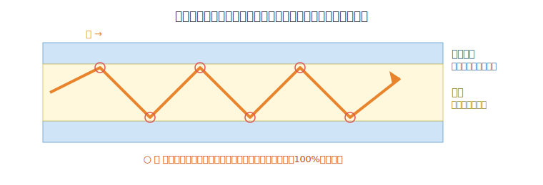
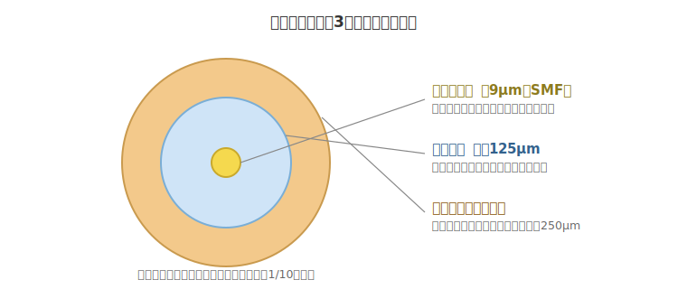
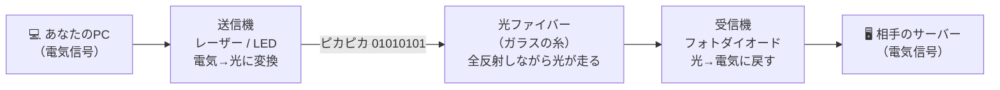
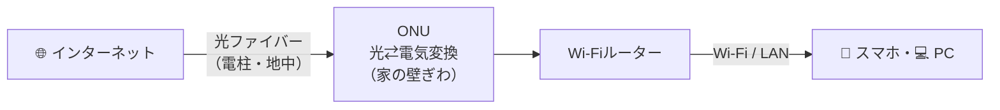

# ① 光ファイバー ゼロからわかる完全ガイド

> **光ファイバー・光通信 完全ガイド**：[総合インデックス](optical-fiber-overview.md) ｜ [🏠 ポータル](optical-fiber-portal.html) ｜ **①** [②](optical-fiber-network-guide.md) [③](optical-fiber-cable-types.md) [④](optical-fiber-fieldwork-guide.md) [⑤](optical-fiber-vendors.md) [⑥](sumitomo-electric-optical-fiber.md) [⑦](optical-fiber-transmission-deep-dive.md) [⑧](optical-fiber-transceiver-guide.md) [⑨](optical-fiber-career-guide.md) ｜ [✅ クイズ](optical-fiber-quiz.html) ｜ [🧮 計算機](optical-fiber-calculator.html)

「光ファイバーって名前は聞くけど、結局なに？」という人のためのガイド。
むずかしい言葉はたとえ話でかみくだきつつ、仕組み・種類・身近な使われ方までひととおりわかるようにまとめた。
シリーズの入口となる章なので、まずここから読めば以降の章（ネットワーク・部材・施工・メーカー）にスムーズに進める。

---

## 0. 1分でわかる「ざっくり結論」

- **光ファイバー** ＝ 髪の毛くらいの細さの「ガラスの糸」。
- その中を **光（ピカピカした信号）** が通って、データを運ぶ。
- 光は速くて、遠くまで弱まりにくいので、**大量の情報を・速く・遠くまで** 送れる。
- 家のインターネット（光回線）、海をまたぐ国際通信、データセンターなど、いまの通信の土台になっている。

イメージ：**「光のモールス信号を、ガラスのストローの中で何百万回もチカチカさせて情報を送っている」** くらいの理解でOK。

---

## 1. そもそも光ファイバーとは？

光ファイバーは、**光を通すための細いガラス（またはプラスチック）の線**。

- 太さは髪の毛ほど（おおよそ 0.125 mm ＝ 125 マイクロメートル）。
- この中を光が走り、その光の **「点いた／消えた」** を `1` と `0` に対応させて情報を運ぶ。

> **たとえ話**
> 暗い部屋で懐中電灯を「ピカ・ピカ・ピカッ」と点滅させて、離れた友だちに合図を送る遊びを想像してほしい。
> 「2回光ったら “はい”、3回なら “いいえ”」みたいなルールを決めれば、光だけで会話できる。
> 光ファイバーはこれを、**目に見えないほど高速に・ガラスの糸の中で** やっているだけ。

---

## 2. なぜ「電気」じゃなく「光」を使うの？

昔の通信は銅線（メタルケーブル）に **電気** を流して情報を送っていた。電話線やLANケーブルがそれ。
でも電気には弱点がある。

| 比較 | 銅線（電気） | 光ファイバー（光） |
|------|------------|------------------|
| 速さ・容量 | 限界がある | けた違いに大きい |
| 遠くへ送る | すぐ弱まる | 弱まりにくい |
| ノイズ（雑音） | 電磁波の影響を受けやすい | 電気的ノイズに強い |
| 盗聴 | されやすい | されにくい |
| 重さ・太さ | 重くて太い | 軽くて細い |

光は **周波数がとても高い** ため、たくさんの情報を一度に詰め込める。
さらに光は電気のように「まわりの電気ノイズ」で乱されないので、きれいな信号を遠くまで届けられる。

---

## 3. いちばん大事な仕組み — 「全反射」

「ガラスの糸の中を光が走る」と言うが、なぜ光は外に逃げず、曲がった線の中でもちゃんと進めるのか？
答えは **全反射（ぜんはんしゃ）** という現象。

### 全反射ってなに？

光は、**密度のちがう物質の境目で曲がったり跳ね返ったりする**。
ある角度より浅い角度で当たると、光は外に出ずに **100% 鏡のように跳ね返る**。これが全反射。

> **たとえ話**
> プールの底から水面を斜めに見上げると、空ではなく **プールの底や壁が鏡のように映って見える** ことがある。
> あれが全反射。光が水から空気へ抜けられず、全部はね返っている状態。

### 光ファイバーでの使い方

光ファイバーは、**「光が逃げにくい中心」** を **「光をはね返す外側」** で包む構造になっている。
だから光は中心を **ジグザグに跳ね返りながら** 前へ前へと進み、ケーブルが多少曲がっても外に漏れずに伝わる。

---

## 4. 光ファイバーの構造（中身を輪切りにすると）

光ファイバーは、3つの層が同心円状に重なってできている。

| 部分 | 役割 | たとえ |
|------|------|--------|
| **コア（芯）** | 光が実際に通る道。屈折率が高い | ストローの中の「水の通り道」 |
| **クラッド** | 光を外に逃がさずはね返す層。屈折率が少し低い | 通り道を囲む「鏡の壁」 |
| **被覆（ひふく）／ジャケット** | 傷・水・曲げから守る保護層 | ケーブルの「服・よろい」 |

ポイントは、**コアとクラッドの屈折率（光の曲がりやすさ）にわずかな差をつける** こと。
この差があるおかげで全反射が起き、光がコアの中だけを進む。

---

## 5. 光ファイバーの種類

大きく分けて2タイプある。「コア（芯）の太さ」と「光の通り方」が違う。

### ① シングルモードファイバー（SMF）

- コアがとても細い（およそ **9 マイクロメートル**）。
- 光が **ほぼ一直線に1つの道だけ** を通る。
- 信号が乱れにくく、**遠距離・大容量** が得意。
- 主に **通信会社の幹線、海底ケーブル、家庭の光回線** などで使われる。

### ② マルチモードファイバー（MMF）

- コアが太い（およそ **50〜62.5 マイクロメートル**）。
- 光が **いくつもの道（モード）** に分かれて通る。
- 道ごとに到着のタイミングがズレるため、長距離だと信号がにじむ。
- そのぶん **短距離なら安く・扱いやすい**。データセンター内や建物内の配線などで使われる。

> **たとえ話**
> シングルモード ＝ **1人ぶんの細い廊下**。みんな一列で歩くから乱れない（遠くまでキレイ）。
> マルチモード ＝ **大きな広間**。いろんなルートで歩けるが、人によって到着時間がバラつく（近距離向き）。

| | シングルモード | マルチモード |
|--|--------------|-------------|
| コアの太さ | 細い（約9µm） | 太い（約50〜62.5µm） |
| 距離 | 長距離が得意 | 短距離向け |
| 容量 | 非常に大きい | 大きい |
| コスト | 機器が高め | 比較的安い |
| 主な用途 | 通信幹線・光回線・海底 | 建物内・データセンター内 |

---

## 6. データはどう流れる？（電気 → 光 → 電気）

私たちのパソコンやスマホは **電気信号** で動いている。
でも光ファイバーを通るのは **光**。だから途中で「変換」が必要になる。

*（図が表示されない環境用：[SVG版](optical-fiber-svg/guide-3.svg)）*

1. **送信側**：電気の `1/0` を、**レーザー（またはLED）** の「光った／消えた」に変換して送り出す。
2. **伝送中**：光がファイバーの中を全反射しながら高速で進む。
3. **受信側**：**フォトダイオード（光検出器）** が光を受けて、また電気の `1/0` に戻す。

長い距離では途中で光が少しずつ弱まるので、**中継器（リピーター）や光増幅器（EDFAなど）** で光を増幅して元気にしながら届ける。

---

## 7. 知っておくと役立つ通信用語

| 用語 | 意味 | ひとこと |
|------|------|---------|
| **bps（ビーピーエス）** | 1秒間に送れるビット数。通信速度の単位 | Gbps＝1秒に10億ビット |
| **帯域（たいいき）／バンド幅** | 一度にどれだけ運べるかの「道幅」 | 広いほど速い・たくさん運べる |
| **減衰（げんすい）** | 進むうちに信号が弱まること | 光は銅線より減衰しにくい |
| **波長（はちょう）** | 光の「色」にあたる性質。nm（ナノメートル）で表す | 1310nm・1550nm がよく使われる |
| **WDM（波長多重）** | 1本の中に複数の波長の光を同時に流す技術 | 1本の道を「色違いの光」で何車線にも増やすイメージ |
| **レイテンシ** | 信号が届くまでの遅れ（応答の速さ） | 小さいほど反応がキビキビ |

> **WDMのたとえ**
> 1本のガラスの糸に、赤・青・緑…と **色のちがう光を同時に流す**。
> 受け取る側で色ごとに分ければ、まるで **1本の道を何車線にも増やした** ようにたくさん運べる。これがWDM。
> 幹線ではこれを何十波にも増やした **DWDM** が主役（→ [② ネットワーク全体像](optical-fiber-network-guide.md)）。

### もう一歩深く①：減衰（損失）の正体

「光が弱まる」原因は、大きく2つ。

| 原因 | 何が起きている？ | ひとこと |
|------|----------------|---------|
| **レイリー散乱** | ガラス内部の分子レベルのゆらぎに光がぶつかって散る | 空が青いのと同じ現象。短い波長ほど散りやすい |
| **吸収** | ガラス中の不純物（特に水分＝OH基）が光を熱として食べる | 1383nm付近の「**ウォーターピーク**」が有名 |

- 現代のファイバは製法の進歩で不純物が極限まで減り、損失は **約0.2dB/km（1550nm）**。
  「**100km進んでも光がまだ1/100残る**」レベルの透明さで、窓ガラスとは別世界の純度。
- ウォーターピークを抑えた「フルバンド」ファイバなら全波長帯が使える（⑤⑥で製品名が出てくる）。

### もう一歩深く②：なぜ 1310nm と 1550nm なの？

光ならどの色でもいいわけではなく、**損失が谷になる波長（窓）** を選んで使っている。

| 波長帯 | 通称 | 特徴・用途 |
|--------|------|-----------|
| 850nm | ― | マルチモード・短距離用（データセンター内） |
| **1310nm** | **Oバンド** | 分散が最小の窓。アクセス系・中距離 |
| **1550nm** | **Cバンド** | **損失が最小**の窓。長距離幹線・海底・DWDMの主戦場 |
| 1565〜1625nm | Lバンド | Cバンドの隣。DWDMの増設用 |

- 覚え方：**「近くは1310、遠くは1550」**。
- 損失・利得の単位 **dB** の読み方（-3dBで半分、-10dBで1/10）は [④ 施工・測定ガイド](optical-fiber-fieldwork-guide.md) で詳しく扱う。

---

## 8. メリットとデメリット

### メリット

- **超高速・大容量**：銅線とはけた違いの情報量を運べる。
- **遠くまで届く**：減衰しにくく、長距離でも品質を保てる。
- **ノイズに強い**：電磁波の影響を受けにくく、信号が安定。
- **軽くて細い**：同じ容量なら銅ケーブルよりずっと省スペース。
- **盗聴されにくい**：途中で光を抜き取るのが難しく、安全性が高い。

### デメリット

- **折れ・曲げに弱い**：ガラスなので無理に曲げると割れたり減衰する。
- **接続がデリケート**：芯がとても細く、つなぐ作業に専用工具と技術が必要。
- **電気を送れない**：あくまで「光（情報）」専用。電力は別途必要。
- **端末で変換が必要**：電気⇄光の変換機器（送受信機）が要る。

---

## 9. 身近な使われ方

- **家庭の光回線（FTTH）**：電柱から家まで光ファイバーを引き込み、高速インターネットを実現。
  - FTTH ＝ *Fiber To The Home*（家まで光を）。
  - 家の中では **ONU（光回線終端装置）** が光⇄電気を変換し、そこからWi‑Fiルーターやパソコンへつながる。
- **海底ケーブル**：大陸と大陸を結ぶ光ファイバーが海の底に何万kmも敷かれていて、国際的なネット通信の大部分を支えている。
- **データセンター**：サーバー同士を光でつなぎ、膨大なデータを高速にやりとり。
- **携帯電話の基地局どうしの接続**：スマホの電波の裏側でも、基地局間は光ファイバーで結ばれている。
- **医療・工業**：内視鏡で体内を照らす／映す、レーザー加工、センサーなど通信以外の用途も多い。

*（図が表示されない環境用：[SVG版](optical-fiber-svg/guide-4.svg)）*

> 電柱から先（収容局・スプリッタ・PONの仕組み）は [② ネットワーク全体像](optical-fiber-network-guide.md) で詳しく図解している。

---

## 10. コネクタと規格（つなぎ口の話）

光ファイバー同士や機器とつなぐ「差込口（コネクタ）」にはいくつか種類がある。名前だけ知っておくと現場で迷わない。

| コネクタ | 特徴 | よく見る場所 |
|---------|------|------------|
| **SC** | カチッとはめる四角い形。定番 | 家庭のONU・通信機器 |
| **LC** | SCを小型にしたもの。省スペース | データセンター・スイッチ |
| **ST** | 丸くてひねって固定する | 古めの設備・LAN |
| **FC** | ねじで締める。振動に強い | 計測器・産業用 |
| **MPO** | 12〜24心を一括接続する多心コネクタ | データセンターの高密度配線 |

> コネクタには形のほかに **研磨タイプ（UPC=青／APC=緑）** の区別もあり、混在はNG。
> 詳しくは [④ 施工・接続・測定・保守ガイド](optical-fiber-fieldwork-guide.md) へ。
> ケーブル・コード・成端箱など「線材と箱」の話は [③ ケーブル・部材ガイド](optical-fiber-cable-types.md) へ。

---

## 11. 歴史をざっくり

- **1960年代**：レーザーが発明され、「光で通信できないか？」という研究が始まる。
- **1966年**：カオ（Charles Kao）博士らが「ガラスを高純度にすれば光通信に使える」と提唱。のちにノーベル物理学賞（2009年）。
- **1970年**：実用に耐える低損失の光ファイバーが作られる。
- **1980年代以降**：通信会社が幹線に採用し、世界中に普及。
- **現在**：海底ケーブルや家庭の光回線として、インターネットの土台を支えている。

---

## 12. よくある疑問（FAQ）

**Q. 光ファイバーって光るの？目に見える？**
A. 通信に使う光は赤外線（目に見えない波長）が中心なので、ふつうは見えない。直接のぞくのは目に危険なのでNG。

**Q. 曲げたら使えなくなる？**
A. ゆるやかな曲げは大丈夫だが、急角度で折ると割れたり光が漏れて弱くなる。配線時は「曲げ半径」に注意する。

**Q. Wi‑Fiと光ファイバーは別物？**
A. 別物。光ファイバーは「家までの太い道」、Wi‑Fiは「家の中で電波を飛ばす最後のひと区間」。両者は役割分担している。

**Q. 銅線（メタル回線）はもう使われない？**
A. 短距離や既存設備ではまだ使われる。ただし高速・長距離が必要な場面はほぼ光が主役。

**Q. 速さの限界は？**
A. WDMなどの技術で1本あたりの容量はいまも伸び続けており、研究では1本で数百Tbps級も実証されている。

---

## 13. 用語集

シリーズ全章の用語をまとめた **[統合用語集（総合インデックス内）](optical-fiber-overview.md#用語集)** を参照。
この章の範囲では、まず **コア／クラッド／全反射／SMF・MMF／減衰／波長／WDM／FTTH／ONU** を押さえれば十分。

---

## まとめ

- 光ファイバーは **「光を通す細いガラスの糸」**。
- **全反射** のおかげで光が外に逃げず、曲がっても伝わる。
- **コア・クラッド・被覆** の3層構造で、芯の太さによって **シングルモード／マルチモード** に分かれる。
- 電気⇄光を変換しながら、**速く・遠くまで・大量に** データを運ぶ。
- 家の光回線から海底ケーブルまで、いまの通信を根っこで支える主役。

これで「光ファイバーってなに？」と聞かれても、自分の言葉で説明できるはず。

> **次に読む**：この糸が世界中でどうつながっているかは [② 光通信ネットワークの全体像](optical-fiber-network-guide.md) へ。
> 理解度チェックは [✅ クイズ](optical-fiber-quiz.html) でどうぞ。
