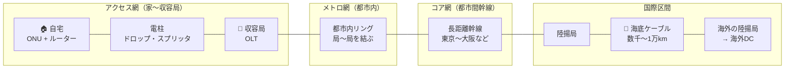
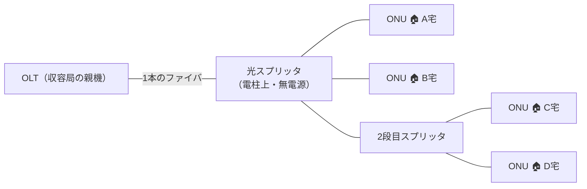
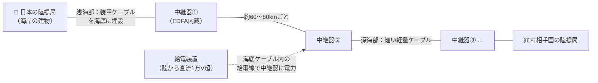

# ② 光通信ネットワークの全体像（FTTH・PON・海底ケーブル）

> **光ファイバー・光通信 完全ガイド**：[総合インデックス](optical-fiber-overview.md) ｜ [① 入門](optical-fiber-guide.md) ｜ **② ネットワーク全体像** ｜ [③ ケーブル・部材](optical-fiber-cable-types.md) ｜ [④ 施工・測定](optical-fiber-fieldwork-guide.md) ｜ [⑤ メーカー比較](optical-fiber-vendors.md) ｜ [⑥ 住友電工](sumitomo-electric-optical-fiber.md) ｜ [✅ クイズ](optical-fiber-quiz.html)

①では「1本のガラスの糸の中で何が起きているか」を見た。
この章では視点をぐっと引いて、**その糸が世界中でどうつながっているか** ——
自宅のONUから、電柱、収容局、都市間の幹線、そして海底ケーブルまでの「地図」を描く。

---

## 0. まず全体像（30秒）

インターネットの物理的な実体は、**階層構造の光ファイバー網** だ。
家から海外サーバーまでの通信は、おおよそ次の区間を通る。



*（図が表示されない環境用：[SVG版](optical-fiber-svg/network-1.svg)）*

| 区間 | 距離感 | 主なファイバ | キーワード |
|------|--------|------------|-----------|
| **アクセス網** | 〜数km | G.657（曲げに強い） | FTTH・PON・ドロップ |
| **メトロ網** | 数〜数十km | G.652.D | 都市内リング・WDM |
| **コア網（幹線）** | 数百〜千km超 | G.652.D／G.654.E | DWDM・光増幅（EDFA） |
| **海底ケーブル** | 数千〜1万km超 | G.654（超低損失） | 中継器・陸揚局 |
| **データセンタ** | 〜数百m（DC内） | マルチモード（OM3/4/5）・SMF | MPO・高密度配線 |

> **たとえ話**：道路網と同じ。家の前の**生活道路（アクセス）**→ 市内の**幹線道路（メトロ）**→
> **高速道路（コア）**→ **海底トンネル（海底ケーブル）**。区間ごとに道の作りも交通ルールも違う。

---

## 1. FTTHのしくみ — 家までどう光が来るか

**FTTH（Fiber To The Home）** は、収容局から家の中まで光ファイバーで結ぶ方式。
日本の光回線（フレッツ光・auひかり等）はほぼこれで、その中身は **PON** という構成が主流だ。

### 1-1. 登場する機器

| 機器 | 場所 | 役割 |
|------|------|------|
| **OLT**（Optical Line Terminal） | 収容局 | 局側の親機。多数の家を1台で収容 |
| **光スプリッタ** | 電柱上・ビル内など | 1本の光を4分岐・8分岐…と**電源なしで**分ける |
| **ONU**（Optical Network Unit） | 家の壁ぎわ | 宅内の子機。光⇄電気を変換（①参照） |
| **ドロップケーブル** | 電柱→家 | 最後の引き込み線（③参照） |

### 1-2. PON — 1本の光を分け合う仕組み

**PON（Passive Optical Network＝受動光網）** は、
**局からの1本のファイバを、電源不要の光スプリッタで最大32〜64分岐して各家庭で共有する** 構成。



*（図が表示されない環境用：[SVG版](optical-fiber-svg/network-2.svg)）*

- **下り（局→家）**：全員に同じ光が届き、各ONUが**自分宛てのデータだけ拾う**（宛先ラベル＋暗号化）。
- **上り（家→局）**：全員が同時に光ると衝突するので、OLTが**時間を割り当てて交代で送信**させる（時分割多重）。
- 上りと下りは**別々の波長**を使うので、1本のファイバで双方向通信できる（波長分割）。

> **たとえ話**：PONは**マンションの掲示板と回覧板**。
> 下りは「掲示板に全員向けの掲示を貼る（各自が自分宛てだけ読む）」、
> 上りは「回覧板の順番が来た人だけ書き込める」イメージ。

### 1-3. PONの規格いろいろ

| 規格 | 系統 | 速度（下り/上り） | ひとこと |
|------|------|-----------------|---------|
| **GE-PON** | IEEE（Ethernet系） | 1G / 1G | 日本のFTTHで長年の主力 |
| **GPON** | ITU-T | 2.4G / 1.2G | 海外で主流の1G世代 |
| **10G-EPON** | IEEE | 10G / 10G | GE-PONの10G版。「10ギガ」プランの中身 |
| **XGS-PON** | ITU-T | 10G / 10G | GPONの10G対称版。海外の10G主流 |
| **50G-PON** | ITU-T | 50G / - | 次世代。標準化・実証が進行中 |

- 日本の「1ギガ」プラン ≒ GE-PON、「10ギガ」プラン ≒ 10G-EPON／XGS-PON が中身、と押さえておけばOK。
- **最大32〜64世帯で帯域を共有**するため、「ベストエフォート」（速度は保証されない）になる。

### 1-4. PONじゃない光回線もある

- **専用線／ダークファイバ**：1本を1契約者が占有する方式（→ §5）。法人・基地局向け。
- **FTTB＋LAN配線**：ビルまで光、建物内はLAN。マンションの「VDSL/LAN方式」はこの親戚。

---

## 2. メトロ網・コア網 — 都市と都市を結ぶ幹線

収容局から先は、通信会社の**幹線ネットワーク**の世界になる。

- **メトロ網**：都市内の収容局どうしをリング状に結ぶ。障害時は逆回りに迂回できる冗長構成。
- **コア網**：東京〜名古屋〜大阪のような**都市間の長距離大容量幹線**。

### 2-1. DWDM — 1本のファイバを何十車線にも

幹線のキモは①でも触れた**WDM（波長多重）**の本気版、**DWDM（高密度波長多重）**。

- 1本のファイバに**波長（色）のわずかに違う光を40〜96波**同時に流す。
- 1波あたり100G〜800Gbps → **1本で数十Tbps級**の容量になる。
- 途中の減衰は**EDFA（光ファイバ増幅器）**が**光のまま一括増幅**してカバーする。
  電気に戻さず全波長まとめて増幅できるのが革命的だった。

```
1本のファイバ = 多車線道路
 λ1 ────────────▶ 100G
 λ2 ────────────▶ 100G     合流(合波)→ ═══════▶ →分流(分波)
 λ3 ────────────▶ 100G      （MUX）    数十Tbps    （DEMUX）
 ...最大96波...
```

### 2-2. 幹線で使うファイバ

- 標準は **G.652.D**。より長距離・大容量を狙う区間は **G.654.E**（超低損失・大有効断面積）を採用（⑤⑥参照）。
- 数十kmごとにEDFA、数百km級で信号を整える中継が入る。**中継間隔を伸ばせる＝コスト減**なので、
  ファイバの低損失化がそのまま経済価値になる。

---

## 3. 海底ケーブル — 大陸間通信の主役

**国際通信の99%は海底ケーブル**が運んでいる（衛星はごく一部）。

### 3-1. 構造と敷設



*（図が表示されない環境用：[SVG版](optical-fiber-svg/network-3.svg)）*

- **ケーブル本体**：中心に光ファイバ（数〜24ペア程度）、周りを鋼線・銅管・ポリエチレンで保護。
  深海部は直径2cmほど、漁具や錨のリスクがある浅海部は装甲を重ねて腕ほどの太さになる。
- **中継器**：約60〜80kmごとにEDFAを内蔵した筒を挿入。電力は**陸の給電装置から
  ケーブル内の銅管を通じて直流給電**する。
- **敷設**：専用のケーブル敷設船が数千kmを数ヶ月かけて敷く。浅海部は鋤（すき）状の機械で海底に埋める。
- **ファイバ**：超長距離なので**G.654系の超低損失ファイバ**一択（⑤参照）。

### 3-2. 障害と修理

- 原因の多くは**漁業活動と船の錨**（深海では地震・海底地すべりも）。
- 切れたら敷設船が現場へ行き、ケーブルを**海面に引き上げて融着接続で修理**する（④の技術が海の上でも使われる）。
- だから国際通信は**複数ルートに分散**するのが鉄則（日米間だけでも多数のケーブルが並走している）。

### 3-3. 誰が作っている？

- 近年は通信会社に加えて**Google・Meta・Amazon・Microsoft**などの巨大IT企業が
  自社DC間を結ぶため主要出資者になっている。
- 製造・敷設の世界大手は **NEC（日本）／SubCom（米）／ASN（仏）** の3社でほぼ寡占。

---

## 4. データセンタとモバイルの裏側

### 4-1. データセンタ内・DC間

| 区間 | 距離 | 使うもの |
|------|------|---------|
| ラック内・隣接ラック | 〜数十m | DAC（銅）や**マルチモード（OM3/4/5）**＋MPOコネクタ |
| DC内の縦系・棟間 | 〜数百m | マルチモード／シングルモード＋**超多心ケーブル**（数千心） |
| **DC間（DCI）** | 数〜数百km | シングルモード＋DWDM。金融・クラウドの生命線 |

- AI・クラウドの拡大でDC内の配線密度は爆発的に増加中。**間欠リボン＋超多心ケーブル**（⑥参照）や
  **MPOカセット**による高密度化がトレンド。

### 4-2. モバイル（スマホ）の裏側

スマホの通信も、無線なのは**端末〜基地局の数百mだけ**で、その先はすべて光ファイバー。

- **フロントホール**：アンテナ〜基地局装置の間。
- **バックホール**：基地局〜通信会社のコア網の間。
- 5Gは基地局が小型・多数になるため、**基地局の数だけ光ファイバの引き込みが必要**になり、
  光工事の需要を押し上げている。

---

## 5. 回線を「調達する」ときの選択肢（法人向けの基礎知識）

企業やDC事業者が拠点間を光で結びたいとき、主な選択肢は3つ。

| 方式 | 何を借りる/買う？ | 帯域 | コスト感 | 向いている場面 |
|------|-----------------|------|---------|--------------|
| **ベストエフォート型（FTTH）** | PONの1分岐 | 共有（〜10G） | 安い | 一般オフィスのネット接続 |
| **帯域保証型専用線** | 通信会社のサービス | 保証あり | 高い | 金融・基幹系・SLA必須 |
| **ダークファイバ** | **光ファイバの芯線そのもの**（未点灯の心線） | 自分次第（DWDMで数Tbpsも可） | 中〜高＋機器自前 | DC間接続・通信事業者・大学 |

- **ダークファイバ**＝通信会社が敷設済みで**まだ使っていない（光っていない）心線**を借り、
  両端の機器を自分で用意して好きに使う方式。自由度最強だが運用力が要る。
- 拠点をDCに置く（**コロケーション**）と、DC内の**構内配線（クロスコネクト）**だけで
  クラウドや他社と直結できる。物理的に近いほど遅延も小さい。

---

## 6. 遅延（レイテンシ）の物理学

光は速いが**無限に速くはない**。ファイバ中の光速は真空の約2/3（約20万km/s）なので：

| 区間 | 距離 | 片道の伝搬遅延（理論値） |
|------|------|------------------------|
| 東京〜大阪 | 約500km | 約2.5ms |
| 日本〜米国西海岸 | 約9,000km | 約45ms |
| 日本〜欧州 | 約20,000km | 約100ms |

- オンラインゲームで海外サーバーが「重い」最大の理由は、機器ではなく**この物理的な距離**。
- 金融の高頻度取引では1msを削るために**より直線に近いルートの専用ケーブル**が敷かれるほど。
- 遅延を根本的に減らす手段は「物理的に近づく」しかない — これが**CDN**（世界中にサーバーを分散配置）や
  コロケーション（§5）が重要な理由。

---

## 7. よくある疑問（FAQ）

**Q. 「10ギガプラン」にしたのに10Gbps出ないのは詐欺？**
A. PONは最大32〜64分岐の共有＋プロトコルのオーバーヘッドがあるため、理論上も10Gは出ない。
「ベストエフォート」はそういう意味。それでも実効数Gbpsは家庭用として十分速い。

**Q. 衛星インターネット（Starlink等）があれば海底ケーブルは不要になる？**
A. ならない。衛星の総容量は海底ケーブル1本にも遠く及ばず、遅延・天候の面でも不利。
衛星は「ファイバを引けない場所」を埋める補完役と考えるのが正確。

**Q. 停電するとFTTHはどうなる？**
A. 電柱上のスプリッタは無電源なので生きるが、**宅内のONU・ルーターが停電で止まる**。
収容局は非常用電源を持つ。ONUをモバイルバッテリー等で動かせば通信できる場合が多い。

**Q. 海底ケーブルって盗聴されない？**
A. 物理的アクセスは極めて困難だが、リスクはゼロではないとされる。だから重要通信は
**経路によらずエンドツーエンドで暗号化する**のが現代の前提（TLS等）。

---

## まとめ

- 光ネットワークは **アクセス（FTTH/PON）→ メトロ → コア（DWDM幹線）→ 海底ケーブル** の階層構造。
- **PON** は1本の光をスプリッタで分け合う省コスト構成。GE-PON/10G-EPONなどの規格がある。
- 幹線は **DWDM＋EDFA** で1本あたり数十Tbpsを実現。海底ケーブルが国際通信の99%を運ぶ。
- スマホもクラウドも、無線・サーバーの手前は**すべて光ファイバー**が支えている。
- 遅延は光速の物理限界で決まる。「近くに置く」ことが最強の高速化。

> **次に読む**：物理的な線材・部材の話は [③ ケーブル・コード・接続部材](optical-fiber-cable-types.md)、
> 現場の施工・測定は [④ 施工・接続・測定・保守](optical-fiber-fieldwork-guide.md) へ。
> 理解度チェックは [✅ クイズ](optical-fiber-quiz.html) でどうぞ。
