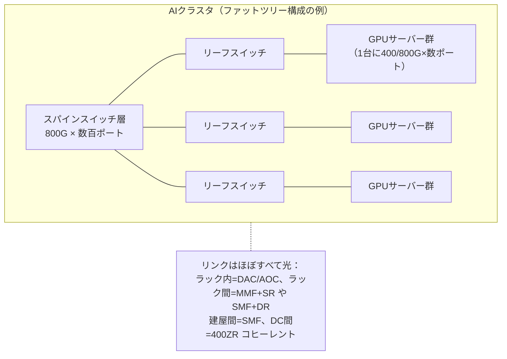

# ⑧ 光トランシーバとデータセンタ機器ガイド

> **光ファイバー・光通信 完全ガイド**：[総合インデックス](optical-fiber-overview.md) ｜ [🏠 ポータル](optical-fiber-portal.html) ｜ [①](optical-fiber-guide.md) [②](optical-fiber-network-guide.md) [③](optical-fiber-cable-types.md) [④](optical-fiber-fieldwork-guide.md) [⑤](optical-fiber-vendors.md) [⑥](sumitomo-electric-optical-fiber.md) [⑦](optical-fiber-transmission-deep-dive.md) **⑧** [⑨](optical-fiber-career-guide.md) ｜ [✅ クイズ](optical-fiber-quiz.html) ｜ [🧮 計算機](optical-fiber-calculator.html)

①で出てきた「送信機（レーザー）と受信機（フォトダイオード）」は、実際の機器では
**光トランシーバ（光モジュール）** という抜き差し可能な小箱に収まっている。
スイッチの前面にズラリと刺さっているアレだ。AIブームで需要が爆発しているこの部品を、
「名前の読み方」から「AIクラスタの配線」まで一気に整理する。

---

## 0. まず全体像（30秒）

光トランシーバ＝**「電気⇄光の変換器を、規格化された抜き差し可能な箱に詰めたもの」**。

```
 [スイッチ/サーバー]                    [光トランシーバ]
  ┌──────────────┐   電気信号   ┌─────────────────┐
  │ スイッチチップ │ ═══════════▶│ DSP → レーザー   ─────▶ 光ファイバへ
  │  (ASIC)      │ ◀═══════════│ フォトダイオード ◀───── 光ファイバから
  └──────────────┘              └─────────────────┘
                                  ▲ケージに抜き差し可能（ホットスワップ）
```

読み方は3要素だけ押さえればよい：

| 要素 | 例 | 意味 |
|------|-----|------|
| **形（フォームファクタ）** | SFP+ / QSFP28 / QSFP-DD / OSFP | 箱の大きさ・ピン数・電力枠 |
| **速度** | 10G / 100G / 400G / 800G | モジュール合計の伝送速度 |
| **リーチ規格** | SR / DR / FR / LR / ER / ZR | どのファイバで何km飛ぶか |

例：「**QSFP-DD 400G-DR4**」＝QSFP-DDサイズ、合計400G、SMFで500m、4レーン並列。

---

## 1. フォームファクタ — 「箱の形」の系譜

| フォームファクタ | 主な速度 | レーン数 | ひとこと |
|----------------|---------|--------|---------|
| **SFP / SFP+** | 1G / 10G | 1 | 小型の定番。企業スイッチで現役 |
| **SFP28** | 25G | 1 | サーバーNICの主流だった世代 |
| **QSFP+** | 40G | 4 | Quad（4レーン）SFPの初代 |
| **QSFP28** | 100G | 4 | 25G×4。100G時代の主役 |
| **QSFP-DD** | 400G / 800G | 8 | Double Density（8レーン）。QSFP系と後方互換 |
| **OSFP** | 400G / 800G / 1.6T | 8 | 放熱に余裕がある大きめの箱。AIクラスタで優勢 |

- 「Q」はQuad（4レーン）、「DD」はDouble Density（8レーン）。**モジュール速度 ≒ 1レーン速度 × レーン数**。
- 世代交代の本質は**1レーンの高速化**：10G → 25G → 50G → **100G/レーン**（現行800G世代）→ 200G/レーン（1.6T世代）。
- QSFP-DDは旧QSFPモジュールがそのまま刺さる互換性が売り。OSFPは冷却重視でAI向けスイッチに多い。

---

## 2. リーチ規格 — 「どこまで飛ぶか」の読み方

イーサネット系の接尾辞は、ファイバ種別（①③）と距離のセットになっている。

| 記号 | 距離目安 | ファイバ | 中身 |
|------|---------|---------|------|
| **SR**（Short Reach） | 〜100m | **MMF**（OM3/4/5）＋MPO | ラック間の短距離。VCSELレーザー |
| **DR** | 500m | SMF（並列レーン） | DC内の縦系 |
| **FR** | 2km | SMF | 大型DCのフロア間 |
| **LR**（Long Reach） | 10km | SMF | 拠点間・ビル間 |
| **ER** | 40km | SMF | メトロ圏 |
| **ZR / ZR+** | 80〜120km+ | SMF＋**コヒーレント**（⑦） | DC間接続（DCI）をプラガブルで |

- 数字付き（DR**4**・FR**4**など）は**並列レーン数**：DR4=500m×4レーン（8心SMF・MPO）、FR4=**波長4つを1本に多重**（2心）——同じ400Gでも配線が違う点に注意（③のMPO/2心コードの使い分けに直結）。
- **400ZR**は⑦のコヒーレントDSPを手のひらサイズに収めた画期的規格。従来は専用伝送装置が必要だったDC間接続が、スイッチに挿すだけになった。

### 銅・AOCとの使い分け（ラック内）

| 手段 | 距離 | 特徴 |
|------|------|------|
| **DAC**（銅ツイナックス直結） | 〜3m | 最安・ゼロ電力。同一ラック内 |
| **AOC**（光ケーブル一体型） | 〜30m | 軽く柔らかい。両端一体で清掃不要（④の汚れ問題を回避） |
| **光トランシーバ＋ファイバ** | 100m〜 | 抜き差し・張り替え自由。DC配線の本命 |

---

## 3. 中の技術：PAM4という発明

DC内の短距離（イーサネット系）は、⑦のコヒーレントではなく**IM-DD（強度変調・直接検波）**のまま高速化してきた。
その立役者が **PAM4**。

```
 NRZ（従来）: 光の強さ2段階 → 1シンボル1ビット
   ‾|_|‾|_|‾   （0 か 1）

 PAM4:        光の強さ4段階 → 1シンボル2ビット
   ３‾２-１_０   （00/01/10/11）→ 同じ速度の部品で2倍のデータ
```

- 50G/レーン以降（400G世代〜）は**PAM4が標準**。同じシンボルレートで2倍運べる。
- 代償として段差の間隔が1/3になり雑音に弱い → **DSPとFEC（⑦§6）がDC内の短距離にも標準搭載**されるようになった。
- 整理すると：**DC内=PAM4（安く大量に）／DC間・幹線=コヒーレント（遠く濃密に）**という2本立て（⑦FAQ参照）。

---

## 4. シリコンフォトニクスとCPO — 「光の回路を半導体で刷る」

### 4-1. シリコンフォトニクス（SiPh）

光の変調器・導波路・受信器を**シリコンチップ上に集積**する技術。
半導体の製造ライン（CMOSプロセス）で光回路を量産できるため、
**「はんだ付けで組む光学」から「ウェハで刷る光学」へ**とコスト構造が変わる。
400G以降のトランシーバで採用が拡大し、AI需要の量産を支えている。
（レーザー光源だけはシリコンでは作りにくく、InP等の別チップを貼り合わせるのが主流。）

### 4-2. CPO / LPO — トランシーバの「箱」が消える未来

| 方式 | 内容 | 狙い |
|------|------|------|
| **プラガブル**（現在の主流） | 前面パネルに抜き差し | 運用性・互換性が最強 |
| **LPO**（Linear Pluggable Optics） | モジュール内のDSPを省略しスイッチASIC側で処理 | 電力を約半分に。互換性を保ちつつ省電力 |
| **CPO**（Co-Packaged Optics） | 光エンジンを**スイッチASICと同じパッケージに同居** | 電気配線を極小化し電力・密度を根本改善 |

- 背景：スイッチ1台51.2Tbps時代、**消費電力の過半が光モジュールとその電気接続**に食われるようになった。
- CPOは2025年前後から大手のAIクラスタ向けスイッチで実用が始まった段階。故障時にモジュール交換できない等、
  運用面の課題（④の保守観点）とのトレードオフが業界の議論どころ。

---

## 5. AIクラスタと光配線 — いま需要が爆発している理由

生成AIの学習クラスタは「GPU数万台を**1台の巨大コンピュータのように**つなぐ」必要があり、
その内部ネットワーク（スケールアウト／スケールアップ）はほぼ光になる。

- GPU 1台あたり複数ポートの400G/800Gが生え、**GPU数×数本の光リンク**が必要になる
  ——クラスタ1つでトランシーバ数十万個という規模。
- トポロジは**ファットツリー（Clos）**：どのGPU間も等距離・ノンブロッキングを目指す多段スイッチ構成。
  段数が増えるほどリンク本数（＝トランシーバ）も倍々で増える。
- 遅延・電力がスケールの敵なので、**OSFP・LPO/CPO・ホローコア（⑦§8）・MPO超高密度配線（③⑥）**が
  すべて「AIのため」という一点で急加速している。
- 市場へのインパクト：光トランシーバ市場はAI需要で史上最大の成長期にあり、⑤で見た部材各社
  （ファイバ・MPO・超多心ケーブル）にも波及している——**このシリーズの全章がAIデータセンタで交差する**。



*（図が表示されない環境用：[SVG版](optical-fiber-svg/transceiver-1.svg)）*

---

## 6. 現場の実務メモ（選定・運用）

- **互換品（サードパーティ）問題**：トランシーバは規格化されているが、スイッチベンダが自社ブランド品以外を
  警告・非サポートにすることがある。調達時はサポートポリシーを確認。
- **DDM/DOM**：モジュールは自分の温度・受光レベル（dBm）を報告できる。④のパワーメータ測定と合わせ、
  **受光レベル監視はリンク品質の一次情報**。
- **清掃**：MPO端面の汚れは高速ほど致命的（④§5-1）。SRリンク不調はまず端面検査。
- **レーンとファイバの対応**：DR4/SR4はMPOの心線割当（③）を理解していないと「刺さるのにリンクしない」が起きる。
- **消費電力**：800G世代は1個15W前後。数百ポートのスイッチでは**光モジュールだけでkW級**——ラックの電力・冷却設計に直結。

---

## 7. よくある疑問（FAQ）

**Q. トランシーバの「800G」と回線の「800G」は同じもの？**
A. モジュールの800Gは**8レーン×100Gの合計**（パラレル）。⑦の幹線の800Gは**1波長で800G**（コヒーレント）。
同じ数字でも中身が別物なので、ニュースを読むときは要注意。

**Q. なぜ抜き差し式（プラガブル）がここまで続いている？**
A. 故障交換・速度アップグレード・ベンダ混在が**ポート単位**でできるから。CPOはこの運用性を捨てて
電力を取る選択で、だから移行はAIクラスタのような「電力が最優先の場所」から始まっている。

**Q. 家庭用のONU（②）にもトランシーバが入っている？**
A. 機能的には同じもの（レーザー＋フォトダイオード＋制御）が基板直付けで入っている。PONは1本の
ファイバで上下を波長分割するBiDi構成という点がDC用と異なる。

**Q. MMF（マルチモード）はもう要らなくなる？**
A. 100m以内ならVCSEL＋MMFが依然として安い。ただしレーン高速化でSRの到達距離が縮む傾向にあり、
新設大規模DCはSMF（DR/FR）へ寄せる動きが強い。①③のSMF/MMF使い分けの現代版。

---

## まとめ

- 光トランシーバは**形（SFP/QSFP/OSFP）×速度×リーチ（SR/DR/FR/LR/ZR）**の3要素で読める。
- DC内は**PAM4＋IM-DD**、DC間・幹線は**コヒーレント（400ZR）**という2本立て。
- **シリコンフォトニクス**が量産を、**LPO/CPO**が電力問題を、それぞれ突破しようとしている。
- **AIクラスタが需要の爆心地**：GPU数万台×数リンクで、ファイバ・MPO・超多心（③⑤⑥）まで全部つながる話になる。

> **次に読む**：この業界で働く・資格を取るなら → [⑨ 資格・業界・キャリアガイド](optical-fiber-career-guide.md)。
> 理解度チェックは [✅ クイズ](optical-fiber-quiz.html) でどうぞ。
