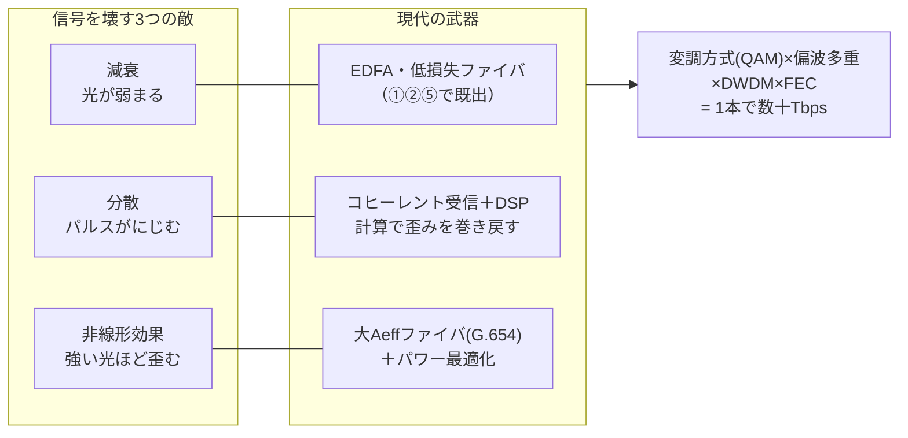
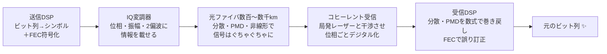

# ⑦ 光伝送技術の深掘り — なぜ1本で数十Tbps送れるのか

> **光ファイバー・光通信 完全ガイド**：[総合インデックス](optical-fiber-overview.md) ｜ [🏠 ポータル](optical-fiber-portal.html) ｜ [①](optical-fiber-guide.md) [②](optical-fiber-network-guide.md) [③](optical-fiber-cable-types.md) [④](optical-fiber-fieldwork-guide.md) [⑤](optical-fiber-vendors.md) [⑥](sumitomo-electric-optical-fiber.md) **⑦** [⑧](optical-fiber-transceiver-guide.md) [⑨](optical-fiber-career-guide.md) ｜ [✅ クイズ](optical-fiber-quiz.html) ｜ [🧮 計算機](optical-fiber-calculator.html)

①②では「光のON/OFFでデータを送る」と説明した。しかし実は、現代の幹線でON/OFF（点滅）方式はもう主役ではない。
**位相・振幅・偏波まで総動員し、DSP（デジタル信号処理）で物理現象を"計算で打ち消す"** ——
それが1本のファイバで数十Tbpsを実現している現代光伝送の正体だ。この章はシリーズで最も技術寄りの深掘り編。

---

## 0. まず全体像（30秒）

高速化の歴史は「**信号を壊す3つの敵**」と「**限られた帯域に詰め込む工夫**」の戦いだった。



*（図が表示されない環境用：[SVG版](optical-fiber-svg/deepdive-1.svg)）*

- **減衰**にはEDFAと低損失ファイバ（既出）。
- **分散**は昔は物理的に補償していたが、今は**受信後にDSPが数式で巻き戻す**。
- **非線形**は「光を強くしすぎると歪む」性質。ファイバの断面積拡大とパワー設計で抑える。
- そのうえで**1シンボルに複数ビットを載せ（QAM）、偏波で2倍にし、波長で数十倍にし（DWDM）、誤りはFECで訂正**する。

---

## 1. 敵①をおさらい：減衰はもう「勝ち筋」がある

減衰（〜0.2dB/km）はEDFAによる光増幅と低損失ファイバでほぼ解決済み（①§7・②§2）。
ただしEDFAは増幅のたびに**雑音（ASE雑音）**も足すので、**中継を重ねるほどSNR（信号対雑音比）が下がる**。
これが後述のシャノン限界（§7）に効いてくる。「減衰そのもの」より「増幅の代償」が現代の課題。

---

## 2. 敵②：分散 — パルスが「にじんで」隣とぶつかる

### 2-1. 波長分散（色分散）

ガラス中の光の速度は**波長によってわずかに違う**。レーザー光も完全な単色ではなく微妙な波長幅を持つため、
長距離を走るうちに**速い成分と遅い成分がばらけて、パルスが時間方向に広がる**。

> **たとえ話**：マラソンのスタート時は固まっていた集団が、42km走ると数kmに引き伸ばされるのと同じ。
> パルス（集団）が広がると、後続のパルスと重なって `1` と `0` の区別がつかなくなる。

- 速度が上がるほどパルス間隔が詰まるので、**同じ分散でも高速信号ほど致命的**（10Gの16倍厳しいのが40G）。
- 標準ファイバ（G.652）の分散は1550nmで約17ps/nm/km。1310nmでほぼゼロ（①で「分散最小の窓」と呼んだ理由）。

### 2-2. 偏波モード分散（PMD）

光は進行方向に直交する2つの**偏波**（振動の向き）を持つ。ファイバのわずかな楕円歪みや応力で
**2つの偏波の速度に差が出て**、これもパルスを広げる。製造誤差や敷設環境に依存し、古いケーブルで問題になりやすい。

### 2-3. 分散との戦い方の変遷

| 世代 | 対策 | 弱点 |
|------|------|------|
| 〜10G時代 | **分散補償ファイバ（DCF）**：逆特性のファイバを数kmぶん挿入して物理的に相殺 | 損失・遅延・コストが増える。PMDは補償困難 |
| 100G以降（現代） | **コヒーレント受信＋DSP**：受信後にデジタル演算で完全に巻き戻す（§5） | 消費電力・チップコスト |

**「物理で起きた歪みは、位相情報さえ取れていれば計算で戻せる」**——この発想の転換が現代光通信の心臓部。

---

## 3. 敵③：非線形効果 — 「光を強くすればいい」が通じない

減衰やSNRのことだけ考えると「入力パワーを上げればいい」となるが、そうはいかない。
強い光はガラスの屈折率をわずかに変えてしまい（**光カー効果**）、**自分自身や隣の波長の信号を歪ませる**。

- 自己位相変調（SPM）：自分の強度変化が自分の位相を歪ませる
- 相互位相変調（XPM）・四光波混合（FWM）：DWDMの**隣の波長に漏話**する

> **たとえ話**：静かな声なら会議室で複数の会話が並立できるが、全員が大声で叫ぶと
> 声が割れて隣の会話に混ざり、全員が聞き取れなくなる。

対策は：

1. **パワーの最適点運転**：上げすぎず下げすぎず、SNRと非線形のバランス点で運転する。
2. **実効断面積（Aeff）の拡大**：同じパワーでも断面積が広ければ光の「密度」が下がり非線形が減る。
   ——これが⑤⑥に出てきた **G.654.E（大Aeff）ファイバが幹線で重宝される本当の理由**。
3. DSPによる非線形補償（研究〜一部実用）。

---

## 4. 詰め込む工夫①：変調方式 — 1回の合図で何ビット送るか

①のたとえでは「光った=1、消えた=0」（OOK: On-Off Keying）だった。これは**1シンボル（1回の合図）で1ビット**。
現代の幹線は光の**位相**と**振幅**を組み合わせ、1シンボルに複数ビットを載せる。

| 変調方式 | 1シンボルのビット数 | 使う物理量 | 主な用途 |
|---------|------------------|-----------|---------|
| OOK（ON/OFF） | 1 | 振幅のみ | 〜10G時代・短距離 |
| **QPSK** | 2 | 位相（4点） | 100G長距離の主役 |
| **16QAM** | 4 | 位相＋振幅（16点） | 400G・メトロ〜長距離 |
| **64QAM** | 6 | 位相＋振幅（64点） | 800G・短〜中距離 |

- 位相・振幅の組み合わせを平面に打った図を**コンスタレーション（星座図）**と呼ぶ。点が増えるほど
  1シンボルのビット数は増えるが、**点同士の間隔が狭まり雑音に弱くなる**——距離とのトレードオフ。
- さらに**偏波多重（DP-）**：直交する2偏波に別データを載せて**問答無用で2倍**。現代の「DP-16QAM」等の表記はこれ。
- 例：100G = QPSK(2bit) × 2偏波 × 約32Gbaud。400G = 16QAM(4bit) × 2偏波 × 約64Gbaud。

> **たとえ話**：OOKは懐中電灯の点滅（1回で1情報）。QAMは**腕の角度（位相）と旗の大きさ（振幅）を
> 組み合わせた手旗信号**で、1回のポーズで多くの情報を伝える。ただしポーズの種類が増えるほど、遠くからは見分けにくい。

---

## 5. 詰め込む工夫②：コヒーレント伝送 — 現代光通信の心臓部

位相に情報を載せるには、受信側で位相を測れなければならない。単純なフォトダイオードは**光の強弱しか**見えない。
そこで**コヒーレント受信**：受信機内の基準レーザー（局発光）と受信光を干渉させ、
**振幅・位相・偏波のすべてをデジタル値として取得**する。



*（図が表示されない環境用：[SVG版](optical-fiber-svg/deepdive-2.svg)）*

コヒーレント＋DSPの何が革命だったか：

- **分散・PMDの完全デジタル補償**：DCF（物理補償）が不要になり、リンク設計が劇的に簡単に。
- **多値変調（QAM）が使える**：位相が読めるから。OOKのままなら100Gは実現困難だった。
- **ソフトウェアで距離と速度を交換**：同じハードで「800G短距離モード⇄400G中距離⇄200G長距離」のように
  変調方式を切り替えられる（可変速トランシーバ）。

2010年頃の100Gコヒーレント商用化以降、幹線・海底・DC間（②）はすべてこの方式になった。

---

## 6. 詰め込む工夫③：FEC — 「誤ってもいい、直せるなら」

**FEC（前方誤り訂正）**は、データに冗長ビットを約15〜27%足して送り、受信側で誤りを数学的に訂正する技術。

- 訂正前（pre-FEC）のビット誤り率が**1%程度あっても、訂正後は実質エラーゼロ**にできる。
- つまり「多少ぐちゃぐちゃでも届けば直せる」ので、**より遠く・より多値の変調**へ踏み込める。
- 現場では「pre-FEC BER」がリンクの健康指標として監視される（④の運用の延長）。マージンが尽きて
  訂正能力を超えた瞬間、エラーフリーから一気に通信断へ落ちる（クリフ効果）。

---

## 7. 天井の存在：シャノン限界

「では変調を256QAM、1024QAM…と増やせば無限に速くなる？」——ならない。
通信路には**シャノン限界**という理論上の天井がある：

```
C = B × log2(1 + SNR)
   容量 = 帯域幅 × log2(1 + 信号対雑音比)
```

- 帯域幅B（EDFAが増幅できるC帯≒4THz強）は有限。
- SNRを上げようとパワーを上げると**非線形（§3）が悪化**して逆にSNRが下がる。
- 現代のコヒーレント＋FECは、この限界の**かなり近くまで既に到達**している。
  ——「1本のファイバの容量はそろそろ頭打ち」問題は**キャパシティクランチ**と呼ばれる。

---

## 8. 天井の破り方：次世代技術の最前線

シャノンの式で残された変数は「**帯域Bを広げる**」か「**通信路そのものを増やす**」。

| アプローチ | 内容 | 状況 |
|-----------|------|------|
| **C+L帯運用** | EDFAの増幅帯域をL帯まで拡張し、帯域Bをほぼ2倍に | 商用化済み（大容量海底・幹線） |
| **SDM（空間分割多重）** | 通信路の数で稼ぐ。まずは**多心化・細径化**（③⑥の間欠リボン・超多心はこの文脈） | 実用まっただ中 |
| **マルチコアファイバ（MCF）** | 1本のガラスに**コアを2〜19個**内蔵。125µm径のまま容量倍増 | 海底ケーブルで商用採用が始まった（2コア→4コア） |
| **数モードファイバ（FMF）** | 1つのコアに複数モードを流しMIMO処理で分離 | 研究段階 |
| **ホローコアファイバ（HCF）** | コアを**中空（空気）**にする。光速が約1.5倍（≒真空並み）になり**遅延3割減**、非線形も激減 | 金融・DC間で先行導入が始まる |
| **研究記録** | 標準径マルチコアで**1本あたりペタビット級**の伝送実験も報告されている | 実験室 |

> ホローコアは「ガラスの中は光が遅い（①§真空の2/3）」という前提自体を壊す技術。
> ②§6で見た「東京〜大阪 2.5ms」が約1.7msになる世界で、高頻度取引や AI クラスタ間で価値が大きい。

---

## 9. よくある疑問（FAQ）

**Q. 家の10G回線もコヒーレント？**
A. いいえ。アクセス網（PON）はコスト最優先なので、今も強度変調＋直接検波（IM-DD）。
コヒーレントは幹線・海底・DC間から普及し、将来のPONへの適用が研究されている段階。

**Q. 「1.6Tトランシーバ」のようなニュースは1波で1.6Tbpsという意味？**
A. 多くは**複数レーン（波長）の合計**。例：1.6T = 200G×8レーン。1波あたりの速度とモジュール合計速度は
区別して読むのがコツ（⑧で詳述）。

**Q. DSPで何でも補償できるなら、良いファイバは要らなくなる？**
A. ならない。非線形とASE雑音で失われた情報は**原理的に取り戻せない**（シャノン限界）。
だから低損失・大Aeffのファイバ（G.654.E）は今後も価値を持ち続ける。むしろDSPの限界が見えたからこそ、
ファイバ側（SDM・ホローコア）へ投資が戻っている。

**Q. 標準の125µm径を保ったままコアを増やす意味は？**
A. 既存のケーブル構造・コネクタ・融着技術（③④）を流用できるから。196心ケーブルを4コアMCFにすれば
外形そのままで784コア相当になる。互換性はインフラ技術の命。

---

## まとめ

- 信号の敵は**減衰・分散・非線形**。減衰はEDFA、**分散はコヒーレント受信＋DSPの計算で巻き戻す**のが現代流。
- 非線形は「パワーを上げるほど歪む」制約で、**G.654.E（大Aeff）が幹線で選ばれる本当の理由**。
- 容量は **QAM多値化 × 偏波多重 × DWDM × FEC** の掛け算。ただし**シャノン限界**という天井がある。
- 天井の突破口は**帯域拡張（C+L）と空間の多重（マルチコア・ホローコア）**。③⑥で見た超多心化はその第一歩。

> **次に読む**：この技術が詰まった「箱」＝光トランシーバの世界へ → [⑧ 光トランシーバ・DC機器ガイド](optical-fiber-transceiver-guide.md)。
> 理解度チェックは [✅ クイズ](optical-fiber-quiz.html)、dB・損失の計算練習は [🧮 計算機](optical-fiber-calculator.html) でどうぞ。
