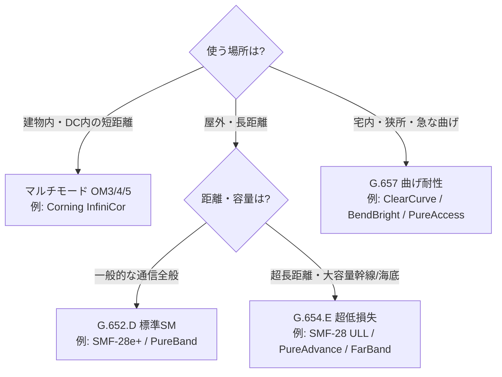

# ⑤ 光ファイバー 大手各社の製品ラインナップまとめ

> **光ファイバー・光通信 完全ガイド**：[総合インデックス](optical-fiber-overview.md) ｜ [🏠 ポータル](optical-fiber-portal.html) ｜ [①](optical-fiber-guide.md) [②](optical-fiber-network-guide.md) [③](optical-fiber-cable-types.md) [④](optical-fiber-fieldwork-guide.md) **⑤** [⑥](sumitomo-electric-optical-fiber.md) [⑦](optical-fiber-transmission-deep-dive.md) [⑧](optical-fiber-transceiver-guide.md) [⑨](optical-fiber-career-guide.md) ｜ [✅ クイズ](optical-fiber-quiz.html) ｜ [🧮 計算機](optical-fiber-calculator.html)

光ファイバー業界の主要メーカーと、その代表的な製品ラインナップを整理したガイド。
「どの会社が何を作っているのか」「製品名の意味」をゼロから把握できるようにまとめた。

> 仕組みや用語そのものは
> [① ゼロからわかる完全ガイド](optical-fiber-guide.md) ／
> [③ ケーブル・コードと接続部材ガイド](optical-fiber-cable-types.md)、
> これらの製品がどの区間（アクセス／幹線／海底／DC）で使われるかは
> [② ネットワーク全体像](optical-fiber-network-guide.md) を参照。

> ⚠️ **注意**：製品ラインナップは改廃・改称が頻繁です。本ページは2026年5月時点で
> 公開情報から整理した代表例であり、正確・最新の仕様は必ず各社公式サイト／カタログで
> ご確認ください（末尾に参考リンク）。

---

## 0. まず全体像

光ファイバーの「大手」は、ざっくり次の2グループ。

| グループ | 主なメーカー | 特徴 |
|---------|------------|------|
| 海外勢 | Corning（米）、Prysmian（伊）、YOFC（中） | 世界シェア上位。ファイバ素材〜ケーブルまで巨大 |
| 国内勢（日本3社） | 住友電工、古河電工、フジクラ | 素線・ケーブル・接続機器・測定器まで一気通貫 |

各社の製品は、結局 **ITU-T（国際電気通信連合）の規格** に沿って作られている。
まずこの「共通言語」を押さえると、各社のラインナップが一気に読めるようになる。

---

## 1. 共通の前提：ITU-T 光ファイバ規格

各社の単心ファイバ製品は、ほぼこの規格区分のどれかに当てはまる。

| 規格 | 通称 | 特徴 | 主な用途 |
|------|------|------|---------|
| **G.652** | 標準シングルモード（SSMF） | 世界で最も普及。1310/1550nm帯で使える | 一般的な通信全般 |
| **G.654** | 低損失・大有効断面積 | 1550nm帯で減衰が最小。長距離・大容量向け | 海底ケーブル、陸上幹線、DC間 |
| **G.657** | 曲げに強い（BIF） | 急な曲げでも損失が増えにくい。G.652と互換 | FTTH・宅内・高密度配線 |
| **G.651系/OM** | マルチモード | 太い芯。短距離・低コスト | 建物内・データセンター内 |

- G.652 には A/B/C/D のサブ区分があり、現在は **G.652.D** が主流。
- G.657 は **A1/A2（G.652互換）** と **B2/B3（より小さく曲げられる）** に分かれ、FTTHで人気。
- マルチモードは **OM3 / OM4 / OM5** の世代があり、データセンターで使われる。

*（図が表示されない環境用：[SVG版](optical-fiber-svg/vendors-1.svg)）*

> つまり各社の「シングルモード製品」は、たいてい
> **G.652.D（汎用）／G.654.E（超低損失・幹線）／G.657（曲げに強い・宅内）** の
> どれかとして売られている。

---

## 2. 海外大手

### 2-1. Corning（コーニング／米国）

光ファイバを世界で初めて実用化した「元祖」。ガラス素材に強い、業界の代表格。

| 製品ライン | 種別 | ポイント |
|-----------|------|---------|
| **SMF-28 Ultra** | G.652.D/G.657.A1相当 | 主力の標準シングルモード。低損失＋曲げ性能。242µm／細径200µm版あり |
| **SMF-28e+** | G.652.D | 定番の標準SM。ウォーターピーク（1360–1460nm）を抑え全波長帯で使える |
| **SMF-28 ULL** | G.654系（超低損失） | 陸上系で最低クラスの損失。長距離・大容量幹線向け |
| **ClearCurve** | G.657（曲げに強い） | 曲げ耐性に特化。宅内・高密度配線向け |
| **InfiniCor** | マルチモード（OM3/4/5） | データセンター・構内のマルチモード用 |

- 強み：**ファイバ素線そのもの**の品質。世界中のケーブルにOEM供給。
- 細径化（200µm）で、同じ太さに**より多くの心線**を詰める高密度ケーブルに対応。

### 2-2. Prysmian（プリスミアン／イタリア）

ケーブルの世界最大手の一つ（Drakaを統合）。**エアブロー（空気で吹き込む）配線**に強い。

| 製品ライン | 種別 | ポイント |
|-----------|------|---------|
| **BendBright / BendBright-XS** | G.657.A2/D | 曲げに強い単心ファイバ。160/180/200µmの細径版 |
| **Sirocco HD / Ultra / Extreme** | 超高密度マイクロダクトケーブル | 細径ファイバを極限まで密に集合。空気で吹き込んで敷設 |

- 例：**Sirocco Extreme** は直径9.8mmに **864心**（11.5心/mm²）という超高密度。
- 用途：FTTx・5G・データセンターなど、**限られた管路に大量の心線**を通したい場面。

### 2-3. YOFC（長飛光纖／中国）

世界最大級の生産量を誇る中国大手。低損失・大容量系のラインが充実。

| 製品ライン | 種別 | ポイント |
|-----------|------|---------|
| **FullBand Ultra** | G.652.B/G.654.C相当 | MFD 9.1µmの低損失シングルモード。高速・長距離向け |
| **FarBand Ultra** | G.654.E相当 | 超低損失＋大有効断面積。次世代陸上幹線向け |
| **曲げ耐性ファイバ** | G.657.A/B | FTTH・PON向けの曲げに強いシリーズ |

---

## 3. 国内大手（日本3社）

日本勢は **素線→心線→ケーブル→コネクタ／コード→融着接続機・測定器→成端箱・クロージャ** まで、
ほぼ全レイヤを自社で揃えているのが特徴。

### 3-1. 住友電工（Sumitomo Electric）

ブランド「**Optigate**」で光ファイバ・ケーブル・接続部材を体系展開。

| 製品ライン | 種別 | ポイント |
|-----------|------|---------|
| **PureAdvance** | G.654.E（超低損失） | 損失0.16dB/km以下・有効断面積110〜125µm²。陸上幹線・DC間の400G超向け |
| **Optigate 光ファイバ素線/心線** | G.652/G.657 等 | テープ心線・各種被覆。0.25mm素線などを供給 |
| **Optigate 光ケーブル** | 屋外/屋内/各種 | 単心〜多心。耐熱光ファイバケーブルなど特殊品も |
| **EZremove-plus** | 易解体ケーブル | 心線取り出しを安全化＋作業時間40%以上短縮 |
| 接続部材 | 成端箱／接続箱／クロージャ | 端末成端〜屋外接続まで |

### 3-2. 古河電工（Furukawa Electric / OFS）

子会社 **OFS**（旧ルーセント系）と合わせ、特殊ファイバから海底ケーブルまで幅広い。

| 製品ライン | 種別 | ポイント |
|-----------|------|---------|
| **RightWave** | エルビウム添加ファイバ（EDF） | EDFA（光増幅器）用。MP980などC/L帯増幅向け |
| **AllSilica** | 大口径石英ファイバ | 高密度な光パワー伝送向け（通信以外も） |
| **PYROCOAT** | 耐熱ファイバ | ポリイミド被覆で高耐熱・耐薬品 |
| **HCS（Hard Clad Silica）** | HPCF型大口径 | 高NA。コア=高純度石英／クラッド=硬質ポリマー |
| **伝送用ファイバ／ケーブル** | アクセス〜長距離・メトロ・海底 | 単心〜1000心超まで集合可能 |

- 強み：EDFA用ファイバや海底・特殊用途など、**ニッチで高付加価値**な品揃え。

### 3-3. フジクラ（Fujikura）

ファイバ・ケーブルに加え、**融着接続機で世界トップクラス**のシェア。

| 製品ライン | 種別 | ポイント |
|-----------|------|---------|
| 光ファイバ／光ケーブル | G.652/G.657 等、コード集合型ほか | 屋外・屋内・架内向けを幅広く |
| **融着接続機 90R シリーズ** | 多心一括融着 | 90R12（12心同時）／90R4 など。テープ心線を一気に接続 |
| **融着接続機 45S / 41R** | 単心〜4心 | 45S=単心専用で高速、41R=無線連携でカッタと双方向通信 |
| **FuseConnect** | 融着接続型コネクタ | 現場で心線にコネクタを融着して取り付け |
| 光成端架／成端箱 | 接続部材 | 端末成端・配線盤 |
| 光測定器 | OTDR等 | 施工・保守向け |

- 強み：**施工現場のツール（接続機・測定器）まで一気通貫**。FuseConnectなど現場成端に強い。

---

## 4. 製品カテゴリ別の横断まとめ

「どの会社が・どのレイヤを得意とするか」を俯瞰すると分かりやすい。

| カテゴリ | 代表的な強者 | 備考 |
|---------|------------|------|
| ファイバ素線（ガラスそのもの） | Corning、YOFC、住友電工 | 量・品質で世界をリード |
| 超低損失・幹線/海底向け | 住友電工(PureAdvance)、Corning(ULL)、YOFC(FarBand)、古河(海底) | G.654系 |
| 曲げに強い宅内/FTTH向け | Corning(ClearCurve)、Prysmian(BendBright)、各社G.657 | G.657系 |
| 超高密度ケーブル | Prysmian(Sirocco)、各社細径ケーブル | 細径＋多心 |
| 特殊ファイバ（増幅/耐熱/大口径） | 古河/OFS（RightWave・PYROCOAT・AllSilica） | ニッチ高付加価値 |
| 融着接続機・測定器 | フジクラ、住友電工、古河電工 | 施工ツール |
| 成端箱・クロージャ・コード | 国内3社ほか | 接続部材全般 |

---

## 5. 選び方の観点（ざっくり）

- **長距離・大容量の幹線／DC間** → G.654.E系（住友 PureAdvance、Corning ULL、YOFC FarBand）。
- **家庭・宅内・高密度配線** → G.657系の曲げに強いファイバ（Corning ClearCurve、Prysmian BendBright）。
- **一般的な通信全般** → G.652.D（各社の標準シングルモード）。
- **建物内・データセンター内の短距離** → マルチモード（Corning InfiniCor など OM3/4/5）。
- **施工効率を上げたい** → フジクラの多心融着接続機、住友の易解体ケーブル(EZremove)など。

> 融着接続機・OTDRなど**施工ツールの使いどころ**そのものは [④ 施工・測定ガイド](optical-fiber-fieldwork-guide.md) を参照。

---

## 6. まとめ

- 光ファイバーの大手は **海外勢（Corning・Prysmian・YOFC）** と **国内3社（住友電工・古河電工・フジクラ）**。
- 製品はみな **ITU-T規格（G.652／G.654／G.657／マルチモード）** に沿って整理できる。
- 海外勢は **素材・超高密度ケーブル**、国内勢は **素線〜接続機・測定器までの一気通貫** が強み。
- 用途（幹線か宅内か、短距離か長距離か）で選ぶ規格が決まり、そこから各社の製品が選べる。

> **次に読む**：国内最大手の製品体系を実務レベルまで掘り下げた
> [⑥ 住友電工 完全網羅ガイド](sumitomo-electric-optical-fiber.md) へ。
> 理解度チェックは [✅ クイズ](optical-fiber-quiz.html) でどうぞ。

---

## 7. 参考リンク（各社公式）

- Corning 光ファイバ製品：<https://www.corning.com/optical-communications/worldwide/en/home/products/fiber.html>
- Prysmian（Sirocco/BendBright）：<https://www.prysmian.com/>
- YOFC 製品：<https://en.yofc.com/>
- 住友電工 Optigate（光ファイバ・ケーブル）：<https://sumitomoelectric.com/jp/products/optigate/optical-fiber>
- 古河電工 光ファイバ・ケーブル：<https://www.furukawa.co.jp/telecom/product/opt_fibercable/>
- フジクラ 光部品・融着接続機：<https://www.optic-product.fujikura.com/jp/>
