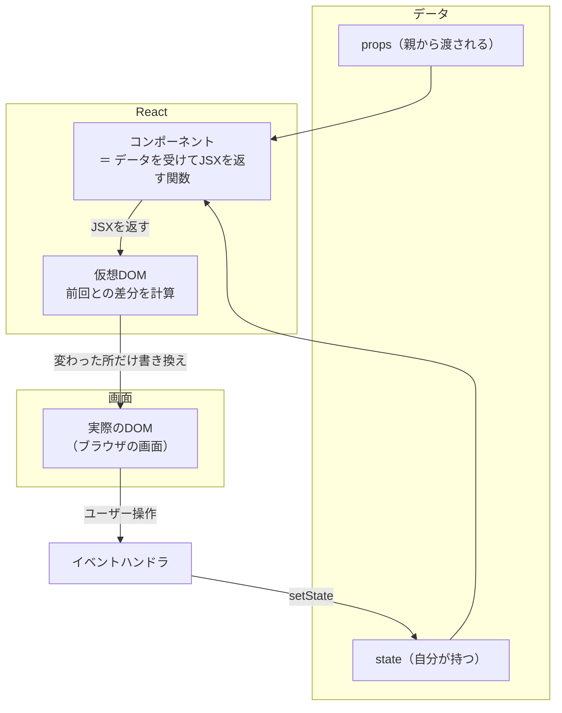

# React 完全ガイド 総合インデックス

このドキュメント群は、**React を基礎から実践レベルまで体系立てて**学ぶための教材です。プログラミング初学者でも読めるように、**たとえ話 → 図解 → 最小コード → 実務の判断基準**の順に進みます。

- 対象：Reactをこれから学ぶ人、なんとなく書けるが仕組みを理解したい人、クラスコンポーネント時代の知識を更新したい人
- 前提バージョン：**React 19 系（執筆時点の最新は 19.2）／ TypeScript**
- 関連：[Node.js 完全ガイド](../nodejs/README.md) ／ [Next.js 完全ガイド](../nextjs/README.md)

> 📖 **はじめに読むと理解が早まります** → [JavaScript・Node.js・React・Next.js の関係](../js-stack-relations.md)

---

## 1. まず結論（30秒サマリ）

**React とは「画面を部品に分けて、データから組み立てるライブラリ」** です。

最大の発明は **「宣言的UI」** ——「どう変えるか」ではなく「**どう見えるべきか**」だけを書けば、実際の書き換えはReactがやってくれる、という考え方です。

```jsx
// これがReactの本質。データ（props）を渡すと画面（JSX）が返る「関数」
function Greeting({ name }) {
  return <h1>こんにちは、{name}さん</h1>
}
```

理解の鍵は次の3つだけです。

| 鍵となる概念 | ひとことで | 効果 |
| --- | --- | --- |
| **コンポーネント** | 画面を部品に分ける単位 | 再利用でき、見通しが良くなる |
| **props と state** | 外から渡すデータ／自分で持つデータ | データの流れが一方向になり追跡できる |
| **再レンダリング** | stateが変わると関数が再実行される | 「なぜ動かないか」の9割はここの理解不足 |

そして実務の鉄則がひとつ：**「stateは必要最小限に。計算で求まるものはstateにしない」**。これを守るだけでバグの多くが消えます。

---

## 2. 全体マップ



**この輪が回り続ける**のがReactアプリの動作です。`state`が変わる → コンポーネント関数が再実行される → 新しいJSXができる → 差分だけDOMに反映される。

---

## 3. 章立てと読み方

### 基礎編 — 書けるようになる

| # | 章 | 内容 |
| --- | --- | --- |
| ① | [Reactとは何か](01-what-is-react.md) | 宣言的UI・仮想DOM・なぜ生まれたか・環境構築・他ライブラリ比較 |
| ② | [JSX・コンポーネント・props](02-jsx-components-props.md) | JSXの正体・コンポーネント分割・props・条件分岐とリスト表示 |
| ③ | [stateとイベント](03-state-events.md) | useState・イベント処理・フォーム・stateを持つ場所の判断 |
| ④ | [フック（Hooks）体系](04-hooks.md) | useEffect・useRef・useContext・useReducer・カスタムフック |

### 応用編 — 仕組みを理解して正しく設計する

| # | 章 | 内容 |
| --- | --- | --- |
| ⑤ | [レンダリングの仕組み](05-rendering-mechanism.md) | 再レンダリングの条件・key・useMemo/useCallback・React Compiler |
| ⑥ | [状態設計と状態管理](06-state-design.md) | リフトアップ・Context・Zustand/Jotai/TanStack Query の使い分け |
| ⑦ | [React 19の新機能](07-react19-features.md) | Server Components・Actions・`use`・`<Activity>`・useEffectEvent |
| ⑧ | [実践パターンとアンチパターン](08-practice-patterns.md) | 設計パターン・よくある失敗・パフォーマンス・アクセシビリティ |

### 付録

- [用語集・チートシート](glossary.md) ← 用語辞典・逆引き表・頻出エラー早見表

---

## 4. 読者タイプ別のおすすめルート

- **完全な初学者** → ① → ② → ③ で簡単な画面が作れます。④まで進めば実用レベル
- **なんとなく書けるが仕組みが不安** → ⑤（レンダリング）→ ⑥（状態設計）が効きます
- **クラスコンポーネント世代** → ④（フック）→ ⑦（React 19）で知識を更新
- **Next.jsを触っている／これから触る** → ② → ③ → ④ → ⑦（RSCの理解に直結）
- **パフォーマンス問題を抱えている** → ⑤ → ⑧
- **用語だけ引きたい** → [用語集](glossary.md)

---

## 5. 最重要ポイント（シリーズ全体から5つだけ）

1. **コンポーネントは「データを受けてJSXを返す関数」** —— stateが変わるたびにこの関数がまた呼ばれる、という理解がすべての土台（→ [⑤](05-rendering-mechanism.md)）
2. **stateは最小限に** —— 他のstateから計算できるものはstateにしない。「派生state」はバグの温床（→ [③](03-state-events.md)・[⑥](06-state-design.md)）
3. **stateは書き換えず、新しい値を作る（イミュータブル）** —— `arr.push()` ではなく `[...arr, x]`。これを破ると画面が更新されない（→ [③](03-state-events.md)）
4. **useEffectは「外の世界との同期」だけに使う** —— データ整形や計算に使うのは誤用。Reactで最も誤用されるフック（→ [④](04-hooks.md)）
5. **React Compilerの登場で `useMemo`/`useCallback` は原則不要に** —— 手動メモ化の常識が変わった（→ [⑤](05-rendering-mechanism.md)）

---

## 6. このシリーズの前提バージョン

| 項目 | 前提 | 備考 |
| --- | --- | --- |
| React | **19 系**（19.2 時点） | 18以前との差分は各章の「⚠️ バージョン差分」に記載 |
| 記法 | **関数コンポーネント＋フック** | クラスコンポーネントは保守時のみ（[④](04-hooks.md)に対応表） |
| 言語 | TypeScript 前提 | 現在のエコシステムは実質TS標準 |
| React Compiler | 1.0（安定版） | 手動メモ化の必要性が大きく減った |
| 実行環境 | Node.js 24 LTS 以上を推奨 | 開発時に必要（→ [Node.js①](../nodejs/01-what-is-nodejs.md)） |
