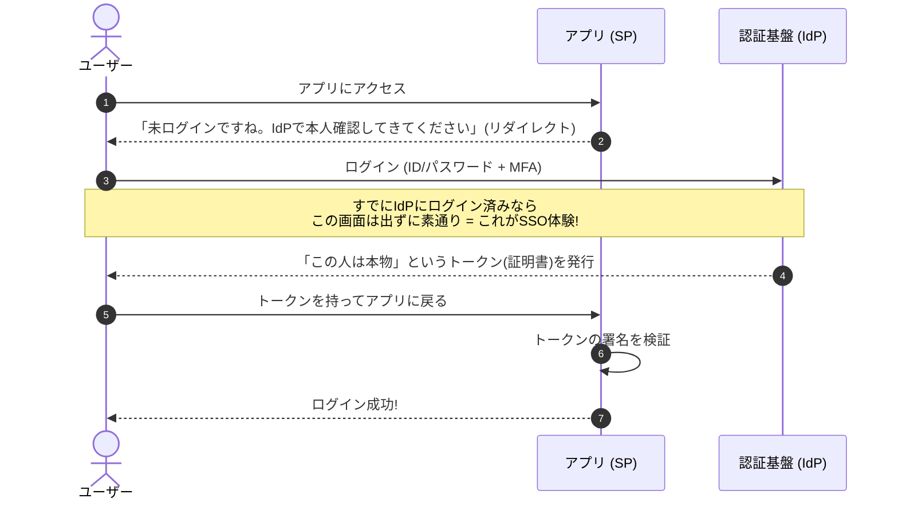

# ① SSOの基礎 〜たとえ話でつかむ仕組みと登場人物〜

> **この章でわかること**
> - SSO（シングルサインオン）とは何か（たとえ話で直感的に）
> - SSOのメリットと、意外と語られないデメリット
> - IdP・SP・トークンという「登場人物」の役割
> - どの技術にも共通する、SSOの基本的な流れ（図解）

---

## 1. SSOとは何か

**SSO（Single Sign-On / シングルサインオン）** とは、

> **一度ログインすれば、複数のサービスやアプリに、その都度ログインし直さずに使える仕組み**

のことです。

Google アカウントひとつで YouTube・Gmail・Google ドライブにそのまま入れる、あの体験がまさに SSO です。会社なら「朝PCで一度ログインしたら、勤怠システムも経費精算も Slack も、パスワードなしでそのまま使える」という世界を実現します。

### たとえ話：遊園地の「1日フリーパス」

遊園地に入るとき、入口で身分証を見せて **1日フリーパス（リストバンド）** をもらうところを想像してください。

- アトラクションごとに毎回チケットを買う必要はありません
- どのアトラクションでも、リストバンドを見せれば乗れます
- 各アトラクションの係員は、リストバンドが「入口の係員（＝信頼できる発行元）」の発行したものだから信じて通してくれます

| 遊園地 | SSOの世界 |
| --- | --- |
| 入口の係員（身分証チェック） | **IdP**（本人確認する認証基盤） |
| 各アトラクション | **SP**（使いたいアプリ） |
| 1日フリーパス（リストバンド） | **トークン**（本人確認済みの証明書） |
| あなた | ユーザー本人 |

### よくある誤解の整理

| 誤解 | 正しい理解 |
| --- | --- |
| 「全部のパスワードを同じにすること」 | ❌ 違います。パスワードの使い回しはむしろ危険。SSOは“ログイン済みという状態”を安全に共有する仕組み |
| 「パスワード管理ツールのこと」 | ❌ それは“パスワードマネージャー”（1Passwordなど）。SSOとは別物 |
| 「Googleでログイン ＝ SSO」 | ⭕ おおむね正しい。ソーシャルログインはSSOの一種（[④OIDC](04-oidc.md)で詳しく） |

---

## 2. SSOがあると何が嬉しいのか

### 利用者（ユーザー）にとって

- **覚えるパスワードが1つで済む** ——「このサービスのパスワード何だっけ…」が激減
- **ログインが速い・ラク** —— 業務アプリが10個あっても、朝1回ログインすれば全部使える
- **パスワードの使い回しが減る** —— 結果的に安全になる

### 企業・管理者にとって

- **退職者のアクセスを一括停止できる** —— IdP側でアカウントを止めれば、連携する全アプリから即座に締め出せる。**SSO最大のセキュリティ効果**のひとつ
- **パスワードリセット対応が減る** —— ヘルプデスク問い合わせの多くは「パスワード忘れ」。これが激減する
- **アクセス管理を一元化** ——「誰がどのアプリを使えるか」を1か所で管理
- **監査ログが集約される** ——「いつ・誰が・どこにログインしたか」を1か所で追える
- **ポリシーを統一適用できる** —— MFA必須・特定IPのみ許可などをまとめて強制

---

## 3. SSOのデメリット・注意点

良いことばかりではありません。導入前に必ず知っておくべき点です。

- **「鍵が1つ」になるリスク（単一障害点）**
  IdPのアカウントが乗っ取られると、連携している**全サービス**に侵入されます。だからこそIdPには**MFA（多要素認証）が必須**です（→ [⑤セキュリティとMFA](05-security-mfa.md)）
- **IdPが落ちると全部止まる**
  IdPがダウンすると、連携アプリ全体にログインできなくなる可能性があります
- **初期導入の手間・コスト**
  特にSAMLの設定はやや複雑で、アプリごとに連携設定が必要です
- **すべてのアプリがSSOに対応しているわけではない**
  古いアプリや独自実装のアプリは非対応のことがあります

> **結論**：SSOは「便利さ」と引き換えに「IdPの守りを固める責任」が増える仕組み。**MFAと可用性対策はセット**で考えるのが鉄則です。

---

## 4. 登場人物と基本用語

SSOを理解する近道は、まず「登場人物」を覚えることです。

| 用語 | 正式名称 | ざっくり言うと | たとえ |
| --- | --- | --- | --- |
| **IdP** | Identity Provider | 本人確認をして「この人は本物です」と保証する側 | 遊園地の入口・パスポート発行局 |
| **SP** | Service Provider | ユーザーが使いたいアプリ・サービス側 | 各アトラクション・入国先の国 |
| **RP** | Relying Party | OIDCでの「SP」の呼び方。IdPを“頼る（rely）”側 | SPと同じ役割 |
| **トークン / アサーション** | Token / Assertion | 「本人確認OK」を証明する電子的な証明書 | リストバンド・ビザ |
| **クレーム** | Claim | トークンに含まれる属性情報（名前・メール・所属など） | パスポートの記載事項 |
| **フェデレーション** | Federation | 別々の組織・ドメイン間で認証を信頼し合う仕組み | 国同士のビザ相互承認 |

> **覚え方**：本人を保証する「**IdP**」が、使いたいアプリ「**SP / RP**」に向けて、「この人は本物だよ」という**トークン**を渡す。まずはこれだけ押さえればOKです。

### 超重要な区別：「認証」と「認可」

この2つの違いが、SSOの技術を理解する最大のカギです。

| | 認証（Authentication） | 認可（Authorization） |
| --- | --- | --- |
| 問い | 「**あなたは誰？**」 | 「**あなたに何を許可する？**」 |
| 例 | ログイン画面でのパスワード確認 | 「このアプリに連絡先の読み取りを許可」 |
| 担当する技術 | SAML、OIDC | OAuth 2.0 |

OAuth 2.0 は本来“認可”の仕組みであって、“ログイン（認証）”のための仕組みではありません。ここを混同すると理解が一気にこんがらがります（→ [③OAuth 2.0](03-oauth2.md) で詳しく）。

---

## 5. SSOの基本的な流れ

使う技術（SAML / OIDC）が違っても、SSOの大筋は同じです。

ポイントは **手順3** です。一度IdPにログイン済みなら、2つ目以降のアプリでは**ログイン画面すら出ずに通過**します。これが「シングルサインオン（一度のサインオン）」という名前の由来です。

### この流れを実現する技術たち

| 技術 | 主な用途 | ひとことで | 詳細 |
| --- | --- | --- | --- |
| **SAML 2.0** | 企業向けSSO（社内アプリ・SaaS） | 老舗。エンタープライズの定番。XML形式 | [②SAML](02-saml.md) |
| **OAuth 2.0** | **認可**（権限の委譲） | 「このアプリにデータへのアクセスを許可」する仕組み | [③OAuth 2.0](03-oauth2.md) |
| **OpenID Connect (OIDC)** | **認証**（ログイン） | OAuth 2.0の上に作られた現代の主流。JSON形式 | [④OIDC](04-oidc.md) |

---

## 次の章へ

企業SSOの定番、SAMLの仕組みから詳しく見ていきましょう。

- 次へ → [② SAMLを詳しく](02-saml.md)
- [シリーズの目次に戻る](README.md)
