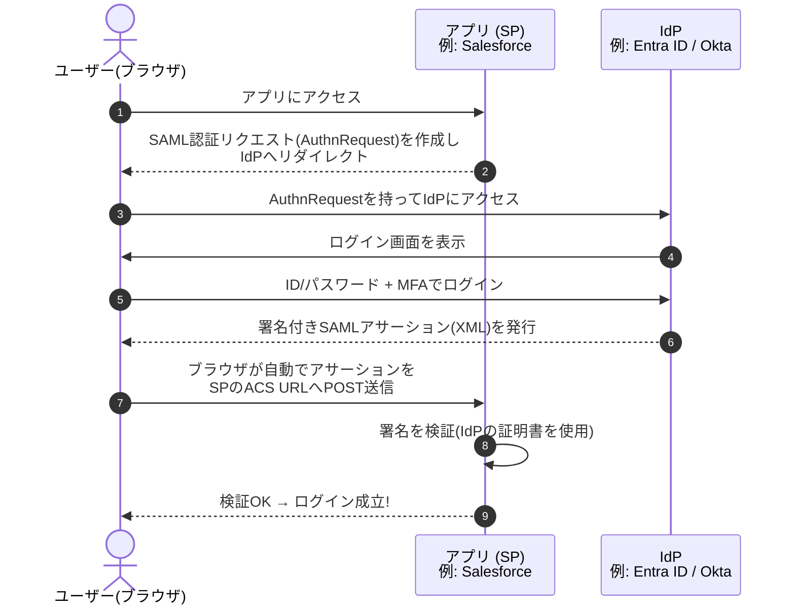
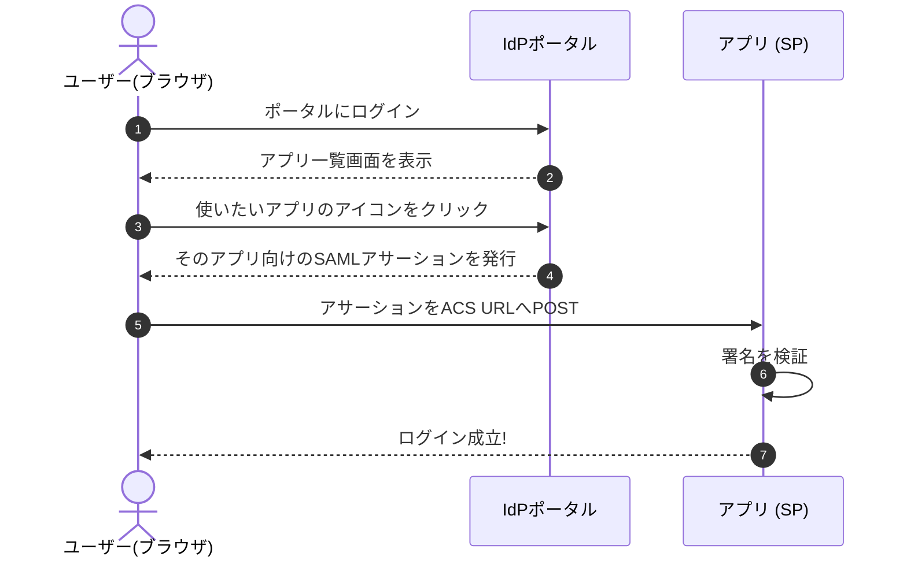

# ② SAMLを詳しく 〜企業SSOの定番プロトコル〜

> **この章でわかること**
> - SAMLの特徴と、企業で採用され続ける理由
> - SP起点 / IdP起点、2つのログインパターンの流れ（図解）
> - 実際のSAMLアサーション（XML）はどんな見た目か
> - 連携設定で必ず出てくる用語（Entity ID・ACS URL・メタデータ・証明書）

---

## 1. SAMLとは

**SAML（Security Assertion Markup Language、サムル）** は、2005年に標準化された（バージョン2.0）、企業向けSSOの定番プロトコルです。**XML** 形式で認証情報をやり取りします。

### 特徴

- Salesforce、Workday、Slack（Enterprise）など、**業務SaaSの多くが対応**
- 本人確認の結果を **アサーション（Assertion）** というXML文書で受け渡す
- アサーションには **デジタル署名** が付き、改ざんを検知できる
- 20年近い実績があり、エンタープライズでの信頼が厚い

### 登場人物（SAMLでの呼び方）

| 役割 | 例 |
| --- | --- |
| **IdP**：本人確認をしてアサーションを発行 | Microsoft Entra ID、Okta、OneLogin |
| **SP**：アサーションを受け取って検証するアプリ | Salesforce、Slack、kintone など |

---

## 2. 2つの開始パターン

SAMLのログインには「どちらから始まるか」で2パターンあります。

### パターン1：SP-Initiated（SP起点）—— 一番よくある形

ユーザーが**まずアプリにアクセス**するところから始まります。



### パターン2：IdP-Initiated（IdP起点）—— ポータルから入る形

ユーザーが**まずIdPのポータル画面**（アプリアイコンが並ぶ画面。Oktaのダッシュボードや Microsoft の「マイアプリ」）にログインし、使いたいアプリのアイコンをクリックして入るパターンです。



> **どちらを使う？** 通常は両方有効にしておき、ユーザーの入り口（ブックマークからアプリ直行 or ポータル経由）に応じて自然に使い分けられます。セキュリティ的にはSP-Initiatedの方が推奨されることが多いです（IdP-Initiatedは応答の宛先検証が緩くなりがちなため）。

---

## 3. 実物を見てみよう：SAMLアサーションの中身

「署名付きXML」と言われてもピンとこないので、実際の構造を見てみましょう。以下は本物の構造を保った簡略版です（実物は数百行になることもあります）。

```xml
<saml:Assertion xmlns:saml="urn:oasis:names:tc:SAML:2.0:assertion"
                ID="_a1b2c3d4e5" IssueInstant="2026-07-12T09:30:00Z" Version="2.0">

  <!-- 誰が発行したか（IdPの識別子） -->
  <saml:Issuer>https://sts.windows.net/aaaabbbb-1111-2222-3333-ccccdddd0000/</saml:Issuer>

  <!-- 改ざん検知用のデジタル署名 -->
  <ds:Signature xmlns:ds="http://www.w3.org/2000/09/xmldsig#">
    <ds:SignatureValue>dGhpcyBpcyBhIHNpZ25hdHVyZS4uLg==</ds:SignatureValue>
  </ds:Signature>

  <!-- 誰についての証明か（ユーザーの識別子） -->
  <saml:Subject>
    <saml:NameID Format="urn:oasis:names:tc:SAML:1.1:nameid-format:emailAddress">
      taro.yamada@example.co.jp
    </saml:NameID>
  </saml:Subject>

  <!-- 有効期限と宛先の限定 -->
  <saml:Conditions NotBefore="2026-07-12T09:30:00Z" NotOnOrAfter="2026-07-12T09:35:00Z">
    <saml:AudienceRestriction>
      <saml:Audience>https://saml.salesforce.com</saml:Audience>
    </saml:AudienceRestriction>
  </saml:Conditions>

  <!-- 属性情報（クレーム）: 名前・部署などをSPに渡す -->
  <saml:AttributeStatement>
    <saml:Attribute Name="displayName">
      <saml:AttributeValue>山田 太郎</saml:AttributeValue>
    </saml:Attribute>
    <saml:Attribute Name="department">
      <saml:AttributeValue>営業部</saml:AttributeValue>
    </saml:Attribute>
  </saml:AttributeStatement>
</saml:Assertion>
```

読み解きポイント：

| 要素 | 意味 | 注目点 |
| --- | --- | --- |
| `Issuer` | 発行者（どのIdPが発行したか） | SPは「知っているIdPか」を確認する |
| `Signature` | デジタル署名 | これで改ざんを検知。**検証しないと危険** |
| `Subject > NameID` | 「誰」についての証明か | メールアドレス形式が多い |
| `Conditions` | 有効期限・宛先制限 | **有効期間はわずか5分**。盗まれても使い回しにくい |
| `AttributeStatement` | 属性情報（クレーム） | 名前・部署などをSP側の項目に対応付ける（属性マッピング） |

---

## 4. 連携設定で必ず出てくる用語

SAML連携の設定作業は、要するに「**IdPとSPがお互いの情報を交換して信頼関係を結ぶこと**」です。そのとき登場するのが以下の用語です。

| 用語 | 意味 | 設定のどこで使うか |
| --- | --- | --- |
| **Entity ID** | IdPやSPを一意に識別するID（URL形式が多い） | 双方に相手のIDを登録 |
| **ACS URL**（Assertion Consumer Service） | IdPがアサーションを送り返す先のSP側URL | IdPに登録する |
| **AuthnRequest** | SPがIdPに送る「認証してください」という依頼 | （自動で流れる） |
| **メタデータ（Metadata）** | Entity ID・URL・証明書などをまとめたXMLファイル | **これを交換すれば設定がほぼ完了**。手入力より安全 |
| **X.509証明書** | 署名検証に使う公開鍵 | IdPからSPへ渡す。**有効期限に注意!** |
| **NameID Format** | ユーザー識別子の形式（メール等） | 双方で合わせる |

> **実務のコツ**：メタデータXMLの交換に対応しているサービス同士なら、URLかファイルを渡すだけで設定の大半が終わります。手入力が必要な場合は Entity ID・ACS URL・証明書の3点セットを正確に。1文字違いでもログインループや署名エラーになります（→ [⑥導入と運用](06-deployment-ops.md) のトラブル表）。

---

## 5. SAMLのメリット・デメリット

| メリット ✅ | デメリット ❌ |
| --- | --- |
| エンタープライズで実績豊富、対応SaaSが多い | XMLベースで重く、設定がやや複雑 |
| 属性情報を細かく渡せる | **モバイルアプリやSPA（シングルページアプリ）には不向き** |
| 署名により改ざん検知できる | 証明書の期限管理という運用負担が発生 |

モバイルやSPAで認証したい場合は、次章以降の **OAuth 2.0 / OIDC** の出番です。

---

## 前後の章

- 前へ ← [① SSOの基礎](01-sso-basics.md)
- 次へ → [③ OAuth 2.0を詳しく](03-oauth2.md)
- [シリーズの目次に戻る](README.md)
