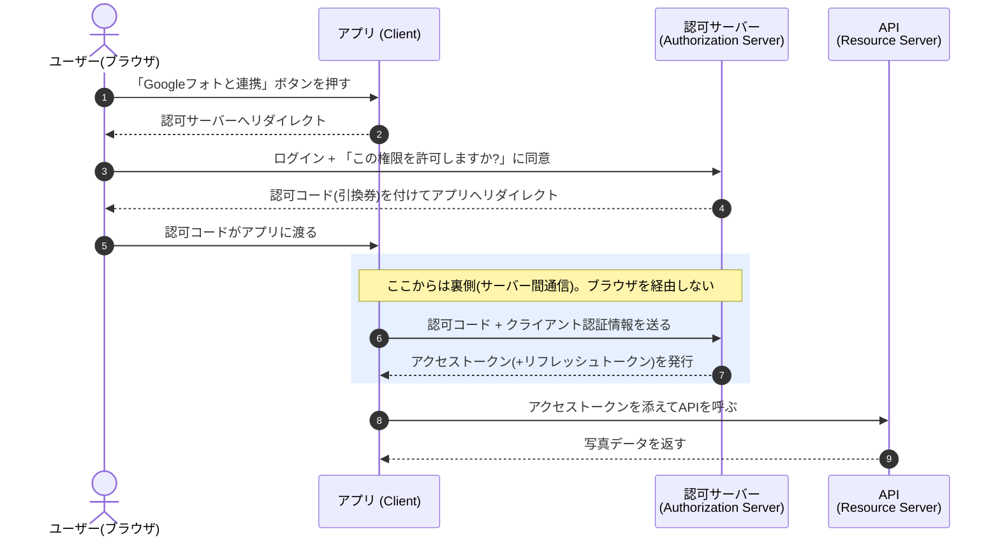
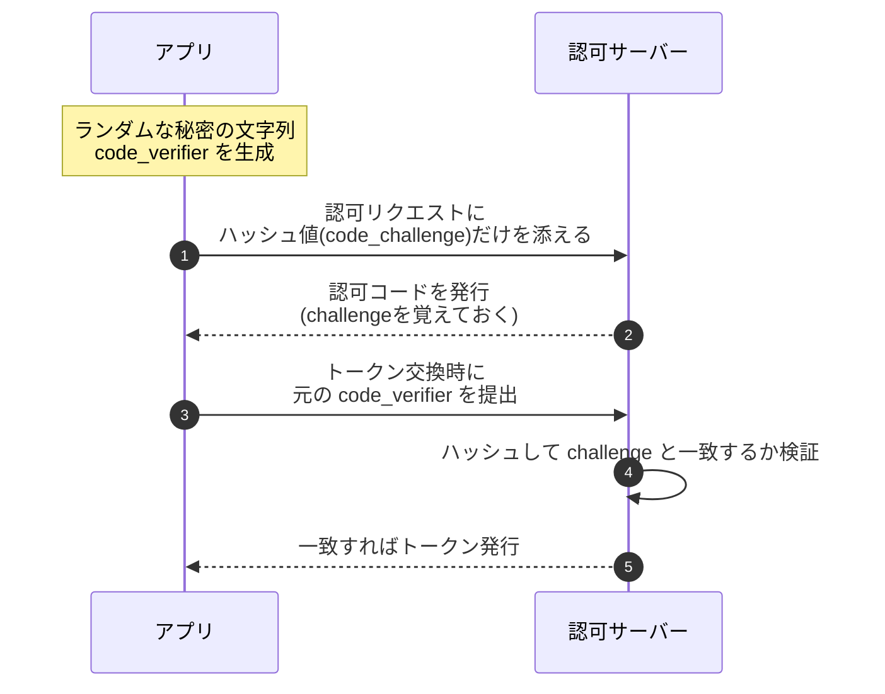

# ③ OAuth 2.0を詳しく 〜「認可」の仕組みとPKCE〜

> **この章でわかること**
> - OAuth 2.0が解決する問題（パスワードを渡さずに権限だけ渡す）
> - 認可コードフローの流れ（図解）と、実際の認可リクエストURLの読み解き方
> - PKCEとは何か、なぜ今や必須なのか
> - **なぜOAuth単体を「ログイン」に使ってはいけないのか**（攻撃シナリオ付き）

---

## 1. OAuth 2.0とは 〜何を解決する仕組み？〜

**OAuth 2.0（オーオース）** は、「**認可（権限の委譲）**」のためのプロトコルです。まず押さえるべきは、**SSO（ログイン）専用の仕組みではない**という点です。

### OAuthがなかった時代の問題

昔、「Gmailの連絡先を読み込んで友達を探す」機能を作るには、アプリがユーザーに **Googleのパスワードそのものを入力させて** いました。これは最悪です。

- アプリにパスワードを渡す＝**そのアプリはメールも削除もパスワード変更も、全部できてしまう**
- アプリが漏洩すれば、Googleアカウントごと乗っ取られる
- 「連絡先へのアクセスだけやめさせる」ことができない

### OAuthの解決策

> 「パスワードは渡さない。代わりに **“連絡先の読み取りだけできる通行証（アクセストークン）”** を発行する」

これがOAuthの発想です。たとえるなら、**車の鍵をまるごと預けるのではなく、「エンジンはかかるがトランクは開かないバレットキー（駐車係用の鍵）」だけを渡す** イメージです。

---

## 2. 登場人物

| 役割 | 意味 | 例（写真印刷アプリの場合） |
| --- | --- | --- |
| **Resource Owner** | データの持ち主（ユーザー本人） | あなた |
| **Client** | データを使いたいアプリ | 写真印刷アプリ |
| **Authorization Server** | 許可を確認して**トークンを発行**するサーバー | Googleの認可サーバー |
| **Resource Server** | 実際のデータを持つサーバー（API） | Googleフォト API |

### 主要な用語

| 用語 | 意味 | たとえ |
| --- | --- | --- |
| **アクセストークン** | APIにアクセスするための通行証。**有効期限が短い**（数分〜1時間） | バレットキー |
| **リフレッシュトークン** | アクセストークンの期限切れ時に再発行してもらう鍵 | 鍵の再発行券 |
| **スコープ（scope）** | 許可する権限の範囲 | 「トランクは開かない」という制限 |
| **認可コード** | トークンと引き換えるための一時的なコード | 引換券 |

---

## 3. 認可コードフロー（Authorization Code Flow）

最も安全で標準的な流れです。ポイントは「**引換券（認可コード）を表で受け取り、本物の鍵（トークン）は裏で受け取る**」という2段階になっていることです。



> **なぜ2段階にするのか？** ブラウザ（表側）はURLが履歴に残ったり拡張機能に見られたりと、漏洩リスクが高い場所です。そこで表側には**盗まれても単体では使えない引換券（認可コード）**だけを流し、本物のトークンは**サーバー同士の裏側通信**で受け渡します。

---

## 4. 実物を見てみよう：認可リクエストURLの読み解き

「Googleフォトと連携」ボタンを押した瞬間、ブラウザは実際にこんなURLへ飛びます（見やすいように改行しています）。

```
https://accounts.google.com/o/oauth2/v2/auth
  ?client_id=407408718192.apps.googleusercontent.com   ← どのアプリからの依頼か
  &redirect_uri=https://photo-print.example.com/callback ← 認可コードの戻し先
  &response_type=code                                   ← 「認可コードをください」
  &scope=https://www.googleapis.com/auth/photoslibrary.readonly ← 欲しい権限(読み取りのみ!)
  &state=xyzABC123                                      ← CSRF対策のランダム値
  &code_challenge=E9Mel6a...                            ← PKCE用(後述)
  &code_challenge_method=S256
```

| パラメータ | 役割 | セキュリティ上の意味 |
| --- | --- | --- |
| `client_id` | アプリの識別子 | 認可サーバーが「登録済みのアプリか」を確認 |
| `redirect_uri` | 認可コードの戻し先 | **事前登録したURLと完全一致しないと拒否される**（横取り防止） |
| `response_type=code` | 認可コード方式の指定 | 現在はこれ一択と考えてよい |
| `scope` | 欲しい権限の範囲 | **最小限にするのがマナーであり防御**。`readonly` に注目 |
| `state` | ランダム値 | 戻ってきたときに一致確認し、CSRF攻撃を防ぐ |
| `code_challenge` | PKCEのチャレンジ値 | 認可コードの横取り対策（次節） |

> **自分でも見られます**：ブラウザの開発者ツール（F12）→ Networkタブを開いてから「Googleでログイン」等を押すと、まさにこの形のリクエストが流れるのが観察できます。詳しい手順は [④OIDC](04-oidc.md) で。

---

## 5. PKCE（ピクシー）〜認可コードの横取りを防ぐ〜

**PKCE（Proof Key for Code Exchange）** は、モバイルアプリやSPAなど「クライアントシークレット（アプリの秘密の合言葉）を安全に隠せないアプリ」のために作られた拡張です。**現在はすべての認可コードフローで利用が推奨**されています。

### 仕組み：「割り符」方式



たとえるなら**割り符**です。最初に「割った片方（ハッシュ値）」を預け、トークンをもらうときに「もう片方（元の文字列）」を見せて、ピッタリ合えば本人と認める——。認可コードを途中で盗んだ攻撃者は `code_verifier` を知らないため、トークンに交換できません。

---

## 6. なぜOAuth単体を「ログイン」に使ってはいけないのか

ここがOAuth理解の最重要ポイントです。

OAuthのアクセストークンは「**何ができるか（認可）**」を表すもので、「**誰なのか（認証）**」を保証する設計ではありません。それでも昔は「アクセストークンでプロフィールAPIを叩いて、返ってきたユーザーを本人とみなす」という**自己流ログイン**が横行し、脆弱性を生みました。

### 攻撃シナリオ：トークン差し替えによるなりすまし

1. 攻撃者が、**正規の手順で自分自身のアクセストークン**を手に入れる（悪意あるアプリBに自分でログインするだけ）
2. 標的アプリAが「アクセストークンを受け取ってプロフィールAPIで本人確認する」自己流ログインだったとする
3. 攻撃者は**被害者がアプリBで発行したトークン**（Bから盗む・Bが悪意を持つ）をアプリAに差し込む
4. アプリAはトークンでプロフィールを取得 →「被害者本人だ」と誤認 → **なりすまし成立**

**根本原因**：アクセストークンには「**どのアプリに向けて発行されたか（宛先）**」を検証する仕組みが標準で備わっていないこと。アプリB向けのトークンをアプリAに使い回されても、アプリAには見分けられません。

### 正解：OpenID Connect を使う

この問題を解決するために、OAuth 2.0の上に「認証」を正しく載せた標準が **OpenID Connect（OIDC）** です。OIDCの **IDトークン** には宛先（`aud`）や発行者（`iss`）が署名付きで含まれ、差し替えを検知できます。→ 次章で詳しく。

---

## 前後の章

- 前へ ← [② SAMLを詳しく](02-saml.md)
- 次へ → [④ OpenID Connect（OIDC）を詳しく](04-oidc.md)
- [シリーズの目次に戻る](README.md)
