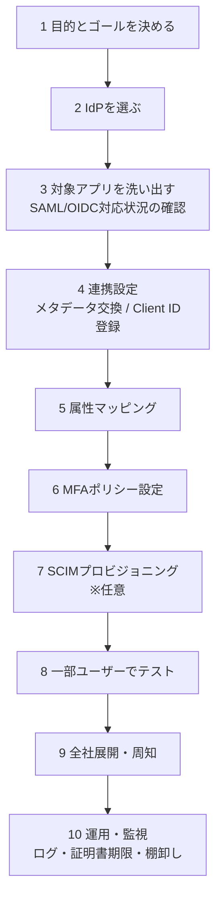
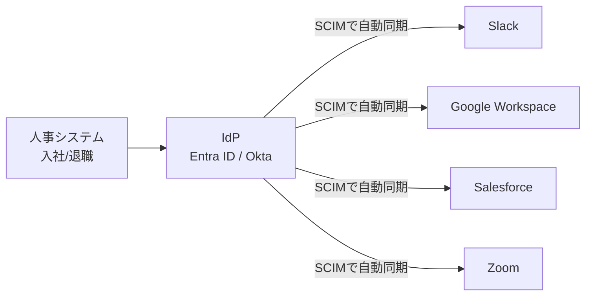

# ⑥ 導入と運用 〜手順・製品選び・SCIM・トラブル対応〜

> **この章でわかること**
> - 社内SSO導入の10ステップ
> - Entra ID / Okta での実際の設定手順（画面レベル）
> - SCIM（アカウント自動同期）でどこまで自動化できるか
> - 代表的なIdP製品の比較と、よくあるトラブルの対処法
> - シリーズ全体の用語集

---

## 1. 導入の全体像：10ステップ

*（図が表示されない環境用：[SVG版](svg/06-deployment-ops-1.svg)）*

| ステップ | ポイント |
| --- | --- |
| 1. 目的とゴール | 「パスワード問い合わせ削減」「退職時の即時停止」「監査対応」など、何を解決したいかを言語化 |
| 2. IdP選定 | 既存環境に合わせるのが近道。Microsoft 365利用中なら Entra ID、Google Workspace中心ならGoogle、マルチクラウドならOktaなど |
| 3. アプリ洗い出し | 各アプリの管理画面やヘルプで「SAML」「OIDC」「SSO」対応を確認。**SSO機能が上位プラン限定のSaaSも多い**（いわゆるSSO Tax）ので料金も確認 |
| 4. 連携設定 | SAMLならメタデータ（Entity ID / ACS URL / 証明書）交換、OIDCなら Client ID / Secret / リダイレクトURI 登録 |
| 5. 属性マッピング | IdPのどの属性（メール・氏名・部署）をアプリのどの項目に渡すか対応付け |
| 6. MFA | **IdPログインにMFA必須化**。これを飛ばすならSSO化しない方がマシなレベルで重要（→ [⑤セキュリティ](05-security-mfa.md)） |
| 7. SCIM | 入退社のアカウント作成・削除を自動化（後述） |
| 8. テスト | ログイン・ログアウト・エラー時の挙動・スマホからのアクセスを確認 |
| 9. 展開 | 部署単位で段階展開が安全。旧ログイン方式の停止日を明確に周知 |
| 10. 運用 | **証明書の期限監視**を必ず仕込む（後述のトラブル表参照） |

---

## 2. 実例：Entra ID でSaaSにSAML連携する手順（画面レベル）

Microsoft Entra ID（旧 Azure AD）で、SaaS（例：Salesforce）をSSO化するときの実際の流れです。

1. [Microsoft Entra 管理センター](https://entra.microsoft.com) にログイン
2. 左メニュー **「エンタープライズ アプリケーション」→「新しいアプリケーション」**
3. ギャラリーから対象アプリ（例：Salesforce）を検索して追加
   （ギャラリーに無い独自アプリは「独自のアプリケーションの作成」→ Non-gallery を選択）
4. 追加したアプリを開き **「シングル サインオン」→「SAML」** を選択
5. 「基本的なSAML構成」に、**SP側（Salesforce）で確認したEntity IDとACS URL**を入力
6. 「属性とクレーム」で、渡す属性（メール・氏名など）を必要に応じて調整
7. 「SAML証明書」から **フェデレーション メタデータXML** をダウンロード
8. **SP側（Salesforce）の管理画面**でSSO設定を開き、手順7のメタデータをアップロード
9. Entra ID側の **「ユーザーとグループ」** で、このアプリを使わせるユーザー/グループを割り当て
10. 「テスト」ボタン、または対象ユーザーでの実ログインで動作確認

> つまずきポイント：手順9の**割り当てを忘れると、そのユーザーは「アクセス権がありません」エラー**になります。「一部の人だけログインできない」問題の定番原因です。

## 3. 実例：Okta でのアプリ追加手順（画面レベル）

1. Okta管理画面（Admin Console）にログイン
2. **「Applications」→「Browse App Catalog」** で対象アプリを検索して追加（7,000以上の連携済みカタログがある）
3. 「Sign On」タブで **SAML 2.0**（またはOIDC）を選択
4. 表示される **IdPメタデータ（またはIdP SSO URL・証明書）** をSP側に登録
5. SP側の Entity ID / ACS URL をOktaのアプリ設定に入力
6. **「Assignments」タブ** でユーザー/グループを割り当て
7. ユーザーのOktaダッシュボードにアプリのアイコンが出現 → クリックでSSOログインできれば成功（IdP-Initiated）

---

## 4. SCIM 〜アカウント管理まで自動化する〜

SSOが担うのは「ログイン」だけです。**「アカウントを作る・消す」**は別の仕組み、**プロビジョニング**が担当します。

- **プロビジョニング**：入社したら各アプリにアカウントを自動作成。退職したら自動削除（**デプロビジョニング**）
- **SCIM（スキム / System for Cross-domain Identity Management）**：このアカウント同期を標準化したプロトコル

*（図が表示されない環境用：[SVG版](svg/06-deployment-ops-2.svg)）*

> **SSO + SCIM をセットで導入する**と、「入社日の朝には全アプリのアカウントが揃っている」「退職と同時に全アプリから消える」が実現し、情シスの運用が劇的にラクになり、削除漏れという最大級のセキュリティホールも塞がれます。

---

## 5. 代表的なIdP製品・サービス

### 企業向けIdP

| 製品 | 提供元 | 特徴 |
| --- | --- | --- |
| **Microsoft Entra ID**（旧 Azure AD） | Microsoft | Microsoft 365と統合。企業で圧倒的シェア。条件付きアクセスが強力 |
| **Okta** | Okta | IdP専業の代表格。連携アプリカタログが最大級。マルチクラウドに中立 |
| **Google Workspace** | Google | Googleアカウントを基盤にSAML/OIDC提供。Google中心の組織に |
| **OneLogin** | One Identity | 中堅企業向けで人気 |
| **Ping Identity** | Ping | 大企業・複雑な要件向け |
| **JumpCloud** | JumpCloud | ディレクトリ＋SSO＋デバイス管理を一体提供。中小向け |
| **Keycloak** | Red Hat（OSS） | オープンソース。自前ホストでき、ライセンス費ゼロ。運用は自己責任 |

### 開発者向け（自社アプリにログインを組み込む）

| サービス | 特徴 |
| --- | --- |
| **Auth0**（Okta傘下） | ドキュメント・SDKが充実。ソーシャルログインも簡単 |
| **Firebase Authentication** | モバイルアプリと相性抜群。無料枠が大きい |
| **Amazon Cognito** | AWS環境なら第一候補。安価 |
| **Supabase Auth** | OSS系BaaSの認証。Postgres連携 |
| **Keycloak** | 自前ホストしたい場合 |

---

## 6. よくあるトラブルと対処

| 症状 | よくある原因 | 対処 |
| --- | --- | --- |
| ログインループ（無限リダイレクト） | サーバーの**時刻ずれ**、Cookie設定、ACS URL誤り | NTPで時刻同期、URL設定見直し、シークレットウィンドウで切り分け |
| 「署名検証に失敗」エラー | 証明書の不一致・期限切れ | IdP/SPの証明書を再交換・更新 |
| **突然、全員ログイン不能に** | **SAML証明書の有効期限切れ**（SSO障害の定番） | 証明書を更新して再連携。**期限の90日前アラートを必ず設定** |
| ログインできるが属性が空 | 属性マッピング漏れ | クレーム/属性の対応付けを設定 |
| 一部ユーザーだけ入れない | アプリへの**割り当て漏れ** | IdPでユーザー/グループにアプリを割り当て |
| `redirect_uri_mismatch`（OIDC） | リダイレクトURIの登録ミス | 末尾スラッシュ・httpとhttpsの違いまで**完全一致**で登録 |
| トークン期限切れが頻発 | 有効期限が短すぎ / リフレッシュ未実装 | リフレッシュトークン運用を実装 |
| 新入社員がアプリを使えない | プロビジョニング遅延・失敗 | SCIM同期ログを確認、手動同期を実行 |

> **二大原因は「時刻ずれ」と「証明書の期限切れ」**。NTPによる時刻同期と、証明書期限の監視アラートは、SSO運用の必須の備えです。

---

## 7. 用語集（シリーズ全体）

| 用語 | 意味 | 詳しくは |
| --- | --- | --- |
| SSO | 一度のログインで複数サービスを使える仕組み | [①基礎](01-sso-basics.md) |
| IdP / OP | 本人確認をしてトークンを発行する側 | [①基礎](01-sso-basics.md) |
| SP / RP | ユーザーが使いたいアプリ側 | [①基礎](01-sso-basics.md) |
| 認証 / 認可 | 「誰か」の確認 / 「何を許すか」の決定 | [①基礎](01-sso-basics.md) |
| フェデレーション | 組織間で認証を信頼し合う仕組み | [①基礎](01-sso-basics.md) |
| SAML / アサーション | XMLベースの企業向けSSO / その証明書 | [②SAML](02-saml.md) |
| Entity ID / ACS URL / メタデータ | SAML連携設定の3点セット | [②SAML](02-saml.md) |
| OAuth 2.0 / スコープ | 権限委譲のプロトコル / 権限の範囲 | [③OAuth 2.0](03-oauth2.md) |
| アクセストークン / リフレッシュトークン | APIの通行証 / その再発行券 | [③OAuth 2.0](03-oauth2.md) |
| PKCE | 認可コード横取りを防ぐ拡張 | [③OAuth 2.0](03-oauth2.md) |
| OIDC / IDトークン / JWT | OAuth2+認証 / 本人証明トークン / その形式 | [④OIDC](04-oidc.md) |
| クレーム（iss/sub/aud/exp） | トークン内の属性情報 | [④OIDC](04-oidc.md) |
| MFA / パスキー / FIDO2 | 多要素認証 / パスワードレス認証 | [⑤セキュリティ](05-security-mfa.md) |
| Kerberos / LDAP | 社内ネットワーク認証 / ディレクトリ | [⑤セキュリティ](05-security-mfa.md) |
| SCIM / プロビジョニング | アカウント自動同期の標準 / 自動作成・削除 | 本章 |
| SLO（シングルログアウト） | 1か所のログアウトで全アプリからログアウトする仕組み | [⑦SLO](07-slo.md) |

---

## シリーズのまとめ

- **SSO** は「一度のログインで複数サービス」を実現し、利便性とセキュリティ（退職時の一括停止・MFAの集中適用）を両立する仕組み
- 技術は3つ覚えればOK：**SAML**（企業SaaSの定番）、**OAuth 2.0**（認可）、**OIDC**（現代のログイン標準）
- 鍵が1つになる以上、**IdPのMFA・証明書管理・可用性**が生命線
- **SCIM** まで入れると入退社のアカウント管理も自動化できる

---

## 前後の章

- 前へ ← [⑤ セキュリティとMFA・パスキー](05-security-mfa.md)
- 次へ → [⑦ シングルログアウト（SLO）](07-slo.md)
- [シリーズの目次に戻る](README.md)
