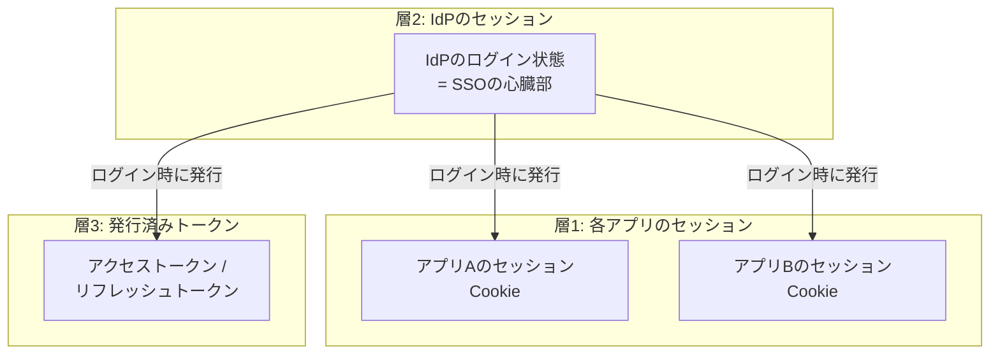
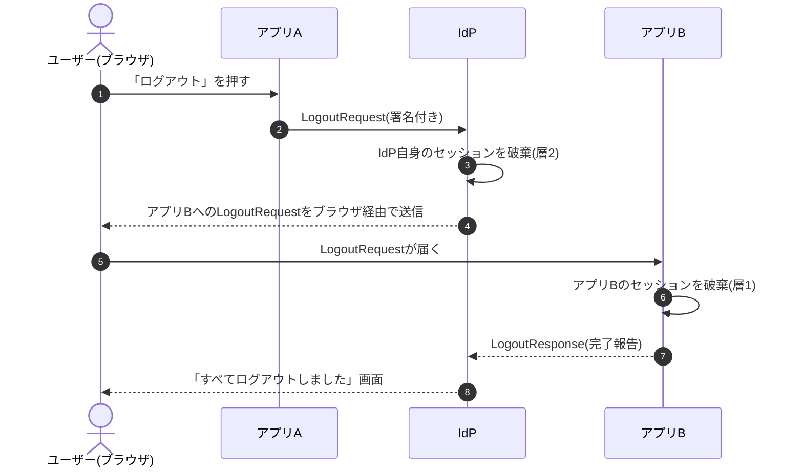
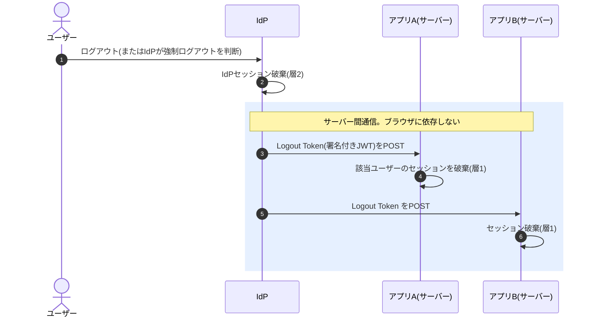

# ⑦ シングルログアウト（SLO）〜「全部からログアウト」の難しさ〜

> **この章でわかること**
> - SLO（シングルログアウト）とは何か、なぜログインより格段に難しいのか
> - 「セッションが3層ある」という考え方（ここが理解のカギ）
> - SAMLのSLOと、OIDCの3つのログアウト方式（RPイニシエイテッド / フロントチャネル / バックチャネル）
> - 完璧なSLOは現実には難しい——実務での落としどころ

---

## 1. SLOとは

**SLO（Single Logout / シングルログアウト）** とは、

> **1か所でログアウトしたら、SSOで繋がっている全アプリからもログアウトされる仕組み**

のことです。SSO（シングルサイン**オン**）の対になる概念です。

### なぜ必要か

- 共有PCや学校・ネットカフェの端末で「ログアウトしたつもりが、他のアプリには入れたまま」は事故のもと
- 退職・アカウント侵害時に「**今すぐ全セッションを切りたい**」という運用要求
- 「ログアウトボタンを押したのに別アプリでまだログインしてる」はユーザーの直感に反する

### なぜログインより難しいのか

ログイン（SSO）は「ユーザーがアプリを訪れたとき」に発生するので、その場でIdPに確認しに行けます。**ログアウトは逆**で、「もう訪れていない他のアプリたち」に**こちらから知らせて回る**必要があります。遊園地でたとえるなら、**退園時にリストバンドを回収しても、既に「顔パス」を覚えてしまった各アトラクションの係員の記憶までは消せない**——この「係員の記憶」が各アプリのセッションです。

---

## 2. 理解のカギ：セッションは「3層」ある

「ログアウトしたのにログインできてしまう」問題は、ほぼすべてこの3層の理解不足から来ます。



*（図が表示されない環境用：[SVG版](svg/07-slo-1.svg)）*

| 層 | 何か | これだけ消すとどうなる？ |
| --- | --- | --- |
| **層1：アプリのセッション** | 各アプリが自分で持つログイン状態（Cookie） | そのアプリからは出るが、**IdPが生きているので再アクセスすると即・自動再ログイン**（「ログアウトできない！」の正体） |
| **層2：IdPのセッション** | IdP自身のログイン状態 | 新しいアプリへのSSOは止まるが、**各アプリの既存セッションは生き続ける** |
| **層3：発行済みトークン** | APIアクセス用のトークン類 | 期限が切れるまで有効なことが多い（失効APIがあれば即時失効可能） |

> **完全なログアウト＝3層すべてを消すこと。** SLOのプロトコルは主に「層1と層2を連動して消す」ための仕組みです。

---

## 3. SAMLのSLO

SAMLには標準のSLO仕様があります。ログアウトの起点（SPまたはIdP）から `LogoutRequest` が送られ、IdPが**ログイン中の全SPに順番にログアウトを伝達**します。



*（図が表示されない環境用：[SVG版](svg/07-slo-2.svg)）*

### SAML SLOの弱点

- 伝達がブラウザのリダイレクト頼み（フロントチャネル）だと、**途中のSPが1つでもエラー・タイムアウトになると連鎖が止まる**
- タブを閉じられたら伝達が完了しない
- 実装がSPごとにまちまちで、**SLO非対応のSPも多い**

このため、実務ではSAML SLOを「有効化はするが、頼りきらない」構成が一般的です（→ 6節）。

---

## 4. OIDCのログアウト3方式

OIDCは「ログアウトの難しさ」を認めた上で、役割の違う3つの仕様を用意しています。

### 方式1：RP-Initiated Logout（アプリ起点ログアウト）

アプリのログアウトボタンから、**IdPのログアウト用URL（`end_session_endpoint`）にユーザーを送る**方式。層1（自アプリ）と層2（IdP）を消せます。最低限これを実装すれば「再アクセスで自動再ログインしてしまう」問題は防げます。

```
https://idp.example.com/logout
  ?id_token_hint=eyJhbGc...        ← 誰のログアウトか(IDトークンを添える)
  &post_logout_redirect_uri=https://app.example.com/goodbye  ← 完了後の戻り先(事前登録制)
```

### 方式2：Front-Channel Logout（フロントチャネル）

IdPのログアウト画面に、**各アプリのログアウトURLを埋め込んだ隠しiframe**を並べ、ブラウザに一斉アクセスさせて各アプリのセッションを消させる方式。仕組みは簡単ですが、近年のブラウザの**サードパーティCookie制限で動かないケースが増えており**、新規採用は非推奨の流れです。

### 方式3：Back-Channel Logout（バックチャネル）——現在の本命

ブラウザを経由せず、**IdPが各アプリのサーバーへ直接「ログアウト通知（Logout Token）」をPOSTする**方式。



*（図が表示されない環境用：[SVG版](svg/07-slo-3.svg)）*

| | フロントチャネル | バックチャネル |
| --- | --- | --- |
| 経路 | ブラウザ（iframe） | サーバー間直接通信 |
| ブラウザ制限の影響 | ✗ 受ける（3rd party Cookie問題） | ⭕ 受けない |
| タブを閉じられたら | ✗ 伝達失敗 | ⭕ 関係なく届く |
| アプリ側の実装 | 簡単 | やや手間（受信エンドポイント＋セッションをサーバー側で管理する必要） |
| 信頼性 | 低 | **高（推奨）** |

> Logout Token は IDトークンと同じ署名付きJWTで、`events` クレームに「これはログアウト通知である」ことが明記され、なりすまし通知を防げるようになっています。

---

## 5. 「退職者を今すぐ全部から締め出したい」への答え

SLOは「ユーザーが自分でログアウトする」場面だけでなく、**管理者による強制切断**でも重要です。

| 手段 | 効果 | 即時性 |
| --- | --- | --- |
| IdPでアカウント無効化 | 新規ログイン・SSOを全停止 | 即時 |
| IdPのセッション失効（全デバイスサインアウト） | 層2を強制破棄 | 即時 |
| バックチャネルログアウト連携 | 各アプリの層1も破棄 | 即時（対応アプリのみ） |
| リフレッシュトークンの失効 | 層3を破棄 | 即時 |
| **アクセストークンの短寿命化（事前の備え）** | 失効漏れがあっても**最大でも寿命分（例：15分）で無効化** | 寿命次第 |

> Microsoft Entra ID の「継続的アクセス評価（CAE）」や Okta の Universal Logout のように、**IdP側のイベントを即座にアプリへ伝える仕組み**（標準としては CAEP / Shared Signals Framework）も広がりつつあります。

---

## 6. 実務での落としどころ

正直に言うと、**「全アプリから確実に・即時に・完全にログアウト」は現実には保証しきれません**（SLO非対応アプリ、通知の取りこぼし、ネイティブアプリのトークンなど）。実務では次の組み合わせが定石です。

1. **RP-Initiated Logout は必ず実装**——「ログアウトしたのに自動再ログイン」だけは絶対に防ぐ（最低ライン）
2. **対応アプリにはバックチャネルログアウトを設定**——重要アプリ（メール・人事・経理系）を優先
3. **トークンとセッションの寿命を短めに設計**——「伝え漏れても15分〜1時間で死ぬ」を保険にする
4. **共有端末の用途にはIdPの「サインアウトですべてのセッションを終了」オプションを周知**
5. 完璧を狙って複雑化するより、**「どこまで消えるか」をユーザー・管理者に正しく説明できる状態**を目指す

---

## 前後の章

- 前へ ← [⑥ 導入と運用](06-deployment-ops.md)
- 次へ → [⑧ OIDCログイン実装ハンズオン](08-oidc-hands-on.md)
- [シリーズの目次に戻る](README.md)
