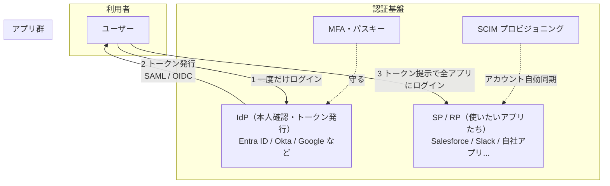

# SSO（シングルサインオン）完全ガイド 総合インデックス

このドキュメント群は、**SSO（シングルサインオン）の仕組み・主要技術（SAML / OAuth 2.0 / OIDC）・セキュリティ・導入運用** を、**専門知識ゼロの人でも理解できる** ようにまとめたものです。

- 対象：これからSSOを学ぶ人、社内にSSOを導入したい情シス担当者、認証まわりを実装するエンジニア、企画・PM
- 特徴：たとえ話 → 図解（シーケンス図）→ 実物（XML・JWT・URL）→ 実務（設定手順・トラブル対応）の順に、段階的に深くなります

> このページだけ読めば「全体像」と「どこに何が書いてあるか」がわかります。詳細は各章へ。

---

## 1. まず結論（30秒サマリ）

**SSOとは「一度ログインすれば、複数のサービスにその都度ログインし直さず入れる仕組み」** です。遊園地の1日フリーパスのように、入口（**IdP**）で一度本人確認を受ければ、各アトラクション（**アプリ＝SP**）はその証明書（**トークン**）を信じて通してくれます。

実現する技術は実質3つだけ：

| 技術 | ひとことで | 主な使いどころ |
| --- | --- | --- |
| **SAML** | 老舗。XMLベースの企業SSO | 業務SaaS（Salesforce等）の社内SSO化 |
| **OAuth 2.0** | ログインではなく「**権限の委譲（認可）**」 | 「このアプリに連絡先の読み取りを許可」 |
| **OIDC** | OAuth 2.0＋ログイン機能。現代の主流 | 「Googleでログイン」、自社アプリの認証 |

そして鉄則がひとつ：**SSOは鍵を1つにまとめる仕組みなので、その鍵（IdP）はMFA（多要素認証）で全力で守る。**

---

## 2. 全体マップ

---

## 3. 章立てと読み方

| # | 章 | 内容 |
| --- | --- | --- |
| ① | [SSOの基礎](01-sso-basics.md) | たとえ話・メリデメ・登場人物（IdP/SP）・基本フロー図・「認証と認可」の違い |
| ② | [SAMLを詳しく](02-saml.md) | SP起点/IdP起点のシーケンス図・実物のアサーションXML・連携設定用語（Entity ID / ACS URL / メタデータ） |
| ③ | [OAuth 2.0を詳しく](03-oauth2.md) | 認可コードフロー図・実際の認可URLの読み解き・PKCE・「OAuthでログインしてはいけない」攻撃シナリオ |
| ④ | [OIDCを詳しく](04-oidc.md) | IDトークン(JWT)を実際にデコードする追体験・「Googleでログイン」をDevToolsで観察・3技術の比較と選び方 |
| ⑤ | [セキュリティとMFA・パスキー](05-security-mfa.md) | 攻撃シナリオ別の対策・MFA方式の強さ比較・パスキーがフィッシングに強い理由 |
| ⑥ | [導入と運用](06-deployment-ops.md) | 導入10ステップ・Entra ID/Oktaの画面レベル手順・SCIM・製品比較・トラブル対処表・用語集 |

### 読者タイプ別のおすすめルート

- **とりあえず概要だけ知りたい** → このページ ＋ [①基礎](01-sso-basics.md) だけでOK
- **「Googleでログイン」を実装したい開発者** → [①基礎](01-sso-basics.md) → [③OAuth 2.0](03-oauth2.md) → [④OIDC](04-oidc.md)
- **社内SaaSをSSO化したい情シス担当** → [①基礎](01-sso-basics.md) → [②SAML](02-saml.md) → [⑥導入と運用](06-deployment-ops.md) →（余力があれば [⑤セキュリティ](05-security-mfa.md)）
- **セキュリティ観点で評価したい** → [⑤セキュリティ](05-security-mfa.md) → [③OAuth 2.0](03-oauth2.md)の攻撃シナリオ → [⑥導入と運用](06-deployment-ops.md)のトラブル表
- **用語だけ引きたい** → [⑥導入と運用の用語集](06-deployment-ops.md#7-用語集シリーズ全体)

---

## 4. 最重要ポイント（シリーズ全体から3つだけ）

1. **「認証（誰か）」と「認可（何を許すか）」は別物** —— SAML/OIDCが認証、OAuth 2.0が認可。ここを混同しなければ、技術選定で迷わない
2. **SSO導入とMFAはセット** —— 鍵を1つにまとめた以上、その鍵が破られたら全滅。IdPのログインは必ずMFA（できればパスキー）で守る
3. **運用の二大事故は「時刻ずれ」と「証明書の期限切れ」** —— NTP同期と証明書期限アラートを最初に仕込む
