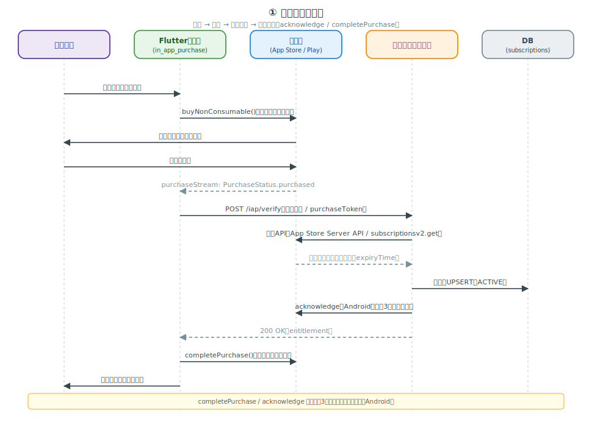
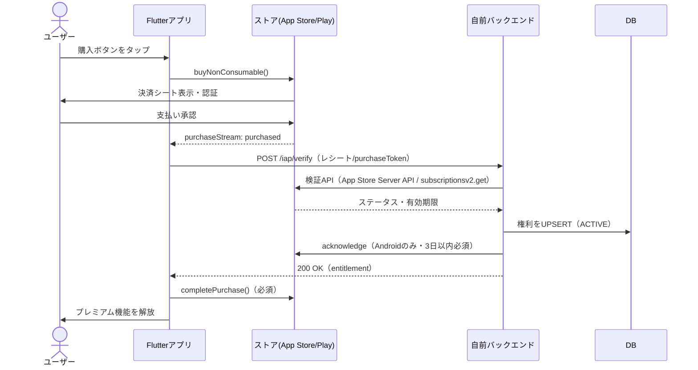
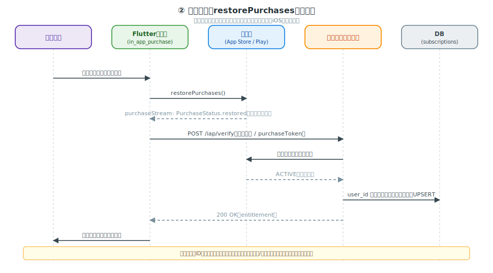
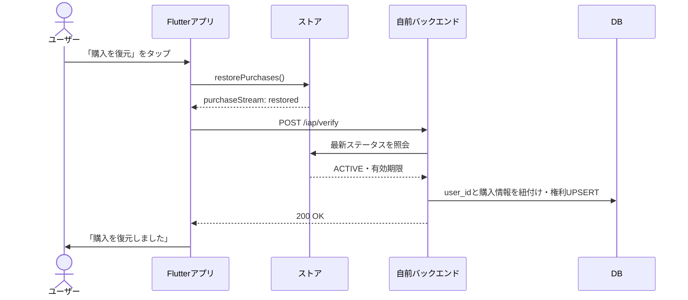
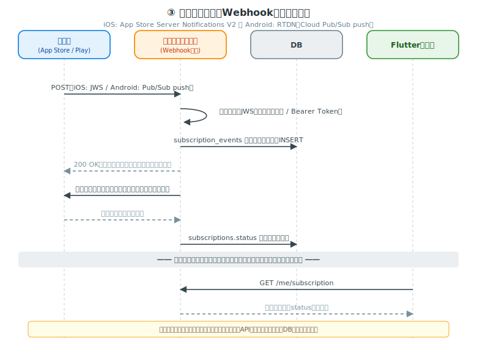
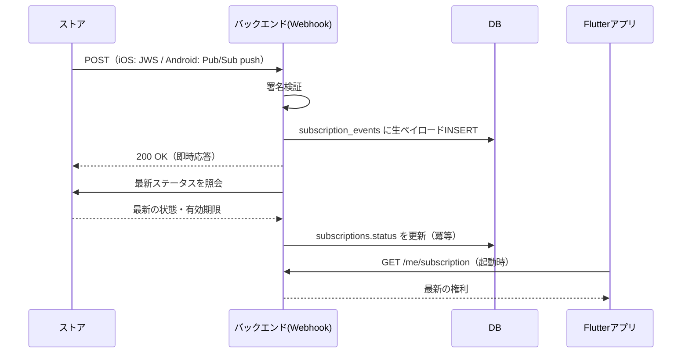
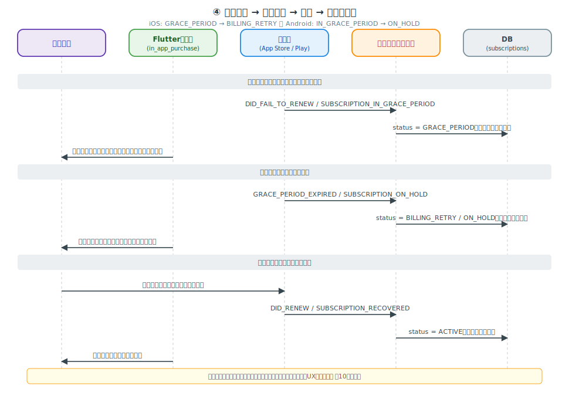
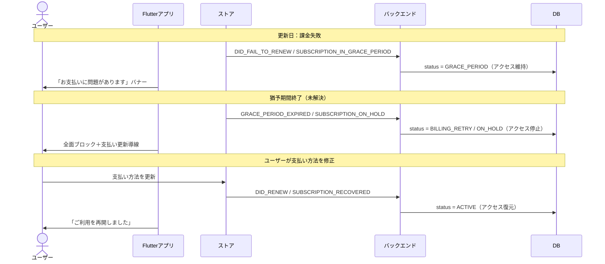
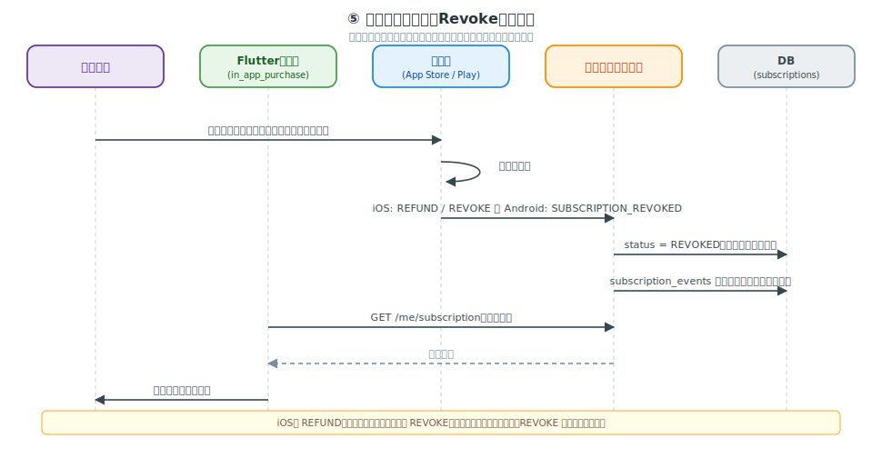
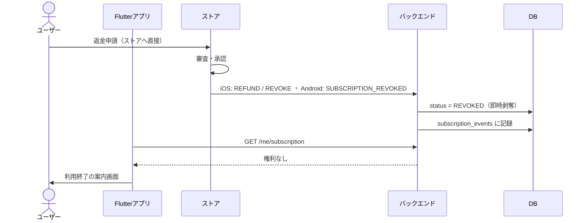

# サブスクリプション 主要フロー シーケンス図集（SVG）

サブスクリプションの主要な5つのフローをシーケンス図にしたものです。登場人物と配色は[iOS](ios-subscription-lifecycle.md)・[Android](android-subscription-lifecycle.md)の状態遷移図と統一しています。

- 図は `gen_subscription_seq_svg.py`（リポジトリ直下）で生成しています。修正はスクリプトを編集して再実行してください。
- 各図の下に、mermaid.live などで編集できる **Mermaidソース**も併記しています（[システム構成図](flutter-subscription-architecture-diagram.md)の変換手順参照）。

**目次**

1. [新規購入フロー](#①-新規購入フロー)
2. [購入復元（restorePurchases）フロー](#②-購入復元restorepurchasesフロー)
3. [サーバー通知（Webhook）受信フロー](#③-サーバー通知webhook受信フロー)
4. [課金失敗 → 回復フロー](#④-課金失敗--回復フロー)
5. [返金・取り消し（Revoke）フロー](#⑤-返金取り消しrevokeフロー)

---

## ① 新規購入フロー

購入操作から権利付与・完了確定までの一連の流れです。**ポイントは「検証してから権利付与」と「完了確定（acknowledge / completePurchase）を忘れない」**の2点です。

- バックエンドはアプリから受け取ったレシート/purchaseTokenを**必ずストアの公式APIで検証**してから権利を付与する（クライアントの自己申告を信用しない）。
- Android は `acknowledge`（3日以内）、Flutter側は `completePurchase()` を怠ると**自動返金・キャンセル扱い**になる。

Mermaidソース

---

## ② 購入復元（restorePurchases）フロー

機種変更・再インストール時に権利を取り戻すフローです。**「購入を復元」ボタンの設置はiOSの審査要件**です。

- 復元でも新規購入と同じく**バックエンド検証を通す**（restored ステータスをそのまま信用しない）。
- 復元された購入が**別のユーザーIDに紐付いていた場合**の扱い（付け替える/拒否する）は事前にポリシーを決めておく（[UX設計ガイド 第5章](flutter-subscription-ux.md)参照）。

Mermaidソース

---

## ③ サーバー通知（Webhook）受信フロー

更新・解約・課金失敗などの状態変化をバックエンドが受け取るフローです。**「即時200応答 → 照会APIで状態確定 → DBが正」**が鉄則です。

- 通知は**重複・順不同・欠落**があり得る。通知ペイロードを鵜呑みにせず、必ず照会API（Get All Subscription Statuses / `subscriptionsv2.get`）で最新状態を取得して確定させる。
- 受信エンドポイントは**署名検証**（iOS: JWS証明書チェーン、Android: Pub/Sub Bearer Token）を必ず行う（[システム構成設計 第5章](flutter-subscription-system-design.md)参照）。
- 取りこぼしに備えた日次リコンサイルは[運用ガイド](flutter-subscription-operations.md)参照。

Mermaidソース

---

## ④ 課金失敗 → 回復フロー

カード期限切れなどで更新に失敗してから回復するまでの流れです。フェーズごとのアクセス制御とUX（バナー→全面ブロック→復帰トースト）が対応します。

- **猶予期間中はアクセス維持**、Billing Retry / Account Hold に入ったら**即アクセス停止**。
- 各フェーズの文言・画面例は[UX設計ガイド 第10章](flutter-subscription-ux.md)参照。

Mermaidソース

---

## ⑤ 返金・取り消し（Revoke）フロー

ユーザーが**ストアに直接**返金申請し、承認された場合のフローです（開発者は承認プロセスに関与できません）。

- iOS は **REFUND（返金のみ・アクセスは期限まで継続）と REVOKE（権利剥奪）が別イベント**。REVOKE のみ即時停止する。
- Android は返金＋剥奪で `SUBSCRIPTION_REVOKED`、返金の確実な検知には `VoidedPurchaseNotification` も併用する。
- 画面対応は[UX設計ガイド 第11章](flutter-subscription-ux.md)参照。

Mermaidソース

---

## 関連ドキュメント

- [iOS 状態遷移図（SVG）](ios-subscription-lifecycle.md) ／ [Android 状態遷移図（SVG）](android-subscription-lifecycle.md)
- [イベント・ステータス一覧](flutter-subscription-events.md)
- [システム構成設計（DB・API・Webhook）](flutter-subscription-system-design.md)
- [実装コード例：Flutter側](flutter-subscription-code-client.md) ／ [バックエンド側](flutter-subscription-code-backend.md)

> **更新日:** 2026-07-13
