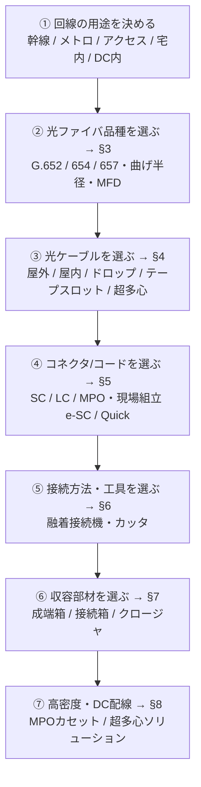
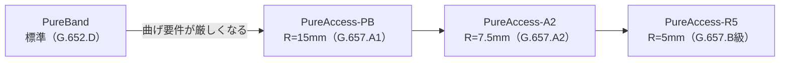

# ⑥ 住友電工 光ファイバー製品 完全網羅ガイド（実務担当者向け）

> **光ファイバー・光通信 完全ガイド**：[総合インデックス](optical-fiber-overview.md) ｜ [① 入門](optical-fiber-guide.md) ｜ [② ネットワーク全体像](optical-fiber-network-guide.md) ｜ [③ ケーブル・部材](optical-fiber-cable-types.md) ｜ [④ 施工・測定](optical-fiber-fieldwork-guide.md) ｜ [⑤ メーカー比較](optical-fiber-vendors.md) ｜ **⑥ 住友電工** ｜ [✅ クイズ](optical-fiber-quiz.html)

住友電気工業（Sumitomo Electric）の光ファイバー関連製品を、**ブランド「Optigate®」** の
製品体系に沿って実務で使えるよう網羅したリファレンス。
「品種選定 → ケーブル選定 → コネクタ/接続 → 収容部材 → 施工工具」まで一気通貫で引けるように整理した。

> 一般的な仕組み・用語は
> [① ゼロからわかる完全ガイド](optical-fiber-guide.md) ／
> [③ ケーブル・コードと接続部材ガイド](optical-fiber-cable-types.md)、
> 融着・測定など施工作業の基礎は [④ 施工・測定ガイド](optical-fiber-fieldwork-guide.md) を参照。
> 他社との比較は [⑤ 大手各社の製品ラインナップまとめ](optical-fiber-vendors.md)。

> ⚠️ **必読・免責**：本ページは2026年5月時点の**公開情報（公式サイト／カタログ／技報／プレス）に基づく整理**です。
> 型番・仕様・心数・損失値などは**改廃・改訂が頻繁**で、製品により公差・条件が異なります。
> **発注・設計の確定値は、必ず最新の「Optigate総合カタログ」と仕様書、または営業窓口で確認**してください。
> 数値は代表値であり「目安（要・公式確認）」として扱うこと。

---

## 0. このドキュメントの使い方（実務フロー）

*（図が表示されない環境用：[SVG版](optical-fiber-svg/sumitomo-1.svg)）*

困ったら §9 の「用途別 早見表／選定フロー」から逆引きする。

---

## 1. 製品体系（Optigate®）の全体像

住友電工の光関連製品は、おおむね次のカテゴリで構成される。

| カテゴリ | 主な中身 | 本書の章 |
|---------|---------|---------|
| 光ファイバ（素線・心線） | PureBand / PureAccess / PureAdvance / PureEther、テープ心線、間欠リボン | §3 |
| 光ケーブル | 層より型、テープスロット型、SZ撚、スロットレス、超多心、ドロップ、屋内、耐熱 | §4 |
| 光コネクタ・光コード | SC/SCSB、e-SC、Quick SC/LC、MPO(SumiMPO)、変換カセット、各種コード | §5 |
| 融着接続機・工具 | TYPE-Q102（コア調心）、T-502S（外径調心）、TYPE-72M+（多心）、カッタ FC | §6 |
| 光成端箱／光接続箱／光クロージャ | 19”ラック型、自立架、壁掛け、MJCクロージャ各種 | §7 |
| 光システム製品・ソリューション | データセンタ高密度配線、MPOカセット、DCIM、プレ配線 | §8 |

> 関連会社：**住友電工オプティフロンティア（SEOF）** が光コネクタ・コード・施工工具などを、
> 施工は **住電通信エンジニアリング** などが担う。製品により取扱窓口が分かれる点に注意。

---

## 2. まず押さえる：規格と「PureシリーズのRシリーズ思想」

住友電工のSM標準は、**曲げ半径（R）と規格（ITU-T）で品種が決まる**のが分かりやすい。

| 規格 | 想定用途 | 住友電工の該当品種 |
|------|---------|------------------|
| G.652.D（標準SM・広帯域低損失） | 一般通信全般 | **PureBand®** |
| G.657.A1（R=15mm 曲げ対応） | アクセス・標準宅内（G.652互換） | **PureAccess®-PB** |
| G.657.A2（R=7.5mm 曲げ対応） | 高密度宅内・狭所配線 | **PureAccess®-A2** |
| G.657.B級（R=5mm 曲げ対応） | 超狭所・極小曲げ | **PureAccess®-R5** |
| G.654.E（超低損失・大Aeff） | 陸上幹線・DC間・400G超 | **PureAdvance®-110/130** |
| マルチモード（OM2/OM3/OM4） | 構内・DC内短距離 | 標準MM、**PureEther®-Access**（曲げ対応MM R=15mm） |

ポイント：**標準仕様を G.657.A1（R=15mm, PA-PB）に統一**しつつ、より小さい曲げが要る場合に
A2（7.5mm）／R5（5mm）を提案する、という考え方。互換性（G.652と接続可）を保ちながら段階的に曲げ性能を上げる。

---

## 3. 光ファイバ（素線・心線）

### 3-1. シングルモード品種

| 品種 | 規格 | 代表MFD(@1310/1550) | 曲げ半径(目安) | 主用途 |
|------|------|--------------------|--------------|--------|
| **PureBand®** | G.652.D | 9.2±0.5 µm | 標準 | 一般通信・幹線〜アクセスの標準SM |
| **PureAccess®-PB** | G.657.A1 | 9.2±0.5 µm | R=15 mm | アクセス・宅内の標準（G.652互換） |
| **PureAccess®-A2** | G.657.A2 | 8.6±0.4 µm | R=7.5 mm | 高密度・狭所配線 |
| **PureAccess®-R5** | G.657.B級 | （要確認） | R=5 mm | 超狭所・極小曲げ |
| **PureAdvance®-110 / -130** | G.654.E | 11.5±0.7 µm | 標準 | 陸上幹線・DC間・超高速(400G+)。損失 ≤0.17 dB/km、実効断面積 110〜130 µm² |

- **PureBand** は1383nm付近の水分吸収ピークを抑えた**フルバンド低損失**で、CWDM等の全波長帯に対応。
- **PureAdvance** は**実効断面積を拡大（Aeff 110〜125µm²超）**し非線形を抑制、低損失でラマン増幅も適用可。
  陸上長距離・データセンタ間の大容量伝送に最適。

### 3-2. マルチモード品種

| 品種 | 規格相当 | 用途 |
|------|---------|------|
| 標準MM | OM2 / OM3 / OM4 | 構内・データセンタ内の短距離 |
| **PureEther®-Access** | 曲げ対応MM（R=15mm） | 曲げの多いMM配線 |

### 3-3. 心線・テープの形態（被覆・集合の単位）

| 形態 | 説明 | 接続性 |
|------|------|--------|
| 0.25 mm 光ファイバ素線 | ケーブル内の最小単位 | 単心融着 |
| 0.9 mm 光ファイバ心線 | 取り回ししやすい被覆。屋内コード等 | 単心融着・現場組立コネクタ |
| テープ心線（4 / 8 / 12 心） | 複数心を一括被覆 | **多心一括融着**で高効率 |
| **間欠接着型テープ心線（間欠リボン）** | 長手方向に間欠スリット。柔軟性＋整列性を両立。200µm細径化 | 一括融着可＋高密度収納（超多心ケーブルの要） |

> 超多心化のキモが**間欠リボン**。これにより 3,456心・6,912心級の細径高密度ケーブルを実現している（§4-3）。

---

## 4. 光ケーブル

### 4-1. 屋外・幹線系（多心集合）

| ケーブル種類 | 構造の要点 | 向いている用途 |
|------------|-----------|--------------|
| **層より型ケーブル** | 心線をテンションメンバ周りに層状撚り | 中小心数、単心の識別・分岐がしやすい |
| **テープスロット型ケーブル** | スロット（溝）に4心テープを積層 | 多心・高密度、多心一括融着で省力 |
| **SZ撚テープスロット型ケーブル** | スロットをSZ撚り | **布設後の中間（後）分岐が容易** |
| **スロットレス型ケーブル** | スロットロッドを省いた細径構造 | 細径・軽量、高密度化 |

### 4-2. アクセス・宅内系

| ケーブル種類 | 構造の要点 | 向いている用途 |
|------------|-----------|--------------|
| **ドロップケーブル** | 架空・集合住宅向け引き落とし。小径曲げ対応（R=15mm品） | 電柱→宅へ、MDF→各戸 |
| **屋内ケーブル（インドア）** | 0.9mm心線で柔軟、LAPシースで耐水 | 建物内配線 |
| **耐熱光ファイバケーブル** | 高温環境対応 | プラント・特殊環境 |
| **コネクタ付テープスロット型ケーブル** | 工場でコネクタ成端済（プレ配線） | 施工時間短縮 |

### 4-3. データセンタ／超多心・細径高密度

- **間欠リボン採用の細径高密度ケーブル**：200µm間欠12心テープ採用で **6,912心** クラス、
  さらに **3,456心** など世界最高レベルの超多心化を実現。
- 限られた管路・ラック空間に最大限の心線を収容しつつ、**一括融着**で施工性も確保。
- DC内の幹線（縦系）配線やラック間配線の省スペース化に使う（§8 のソリューションと併用）。

---

## 5. 光コネクタ・光コード

### 5-1. コネクタ種類

| 製品 | 形態 | 特徴・対応 |
|------|------|-----------|
| **単心光コネクタ SC / SCSB** | SC（シャッタ付き含む） | 定番の単心。機器・成端箱接続 |
| **e-SC コネクタ** | 角型ドロップ／インドアケーブル用・現場組立 | 約2分で組立、**無研磨・無接着** |
| **Quick SC/LC** | 現場組立 | 0.25mm素線／0.9mm心線／φ1.7・φ2.0コード対応、無研磨・無接着 |
| **MPO「SumiMPO™」** | 多心一括（12 / 24 心） | 約38mmの小型。高密度配線の主役 |
| **MPO/LC 変換カセット** | MPO⇔LC変換 | 19”筐体で高密度実装（§8） |
| **メカニカルスプライス** | 現場接続（融着レス） | 簡易工具で素早い接続 |

### 5-2. コード・成端済みアセンブリ

- 単心コード／2心メガネコード／**FOコード（ファンアウト）**／パッチコード／ピグテール
- **コネクタ付テープスロット型ケーブル（プレ配線）**：成端箱への事前組込で施工短縮
- 組立工具セット（e-SC/FA、Quick用）も併売

---

## 6. 融着接続機・工具

### 6-1. 融着接続機（現行の代表機種）

住友電工は融着接続機の世界的パイオニア。AI融着技術 **NanoTune®**（端面を解析し最適条件を自動設定）を搭載。

| 機種 | 調心方式 | 心数 | 位置づけ・特徴 |
|------|---------|------|--------------|
| **TYPE-Q102（Q102-CA+）** | コア調心 | 単心 | 主力ハイエンド。NanoTune搭載、低損失・高品質 |
| **TYPE-Q102-M12+** | コア調心 | 多心（最大12心） | 高精度コア調心の多心機。基幹網向け |
| **TYPE-Q502 / Q502S** | 外径（クラッド）調心 | 単心 | 経済的なFTTH/アクセス向け |
| **T-502S シリーズ** | 外径（クラッド）調心 | 単心 | 世界初の超小型・AI（NanoTune）。接続損失推定(HCA)・ファイバ種別自動判別 |
| **TYPE-72M+ シリーズ（72M12+ ほか）** | コア調心系（Active-ACAS） | 多心（テープ／間欠リボン 4〜12心） | テープ一括融着。12心 約11秒。NanoTune＋自動軸ズレ低減 |

> **コア調心 vs 外径調心**：コア調心はコアを直接見て合わせる＝**低損失だが高価**（幹線向け）。
> 外径（クラッド）調心は外径基準で合わせる＝**安価・高速**（アクセス／FTTH向け）。

### 6-2. 光ファイバカッタ・工具

| 製品 | 用途 |
|------|------|
| **FC-8R** | 単心用ハンディカッタ（軽量・自動刃回転・カットカウンタ） |
| **FC-6S** | 単心用カッタ |
| **FC-8R-MC** | 多心（テープ心線）対応カッタ |
| ストリッパ／ホットジャケットリムーバ／ファイバホルダ 等 | 被覆除去・保持などの周辺工具 |

---

## 7. 光成端箱／光接続箱／光クロージャ

「**端末でコネクタ化＝成端箱（屋内寄り）**」「**途中の接続・分岐を防水保護＝クロージャ（屋外）**」で大別（→ [接続部材ガイド](optical-fiber-cable-types.md)）。

### 7-1. 屋内系（成端箱・接続箱・配線盤）

| 製品タイプ | 収容の目安 | 用途 |
|-----------|-----------|------|
| **19インチラック搭載型スプライスユニット** | ― | ラック内成端・接続 |
| **19インチ光パネル** | 1U：最大40心(SC)／48心(LC)、2U：100心 | 高密度パッチ盤 |
| **自立架（大型光成端架）** | 大心数 | 局内・MDF |
| **壁掛け型光成端箱** | 小〜中心数 | ビル・集合住宅 |
| **FOコード融着タイプ／簡易FOプレ配線タイプ** | ― | プレ配線で施工短縮 |

### 7-2. 屋外系（光クロージャ MJCシリーズ）

| 製品 | 形態／設置 | 収容の目安 | 特徴 |
|------|-----------|-----------|------|
| **MJC-KD3** | 架空 | テープ400心 | 主力。**出荷100万台超**。片側3条導入、スプリッタ実装可 |
| **MJC-KD3-640** | 架空 | 8心テープ 最大640心 | KD3の多心版 |
| **MJC-LLD** | 架空 | 4/8心テープ 最大1120心 | 大心数の架空接続 |
| **MJC-ACS** | 架空・小型ボックス | 60心以下 | 少心の接続・分岐に最適 |
| **MJC-DAK** | 架空・たるみ付き少心 | 少心 | 単独架設可能な小型 |
| **地下用クロージャ（MJC系）** | 地下・ハンドホール・とう道 | 用途による | 長手コンパクト、専用壁取付金具 |

> グロメット構造で**ケーブル外径ごとの選定が不要**、開閉容易なスリーブ構造で**ドロップ引き落とし対応**など、施工性を重視した設計。
> KD3には品番バリエーション（-S / -Z / -T / -M 等）があり、導入条件で選ぶ。

---

## 8. 光システム製品・データセンタソリューション

| 製品／ソリューション | 内容 |
|--------------------|------|
| **データセンタ高密度光配線ソリューション** | テープスロット型／超多心ケーブル＋スプライスユニット＋MPOカセットを組み合わせた配線体系 |
| **MPOカセット（19”シャーシ）** | スライド型（前面引き出し＋ケーブルマネジメント標準）／簡易固定型。MPO⇔LC変換で高密度化 |
| **SumiMPO™** | 12/24心一括接続、約38mmの小型MPO。ラック間の省配線 |
| **DCIM 製品** | データセンタのインフラ管理 |

- 一次側（縦系・幹線）にテープスロット型／超多心、二次側にMPOカセットで分配、が典型構成。

---

## 9. 実務向け 早見表・選定フロー

### 9-1. 用途別「品種×ケーブル×コネクタ×接続機」の目安

| 用途 | ファイバ品種 | ケーブル | コネクタ | 融着接続機 |
|------|------------|---------|---------|-----------|
| 陸上幹線・DC間（長距離大容量） | PureAdvance（G.654.E） | テープスロット／超多心 | SC/MPO | Q102（コア調心） |
| メトロ／一般通信 | PureBand（G.652.D） | 層より／テープスロット | SC | Q102／Q502 |
| アクセス・FTTH（標準） | PureAccess-PB（G.657.A1） | ドロップ／屋内 | e-SC／Quick SC | Q502／T-502S |
| 高密度宅内・狭所 | PureAccess-A2／R5 | 屋内（細径） | Quick SC/LC | T-502S |
| データセンタ内 短距離 | MM（OM3/4）／PureEther-Access | 超多心／屋内 | MPO（SumiMPO） | 72M+（多心一括） |

### 9-2. 曲げ半径での選定

*（図が表示されない環境用：[SVG版](optical-fiber-svg/sumitomo-2.svg)）*

### 9-3. 接続方法の選定

- **低損失最優先（幹線）** → コア調心融着（TYPE-Q102 / 72M+）
- **コスト・速度重視（FTTH/アクセス）** → 外径調心融着（Q502 / T-502S）
- **電源や融着機が使えない現場** → メカニカルスプライス／現場組立コネクタ（e-SC / Quick）
- **多心テープを一気に** → 多心融着（TYPE-72M+ シリーズ）＋ FC-8R-MC

---

## 10. 発注・カタログ・問い合わせの実務メモ

- まず **「Optigate総合カタログ」**（光ファイバ＆ケーブル編／コネクタ編／融着接続機編／成端箱・接続箱・クロージャ編 等に分冊）を入手して型番・仕様を確定する。
- **選定早見表**（成端箱／接続箱）や **選定・組み合わせ表** が公式・代理店で提供されている。設計時に活用。
- 取扱窓口が **住友電工本体／SEOF（オプティフロンティア）／代理店** で分かれることがある。見積前に確認。
- 仕様値（損失・心数・公差・温度範囲・難燃グレード等）は**必ず最新仕様書で確認**。本書の数値は目安。

---

## 11. まとめ

- 住友電工の光製品は **Optigate®** として、素線→ケーブル→コネクタ→接続機→収容部材→DCソリューションまで**フルライン**。
- SMファイバは **PureBand（G.652.D）／PureAccess（G.657 A1・A2・R5）／PureAdvance（G.654.E）** を、**規格と曲げ半径**で選ぶ。
- ケーブルは **層より／テープスロット／SZ撚／スロットレス／超多心（間欠リボン）／ドロップ／屋内／耐熱** から用途で選定。
- 接続は **コア調心（Q102/72M+）＝低損失** ／ **外径調心（Q502/T-502S）＝経済的**、現場簡易は **e-SC/Quick/メカスプ**。
- 収容は **屋内＝成端箱・19”パネル**、**屋外＝MJCクロージャ各種**（KD3が主力）。
- DCは **超多心ケーブル＋MPO（SumiMPO）＋カセット** で高密度化。

> **シリーズの終着点まで来ました**。仕組み（①）→ ネットワーク（②）→ 線材・部材（③）→
> 施工・測定（④）→ メーカー（⑤）→ 製品選定（⑥）と辿れば、光ファイバーを「説明できる」から
> 「選定・発注できる」まで到達できるはず。
> 総仕上げは [✅ 理解度クイズ](optical-fiber-quiz.html) でどうぞ。

---

## 12. 参考リンク（公式）

- Optigate（光ファイバ関連製品 トップ）：<https://sumitomoelectric.com/jp/products/optigate>
- 光ファイバ・光ケーブル：<https://sumitomoelectric.com/jp/products/optigate/optical-fiber>
- 光コネクタ製品：<https://sumitomoelectric.com/jp/products/optigate/connector>
- 融着接続機／工具：<https://sumitomoelectric.com/jp/products/fusion>
- 光成端箱／光接続箱／光クロージャ：<https://sumitomoelectric.com/jp/products/optigate/termination>
- Optigate総合カタログ（ダウンロード）：<https://sumitomoelectric.com/jp/products/optigate/download>
- 住友電工オプティフロンティア（SEOF）：<https://www.seof.co.jp/>
- 製品ポータル optigate.jp：<https://www.optigate.jp/>
